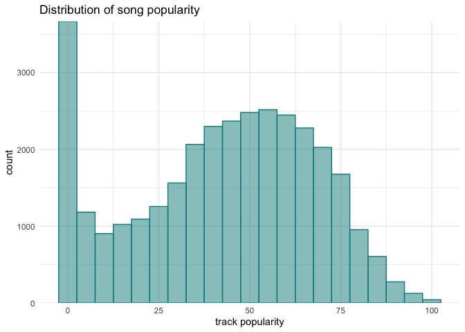
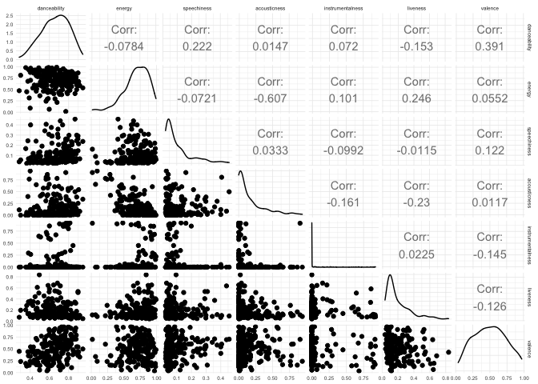
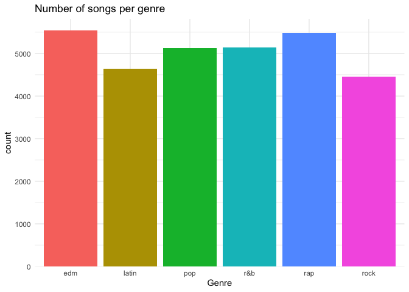
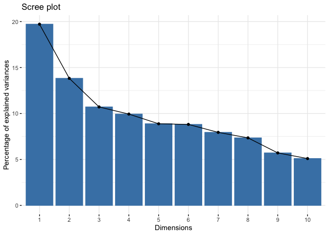
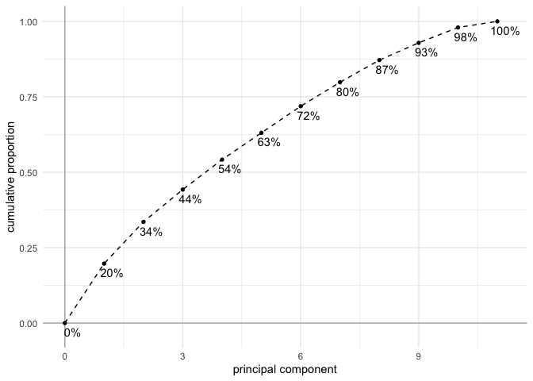
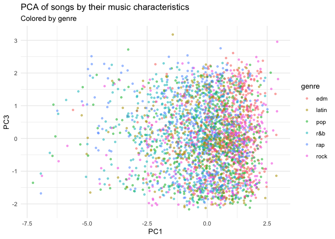

Spotify Songs
================
Joshua Cook
1/21/2020

``` r
knitr::opts_chunk$set(echo = TRUE, comment = "#>")

library(conflicted)
library(GGally)
library(factoextra)
library(tictoc)
library(lubridate)
library(magrittr)
library(tidyverse)

conflict_prefer("filter", "dplyr")

theme_set(theme_minimal())

set.seed(0)
```

## Data

``` r
spotify_songs <- readr::read_csv('https://raw.githubusercontent.com/rfordatascience/tidytuesday/master/data/2020/2020-01-21/spotify_songs.csv') %>%
    mutate(track_album_release_date = ymd(track_album_release_date)) 
```

    #> Parsed with column specification:
    #> cols(
    #>   .default = col_double(),
    #>   track_id = col_character(),
    #>   track_name = col_character(),
    #>   track_artist = col_character(),
    #>   track_album_id = col_character(),
    #>   track_album_name = col_character(),
    #>   track_album_release_date = col_character(),
    #>   playlist_name = col_character(),
    #>   playlist_id = col_character(),
    #>   playlist_genre = col_character(),
    #>   playlist_subgenre = col_character()
    #> )

    #> See spec(...) for full column specifications.

    #> Warning: 1886 failed to parse.

A few dates failed to parse because they just have the year, not
month-day-year. I do not plan to use this feature as an input for the
model, so I will not worry about the parsing failures.

Some `track_ids` appear multiple times. This is likely caused by the
same song being in multiple playlists. Annoyingly, over 1,600 songs are
in multiple playlists with different genre assignments.

``` r
# Removing playlist information removes all duplicates.
spotify_songs %>%
    select(-c(playlist_name, playlist_id, 
              playlist_genre, playlist_subgenre)) %>%
    distinct() %>%
    count(track_id) %>%
    filter(n > 1)
```

    #> # A tibble: 0 x 2
    #> # … with 2 variables: track_id <chr>, n <int>

``` r
# Removing all playlist info except for genre does not remove all duplicates.
spotify_songs %>%
    select(-c(playlist_name, playlist_id, playlist_subgenre)) %>%
    distinct() %>%
    count(track_id) %>%
    filter(n > 1)
```

    #> # A tibble: 1,687 x 2
    #>    track_id                   n
    #>    <chr>                  <int>
    #>  1 00qOE7OjRl0BpYiCiweZB2     2
    #>  2 00QyLmjxaSEE8qIZQjBXBj     3
    #>  3 00WIXhVVhswHuS6dlkScuw     2
    #>  4 01iyINEYgPQ7ThMZuHUsqS     2
    #>  5 0240T0gP9w6xEgIciBrfVF     2
    #>  6 02CygBCQOIyEuhNZqHHcNx     2
    #>  7 02itaCXOdC54J0ISjqqFAp     2
    #>  8 02M6vucOvmRfMxTXDUwRXu     3
    #>  9 04aAxqtGp5pv12UXAg4pkq     2
    #> 10 04KTF78FFg8sOHC1BADqbY     2
    #> # … with 1,677 more rows

## EDA

### Looking at features directly

``` r
spotify_songs %>%
    ggplot(aes(x = track_popularity)) +
    geom_histogram(binwidth = 5,  alpha = 0.5,
                   color = "darkcyan", fill = "darkcyan") +
    scale_y_continuous(expand = expansion(mult = c(0, 0))) +
    labs(x = "track popularity",
         y = "count",
         title = "Distribution of song popularity")
```

<!-- -->

``` r
spotify_songs %>%
    sample_n(200) %>%
    select(danceability, energy, speechiness, acousticness, 
           instrumentalness, liveness, valence) %>%
    ggpairs() +
    theme_minimal(base_size = 6)
```

<!-- -->

``` r
spotify_songs %>%
    group_by(playlist_genre) %>%
    summarise(n = n_distinct(track_id)) %>%
    ungroup() %>%
    ggplot(aes(x = playlist_genre, y = n)) +
    geom_col(aes(fill = playlist_genre)) +
    scale_y_continuous(expand = expansion(mult = c(0, 0.05))) +
    theme(legend.position = "none") +
    labs(x = "Genre", y = "count", title = "Number of songs per genre")
```

<!-- -->

``` r
spotify_songs %>%
    group_by(playlist_genre, playlist_subgenre) %>%
    summarise(n = n_distinct(track_id)) %>%
    ungroup() %>%
    ggplot(aes(x = n, y = playlist_subgenre)) +
    facet_wrap(~ playlist_genre, scales = "free") +
    geom_col(aes(fill = playlist_genre)) +
    scale_x_continuous(expand = expansion(mult = c(0, 0.05))) +
    theme(legend.position = "none") +
    labs(x = "count", y = "Subgrene", title = "Number of songs per subgenre")
```

<!-- -->

``` r
spotify_songs %>%
    filter(!is.na(track_album_release_date)) %>%
    ggplot(aes(x = track_album_release_date, y = track_popularity)) +
    geom_point(size = 0.5, alpha = 0.2, color = "dodgerblue") +
    geom_density2d(color = "black", lty = 2, size = 1)
```

<!-- -->

``` r
spotify_songs %>%
    filter(!is.na(track_album_release_date)) %>%
    mutate(track_release_day = yday(track_album_release_date)) %>%
    ggplot(aes(x = track_release_day, y = track_popularity)) +
    geom_point(size = 0.5, alpha = 0.2, color = "dodgerblue") +
    geom_density2d(color = "black", lty = 2, size = 1)
```

<!-- -->

### PCA & t-SNE

``` r
spotify_songs %>%
    select(track_id, danceability:tempo) %>%
    skimr::skim()
```

    #> Skim summary statistics
    #>  n obs: 32833 
    #>  n variables: 12 
    #> 
    #> ── Variable type:character ───────────────────────────────────────────────────────────────────────────────
    #>  variable missing complete     n min max empty n_unique
    #>  track_id       0    32833 32833  22  22     0    28356
    #> 
    #> ── Variable type:numeric ─────────────────────────────────────────────────────────────────────────────────
    #>          variable missing complete     n    mean    sd        p0     p25
    #>      acousticness       0    32833 32833   0.18   0.22   0         0.015
    #>      danceability       0    32833 32833   0.65   0.15   0         0.56 
    #>            energy       0    32833 32833   0.7    0.18   0.00017   0.58 
    #>  instrumentalness       0    32833 32833   0.085  0.22   0         0    
    #>               key       0    32833 32833   5.37   3.61   0         2    
    #>          liveness       0    32833 32833   0.19   0.15   0         0.093
    #>          loudness       0    32833 32833  -6.72   2.99 -46.45     -8.17 
    #>              mode       0    32833 32833   0.57   0.5    0         0    
    #>        p50      p75   p100     hist
    #>    0.08      0.26     0.99 ▇▂▁▁▁▁▁▁
    #>    0.67      0.76     0.98 ▁▁▁▂▆▇▆▂
    #>    0.72      0.84     1    ▁▁▁▃▅▇▇▆
    #>    1.6e-05   0.0048   0.99 ▇▁▁▁▁▁▁▁
    #>    6         9       11    ▇▃▃▃▃▆▃▆
    #>    0.13      0.25     1    ▇▅▂▁▁▁▁▁
    #>   -6.17     -4.64     1.27 ▁▁▁▁▁▁▇▃
    #>    1         1        1    ▆▁▁▁▁▁▁▇
    #>  [ reached getOption("max.print") -- omitted 3 rows ]

``` r
spotify_songs_data <- spotify_songs %>%
    select(track_id, danceability:tempo) %>%
    distinct() %>%
    as.data.frame() %>%
    column_to_rownames("track_id")

song_pca <- prcomp(spotify_songs_data, scale = TRUE, center = TRUE)

summary(song_pca)
```

    #> Importance of components:
    #>                           PC1    PC2    PC3     PC4    PC5     PC6     PC7
    #> Standard deviation     1.4726 1.2331 1.0855 1.04529 0.9883 0.98439 0.93482
    #> Proportion of Variance 0.1971 0.1382 0.1071 0.09933 0.0888 0.08809 0.07944
    #> Cumulative Proportion  0.1971 0.3354 0.4425 0.54182 0.6306 0.71871 0.79815
    #>                            PC8     PC9    PC10    PC11
    #> Standard deviation     0.89893 0.79241 0.74870 0.47308
    #> Proportion of Variance 0.07346 0.05708 0.05096 0.02035
    #> Cumulative Proportion  0.87161 0.92870 0.97965 1.00000

``` r
fviz_eig(song_pca)
```

<!-- -->

``` r
tibble(
    pc = c(0, seq(1, ncol(song_pca$x))),
    cum_prop = c(0, cumsum(song_pca$sdev^2 / sum(song_pca$sdev^2)))
) %>%
    mutate(label = paste0(round(cum_prop * 100), "%")) %>%
    ggplot(aes(x = pc, y = cum_prop)) +
    geom_hline(yintercept = 0, color = "grey70") +
    geom_vline(xintercept = 0, color = "grey70") +
    geom_line(linetype = 2) +
    geom_point(size = 1.2) +
    geom_text(aes(label = label), family = "Arial", 
              nudge_x = 0.2, nudge_y = -0.03) +
    labs(x = "principal component",
         y = "cumulative proportion")
```

<!-- -->

``` r
fviz_pca_var(song_pca, axes = c(1, 2))
```

<!-- -->

``` r
fviz_pca_var(song_pca, axes = c(1, 3))
```

<!-- -->

``` r
songs_in_pca_mat <- unique(song_pca$x)

songs_in_pca <- songs_in_pca_mat %>%
    as.data.frame(stringsAsFactors = FALSE) %>%
    rownames_to_column("track_id") %>%
    as_tibble() %>%
    left_join(spotify_songs %>% select(track_id:track_popularity, 
                                       playlist_genre:playlist_subgenre),
              by = "track_id") %>%
    group_by(track_id) %>%
    filter(n() == 1) %>%
    ungroup()

songs_in_pca %>%
    sample_n(3000) %>%
    ggplot(aes(x = PC1, y = PC2, color = playlist_genre)) +
    geom_point(size = 1, alpha = 0.5) +
    labs(color = "genre",
         title = "PCA of songs by their music characteristics",
         subtitle = "Colored by genre")
```

<!-- -->

``` r
songs_in_pca %>%
    sample_n(3000) %>%
    ggplot(aes(x = PC1, y = PC3, color = playlist_genre)) +
    geom_point(size = 1, alpha = 0.5) +
    labs(color = "genre",
         title = "PCA of songs by their music characteristics",
         subtitle = "Colored by genre")
```

<!-- -->

``` r
idx <- sample(seq(1, nrow(songs_in_pca_mat)), 5e3)
songs_tsne <- Rtsne::Rtsne(songs_in_pca_mat[idx, ])
```

``` r
songs_tsne$Y %>%
    as.data.frame() %>%
    as_tibble() %>%
    set_names(c("Z1", "Z2")) %>%
    add_column(track_id = rownames(songs_in_pca_mat)[idx]) %>%
    left_join(spotify_songs %>% select(track_id:track_popularity, 
                                       playlist_genre:playlist_subgenre),
              by = "track_id") %>%
    group_by(track_id) %>%
    filter(n() == 1) %>%
    ungroup() %>%
    ggplot(aes(x = Z1, y = Z2, color = playlist_genre)) +
    geom_point(size = 1, alpha = 0.5) +
    labs(color = "genre", title = "t-SNE of PCA of song information")
```

<!-- -->

## Model

Random forest to identify the genre and subgenre from the song
infromation. Using DALEX to standardize and inspect the model.

``` r
library(ranger)
library(rsample)
```

``` r
set.seed(0)

spotify_data <- spotify_songs %>%
    mutate(genre_subgenre = paste(playlist_genre, "-", playlist_subgenre)) %>%
    select(track_id, genre_subgenre, danceability:tempo) %>%
    distinct() %>%
    group_by(track_id) %>%
    filter(n() == 1) %>%
    ungroup()

spotify_data_split <- initial_split(spotify_data %>% select(-track_id), 
                                    prop = 0.8)
spotify_data_train <- training(spotify_data_split)
spotify_data_test <- testing(spotify_data_split)
```

``` r
tic("Training first RF model")
subgenre_rf <- ranger(genre_subgenre ~ ., 
                      data = spotify_data_train, 
                      num.trees = 500, 
                      mtry = 2,
                      verbose = FALSE)
toc()
```

    #> Training first RF model: 45.363 sec elapsed

``` r
subgenre_rf$prediction.error
```

    #> [1] 0.7055029

``` r
hyper_grid <- expand.grid(
    mtry = seq(2, ncol(spotify_data) - 2, by = 2),
    max.depth = seq(5, 20, by = 5),
    num.trees = seq(500, 1000, by = 200)
)

# Number of models.
dim(hyper_grid)
```

    #> [1] 60  3

``` r
head(hyper_grid)
```

    #>   mtry max.depth num.trees
    #> 1    2         5       500
    #> 2    4         5       500
    #> 3    6         5       500
    #> 4    8         5       500
    #> 5   10         5       500
    #> 6    2        10       500

``` r
# tic("Hyperparameter grid search")
# for (i in 1:nrow(hyper_grid)) {
#     model <- ranger(
#         genre_subgenre ~ .,
#         data = spotify_data_train,
#         num.trees = hyper_grid$num.trees[[i]],
#         mtry = hyper_grid$mtry[[i]],
#         max.depth = hyper_grid$max.depth[[i]],
#         verbose = FALSE
#     )
#     hyper_grid$OOB_error <- model$prediction.error
# }
# toc()
```

``` r
# hyper_grid %>%
#     as_tibble() %>%
#     janitor::clean_names() %>%
#     ggplot(aes(x = num_trees, y = oob_error)) +
#     geom_boxplot(aes(color = num_trees)) +
#     geom_point()
```
