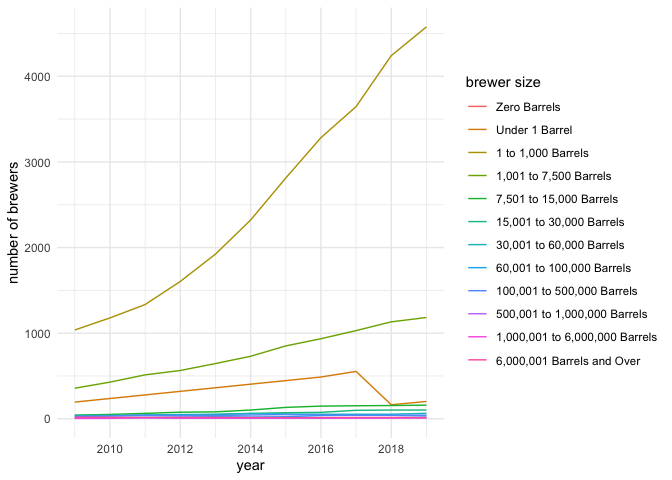
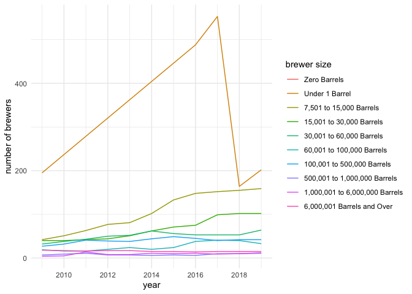
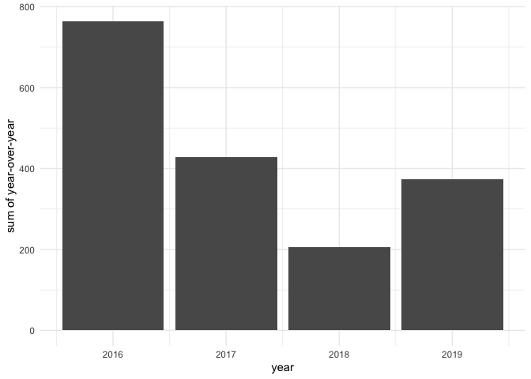

Beer Production
================
Joshua Cook
3/31/2020

## Data preparation

Download the data from the GitHub
[page](https://github.com/rfordatascience/tidytuesday/blob/master/data/2020/2020-03-31/readme.md)

``` bash
cd data

wget 'https://raw.githubusercontent.com/rfordatascience/tidytuesday/master/data/2020/2020-03-31/brewing_materials.csv'
wget 'https://raw.githubusercontent.com/rfordatascience/tidytuesday/master/data/2020/2020-03-31/beer_taxed.csv'
wget 'https://raw.githubusercontent.com/rfordatascience/tidytuesday/master/data/2020/2020-03-31/brewer_size.csv'
wget 'https://raw.githubusercontent.com/rfordatascience/tidytuesday/master/data/2020/2020-03-31/beer_states.csv'

cd ..
```

Here is the brief summary we are given about the data:

> The data this week comes from the Alcohol and Tobacco Tax and Trade
> Bureau (TTB). H/t to Bart Watson for sharing the source of the data.
> 
> There’s a literal treasure trove of data here:
> 
>   - State-level beer production by year (2008-2019)
>   - Number of brewers by production size by year (2008-2019)
>   - Monthly beer stats aggregated across the US (2008-2019)
> 
> Some considerations:
> 
>   - A barrel of beer for this data is 31 gallons
>   - Most data is in barrels removed/taxed or produced
>   - Removals = “Total barrels removed subject to tax by the breweries
>     comprising the named strata of data”, essentially how much was
>     produced and removed for consumption.
>   - A LOT of data came from PDFs - I included all the code I used to
>     grab data and tidy it up, take a peek and try out your own
>     mechanism for getting the tables out.

I have seen a few people looking at the “brewing\_materials.csv” data,
so I think I will instead analyze the “brewer\_size.csv” today.

``` r
library(magrittr)
library(tidyverse)
```

    ## ── Attaching packages ───────────────────────────────────────────────────────────────── tidyverse 1.2.1 ──

    ## ✓ ggplot2 3.3.0           ✓ purrr   0.3.3      
    ## ✓ tibble  3.0.0           ✓ dplyr   0.8.99.9002
    ## ✓ tidyr   1.0.0           ✓ stringr 1.4.0      
    ## ✓ readr   1.3.1           ✓ forcats 0.4.0

    ## ── Conflicts ──────────────────────────────────────────────────────────────────── tidyverse_conflicts() ──
    ## x tidyr::extract()   masks magrittr::extract()
    ## x dplyr::filter()    masks stats::filter()
    ## x dplyr::lag()       masks stats::lag()
    ## x purrr::set_names() masks magrittr::set_names()

``` r
theme_set(theme_minimal())
```

``` r
brewer_size <- read_csv(file.path("data", "brewer_size.csv"))
```

    ## Parsed with column specification:
    ## cols(
    ##   year = col_double(),
    ##   brewer_size = col_character(),
    ##   n_of_brewers = col_double(),
    ##   total_barrels = col_double(),
    ##   taxable_removals = col_double(),
    ##   total_shipped = col_double()
    ## )

``` r
brewer_size
```

    ## # A tibble: 137 x 6
    ##     year brewer_size   n_of_brewers total_barrels taxable_removals total_shipped
    ##    <dbl> <chr>                <dbl>         <dbl>            <dbl>         <dbl>
    ##  1  2009 6,000,001 Ba…           18    171232882.       159643984.       3639970
    ##  2  2009 1,000,001 to…            4      9970404.         9592723.         14548
    ##  3  2009 500,001 to 1…            7      4831386.         4535659.         21563
    ##  4  2009 100,001 to 5…           27      5422156.         4469289.        128000
    ##  5  2009 60,001 to 10…           19      1501977.         1224618.         95732
    ##  6  2009 30,001 to 60…           32      1412245.         1233959.         14369
    ##  7  2009 15,001 to 30…           40       895133.          750529.         19808
    ##  8  2009 7,501 to 15,…           42       442754.          388968.           240
    ##  9  2009 1,001 to 7,5…          357       859935.          769155.            12
    ## 10  2009 1 to 1,000 B…         1037       400401.          371873.           123
    ## # … with 127 more rows

There are some categories of brewer size that overlap. I manually
curated the list to have only non-overlapping groups.

``` r
sort(unique(brewer_size$brewer_size))
```

    ##  [1] "1 to 1,000 Barrels"             "1,000,000 to 6,000,000 Barrels"
    ##  [3] "1,000,001 to 1,999,999 Barrels" "1,000,001 to 6,000,000 Barrels"
    ##  [5] "1,001 to 7,500 Barrels"         "100,001 to 500,000 Barrels"    
    ##  [7] "15,001 to 30,000 Barrels"       "2,000,000 to 6,000,000 Barrels"
    ##  [9] "30,001 to 60,000 Barrels"       "500,001 to 1,000,000 Barrels"  
    ## [11] "6,000,001 Barrels and Over"     "60,001 to 100,000 Barrels"     
    ## [13] "7,501 to 15,000 Barrels"        "Total"                         
    ## [15] "Under 1 Barrel"                 "Zero Barrels"

``` r
brewer_size %<>%
    mutate(brewer_size = case_when(
        brewer_size == "Total" ~ NA_character_,
        brewer_size == "1,000,000 to 6,000,000 Barrels" ~ "1,000,001 to 6,000,000 Barrels",
        brewer_size == "1,000,001 to 1,999,999 Barrels" ~ "1,000,001 to 6,000,000 Barrels",
        brewer_size == "2,000,000 to 6,000,000 Barrels" ~ "1,000,001 to 6,000,000 Barrels",
        TRUE ~ brewer_size
    ))
```

I then declared the order of the `brewer_size` column.

``` r
brewer_size_order <- c(
    "Zero Barrels",
    "Under 1 Barrel",
    "1 to 1,000 Barrels",
    "1,001 to 7,500 Barrels",
    "7,501 to 15,000 Barrels",
    "15,001 to 30,000 Barrels",
    "30,001 to 60,000 Barrels",
    "60,001 to 100,000 Barrels",
    "100,001 to 500,000 Barrels",
    "500,001 to 1,000,000 Barrels",
    "1,000,001 to 6,000,000 Barrels",
    "6,000,001 Barrels and Over"
)

brewer_size %<>%
    mutate(brewer_size = factor(brewer_size, levels = brewer_size_order)) %>%
    group_by(year, brewer_size) %>%
    summarise(n_of_brewers = sum(n_of_brewers)) %>%
    ungroup()
```

## EDA

The first plot shows the total number of companies at each size.

``` r
brewer_size %>%
    filter(!is.na(brewer_size)) %>%
    ggplot(aes(x = year, y = n_of_brewers, group = brewer_size, color = brewer_size)) +
    geom_line() +
    scale_x_continuous(breaks = scales::pretty_breaks()) +
    labs(x = "year",
         y = "number of brewers",
         color = "brewer size")
```

<!-- -->

The plot below is the same as above, but after removing the top two
largest groups.

``` r
brewer_size %>%
    filter(!is.na(brewer_size)) %>%
    filter(!brewer_size %in% c("1 to 1,000 Barrels", "1,001 to 7,500 Barrels")) %>%
    ggplot(aes(x = year, y = n_of_brewers, group = brewer_size, color = brewer_size)) +
    geom_line() +
    scale_x_continuous(breaks = scales::pretty_breaks()) +
    labs(x = "year",
         y = "number of brewers",
         color = "brewer size")
```

<!-- -->

The trend in the “Under 1 Barrel” group is rather interesting. They grow
sharply and then dip in 2017. The following analysis will try to tell if
this is because they are going bankrupt, or are expanding into higher
groups.

## The “Under 1 Barrel” drop

We can start by analyzing the year-over-year change in number of
companies, i.e. the dirst derivative of the lines above.

``` r
calc_year_over_year <- function(x) {
    y <- x
    for (i in seq(1, length(x))) {
        if (i == 1) {
            y[[i]] <- 0
        } else {
            y[[i]] <- x[[i]] - x[[i - 1]]
        }
    }
    return(y)
}


brewer_size %<>%
    filter(!is.na(brewer_size)) %>%
    group_by(brewer_size) %>%
    arrange(year) %>%
    mutate(yoy_change = calc_year_over_year(n_of_brewers)) %>%
    ungroup()
```

We can see that a large drop in the “Under 1 Barrel” category is
concomittant with an increase in the “1 to 1,000 Barrels” group. The
difference does account for the change: from 2017 to 2018, the “Under 1
Barrel” category lost 400 companies, but the “1 to 1,000 Barrels”
category gained 600. So not only does it look like many small operations
scaled up, but additional new companies were started and went instantly
to producing more than one barrel. The same trend holds for the 2018 to
2019 transition.

``` r
brewer_size %>%
    ggplot(aes(x = year, y = yoy_change, group = brewer_size, color = brewer_size)) +
    geom_line() +
    scale_x_continuous(breaks = scales::pretty_breaks()) +
    labs(x = "year",
         y = "year-over-year change",
         color = "brewer size")
```

<!-- -->

``` r
brewer_size %>%
    filter(year >= 2016) %>%
    filter(brewer_size %in% c("Under 1 Barrel", "1 to 1,000 Barrels")) %>%
    mutate(year = factor(year)) %>%
    ggplot(aes(x = year, y = yoy_change, group = brewer_size, color = brewer_size)) +
    geom_hline(yintercept = 0, color = "grey50", size = 0.6) +
    geom_line() +
    labs(x = "year",
         y = "year-over-year change",
         color = "brewer size")
```

<!-- -->

``` r
brewer_size %>%
    filter(year >= 2016) %>%
    filter(brewer_size %in% c("Under 1 Barrel", "1 to 1,000 Barrels")) %>%
    group_by(year) %>%
    arrange(brewer_size) %>%
    summarise(diff_yoy_change = sum(yoy_change)) %>%
    ungroup() %>%
    ggplot(aes(x = year, y = diff_yoy_change)) +
    geom_col() +
    labs(x = "year",
         y = "sum of year-over-year")
```

<!-- -->
