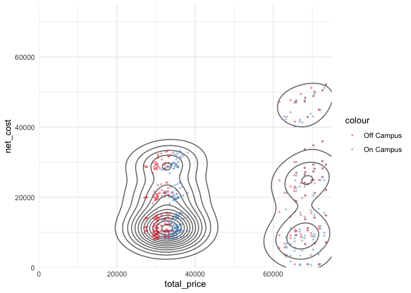
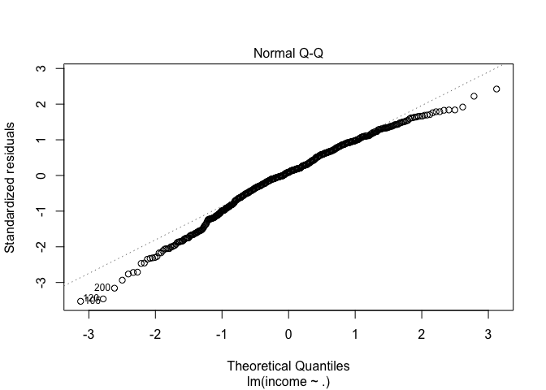
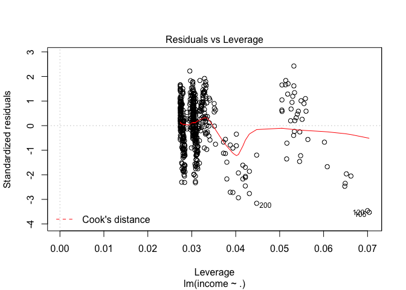
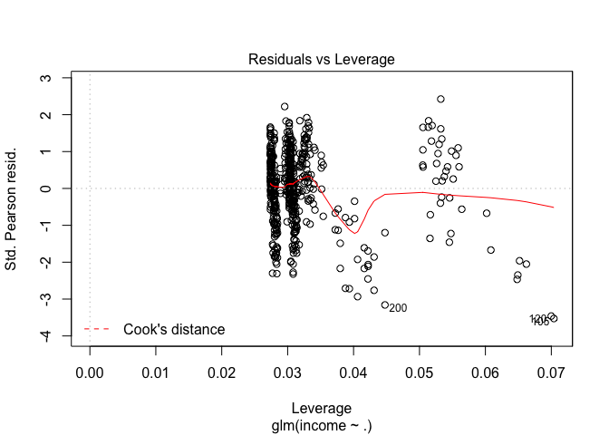
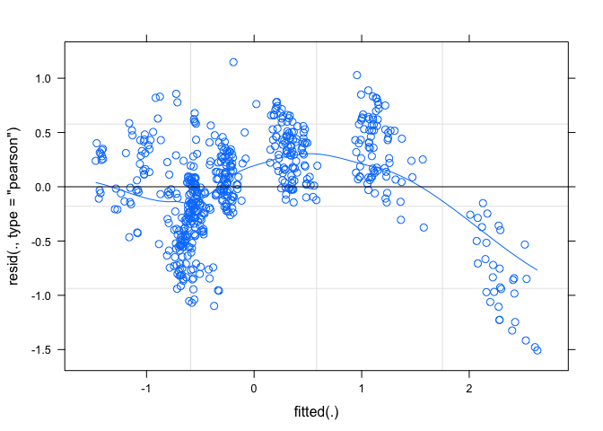
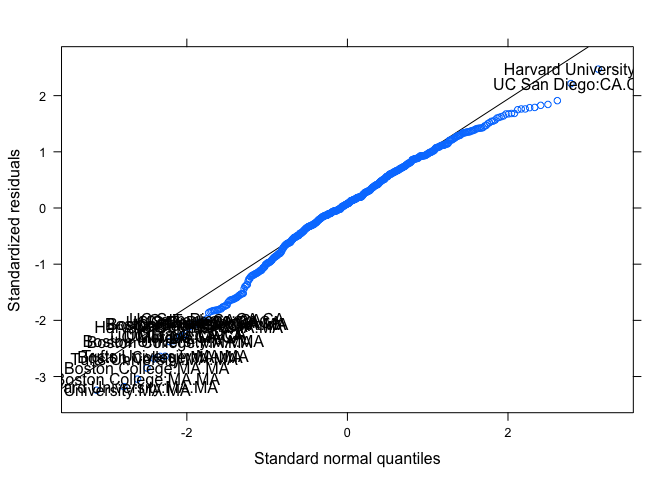

Untitled
================

## Data preparation

``` bash
cd data
wget 'https://raw.githubusercontent.com/rfordatascience/tidytuesday/master/data/2020/2020-03-10/tuition_cost.csv'
wget 'https://raw.githubusercontent.com/rfordatascience/tidytuesday/master/data/2020/2020-03-10/tuition_income.csv'
wget 'https://raw.githubusercontent.com/rfordatascience/tidytuesday/master/data/2020/2020-03-10/salary_potential.csv'
wget 'https://raw.githubusercontent.com/rfordatascience/tidytuesday/master/data/2020/2020-03-10/historical_tuition.csv'
wget 'https://raw.githubusercontent.com/rfordatascience/tidytuesday/master/data/2020/2020-03-10/diversity_school.csv'
cd ..
```

Today, I would specifically like to employ a linear modex effects model
using the `lmer()` function from the ‘lme4’ package. The question I ask
and data set I use will be targeted towards being able to implement
these tools.

I think I will use the “tuition\_income.csv” data:

| variable     | class     | description                                              |
| :----------- | :-------- | :------------------------------------------------------- |
| name         | character | School name                                              |
| state        | character | State Name                                               |
| total\_price | double    | Total price in USD                                       |
| year         | double    | year                                                     |
| campus       | character | On or off-campus                                         |
| net\_cost    | double    | Net-cost - average actually paid after scholarship/award |
| income\_lvl  | character | Income bracket                                           |

``` r
tuition_income <- read_csv(file.path("data", "tuition_income.csv")) %>%
    janitor::clean_names()
```

    ## Parsed with column specification:
    ## cols(
    ##   name = col_character(),
    ##   state = col_character(),
    ##   total_price = col_double(),
    ##   year = col_double(),
    ##   campus = col_character(),
    ##   net_cost = col_double(),
    ##   income_lvl = col_character()
    ## )

``` r
tuition_income %>%
    skimr::skim()
```

    ## Skim summary statistics
    ##  n obs: 209012 
    ##  n variables: 7 
    ##  group variables:  
    ## 
    ## ── Variable type:character ──────────────────────────────────────────────
    ##    variable missing complete      n min max empty n_unique
    ##      campus       0   209012 209012   9  10     0        2
    ##  income_lvl       0   209012 209012  11  17     0        5
    ##        name       0   209012 209012   6  75     0     3664
    ##       state       0   209012 209012   2   2     0       51
    ## 
    ## ── Variable type:numeric ────────────────────────────────────────────────
    ##     variable missing complete      n     mean       sd     p0      p25     p50
    ##     net_cost       0   209012 209012 16784.92  8887.16 -15101 10148.56 16207.1
    ##  total_price       0   209012 209012 30102.19 13824.7    4906 19186    26286  
    ##         year       0   209012 209012  2014.38     2.46   2010  2012     2014  
    ##    p75      p100     hist
    ##  22350  95674.84 ▁▆▇▂▁▁▁▁
    ##  38831 114083    ▅▇▅▂▁▁▁▁
    ##   2017   2018    ▇▆▆▆▆▆▆▆

The `income_lvl` data is currently a categorical variable, but I would
like to model the income as a function of the rest of the variables.
Therefore, I will make it a continuous variable by randomly sampling
from a uniform distribution within the range.

``` r
income_range <- tibble::tribble(
    ~income_lvl, ~income_min, ~income_max,
    "0 to 30,000", 0, 30e3,
    "30,001 to 48,000", 30e3, 48e3,
    "48_001 to 75,000", 48e3, 75e3,
    "75,001 to 110,000", 75e3, 110e3,
    "Over 110,000", 110e3, 150e3
)

tuition_income %<>%
    left_join(income_range, by = "income_lvl") %>%
    group_by(income_lvl) %>%
    mutate(
        n = n(),
        income = runif(n = unique(n), 
                       min = unique(income_min),
                       max = unique(income_max)),
        income = round(income)) %>%
    ungroup()
```

To limit the scope of the analysis (and actually fit models in a
reasonable amount of time), I will limit the data to just the years 2015
- 2018 and the schools to those in California and Massacheusettes.

``` r
tuition_income %<>%
    filter(state %in% c("MA", "CA")) %>%
    filter(between(year, 2015, 2018))
```

I’m going to further restrict the analysis to a handful of schools,
again, just ot limit the score of the analysis.

``` r
schools <- c(
    "Stanford",
    "California Institute of Technology",
    "Harvard University",
    "Massachusetts Institute of Technology",
    "Boston University",
    "Boston College",
    "Tufts University"
)

tuition_income %<>%
    filter(
      str_detect(name, "University of California-") | name %in% schools
    ) %>%
    mutate(
      name = str_replace(name, "University of California-", "UC "),
      name = str_replace(name, "Massachusetts Institute of Technology", "MIT"),
      name = str_replace(name, "California Institute of Technology", "CalTech")
    )
```

## EDA

``` r
tuition_income %>%
    ggplot(aes(x = total_price, y = net_cost)) +
    geom_density_2d(color = "black", alpha = 0.6, size = 0.6) +
    geom_point(aes(color = campus), size = 0.6, alpha = 0.3) +
    scale_x_continuous(limits = c(0, 75000), expand = c(0, 0)) +
    scale_y_continuous(limits = c(0, 75000), expand = c(0, 0)) +
    scale_color_brewer(palette = "Set1")
```

    ## Warning: Removed 3 rows containing non-finite values (stat_density2d).

    ## Warning: Removed 3 rows containing missing values (geom_point).

<!-- -->

``` r
tuition_income %>%
    ggplot(aes(x = income)) +
    geom_density(aes(color = income_lvl, fill = income_lvl)) +
    scale_color_brewer() +
    scale_fill_brewer() +
    labs(color = "income level", fill = "income level")
```

<!-- -->

``` r
tuition_income %>%
  ggplot(aes(x = net_cost, y = income)) +
  geom_point(aes(color = name, shape = state)) +
  geom_smooth() +
  scale_color_manual(
    values = randomcoloR::distinctColorPalette(n_distinct(tuition_income$name)),
    guide = guide_legend(ncol = 2, order = 0)
  )
```

    ## `geom_smooth()` using method = 'loess' and formula 'y ~ x'

<!-- -->

## Model

``` r
income_data <- tuition_income %>%
    ungroup() %>%
    select(income, name, state, year, campus, net_cost) %>%
    mutate(
        income = scale(income)[, 1],
        net_cost = scale(net_cost)[, 1],
        year = scale(year)[, 1]
    )

head(income_data)
```

    ## # A tibble: 6 x 6
    ##   income name      state   year campus    net_cost
    ##    <dbl> <chr>     <chr>  <dbl> <chr>        <dbl>
    ## 1 -1.65  UC Merced CA    -1.34  On Campus   -0.789
    ## 2 -0.517 UC Merced CA    -1.34  On Campus   -0.661
    ## 3 -0.480 UC Merced CA    -1.34  On Campus   -0.454
    ## 4  0.439 UC Merced CA    -1.34  On Campus    0.107
    ## 5  1.70  UC Merced CA    -1.34  On Campus    0.917
    ## 6 -0.993 UC Merced CA    -0.447 On Campus   -0.733

``` r
dim(income_data)
```

    ## [1] 560   6

### Linear model

``` r
income_fit1 <- lm(income ~ ., data = income_data)
summary(income_fit1)
```

    ## 
    ## Call:
    ## lm(formula = income ~ ., data = income_data)
    ## 
    ## Residuals:
    ##      Min       1Q   Median       3Q      Max 
    ## -1.58056 -0.25440  0.04017  0.32652  1.09579 
    ## 
    ## Coefficients: (1 not defined because of singularities)
    ##                        Estimate Std. Error t value Pr(>|t|)    
    ## (Intercept)            -0.21159    0.07639  -2.770 0.005802 ** 
    ## nameBoston University  -0.93632    0.10604  -8.830  < 2e-16 ***
    ## nameCalTech             0.31669    0.10414   3.041 0.002472 ** 
    ## nameHarvard University  0.68063    0.12983   5.243 2.27e-07 ***
    ## nameMIT                 0.41332    0.12922   3.198 0.001462 ** 
    ## nameTufts University   -0.19104    0.10404  -1.836 0.066866 .  
    ## nameUC Berkeley         0.38167    0.10422   3.662 0.000274 ***
    ## nameUC Davis            0.35010    0.10419   3.360 0.000834 ***
    ## nameUC Irvine           0.48134    0.10427   4.616 4.88e-06 ***
    ## nameUC Los Angeles      0.41422    0.10438   3.968 8.21e-05 ***
    ## nameUC Merced           0.35771    0.10422   3.432 0.000645 ***
    ## nameUC Riverside        0.47589    0.10449   4.555 6.49e-06 ***
    ## nameUC San Diego        0.37359    0.10430   3.582 0.000372 ***
    ## nameUC Santa Barbara    0.26404    0.10407   2.537 0.011454 *  
    ## nameUC Santa Cruz       0.24458    0.10400   2.352 0.019038 *  
    ## stateMA                      NA         NA      NA       NA    
    ## year                   -0.03652    0.01968  -1.856 0.063963 .  
    ## campusOn Campus        -0.01563    0.04076  -0.384 0.701431    
    ## net_cost                0.96748    0.02140  45.204  < 2e-16 ***
    ## ---
    ## Signif. codes:  0 '***' 0.001 '**' 0.01 '*' 0.05 '.' 0.1 ' ' 1
    ## 
    ## Residual standard error: 0.4647 on 542 degrees of freedom
    ## Multiple R-squared:  0.7906, Adjusted R-squared:  0.784 
    ## F-statistic: 120.4 on 17 and 542 DF,  p-value: < 2.2e-16

``` r
plot(income_fit1)
```

<!-- --><!-- --><!-- --><!-- -->

### Generalized linear model

``` r
income_fit2 <- glm(income ~ ., data = income_data)
summary(income_fit2)
```

    ## 
    ## Call:
    ## glm(formula = income ~ ., data = income_data)
    ## 
    ## Deviance Residuals: 
    ##      Min        1Q    Median        3Q       Max  
    ## -1.58056  -0.25440   0.04017   0.32652   1.09579  
    ## 
    ## Coefficients: (1 not defined because of singularities)
    ##                        Estimate Std. Error t value Pr(>|t|)    
    ## (Intercept)            -0.21159    0.07639  -2.770 0.005802 ** 
    ## nameBoston University  -0.93632    0.10604  -8.830  < 2e-16 ***
    ## nameCalTech             0.31669    0.10414   3.041 0.002472 ** 
    ## nameHarvard University  0.68063    0.12983   5.243 2.27e-07 ***
    ## nameMIT                 0.41332    0.12922   3.198 0.001462 ** 
    ## nameTufts University   -0.19104    0.10404  -1.836 0.066866 .  
    ## nameUC Berkeley         0.38167    0.10422   3.662 0.000274 ***
    ## nameUC Davis            0.35010    0.10419   3.360 0.000834 ***
    ## nameUC Irvine           0.48134    0.10427   4.616 4.88e-06 ***
    ## nameUC Los Angeles      0.41422    0.10438   3.968 8.21e-05 ***
    ## nameUC Merced           0.35771    0.10422   3.432 0.000645 ***
    ## nameUC Riverside        0.47589    0.10449   4.555 6.49e-06 ***
    ## nameUC San Diego        0.37359    0.10430   3.582 0.000372 ***
    ## nameUC Santa Barbara    0.26404    0.10407   2.537 0.011454 *  
    ## nameUC Santa Cruz       0.24458    0.10400   2.352 0.019038 *  
    ## stateMA                      NA         NA      NA       NA    
    ## year                   -0.03652    0.01968  -1.856 0.063963 .  
    ## campusOn Campus        -0.01563    0.04076  -0.384 0.701431    
    ## net_cost                0.96748    0.02140  45.204  < 2e-16 ***
    ## ---
    ## Signif. codes:  0 '***' 0.001 '**' 0.01 '*' 0.05 '.' 0.1 ' ' 1
    ## 
    ## (Dispersion parameter for gaussian family taken to be 0.2159502)
    ## 
    ##     Null deviance: 559.00  on 559  degrees of freedom
    ## Residual deviance: 117.05  on 542  degrees of freedom
    ## AIC: 750.6
    ## 
    ## Number of Fisher Scoring iterations: 2

``` r
plot(income_fit2)
```

<!-- --><!-- --><!-- --><!-- -->

``` r
anova(income_fit1, income_fit2)
```

    ## Analysis of Variance Table
    ## 
    ## Model 1: income ~ name + state + year + campus + net_cost
    ## Model 2: income ~ name + state + year + campus + net_cost
    ##   Res.Df    RSS Df  Sum of Sq F Pr(>F)
    ## 1    542 117.05                       
    ## 2    542 117.05  0 5.6843e-14

### Linear mixed effects model

``` r
income_fit3 <- lmer(income ~ year + net_cost + campus + (1 | state/name), 
                    data = income_data)
```

    ## Warning in checkConv(attr(opt, "derivs"), opt$par, ctrl = control$checkConv, :
    ## Model failed to converge with max|grad| = 0.0874504 (tol = 0.002, component 1)

``` r
summary(income_fit3)
```

    ## Linear mixed model fit by REML ['lmerMod']
    ## Formula: income ~ year + net_cost + campus + (1 | state/name)
    ##    Data: income_data
    ## 
    ## REML criterion at convergence: 792.9
    ## 
    ## Scaled residuals: 
    ##     Min      1Q  Median      3Q     Max 
    ## -3.2439 -0.5395  0.0804  0.7110  2.4714 
    ## 
    ## Random effects:
    ##  Groups     Name        Variance Std.Dev.
    ##  name:state (Intercept) 0.11444  0.3383  
    ##  state      (Intercept) 0.04833  0.2198  
    ##  Residual               0.21599  0.4648  
    ## Number of obs: 560, groups:  name:state, 15; state, 2
    ## 
    ## Fixed effects:
    ##                  Estimate Std. Error t value
    ## (Intercept)     -0.022589   0.183141  -0.123
    ## year            -0.036236   0.019677  -1.842
    ## net_cost         0.960629   0.021326  45.045
    ## campusOn Campus -0.009168   0.040670  -0.225
    ## 
    ## Correlation of Fixed Effects:
    ##             (Intr) year   nt_cst
    ## year         0.000              
    ## net_cost    -0.004 -0.045       
    ## campsOnCmps -0.131  0.000  0.004
    ## convergence code: 0
    ## Model failed to converge with max|grad| = 0.0874504 (tol = 0.002, component 1)

``` r
plot(income_fit3, type = c("p", "smooth"))
```

<!-- -->

``` r
lattice::qqmath(income_fit3, id = 0.05,)
```

<!-- -->

``` r
confint(income_fit3)
```

    ## Computing profile confidence intervals ...

    ##                       2.5 %      97.5 %
    ## .sig01           0.22997088 0.535087822
    ## .sig02           0.00000000 0.779917779
    ## .sigma           0.43728625 0.492458293
    ## (Intercept)     -0.49301224 0.420679899
    ## year            -0.07474567 0.002317116
    ## net_cost         0.91800919 1.002188378
    ## campusOn Campus -0.08984207 0.069990839
