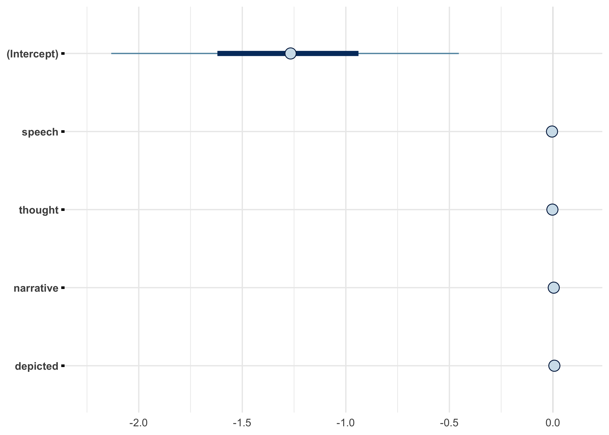
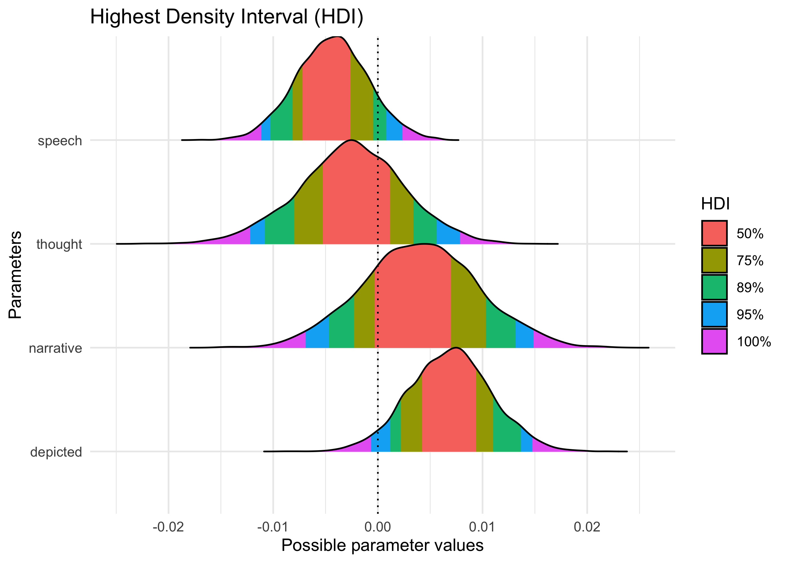
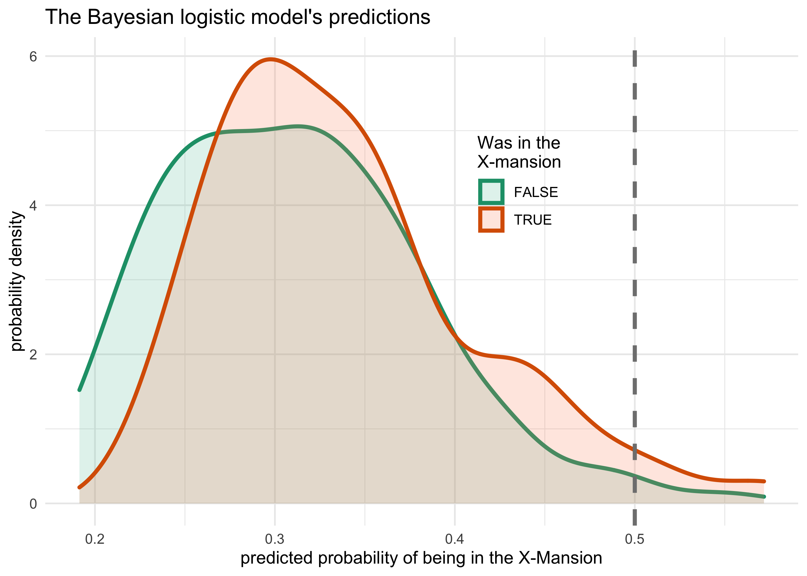

Uncanny X-men: Bayesian take on Dr. Silge’s analysis
================
Joshua Cook
June 30, 2020

The other day, Dr. Silge from RStudio posted the
[screencast](https://www.youtube.com/watch?v=EIcEAu94sf8&t=1758s) and
[blog post](https://juliasilge.com/blog/uncanny-xmen/) of her
[`#TidyTuesday`](https://github.com/rfordatascience/tidytuesday)
analysis of the Uncanny X-Men data set from [Claremont Run
Project](http://www.claremontrun.com/). In her analysis, she used
logistic regression to model the effect of various features of each
comic book issue on the likelihood of the characters to visit the
X-Mansion at least once She also built a similar model for whether or
not the comic book issue passed the [Bechdel
test](https://en.wikipedia.org/wiki/Bechdel_test).

One thing that caught my eye was that she used bootstrap resampling to
build a distribution of values for each parameter for the models. To me,
this resembled using Markov Chain Monte Carlo (MCMC) sampling methods
for fitting models in Bayesian statistics. Therefore, I thought it would
be interesting to fit the same logistic model (I only analyzed the first
one on visiting X-Mansion) using Bayesian methods and copare the results
and interpretations.

## Dr. Silge’s analysis

The following was taken from Dr. Silge’s [blog
post](https://juliasilge.com/blog/uncanny-xmen/). I provide brief
explanations about each step, though more information and explanation
can be found in the original article.

### Data preparation

First the data is downloaded from the TidyTuesday GitHub repository and
loaded into R.

``` r
character_visualization <- readr::read_csv("https://raw.githubusercontent.com/rfordatascience/tidytuesday/master/data/2020/2020-06-30/character_visualization.csv")
```

    #> Parsed with column specification:
    #> cols(
    #>   issue = col_double(),
    #>   costume = col_character(),
    #>   character = col_character(),
    #>   speech = col_double(),
    #>   thought = col_double(),
    #>   narrative = col_double(),
    #>   depicted = col_double()
    #> )

``` r
xmen_bechdel <- readr::read_csv("https://raw.githubusercontent.com/rfordatascience/tidytuesday/master/data/2020/2020-06-30/xmen_bechdel.csv")
```

    #> Parsed with column specification:
    #> cols(
    #>   issue = col_double(),
    #>   pass_bechdel = col_character(),
    #>   notes = col_character(),
    #>   reprint = col_logical()
    #> )

``` r
locations <- readr::read_csv("https://raw.githubusercontent.com/rfordatascience/tidytuesday/master/data/2020/2020-06-30/locations.csv")
```

    #> Parsed with column specification:
    #> cols(
    #>   issue = col_double(),
    #>   location = col_character(),
    #>   context = col_character(),
    #>   notes = col_character()
    #> )

Dr. Silge first created the `per_issue` data frame that is a aggregation
over all of the main characters summarizing number of speech bubbles
(`speech`), number of thought bubbles (`thought`), number of times the
characters were involved in narrative statements (`narrative`), and the
total number of depictions (`depicted`) in each issue.

``` r
per_issue <- character_visualization %>%
    group_by(issue) %>%
    summarise(across(speech:depicted, sum)) %>%
    ungroup()

per_issue
```

    #> # A tibble: 196 x 5
    #>    issue speech thought narrative depicted
    #>    <dbl>  <dbl>   <dbl>     <dbl>    <dbl>
    #>  1    97    146      13        71      168
    #>  2    98    172       9        29      180
    #>  3    99    105      22        29      124
    #>  4   100    141      28         7      122
    #>  5   101    158      27        58      191
    #>  6   102     78      27        33      133
    #>  7   103     91       6        25      121
    #>  8   104    142      15        25      165
    #>  9   105     83      12        24      128
    #> 10   106     20       6        20       16
    #> # … with 186 more rows

She also made the `x_mansion` data frame which just says whether each
issue visited the X-Mansion at least once and then joined that with
`per_issue` to create `locations_joined`.

``` r
x_mansion <- locations %>%
    group_by(issue) %>%
    summarise(mansion = "X-Mansion" %in% location)

locations_joined <- per_issue %>%
    inner_join(x_mansion)
```

    #> Joining, by = "issue"

### Modeling

To get a distribution of parameter estimates, Dr. Silge bootstrapped
1,000 versions of `locations_joined` and fit a separate logistic model
to each. She then extracted the coefficients of each model and used the
percentile interval method (`int_pctl()`) to gather estimates and
confidence intervals for the bootstraps.

``` r
library(tidymodels)
```

    #> ── Attaching packages ─────────────────────────────────────────────────────────────── tidymodels 0.1.0 ──

    #> ✓ broom     0.7.0.9000     ✓ rsample   0.0.6     
    #> ✓ dials     0.0.6          ✓ tune      0.1.0     
    #> ✓ infer     0.5.1          ✓ workflows 0.1.1     
    #> ✓ parsnip   0.1.1          ✓ yardstick 0.0.6     
    #> ✓ recipes   0.1.12

``` r
set.seed(123)
boots <- bootstraps(locations_joined, times = 1000, apparent = TRUE)

boot_models <- boots %>%
    mutate(
        model = map(
            splits,
            ~ glm(mansion ~ speech + thought + narrative + depicted,
                  family = "binomial", data = analysis(.)
            )
        ),
        coef_info = map(model, tidy)
    )

boot_coefs <- boot_models %>%
    unnest(coef_info)

int_pctl(boot_models, coef_info)
```

    #> # A tibble: 5 x 6
    #>   term          .lower .estimate    .upper .alpha .method   
    #>   <chr>          <dbl>     <dbl>     <dbl>  <dbl> <chr>     
    #> 1 (Intercept) -2.42     -1.29    -0.277      0.05 percentile
    #> 2 depicted     0.00193   0.0103   0.0196     0.05 percentile
    #> 3 narrative   -0.0106    0.00222  0.0143     0.05 percentile
    #> 4 speech      -0.0148   -0.00716  0.000617   0.05 percentile
    #> 5 thought     -0.0143   -0.00338  0.00645    0.05 percentile

The boostrapped distributions are shown below.

``` r
boot_coefs %>%
    filter(term != "(Intercept)") %>%
    mutate(term = fct_inorder(term)) %>%
    ggplot(aes(estimate, fill = term)) +
    geom_vline(
        xintercept = 0, color = "gray50",
        alpha = 0.6, lty = 2, size = 1.5
    ) +
    geom_histogram(alpha = 0.8, bins = 25, show.legend = FALSE) +
    facet_wrap(~term, scales = "free") +
    labs(
        title = "Which issues contain the X-Mansion as a location?",
        subtitle = "Comparing the top 25 characters' speech, thought, narrative portrayal, and total depictions",
        caption = "Data from the Claremont Run Project"
    )
```

<!-- -->

## The Bayesian way

Bayesian modeling is the practice of updating our prior beliefs using
observed data to produce a probability distribtion for the values of
unknown parameters. Thus, unlike the single point-estimates provided by
“frequentist” approaches, the results of a Bayesian analysis are the
distributions of estimated parameters. This is why Dr. Silge’s
bootstrapping analysis reminded by of Bayesian regression modeling.

### The libraries

The ‘rstanarm’ pacakge was used to fit the models, and ‘tidybayes’,
‘bayestestR’, and ‘see’

``` r
library(rstanarm)
library(tidybayes)
library(bayestestR)
library(see)
```

``` r
bayes_mansion <- stan_glm(
    mansion ~ speech + thought + narrative + depicted,
    family = binomial(link = "logit"), 
    data = locations_joined,
    prior = normal(location = 0, scale = 0.5),
    prior_intercept = normal(location = 0, scale = 3)
)
```

    #> 
    #> SAMPLING FOR MODEL 'bernoulli' NOW (CHAIN 1).
    #> Chain 1: 
    #> Chain 1: Gradient evaluation took 0.000153 seconds
    #> Chain 1: 1000 transitions using 10 leapfrog steps per transition would take 1.53 seconds.
    #> Chain 1: Adjust your expectations accordingly!
    #> Chain 1: 
    #> Chain 1: 
    #> Chain 1: Iteration:    1 / 2000 [  0%]  (Warmup)
    #> Chain 1: Iteration:  200 / 2000 [ 10%]  (Warmup)
    #> Chain 1: Iteration:  400 / 2000 [ 20%]  (Warmup)
    #> Chain 1: Iteration:  600 / 2000 [ 30%]  (Warmup)
    #> Chain 1: Iteration:  800 / 2000 [ 40%]  (Warmup)
    #> Chain 1: Iteration: 1000 / 2000 [ 50%]  (Warmup)
    #> Chain 1: Iteration: 1001 / 2000 [ 50%]  (Sampling)
    #> Chain 1: Iteration: 1200 / 2000 [ 60%]  (Sampling)
    #> Chain 1: Iteration: 1400 / 2000 [ 70%]  (Sampling)
    #> Chain 1: Iteration: 1600 / 2000 [ 80%]  (Sampling)
    #> Chain 1: Iteration: 1800 / 2000 [ 90%]  (Sampling)
    #> Chain 1: Iteration: 2000 / 2000 [100%]  (Sampling)
    #> Chain 1: 
    #> Chain 1:  Elapsed Time: 0.270786 seconds (Warm-up)
    #> Chain 1:                0.17146 seconds (Sampling)
    #> Chain 1:                0.442246 seconds (Total)
    #> Chain 1: 
    #> 
    #> SAMPLING FOR MODEL 'bernoulli' NOW (CHAIN 2).
    #> Chain 2: 
    #> Chain 2: Gradient evaluation took 8.6e-05 seconds
    #> Chain 2: 1000 transitions using 10 leapfrog steps per transition would take 0.86 seconds.
    #> Chain 2: Adjust your expectations accordingly!
    #> Chain 2: 
    #> Chain 2: 
    #> Chain 2: Iteration:    1 / 2000 [  0%]  (Warmup)
    #> Chain 2: Iteration:  200 / 2000 [ 10%]  (Warmup)
    #> Chain 2: Iteration:  400 / 2000 [ 20%]  (Warmup)
    #> Chain 2: Iteration:  600 / 2000 [ 30%]  (Warmup)
    #> Chain 2: Iteration:  800 / 2000 [ 40%]  (Warmup)
    #> Chain 2: Iteration: 1000 / 2000 [ 50%]  (Warmup)
    #> Chain 2: Iteration: 1001 / 2000 [ 50%]  (Sampling)
    #> Chain 2: Iteration: 1200 / 2000 [ 60%]  (Sampling)
    #> Chain 2: Iteration: 1400 / 2000 [ 70%]  (Sampling)
    #> Chain 2: Iteration: 1600 / 2000 [ 80%]  (Sampling)
    #> Chain 2: Iteration: 1800 / 2000 [ 90%]  (Sampling)
    #> Chain 2: Iteration: 2000 / 2000 [100%]  (Sampling)
    #> Chain 2: 
    #> Chain 2:  Elapsed Time: 0.271705 seconds (Warm-up)
    #> Chain 2:                0.210377 seconds (Sampling)
    #> Chain 2:                0.482082 seconds (Total)
    #> Chain 2: 
    #> 
    #> SAMPLING FOR MODEL 'bernoulli' NOW (CHAIN 3).
    #> Chain 3: 
    #> Chain 3: Gradient evaluation took 3.8e-05 seconds
    #> Chain 3: 1000 transitions using 10 leapfrog steps per transition would take 0.38 seconds.
    #> Chain 3: Adjust your expectations accordingly!
    #> Chain 3: 
    #> Chain 3: 
    #> Chain 3: Iteration:    1 / 2000 [  0%]  (Warmup)
    #> Chain 3: Iteration:  200 / 2000 [ 10%]  (Warmup)
    #> Chain 3: Iteration:  400 / 2000 [ 20%]  (Warmup)
    #> Chain 3: Iteration:  600 / 2000 [ 30%]  (Warmup)
    #> Chain 3: Iteration:  800 / 2000 [ 40%]  (Warmup)
    #> Chain 3: Iteration: 1000 / 2000 [ 50%]  (Warmup)
    #> Chain 3: Iteration: 1001 / 2000 [ 50%]  (Sampling)
    #> Chain 3: Iteration: 1200 / 2000 [ 60%]  (Sampling)
    #> Chain 3: Iteration: 1400 / 2000 [ 70%]  (Sampling)
    #> Chain 3: Iteration: 1600 / 2000 [ 80%]  (Sampling)
    #> Chain 3: Iteration: 1800 / 2000 [ 90%]  (Sampling)
    #> Chain 3: Iteration: 2000 / 2000 [100%]  (Sampling)
    #> Chain 3: 
    #> Chain 3:  Elapsed Time: 0.164779 seconds (Warm-up)
    #> Chain 3:                0.222833 seconds (Sampling)
    #> Chain 3:                0.387612 seconds (Total)
    #> Chain 3: 
    #> 
    #> SAMPLING FOR MODEL 'bernoulli' NOW (CHAIN 4).
    #> Chain 4: 
    #> Chain 4: Gradient evaluation took 1.7e-05 seconds
    #> Chain 4: 1000 transitions using 10 leapfrog steps per transition would take 0.17 seconds.
    #> Chain 4: Adjust your expectations accordingly!
    #> Chain 4: 
    #> Chain 4: 
    #> Chain 4: Iteration:    1 / 2000 [  0%]  (Warmup)
    #> Chain 4: Iteration:  200 / 2000 [ 10%]  (Warmup)
    #> Chain 4: Iteration:  400 / 2000 [ 20%]  (Warmup)
    #> Chain 4: Iteration:  600 / 2000 [ 30%]  (Warmup)
    #> Chain 4: Iteration:  800 / 2000 [ 40%]  (Warmup)
    #> Chain 4: Iteration: 1000 / 2000 [ 50%]  (Warmup)
    #> Chain 4: Iteration: 1001 / 2000 [ 50%]  (Sampling)
    #> Chain 4: Iteration: 1200 / 2000 [ 60%]  (Sampling)
    #> Chain 4: Iteration: 1400 / 2000 [ 70%]  (Sampling)
    #> Chain 4: Iteration: 1600 / 2000 [ 80%]  (Sampling)
    #> Chain 4: Iteration: 1800 / 2000 [ 90%]  (Sampling)
    #> Chain 4: Iteration: 2000 / 2000 [100%]  (Sampling)
    #> Chain 4: 
    #> Chain 4:  Elapsed Time: 0.153558 seconds (Warm-up)
    #> Chain 4:                0.202304 seconds (Sampling)
    #> Chain 4:                0.355862 seconds (Total)
    #> Chain 4:

PD shows that the posterior distributions for `speech` and `depicted`
are likely away from 0, but the ROPE suggests that the differences are
negligible.

``` r
bayestestR::describe_posterior(bayes_mansion)
```

    #> Possible multicollinearity between depicted and speech (r = 0.7). This might lead to inappropriate results. See 'Details' in '?rope'.

    #> # Description of Posterior Distributions
    #> 
    #> Parameter   | Median |           89% CI |    pd |        89% ROPE | % in ROPE |  Rhat |      ESS
    #> ------------------------------------------------------------------------------------------------
    #> (Intercept) | -1.267 | [-2.095, -0.467] | 0.997 | [-0.181, 0.181] |         0 | 1.000 | 5612.356
    #> speech      | -0.004 | [-0.010,  0.001] | 0.900 | [-0.181, 0.181] |       100 | 1.001 | 2401.035
    #> thought     | -0.003 | [-0.011,  0.006] | 0.697 | [-0.181, 0.181] |       100 | 1.001 | 2865.077
    #> narrative   |  0.004 | [-0.005,  0.013] | 0.771 | [-0.181, 0.181] |       100 | 1.000 | 3264.987
    #> depicted    |  0.007 | [ 0.001,  0.014] | 0.961 | [-0.181, 0.181] |       100 | 1.000 | 2219.555

Intercept is comfortably negative = less likely to be in X-Mansion over
all. The other distributions are miniscule suggesting they provide
little extra information.

``` r
plot(bayes_mansion)
```

<!-- -->

HDI confirm the above results.

``` r
plot(bayestestR::hdi(bayes_mansion, ci = c(0.5, 0.75, 0.89, 0.95)))
```

<!-- -->

Plot the predicted likelihood of being in the X-Mansion or not and plot
the distribution separated by if they actually were in the mansion or
not. Both distributions are comfortably below 0.5 and have a lot of
overlap suggesting predictors do not add much extra information.

``` r
# From 'rethinking' package.
logistic <- function (x) {
    p <- 1/(1 + exp(-x))
    p <- ifelse(x == Inf, 1, p)
    return(p)
}

locations_joined %>%
    mutate(mansion_predict = logistic(predict(bayes_mansion))) %>%
    ggplot(aes(x = mansion_predict, color = mansion, fill = mansion)) +
    geom_density(size = 1.2, alpha = 0.2) +
    geom_vline(xintercept = 0.5, size = 1.2, lty = 2, color = grey) +
    scale_color_brewer(palette = "Dark2") +
    scale_fill_brewer(palette = "Set2") +
    theme(legend.position = c(0.63, 0.7)) +
    labs(x = "predicted probability of being in the X-Mansion",
         y = "probability density",
         title = "The Bayesian logistic model's predictions",
         color = "Was in the\nX-mansion",
         fill = "Was in the\nX-mansion")
```

<!-- -->

``` r
pred_data <- locations_joined %>%
    summarise(across(issue:narrative, mean)) %>%
    mutate(depicted = list(modelr::seq_range(locations_joined$depicted, n = 100))) %>%
    unnest(depicted) %>%
    add_fitted_draws(bayes_mansion, n = 200)

pred_data
```

    #> # A tibble: 20,000 x 10
    #> # Groups:   issue, speech, thought, narrative, depicted, .row [100]
    #>    issue speech thought narrative depicted  .row .chain .iteration .draw .value
    #>    <dbl>  <dbl>   <dbl>     <dbl>    <dbl> <int>  <int>      <int> <int>  <dbl>
    #>  1  189.   143.    44.2      48.7       16     1     NA         NA     1 0.125 
    #>  2  189.   143.    44.2      48.7       16     1     NA         NA     6 0.143 
    #>  3  189.   143.    44.2      48.7       16     1     NA         NA    15 0.117 
    #>  4  189.   143.    44.2      48.7       16     1     NA         NA    47 0.0890
    #>  5  189.   143.    44.2      48.7       16     1     NA         NA    86 0.272 
    #>  6  189.   143.    44.2      48.7       16     1     NA         NA   118 0.101 
    #>  7  189.   143.    44.2      48.7       16     1     NA         NA   131 0.158 
    #>  8  189.   143.    44.2      48.7       16     1     NA         NA   133 0.279 
    #>  9  189.   143.    44.2      48.7       16     1     NA         NA   140 0.0990
    #> 10  189.   143.    44.2      48.7       16     1     NA         NA   154 0.109 
    #> # … with 19,990 more rows

``` r
locations_joined_mod <- locations_joined %>%
    mutate(mansion_num = as.numeric(mansion) + ifelse(mansion, -0.1, 0.1))
    

pred_data %>%
    ggplot(aes(x = depicted, y = .value)) +
    geom_line(aes(group = .draw), alpha = 0.1) +
    geom_jitter(aes(y = mansion_num, color = mansion), 
                data = locations_joined_mod, 
                height = 0.08, width = 0,
                size = 2.2, alpha = 0.5) +
    scale_color_brewer(palette = "Dark2") +
    scale_x_continuous(expand = expansion(mult = c(0.02, 0.02))) +
    scale_y_continuous(expand = c(0, 0), limits = c(0, 1)) +
    labs(x = "depicted",
         y = "probability of being in the X-mansion",
         color = "was in the\nX-Mansion",
         title = "Posterior predictions of the effect of the number\nof depictions of the main characters",
         subtitle = "All other predictors were held constant at their average value.")
```

<!-- -->
