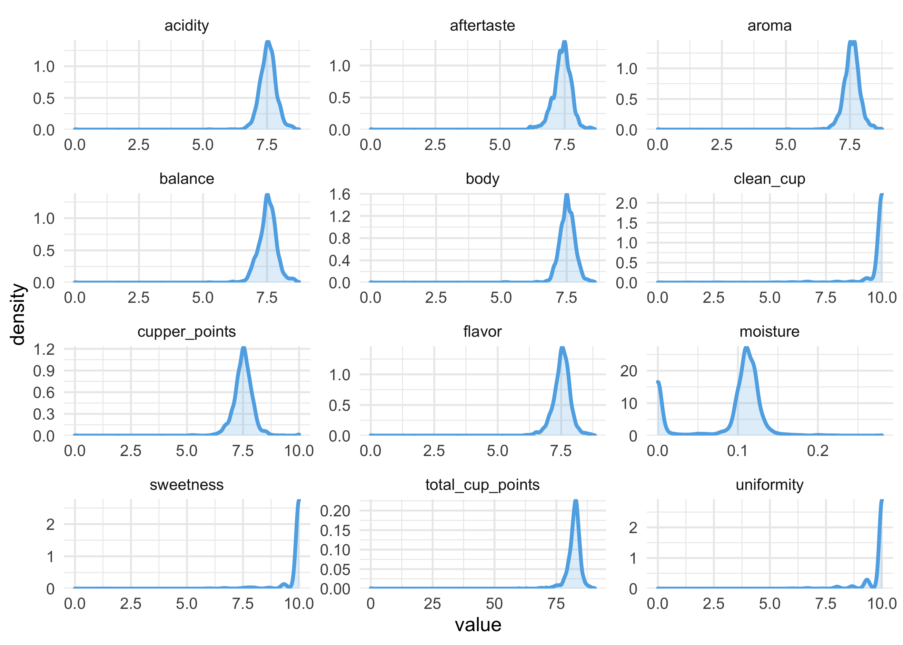
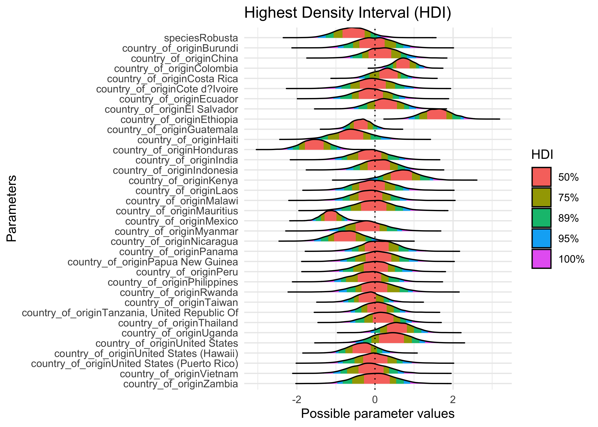
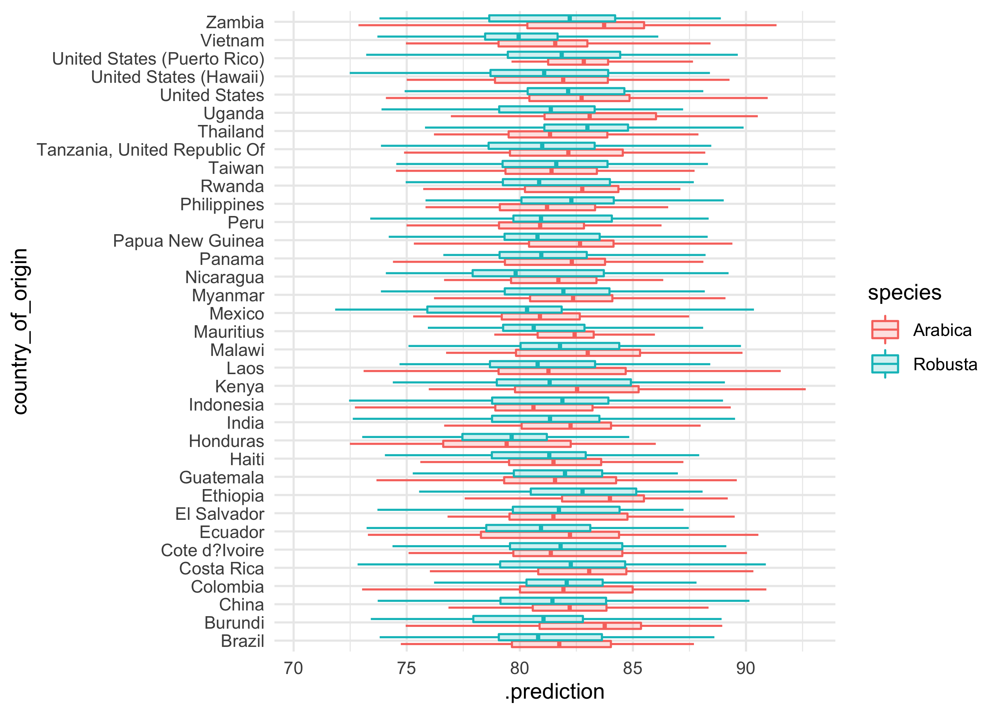
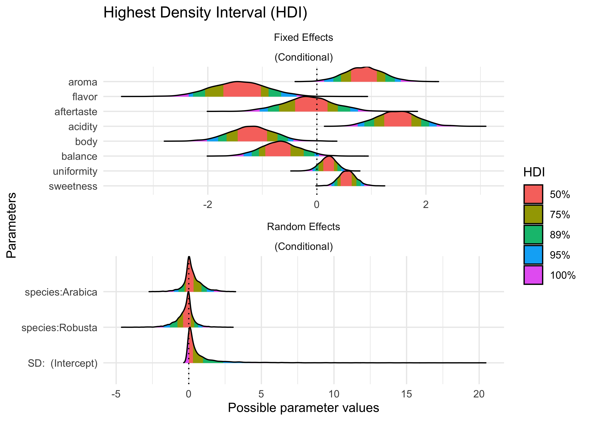
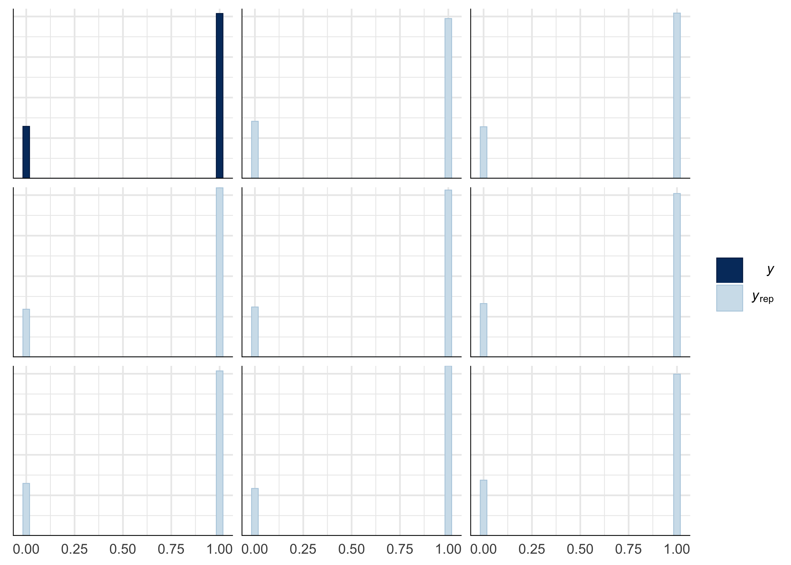
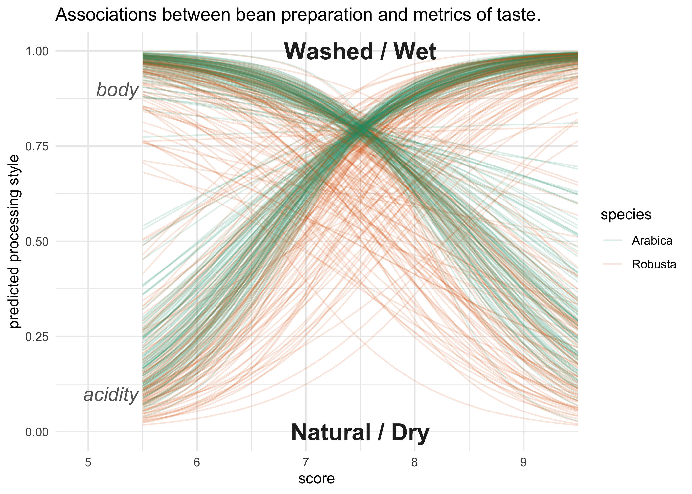

Coffee Ratings
================
Joshua Cook
July 7, 2020

## Setup

TidyTuesday link:
<https://github.com/rfordatascience/tidytuesday/blob/master/data/2020/2020-07-07/readme.md>

``` r
knitr::opts_chunk$set(echo = TRUE, comment = "#>", dpi = 400)

library(mustashe)
library(glue)
library(magrittr)
library(ggtext)
library(ggforce)
library(patchwork)
library(tidyverse)
library(conflicted)

conflict_prefer("filter", "dplyr")
conflict_prefer("select", "dplyr")
conflict_prefer("setdiff", "dplyr")

blue <- "#5eafe6"
red <- "#eb5e60"
light_grey <- "grey80"
grey <- "grey50"
dark_grey <- "grey25"

theme_set(theme_minimal())

# To shutup `summarise()`.
options(dplyr.summarise.inform = FALSE)

set.seed(0)
```

## Data

``` r
coffee_ratings <- read_csv("https://raw.githubusercontent.com/rfordatascience/tidytuesday/master/data/2020/2020-07-07/coffee_ratings.csv") %>%
    janitor::clean_names() %>%
    mutate(id = row_number())
```

    #> Parsed with column specification:
    #> cols(
    #>   .default = col_character(),
    #>   total_cup_points = col_double(),
    #>   number_of_bags = col_double(),
    #>   aroma = col_double(),
    #>   flavor = col_double(),
    #>   aftertaste = col_double(),
    #>   acidity = col_double(),
    #>   body = col_double(),
    #>   balance = col_double(),
    #>   uniformity = col_double(),
    #>   clean_cup = col_double(),
    #>   sweetness = col_double(),
    #>   cupper_points = col_double(),
    #>   moisture = col_double(),
    #>   category_one_defects = col_double(),
    #>   quakers = col_double(),
    #>   category_two_defects = col_double(),
    #>   altitude_low_meters = col_double(),
    #>   altitude_high_meters = col_double(),
    #>   altitude_mean_meters = col_double()
    #> )

    #> See spec(...) for full column specifications.

## EDA

``` r
naniar::miss_var_summary(coffee_ratings)
```

    #> # A tibble: 44 x 3
    #>    variable             n_miss pct_miss
    #>    <chr>                 <int>    <dbl>
    #>  1 lot_number             1063     79.4
    #>  2 farm_name               359     26.8
    #>  3 mill                    315     23.5
    #>  4 producer                231     17.3
    #>  5 altitude_low_meters     230     17.2
    #>  6 altitude_high_meters    230     17.2
    #>  7 altitude_mean_meters    230     17.2
    #>  8 altitude                226     16.9
    #>  9 variety                 226     16.9
    #> 10 color                   218     16.3
    #> # … with 34 more rows

``` r
coffee_ratings %>%
    select(id, total_cup_points, aroma:moisture) %>%
    pivot_longer(-id) %>%
    ggplot(aes(value)) +
    facet_wrap(~ name, ncol = 3, scales = "free") +
    geom_density(size = 1, color = blue, fill = blue, alpha = 0.2) +
    scale_y_continuous(expand = expansion(mult = c(0, 0.01)))
```

<!-- -->

``` r
coffee_ratings %>%
    select(id, aroma:moisture) %>%
    pivot_longer(-id) %>%
    ggplot(aes(x = name, y = value)) +
    ggbeeswarm::geom_quasirandom(size = 0.4, alpha = 0.2, color = blue) +
    geom_boxplot(outlier.shape = NA, size = 1, alpha = 0.2, fill = grey) +
    scale_y_continuous(expand = expansion(mult = c(00.02, 0.02)))
```

<!-- -->

## Modeling

  - model `total_cup_points` on other features of coffee
  - logistic: species \~ aroma:sweetness
  - logistic: two countries \~ aroma:sweetness

<!-- end list -->

``` r
library(rstanarm)
```

    #> Loading required package: Rcpp

    #> rstanarm (Version 2.19.3, packaged: 2020-02-11 05:16:41 UTC)

    #> - Do not expect the default priors to remain the same in future rstanarm versions.

    #> Thus, R scripts should specify priors explicitly, even if they are just the defaults.

    #> - For execution on a local, multicore CPU with excess RAM we recommend calling

    #> options(mc.cores = parallel::detectCores())

    #> - bayesplot theme set to bayesplot::theme_default()

    #>    * Does _not_ affect other ggplot2 plots

    #>    * See ?bayesplot_theme_set for details on theme setting

``` r
library(bayestestR)
library(bayesplot)
```

    #> This is bayesplot version 1.7.2

    #> - Online documentation and vignettes at mc-stan.org/bayesplot

    #> - bayesplot theme set to bayesplot::theme_default()

    #>    * Does _not_ affect other ggplot2 plots

    #>    * See ?bayesplot_theme_set for details on theme setting

``` r
library(see)
library(tidybayes)
library(modelr)
```

``` r
d <- coffee_ratings %>%
    filter(!is.na(country_of_origin) & !is.na(harvest_year))

stash("cupping_by_beantype", depends_on = "d", {
    cupping_by_beantype <- stan_glm(
        total_cup_points ~ 1 + species + country_of_origin,
        data = d,
        family = gaussian(link = "identity"),
        prior_intercept = normal(location = 0, scale = 2, autoscale = FALSE),
        prior = normal(location = 0, scale = 0.5, autoscale = FALSE),
        cores = 4,
        refresh = 0
    )
})
```

    #> Loading stashed object.

``` r
stash("cupping_by_beantype_me", depends_on = "d", {
    cupping_by_beantype_me <- stan_glmer(
        total_cup_points ~ 1 + species + country_of_origin + (1|harvest_year),
        data = d,
        family = gaussian(link = "identity"),
        prior_intercept = normal(location = 0, scale = 2, autoscale = FALSE),
        prior = normal(location = 0, scale = 0.5, autoscale = FALSE),
        cores = 4,
        refresh = 0
    )
})
```

    #> Loading stashed object.

``` r
cupping_by_beantype_loo <- loo(cupping_by_beantype)
```

    #> Warning: Found 1 observation(s) with a pareto_k > 0.7. We recommend calling 'loo' again with argument 'k_threshold = 0.7' in order to calculate the ELPD without the assumption that these observations are negligible. This will refit the model 1 times to compute the ELPDs for the problematic observations directly.

``` r
cupping_by_beantype_me_loo <- loo(cupping_by_beantype_me)
```

    #> Warning: Found 22 observations with a pareto_k > 0.7. With this many problematic observations we recommend calling 'kfold' with argument 'K=10' to perform 10-fold cross-validation rather than LOO.

``` r
loo_compare(cupping_by_beantype_loo, cupping_by_beantype_me_loo)
```

    #>                        elpd_diff se_diff
    #> cupping_by_beantype      0.0       0.0  
    #> cupping_by_beantype_me -21.2      13.3

``` r
plot(bayestestR::hdi(cupping_by_beantype, ci = c(0.5, 0.75, 0.89, 0.95)))
```

<!-- -->

``` r
d %>%
    modelr::data_grid(species, country_of_origin) %>%
    add_predicted_draws(cupping_by_beantype, n = 50) %>%
    ggplot(aes(x = .prediction, y = country_of_origin)) +
    geom_boxplot(aes(color = species, fill = species), alpha = 0.2, outlier.shape = NA)
```

<!-- -->

### Logisitic regression on processing method

``` r
washed_wet_d <- coffee_ratings %>%
    filter(!is.na(processing_method)) %>%
    filter(processing_method %in% c("Natural / Dry", "Washed / Wet")) %>%
    mutate(washed_wet = processing_method == "Washed / Wet") %>%
    select(washed_wet, species, aroma:sweetness, -clean_cup)

stash("processing_method_model", depends_on = "washed_wet_d", {
    processing_method_model <- stan_glmer(
        washed_wet ~ aroma + flavor + aftertaste + acidity + 
                     body + balance + uniformity + sweetness + 
                     (1|species),
        data = washed_wet_d,
        family = binomial(link = "logit"),
        prior_intercept = normal(0, 3, autoscale = FALSE),
        prior = normal(0, 3, autoscale = FALSE),
        refresh = 0,
        cores = 4
    )
})
```

    #> Loading stashed object.

``` r
plot(processing_method_model)
```

<!-- -->

``` r
as.data.frame(describe_posterior(processing_method_model))
```

    #>     Parameter     Median CI      CI_low     CI_high      pd ROPE_CI   ROPE_low
    #> 1 (Intercept)  1.5772327 89 -2.61516469  6.44786383 0.72075      89 -0.1813799
    #> 4       aroma  0.8682892 89  0.30300797  1.43285915 0.99450      89 -0.1813799
    #> 7      flavor -1.4214839 89 -2.27520997 -0.65208677 0.99725      89 -0.1813799
    #> 3  aftertaste -0.1601588 89 -0.89536776  0.61308064 0.63250      89 -0.1813799
    #> 2     acidity  1.4725094 89  0.86880302  2.06153963 1.00000      89 -0.1813799
    #> 6        body -1.1999633 89 -1.81082944 -0.52904895 0.99675      89 -0.1813799
    #> 5     balance -0.6754452 89 -1.19361735 -0.04495839 0.96925      89 -0.1813799
    #> 9  uniformity  0.2107867 89 -0.02882586  0.44492133 0.91575      89 -0.1813799
    #>   ROPE_high ROPE_Percentage      Rhat      ESS
    #> 1 0.1813799      0.05082842 0.9995265 3634.438
    #> 4 0.1813799      0.00000000 1.0009515 3694.481
    #> 7 0.1813799      0.00000000 1.0013434 3225.412
    #> 3 0.1813799      0.33445661 1.0000297 3285.913
    #> 2 0.1813799      0.00000000 1.0001545 4110.583
    #> 6 0.1813799      0.00000000 0.9995631 3643.059
    #> 5 0.1813799      0.05925302 0.9996504 3647.672
    #> 9 0.1813799      0.40634653 0.9998515 3341.730
    #>  [ reached 'max' / getOption("max.print") -- omitted 1 rows ]

``` r
plot(bayestestR::hdi(processing_method_model, 
                     ci = c(0.5, 0.75, 0.89, 0.95), 
                     effects = "all"))
```

<!-- -->

``` r
pp_check(processing_method_model)
```

<!-- -->

``` r
pp_check(processing_method_model, plotfun = "hist")
```

    #> `stat_bin()` using `bins = 30`. Pick better value with `binwidth`.

<!-- -->

``` r
washed_wet_averages <- washed_wet_d %>%
    summarise(aroma = median(aroma), 
              flavor = median(flavor), 
              aftertaste = median(aftertaste), 
              acidity = median(acidity),
              body = median(body), 
              balance = median(balance), 
              uniformity = median(uniformity), 
              sweetness = median(sweetness))

n_draws <- 100
pred_range <- seq(5.5, 9.5, length.out = 100)

pred_data_acidity <- washed_wet_d %>%
    data_grid(washed_wet, species, 
              acidity = pred_range) %>%
    bind_cols(washed_wet_averages %>% select(-acidity)) %>%
    add_fitted_draws(processing_method_model, n = n_draws) %>%
    add_column(var = "acidity")

pred_data_body <- washed_wet_d %>%
    data_grid(washed_wet, species, 
              body = pred_range) %>%
    bind_cols(washed_wet_averages %>% select(-body)) %>%
    add_fitted_draws(processing_method_model, n = n_draws) %>%
    add_column(var = "body")

bind_rows(pred_data_acidity, pred_data_body) %>%
    mutate(x_value = ifelse(var == "acidity", acidity, body)) %>%
    ggplot(aes(x = x_value, y = .value)) +
    geom_line(aes(group = paste(.draw, .iteration, species, var), 
                  color = species),
              alpha = 0.15) +
    geom_text(aes(x = x, y = y, label = label),
               data = tibble(x = 5.46, 
                             y = c(0.1, 0.9), 
                             label = c("acidity", "body")),
               family = "Arial", size = 5, color = "grey40", fontface = "italic", hjust = 1) +
    geom_text(aes(x = x, y = y, label = label),
               data = tibble(x = median(pred_range), 
                             y = c(0, 1), 
                             label = c("Natural / Dry", "Washed / Wet")),
               family = "Arial", size = 6, color = "grey15", fontface = "bold") +
    scale_x_continuous(limits = c(4.7, 9.5), expand = c(0, 0)) +
    scale_color_brewer(palette = "Dark2") +
    labs(x = "score",
         y = "predicted processing style",
         title = "Associations between bean preparation and metrics of taste.")
```

<!-- -->
