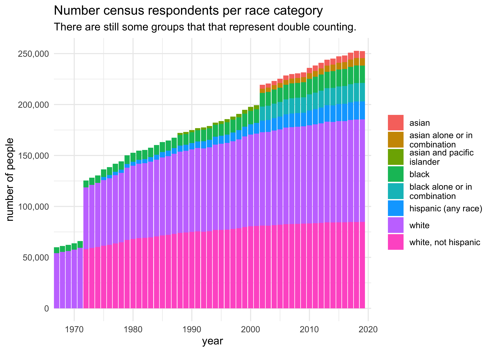
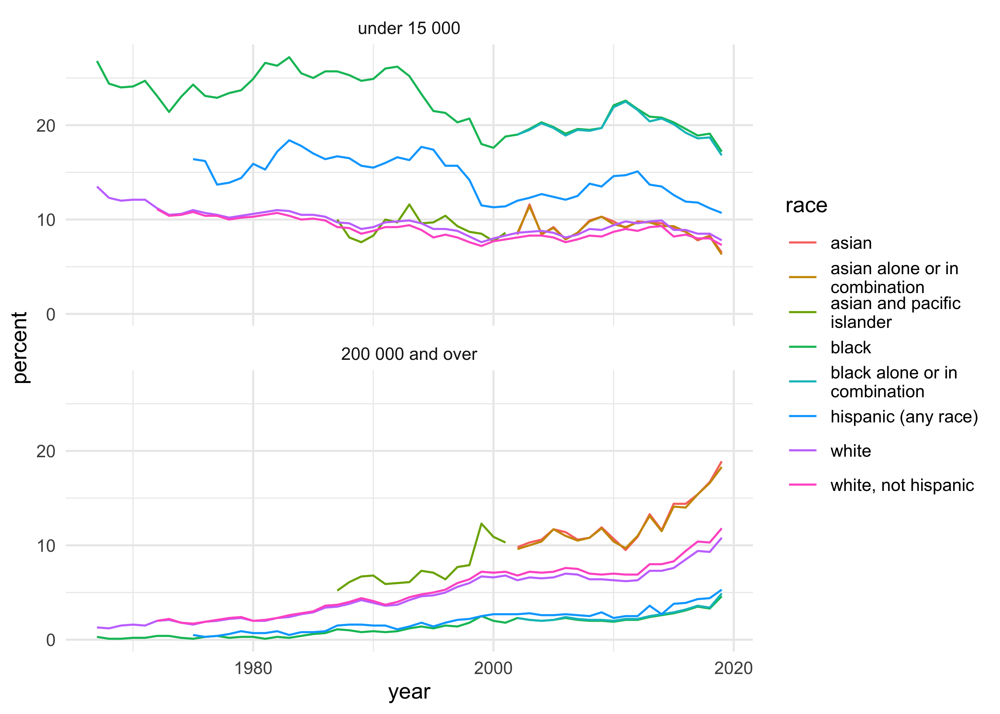
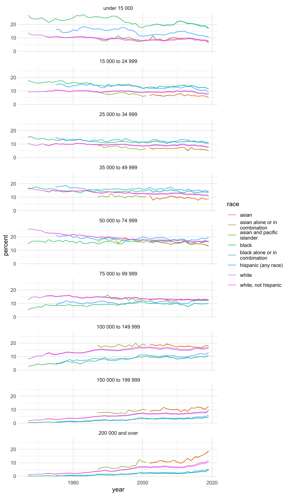
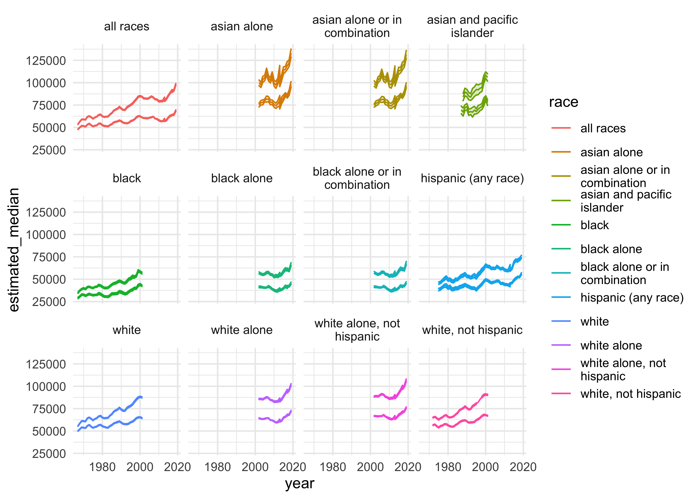
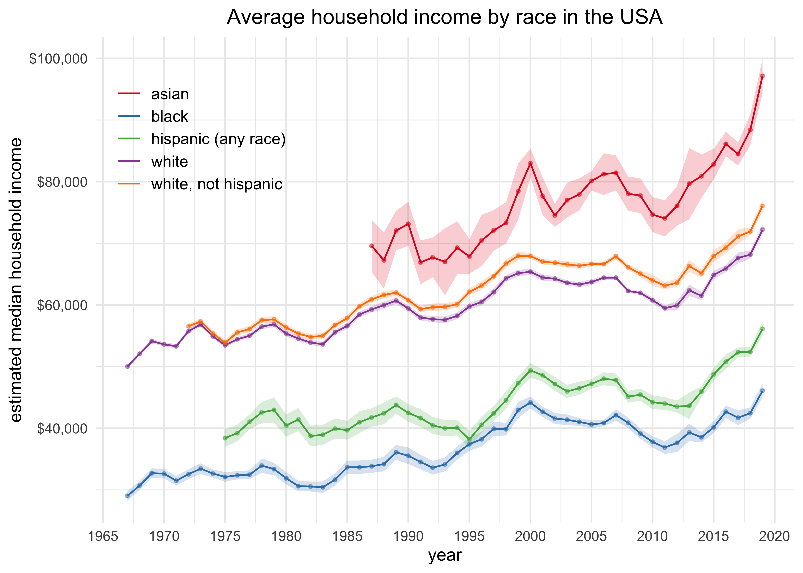

USA Household Income
================
Joshua Cook
December 29, 2020

## Setup

For the first week of the year, we were told to bring our favorite data
from 2020. I decided to prepare my own data on US household income
acquired from the [US Census
Bureau](https://www.census.gov/library/publications/2020/demo/p60-270.html).
The processing of that data was conducted in
[“2020-12-29\_usa-household-income.R”](2020-12-29_usa-household-income.R).

## Data

``` r
annotations <- read_csv(here::here(files_dir, "annotations.csv"))
```

    #> 
    #> ── Column specification ────────────────────────────────────────────────────────
    #> cols(
    #>   annotation = col_character(),
    #>   information = col_character()
    #> )

``` r
average_income <- read_csv(here::here(files_dir, "average_income.csv"))
```

    #> 
    #> ── Column specification ────────────────────────────────────────────────────────
    #> cols(
    #>   year = col_double(),
    #>   year_annotation = col_number(),
    #>   race = col_character(),
    #>   race_annotation = col_double(),
    #>   estimated_median = col_double(),
    #>   estimated_median_error = col_double(),
    #>   estimated_mean = col_double(),
    #>   estimated_mean_error = col_double()
    #> )

``` r
income_by_race <- read_csv(here::here(files_dir, "income_by_race.csv"))
```

    #> 
    #> ── Column specification ────────────────────────────────────────────────────────
    #> cols(
    #>   year = col_double(),
    #>   year_annotation = col_number(),
    #>   race = col_character(),
    #>   race_annotation = col_double(),
    #>   number = col_double(),
    #>   income = col_character(),
    #>   percent = col_double()
    #> )

## EDA

``` r
head(average_income)
```

    #> # A tibble: 6 x 8
    #>    year year_annotation race  race_annotation estimated_median estimated_media…
    #>   <dbl>           <dbl> <chr>           <dbl>            <dbl>            <dbl>
    #> 1  2019              NA ALL …              NA            68703              904
    #> 2  2018              NA ALL …              NA            64324              704
    #> 3  2017               2 ALL …              NA            63761              552
    #> 4  2017              NA ALL …              NA            64007              575
    #> 5  2016              NA ALL …              NA            62898              764
    #> 6  2015              NA ALL …              NA            60987              570
    #> # … with 2 more variables: estimated_mean <dbl>, estimated_mean_error <dbl>

``` r
head(income_by_race)
```

    #> # A tibble: 6 x 7
    #>    year year_annotation race      race_annotation number income          percent
    #>   <dbl>           <dbl> <chr>               <dbl>  <dbl> <chr>             <dbl>
    #> 1  2019              NA ALL RACES              NA 128451 under 15 000        9.1
    #> 2  2019              NA ALL RACES              NA 128451 15 000 to 24 9…     8  
    #> 3  2019              NA ALL RACES              NA 128451 25 000 to 34 9…     8.3
    #> 4  2019              NA ALL RACES              NA 128451 35 000 to 49 9…    11.7
    #> 5  2019              NA ALL RACES              NA 128451 50 000 to 74 9…    16.5
    #> 6  2019              NA ALL RACES              NA 128451 75 000 to 99 9…    12.3

``` r
income_by_race <- income_by_race %.% {
  filter(
    !year %in% c(2017, 2013) |
      (year == 2017 & year_annotation == "2") |
      (year == 2013 & year_annotation == "3")
  )
  mutate(
    race = str_remove(race, " ALONE$| ALONE(?=,)"),
    race = str_to_lower(race)
  )
  distinct()
}
```

``` r
income_by_race %.%
  {
    filter(race != "all races")
    mutate(race = str_wrap(race, 20))
    distinct(year, race, number)
  } %>%
  ggplot(aes(year, number)) +
  geom_col(aes(fill = race), position = "stack") +
  scale_x_continuous(expand = expansion(mult = c(0, 0.02))) +
  scale_y_continuous(labels = scales::label_comma()) +
  theme(legend.title = element_blank()) +
  labs(
    x = "year",
    y = "number of people",
    title = "Number census respondents per race category",
    subtitle = "There are still some groups that that represent double counting."
  )
```

    #> Warning: Removed 1 rows containing missing values (position_stack).

<!-- -->

``` r
income_by_race %.%
  {
    mutate(income = fct_inorder(income))
    filter(race != "all races")
    mutate(race = str_wrap(race, 20))
    filter(income %in% c("under 15 000", "200 000 and over"))
  } %>%
  ggplot(aes(x = year, y = percent)) +
  facet_wrap(~income, ncol = 1) +
  geom_line(aes(color = race))
```

<!-- -->

``` r
income_by_race %.%
  {
    mutate(income = fct_inorder(income))
    filter(race != "all races")
    mutate(race = str_wrap(race, 20))
  } %>%
  ggplot(aes(x = year, y = percent)) +
  facet_wrap(~income, ncol = 1) +
  geom_line(aes(color = race), alpha = 0.8) +
  theme(panel.spacing = unit(2, "mm"))
```

<!-- -->

``` r
average_income %.%
  {
    mutate(
      race = str_wrap(race, 20),
      race = str_to_lower(race),
      median_low = estimated_median - estimated_median_error,
      median_high = estimated_median + estimated_median_error,
      mean_low = estimated_mean - estimated_mean_error,
      mean_high = estimated_mean + estimated_mean_error
    )
  } %>%
  ggplot(aes(x = year, color = race, fill = race)) +
  facet_wrap(~race) +
  geom_ribbon(
    aes(ymin = median_low, ymax = median_high),
    alpha = 0.2,
    show.legend = FALSE
  ) +
  geom_line(aes(y = estimated_median)) +
  geom_ribbon(
    aes(ymin = mean_low, ymax = mean_high),
    alpha = 0.2,
    show.legend = FALSE
  ) +
  geom_line(aes(y = estimated_mean))
```

    #> Warning: Removed 1 row(s) containing missing values (geom_path).

<!-- -->

``` r
black_name_change_year <- average_income %.% {
  filter(race == "BLACK ALONE OR IN COMBINATION")
  pull(year)
  min()
}

average_income %.%
  {
    filter(
      !year %in% c(2017, 2013) |
        (year == 2017 & year_annotation == "2") |
        (year == 2013 & year_annotation == "3")
    )
    mutate(
      race = str_to_lower(race),
      race = str_remove(race, " alone$| alone(?=,)")
    )
    filter(!race %in% c("all races", "asian"))
    filter(!(year >= black_name_change_year & race == "black"))
    mutate(
      race = case_when(
        str_detect(race, "asian") ~ "asian",
        str_detect(race, "black") ~ "black",
        TRUE ~ race
      ),
      median_low = estimated_median - estimated_median_error,
      median_high = estimated_median + estimated_median_error,
    )
  } %>%
  ggplot(aes(x = year, y = estimated_median)) +
  geom_ribbon(
    aes(ymin = median_low, ymax = median_high, fill = race),
    alpha = 0.2,
    show.legend = FALSE
  ) +
  geom_line(aes(color = race)) +
  geom_point(aes(color = race), size = 0.8, alpha = 0.5) +
  scale_x_continuous(n.breaks = 10) +
  scale_y_continuous(labels = scales::dollar_format()) +
  scale_color_brewer(
    type = "qual", palette = "Set1",
    guide = guide_legend(override.aes = list(shape = NA))
  ) +
  scale_fill_brewer(type = "qual", palette = "Set1") +
  theme(
    plot.title = element_text(hjust = 0.5),
    legend.position = c(0.15, 0.80),
    legend.title = element_blank(),
    legend.key.height = unit(5, "mm"),
    legend.text = element_text(size = 10)
  ) +
  labs(
    x = "year",
    y = "estimated median household income",
    title = "Average household income by race in the USA"
  )
```

<!-- -->
