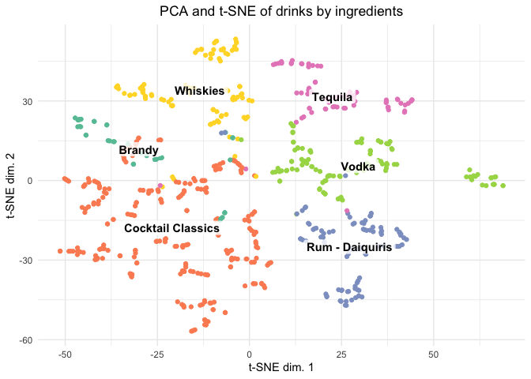
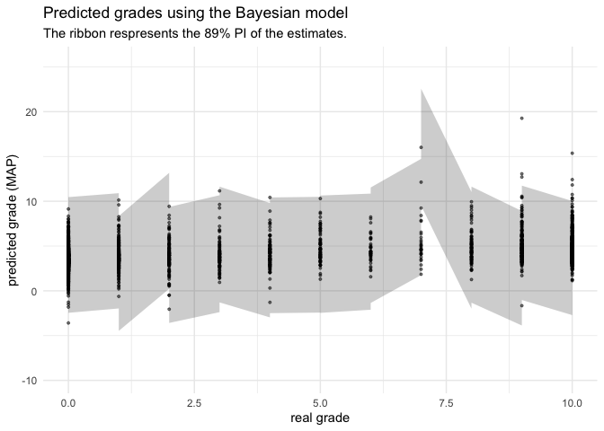
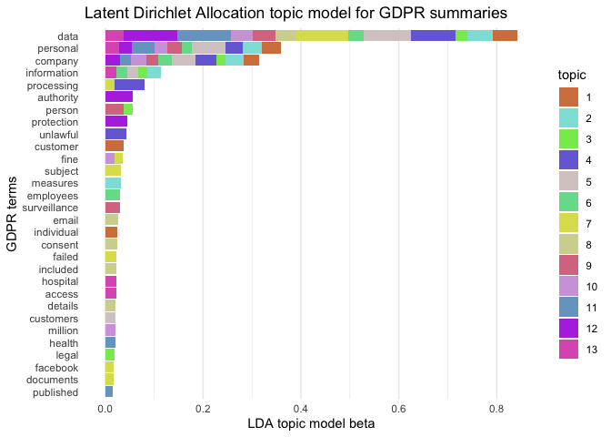
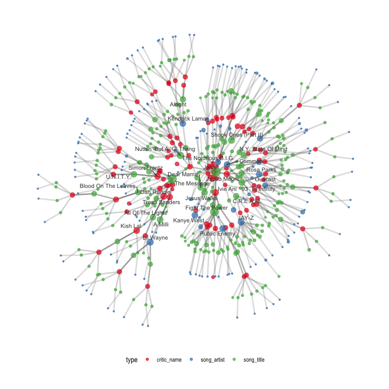
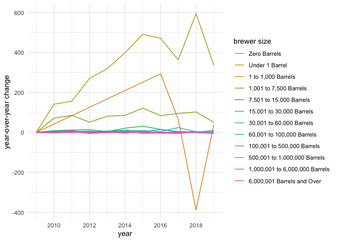
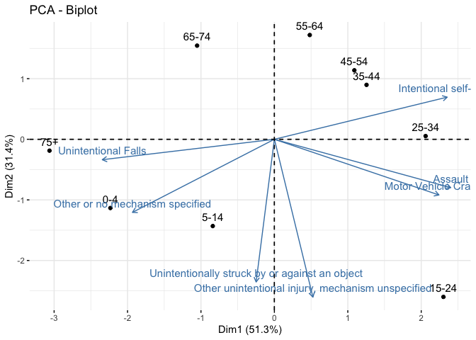
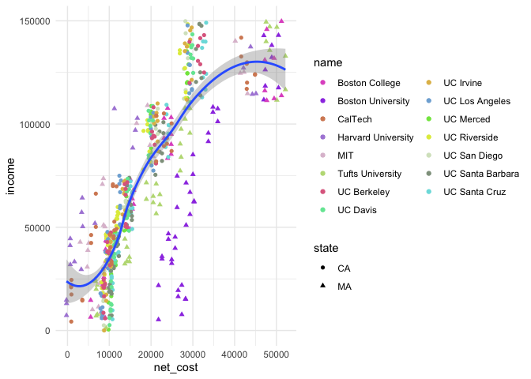
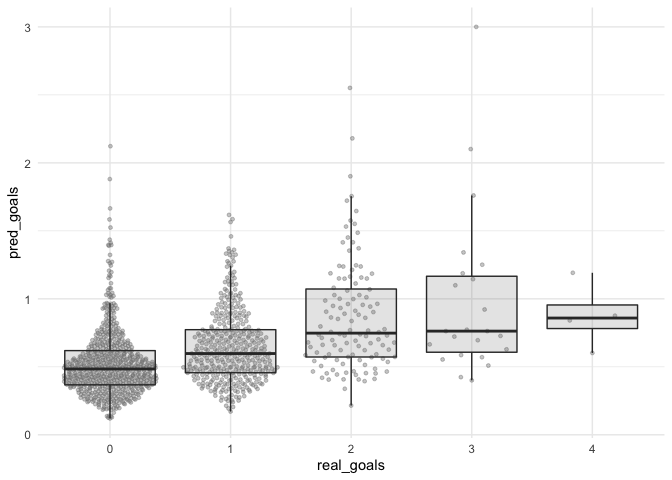
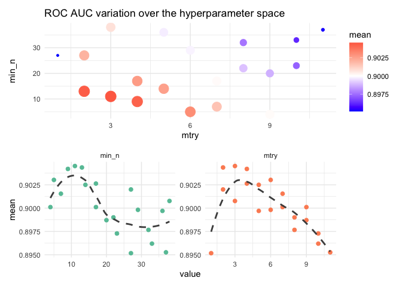

```{r setup, include=FALSE}
knitr::opts_chunk$set(echo = TRUE, comment = "#>")
library(fontawesome)
```

# Tidy Tuesday

[`#TidyTuesday`](https://github.com/rfordatascience/tidytuesday) is a tradition in R where every Tuesday, we practice our data analysis skills on a new "toy" data set.


## Log

**June 2, 2020 - Marble Racing**

[data](https://github.com/rfordatascience/tidytuesday/blob/master/data/2020/2020-06-02/readme.md) | [analysis](2020-06-02_marble-racing.md)

I played around with the data by asking a few smaller questions about the differences between marbles.


**May 26, 2020 - Volcano Eruptions**

[data](https://github.com/rfordatascience/tidytuesday/blob/master/data/2020/2020-05-26/readme.md) | [analysis](2020-05-26_cocktails.md)

I kept it simple this week because the data was quite limited.
I clustered the drinks by their ingredients after doing some feature engineering to extract information form the list of ingredients.



**May 19, 2020 - Volcano Eruptions**

[data](https://github.com/rfordatascience/tidytuesday/blob/master/data/2020/2020-05-19/readme.md) | [analysis](2020-05-19_beach-volleyball.md)

I used logisitic models to predict winners and losers of volleyball matches based on gameplay statistics (e.g. number of attacks, errors, digs, etc.).
I found that including interactions with game duration increased the performance of the model without overfitting.


**May 12, 2020 - Volcano Eruptions**

[data](https://github.com/rfordatascience/tidytuesday/blob/master/data/2020/2020-05-12/readme.md) | [analysis](2020-05-12_volcano-eruptions.md)

I took this as a chance to play around with the suite of packages from ['easystats'](https://github.com/easystats/easystats).
Towards the end, I also experiment a bit more with mixed-effects modeling to help get a better understanding of how to interpret these models.


**May 5, 2020 - Animal Crossing - New Horizons**

[data](https://github.com/rfordatascience/tidytuesday/blob/master/data/2020/2020-05-05/readme.md) | [analysis](2020-05-05_animal-crossing-new-horizons.md)

I used sentiment analysis results on user reivews to model their review grade using a multivariate Bayesian model fit with the quadratic approximation.
The model was pretty awful, but I was able to get some good practice at this statisticaly techinque I am still learning.



**April 28, 2020 - Broadway Weekly Grosses**

[data](https://github.com/rfordatascience/tidytuesday/blob/master/data/2020/2020-04-28/readme.md) | [analysis](2020-04-28_broadway-weekly-grosses.md)

This data set was not very interesting to me as the numerical values were basically all derived from a single value, making it very difficult to avoid highly correlative covariates when modeling.
Still, I got some practice at creating an interpreting miced-effects models.


**April 21, 2020 - GDPR Violations**

[data](https://github.com/rfordatascience/tidytuesday/blob/master/data/2020/2020-04-21/readme.md) | [analysis](2020-04-21_gdpr-violations.md)

I used the 'tidytext' and 'topicmodels' packages to group the GDPR fines based on summaries about the violations.




**April 14, 2020 - Best Rap Artists**

[data](https://github.com/rfordatascience/tidytuesday/blob/master/data/2020/2020-04-14/readme.md) | [analysis](2020-04-14_best-rap-artists.md)

I built a graph of the songs, artists, and critics using Rap song rankings.



**April 7, 2020 - Tour de France**

[data](https://github.com/rfordatascience/tidytuesday/blob/master/data/2020/2020-04-07/readme.md) | [analysis](2020-04-07_tour-de-france.md)

There was quite a lot of data and it took me too long to sort through it all.
Next time, I will focus more on asking a single simple question rather than trying to understand every aspect of the data.


**March 31, 2020 - Beer Production**

[data](https://github.com/rfordatascience/tidytuesday/blob/master/data/2020/2020-03-31/readme.md) | [analysis](2020-03-31_beer-production.md)

I analyzed the number of breweries at varies size categoires and found a jump of very small microbreweries to higher capacity in 2018 and 2019.




**March 24, 2020 - Traumatic Brain Injury**

[data](https://github.com/rfordatascience/tidytuesday/blob/master/data/2020/2020-03-24/readme.md) | [analysis](2020-03-24_traumatic-brain-injury.md)

The data was a bit more limiting because we only had summary statistics for categorical variables, but I was able to use PCA to identify some interesting properties of the TBI sustained by the different age groups.



**March 10, 2020 - College Tuition, Diversity, and Pay**

[data](https://github.com/rfordatascience/tidytuesday/blob/master/data/2020/2020-03-10/readme.md) | [analysis](2020-03-10_college-tuition-diversity-and-pay.md)

I tried to do some classic linear modeling and mixed effects modeling, but the dat didn't really require it.
Still, I got some practice with this method and read plenty about it online during the process.



**March 3, 2020 - Hockey Goals**

[data](https://github.com/rfordatascience/tidytuesday/blob/master/data/2020/2020-03-03/readme.md) | [analysis](2020-03-03_hockey-goals.md)

I got some practice build regression models for count data by building Poisson, Negative Binomial, and Zero-Inflated Poisson regression models for estimating the effect of various game parameters on the goals scored by Alex Ovechkin.



**January 21, 2020 - Spotify Songs**

[data](https://github.com/rfordatascience/tidytuesday/blob/master/data/2020/2020-01-21/readme.md) | [analysis](2020-01-21_spotify-songs.md)

I used a random forest model to predict the genre of a playlist using musical features of their songs.
I was able to play around with the 'tidymodels' framework.




**October 15, 2019**

[data](https://github.com/rfordatascience/tidytuesday/tree/master/data/2019/2019-10-15) | [analysis](2019-10-15_big-mtcars.md)

I chose this old TidyTuesday dataset because I wanted to build a simple linear model using Bayesian methods.
I didn't do too much (and probably did a bit wrong), but this was a useful exercise to get to play around with the modeling.

