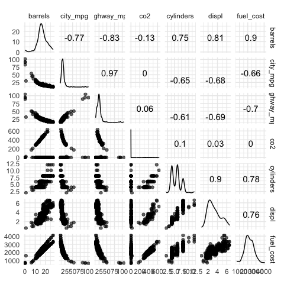
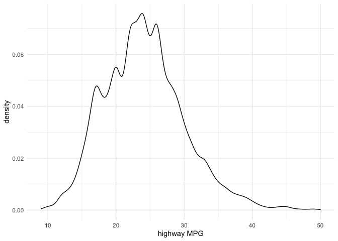
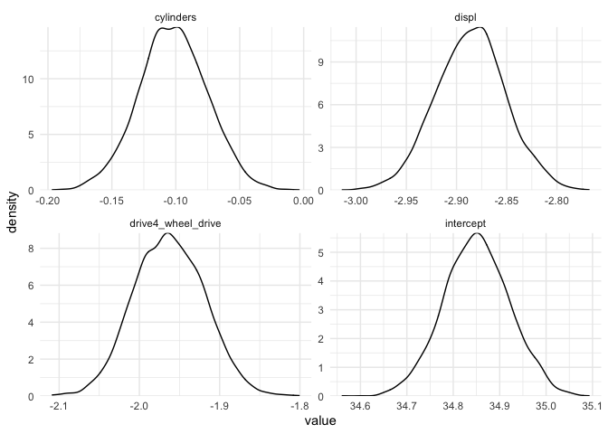
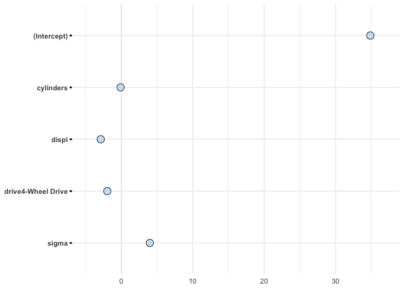
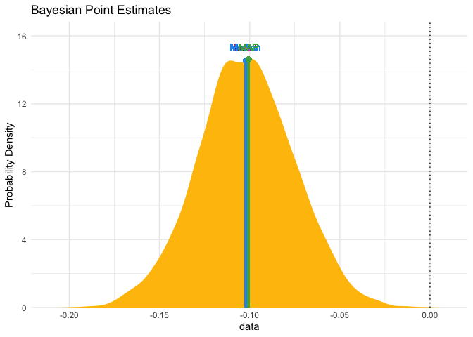
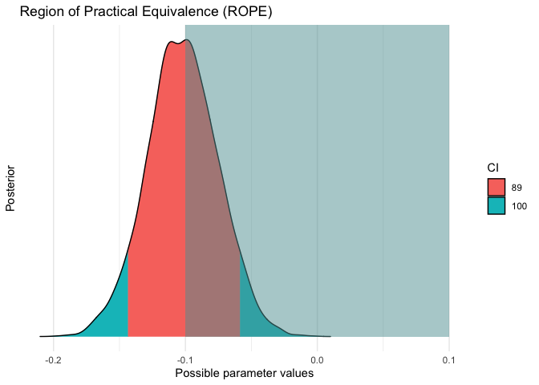
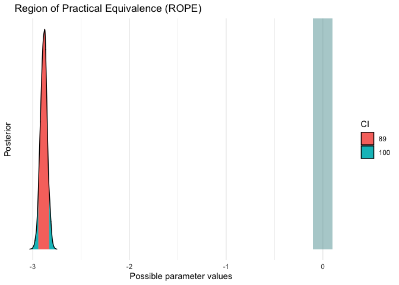
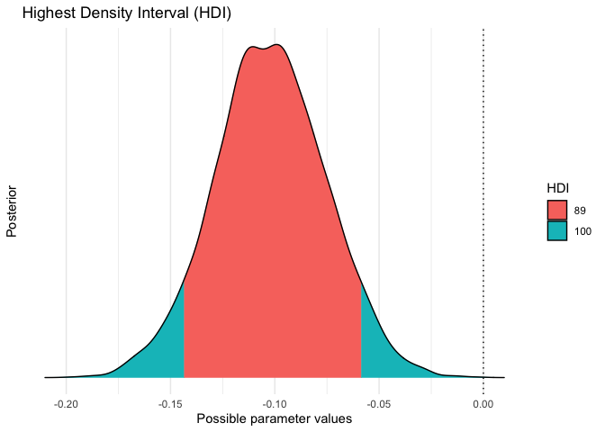
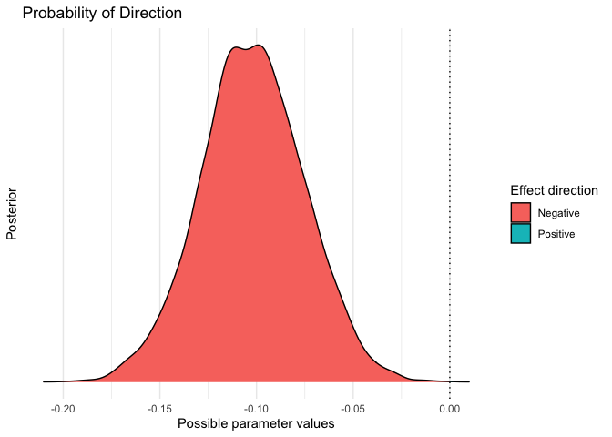

Big mtcars
================
Joshua Cook
10/15/2020

``` r
knitr::opts_chunk$set(echo = TRUE, comment = "#>")

library(GGally)
library(magrittr)
library(tidyverse)

theme_set(theme_minimal())

set.seed(0)
```

## Data

Data dictionary:
<https://www.fueleconomy.gov/feg/ws/index.shtml#fuelType1>

``` r
big_epa_cars <- readr::read_csv("https://raw.githubusercontent.com/rfordatascience/tidytuesday/master/data/2019/2019-10-15/big_epa_cars.csv") %>%
    janitor::clean_names()
```

    #> Parsed with column specification:
    #> cols(
    #>   .default = col_double(),
    #>   drive = col_character(),
    #>   eng_dscr = col_character(),
    #>   fuelType = col_character(),
    #>   fuelType1 = col_character(),
    #>   make = col_character(),
    #>   model = col_character(),
    #>   mpgData = col_character(),
    #>   phevBlended = col_logical(),
    #>   trany = col_character(),
    #>   VClass = col_character(),
    #>   guzzler = col_logical(),
    #>   trans_dscr = col_character(),
    #>   tCharger = col_logical(),
    #>   sCharger = col_character(),
    #>   atvType = col_character(),
    #>   fuelType2 = col_logical(),
    #>   rangeA = col_logical(),
    #>   evMotor = col_logical(),
    #>   mfrCode = col_logical(),
    #>   c240Dscr = col_logical()
    #>   # ... with 4 more columns
    #> )

    #> See spec(...) for full column specifications.

    #> Warning: 26930 parsing failures.
    #>  row     col           expected actual                                                                                                         file
    #> 4430 guzzler 1/0/T/F/TRUE/FALSE      G 'https://raw.githubusercontent.com/rfordatascience/tidytuesday/master/data/2019/2019-10-15/big_epa_cars.csv'
    #> 4431 guzzler 1/0/T/F/TRUE/FALSE      G 'https://raw.githubusercontent.com/rfordatascience/tidytuesday/master/data/2019/2019-10-15/big_epa_cars.csv'
    #> 4432 guzzler 1/0/T/F/TRUE/FALSE      G 'https://raw.githubusercontent.com/rfordatascience/tidytuesday/master/data/2019/2019-10-15/big_epa_cars.csv'
    #> 4433 guzzler 1/0/T/F/TRUE/FALSE      G 'https://raw.githubusercontent.com/rfordatascience/tidytuesday/master/data/2019/2019-10-15/big_epa_cars.csv'
    #> 4442 guzzler 1/0/T/F/TRUE/FALSE      G 'https://raw.githubusercontent.com/rfordatascience/tidytuesday/master/data/2019/2019-10-15/big_epa_cars.csv'
    #> .... ....... .................. ...... ............................................................................................................
    #> See problems(...) for more details.

``` r
big_cars <- big_epa_cars %>%
    filter(is.na(fuel_type2)) %>%
    select(id, make, model, year, eng_id, barrels08, city08, highway08, 
           co2, cylinders, displ, drive, fuel_cost08) %>%
    distinct() %>%
    set_names(c("id", "mfr", "model", "year", "engine_id", "barrels", 
                "city_mpg", "highway_mpg", "co2", "cylinders", "displ", 
                "drive", "fuel_cost"))

big_cars
```

    #> # A tibble: 41,804 x 13
    #>       id mfr   model  year engine_id barrels city_mpg highway_mpg   co2
    #>    <dbl> <chr> <chr> <dbl>     <dbl>   <dbl>    <dbl>       <dbl> <dbl>
    #>  1     1 Alfa… Spid…  1985      9011    15.7       19          25    -1
    #>  2    10 Ferr… Test…  1985     22020    30.0        9          14    -1
    #>  3   100 Dodge Char…  1985      2100    12.2       23          33    -1
    #>  4  1000 Dodge B150…  1985      2850    30.0       10          12    -1
    #>  5 10000 Suba… Lega…  1993     66031    17.3       17          23    -1
    #>  6 10001 Suba… Loya…  1993     66020    15.0       21          24    -1
    #>  7 10002 Suba… Loya…  1993     66020    13.2       22          29    -1
    #>  8 10003 Toyo… Coro…  1993     57005    13.7       23          26    -1
    #>  9 10004 Toyo… Coro…  1993     57005    12.7       23          31    -1
    #> 10 10005 Toyo… Coro…  1993     57006    13.2       23          30    -1
    #> # … with 41,794 more rows, and 4 more variables: cylinders <dbl>, displ <dbl>,
    #> #   drive <chr>, fuel_cost <dbl>

## EDA

``` r
big_cars %>%
    sample_n(300) %>%
    select(barrels:fuel_cost) %>%
    GGally::ggscatmat(alpha = 0.6)
```

    #> Warning in GGally::ggscatmat(., alpha = 0.6): Factor variables are omitted in
    #> plot

    #> Warning: Removed 4 rows containing non-finite values (stat_density).
    
    #> Warning: Removed 4 rows containing non-finite values (stat_density).

<!-- -->

The `co2` column will be removed because is missing a lot of data.

``` r
big_cars %>% 
    filter(co2 == -1) %>% 
    sample_n(10) %>%
    select(mfr, model)
```

    #> # A tibble: 10 x 2
    #>    mfr       model         
    #>    <chr>     <chr>         
    #>  1 Acura     SLX           
    #>  2 GMC       Rally G35 2WD 
    #>  3 Ford      Focus         
    #>  4 Nissan    Xterra 4WD    
    #>  5 Mercury   Topaz         
    #>  6 Suzuki    Vitara 2Door  
    #>  7 Porsche   Targa         
    #>  8 Pontiac   6000 Wagon    
    #>  9 Chevrolet Colorado 2WD  
    #> 10 Chevrolet G10/20 Van 2WD

The `fuel_cost` and `barrels` columns are highly correlated, and the
`city_mpg` and `highway_mpg` are highly correlated. Therefore, we can
remove one column of each pair.

``` r
big_cars %<>%
    select(-fuel_cost, -city_mpg, -co2)
```

``` r
big_cars %>%
    count(drive)
```

    #> # A tibble: 8 x 2
    #>   drive                          n
    #>   <chr>                      <int>
    #> 1 2-Wheel Drive                507
    #> 2 4-Wheel Drive               1578
    #> 3 4-Wheel or All-Wheel Drive  6648
    #> 4 All-Wheel Drive             3222
    #> 5 Front-Wheel Drive          14400
    #> 6 Part-time 4-Wheel Drive      270
    #> 7 Rear-Wheel Drive           13990
    #> 8 <NA>                        1189

``` r
big_cars %<>%
    filter(!is.na(drive)) %>%
    mutate(drive = case_when(
        drive == "4-Wheel or All-Wheel Drive" ~ "4-Wheel Drive",
        drive == "All-Wheel Drive" ~ "4-Wheel Drive",
        drive == "Part-time 4-Wheel Drive" ~ "4-Wheel Drive",
        drive == "Front-Wheel Drive" ~ "2-Wheel Drive",
        drive == "Rear-Wheel Drive" ~ "2-Wheel Drive",
        drive == "Front-Wheel Drive" ~ "2-Wheel Drive",
        TRUE ~ drive
    ))

big_cars %>%
    count(drive)
```

    #> # A tibble: 2 x 2
    #>   drive             n
    #>   <chr>         <int>
    #> 1 2-Wheel Drive 28897
    #> 2 4-Wheel Drive 11718

Remove outliers of `highway_mpg`.

``` r
big_cars %>%
    filter(highway_mpg <= 50) %>%
    ggplot(aes(x = highway_mpg)) +
    geom_density() +
    labs(x = "highway MPG",
         y = "density")
```

<!-- -->

``` r
big_cars %<>% filter(highway_mpg <= 50)
```

## Modeling

### Standard linear model

``` r
lm_model <- lm(highway_mpg ~ cylinders + displ + drive,
               data = big_cars)

summary(lm_model)
```

    #> 
    #> Call:
    #> lm(formula = highway_mpg ~ cylinders + displ + drive, data = big_cars)
    #> 
    #> Residuals:
    #>      Min       1Q   Median       3Q      Max 
    #> -15.5808  -2.6701  -0.2647   2.3954  20.7525 
    #> 
    #> Coefficients:
    #>                    Estimate Std. Error t value Pr(>|t|)    
    #> (Intercept)        34.84890    0.07215 483.021  < 2e-16 ***
    #> cylinders          -0.10131    0.02641  -3.836 0.000125 ***
    #> displ              -2.88676    0.03433 -84.090  < 2e-16 ***
    #> drive4-Wheel Drive -1.96203    0.04432 -44.269  < 2e-16 ***
    #> ---
    #> Signif. codes:  0 '***' 0.001 '**' 0.01 '*' 0.05 '.' 0.1 ' ' 1
    #> 
    #> Residual standard error: 3.993 on 40366 degrees of freedom
    #>   (9 observations deleted due to missingness)
    #> Multiple R-squared:  0.5364, Adjusted R-squared:  0.5364 
    #> F-statistic: 1.557e+04 on 3 and 40366 DF,  p-value: < 2.2e-16

### Bayesian method

``` r
library(rstanarm)
```

    #> Loading required package: Rcpp

    #> rstanarm (Version 2.19.3, packaged: 2020-02-11 05:16:41 UTC)

    #> - Do not expect the default priors to remain the same in future rstanarm versions.

    #> Thus, R scripts should specify priors explicitly, even if they are just the defaults.

    #> - For execution on a local, multicore CPU with excess RAM we recommend calling

    #> options(mc.cores = parallel::detectCores())

    #> - bayesplot theme set to bayesplot::theme_default()

    #>    * Does _not_ affect other ggplot2 plots

    #>    * See ?bayesplot_theme_set for details on theme setting

``` r
library(bayestestR)
library(insight)
library(see)
```

``` r
stan_model <- stan_glm(highway_mpg ~ cylinders + displ + drive,
                       data = big_cars)
```

    #> 
    #> SAMPLING FOR MODEL 'continuous' NOW (CHAIN 1).
    #> Chain 1: 
    #> Chain 1: Gradient evaluation took 0.000108 seconds
    #> Chain 1: 1000 transitions using 10 leapfrog steps per transition would take 1.08 seconds.
    #> Chain 1: Adjust your expectations accordingly!
    #> Chain 1: 
    #> Chain 1: 
    #> Chain 1: Iteration:    1 / 2000 [  0%]  (Warmup)
    #> Chain 1: Iteration:  200 / 2000 [ 10%]  (Warmup)
    #> Chain 1: Iteration:  400 / 2000 [ 20%]  (Warmup)
    #> Chain 1: Iteration:  600 / 2000 [ 30%]  (Warmup)
    #> Chain 1: Iteration:  800 / 2000 [ 40%]  (Warmup)
    #> Chain 1: Iteration: 1000 / 2000 [ 50%]  (Warmup)
    #> Chain 1: Iteration: 1001 / 2000 [ 50%]  (Sampling)
    #> Chain 1: Iteration: 1200 / 2000 [ 60%]  (Sampling)
    #> Chain 1: Iteration: 1400 / 2000 [ 70%]  (Sampling)
    #> Chain 1: Iteration: 1600 / 2000 [ 80%]  (Sampling)
    #> Chain 1: Iteration: 1800 / 2000 [ 90%]  (Sampling)
    #> Chain 1: Iteration: 2000 / 2000 [100%]  (Sampling)
    #> Chain 1: 
    #> Chain 1:  Elapsed Time: 0.440953 seconds (Warm-up)
    #> Chain 1:                3.89693 seconds (Sampling)
    #> Chain 1:                4.33789 seconds (Total)
    #> Chain 1: 
    #> 
    #> SAMPLING FOR MODEL 'continuous' NOW (CHAIN 2).
    #> Chain 2: 
    #> Chain 2: Gradient evaluation took 1.5e-05 seconds
    #> Chain 2: 1000 transitions using 10 leapfrog steps per transition would take 0.15 seconds.
    #> Chain 2: Adjust your expectations accordingly!
    #> Chain 2: 
    #> Chain 2: 
    #> Chain 2: Iteration:    1 / 2000 [  0%]  (Warmup)
    #> Chain 2: Iteration:  200 / 2000 [ 10%]  (Warmup)
    #> Chain 2: Iteration:  400 / 2000 [ 20%]  (Warmup)
    #> Chain 2: Iteration:  600 / 2000 [ 30%]  (Warmup)
    #> Chain 2: Iteration:  800 / 2000 [ 40%]  (Warmup)
    #> Chain 2: Iteration: 1000 / 2000 [ 50%]  (Warmup)
    #> Chain 2: Iteration: 1001 / 2000 [ 50%]  (Sampling)
    #> Chain 2: Iteration: 1200 / 2000 [ 60%]  (Sampling)
    #> Chain 2: Iteration: 1400 / 2000 [ 70%]  (Sampling)
    #> Chain 2: Iteration: 1600 / 2000 [ 80%]  (Sampling)
    #> Chain 2: Iteration: 1800 / 2000 [ 90%]  (Sampling)
    #> Chain 2: Iteration: 2000 / 2000 [100%]  (Sampling)
    #> Chain 2: 
    #> Chain 2:  Elapsed Time: 0.164471 seconds (Warm-up)
    #> Chain 2:                3.64118 seconds (Sampling)
    #> Chain 2:                3.80565 seconds (Total)
    #> Chain 2: 
    #> 
    #> SAMPLING FOR MODEL 'continuous' NOW (CHAIN 3).
    #> Chain 3: 
    #> Chain 3: Gradient evaluation took 1.6e-05 seconds
    #> Chain 3: 1000 transitions using 10 leapfrog steps per transition would take 0.16 seconds.
    #> Chain 3: Adjust your expectations accordingly!
    #> Chain 3: 
    #> Chain 3: 
    #> Chain 3: Iteration:    1 / 2000 [  0%]  (Warmup)
    #> Chain 3: Iteration:  200 / 2000 [ 10%]  (Warmup)
    #> Chain 3: Iteration:  400 / 2000 [ 20%]  (Warmup)
    #> Chain 3: Iteration:  600 / 2000 [ 30%]  (Warmup)
    #> Chain 3: Iteration:  800 / 2000 [ 40%]  (Warmup)
    #> Chain 3: Iteration: 1000 / 2000 [ 50%]  (Warmup)
    #> Chain 3: Iteration: 1001 / 2000 [ 50%]  (Sampling)
    #> Chain 3: Iteration: 1200 / 2000 [ 60%]  (Sampling)
    #> Chain 3: Iteration: 1400 / 2000 [ 70%]  (Sampling)
    #> Chain 3: Iteration: 1600 / 2000 [ 80%]  (Sampling)
    #> Chain 3: Iteration: 1800 / 2000 [ 90%]  (Sampling)
    #> Chain 3: Iteration: 2000 / 2000 [100%]  (Sampling)
    #> Chain 3: 
    #> Chain 3:  Elapsed Time: 0.255954 seconds (Warm-up)
    #> Chain 3:                3.6881 seconds (Sampling)
    #> Chain 3:                3.94405 seconds (Total)
    #> Chain 3: 
    #> 
    #> SAMPLING FOR MODEL 'continuous' NOW (CHAIN 4).
    #> Chain 4: 
    #> Chain 4: Gradient evaluation took 1.6e-05 seconds
    #> Chain 4: 1000 transitions using 10 leapfrog steps per transition would take 0.16 seconds.
    #> Chain 4: Adjust your expectations accordingly!
    #> Chain 4: 
    #> Chain 4: 
    #> Chain 4: Iteration:    1 / 2000 [  0%]  (Warmup)
    #> Chain 4: Iteration:  200 / 2000 [ 10%]  (Warmup)
    #> Chain 4: Iteration:  400 / 2000 [ 20%]  (Warmup)
    #> Chain 4: Iteration:  600 / 2000 [ 30%]  (Warmup)
    #> Chain 4: Iteration:  800 / 2000 [ 40%]  (Warmup)
    #> Chain 4: Iteration: 1000 / 2000 [ 50%]  (Warmup)
    #> Chain 4: Iteration: 1001 / 2000 [ 50%]  (Sampling)
    #> Chain 4: Iteration: 1200 / 2000 [ 60%]  (Sampling)
    #> Chain 4: Iteration: 1400 / 2000 [ 70%]  (Sampling)
    #> Chain 4: Iteration: 1600 / 2000 [ 80%]  (Sampling)
    #> Chain 4: Iteration: 1800 / 2000 [ 90%]  (Sampling)
    #> Chain 4: Iteration: 2000 / 2000 [100%]  (Sampling)
    #> Chain 4: 
    #> Chain 4:  Elapsed Time: 0.214555 seconds (Warm-up)
    #> Chain 4:                3.66129 seconds (Sampling)
    #> Chain 4:                3.87584 seconds (Total)
    #> Chain 4:

``` r
posteriors <- insight::get_parameters(stan_model) %>%
    as_tibble() %>%
    janitor::clean_names()
posteriors
```

    #> # A tibble: 4,000 x 4
    #>    intercept cylinders displ drive4_wheel_drive
    #>        <dbl>     <dbl> <dbl>              <dbl>
    #>  1      34.8   -0.0788 -2.91              -1.93
    #>  2      34.9   -0.103  -2.89              -2.01
    #>  3      34.8   -0.101  -2.88              -2.01
    #>  4      34.9   -0.116  -2.87              -1.92
    #>  5      34.8   -0.0944 -2.90              -1.99
    #>  6      34.9   -0.142  -2.83              -1.99
    #>  7      34.8   -0.0854 -2.90              -1.95
    #>  8      35.0   -0.130  -2.88              -1.88
    #>  9      34.9   -0.128  -2.84              -2.00
    #> 10      34.8   -0.108  -2.87              -1.92
    #> # … with 3,990 more rows

``` r
posteriors %>%
    pivot_longer(intercept:drive4_wheel_drive) %>%
    ggplot(aes(x = value)) +
    facet_wrap(~ name, scales = "free") +
    geom_density() +
    scale_y_continuous(expand = c(0, 0))
```

<!-- -->

``` r
bayestestR::describe_posterior(stan_model)
```

    #> # Description of Posterior Distributions
    #> 
    #> Parameter          | Median | CI | CI_low | CI_high | pd | ROPE_CI | ROPE_low | ROPE_high | ROPE_Percentage |  Rhat |  ESS
    #> --------------------------------------------------------------------------------------------------------------------------
    #> (Intercept)        | 34.850 | 89 | 34.735 |  34.965 |  1 |      89 |   -0.586 |     0.586 |               0 | 1.000 | 3605
    #> cylinders          | -0.102 | 89 | -0.144 |  -0.059 |  1 |      89 |   -0.586 |     0.586 |               1 | 1.001 | 2608
    #> displ              | -2.885 | 89 | -2.941 |  -2.829 |  1 |      89 |   -0.586 |     0.586 |               0 | 1.001 | 2769
    #> drive4-Wheel Drive | -1.963 | 89 | -2.030 |  -1.893 |  1 |      89 |   -0.586 |     0.586 |               0 | 0.999 | 4619

``` r
plot(stan_model)
```

<!-- -->

``` r
plot(point_estimate(posteriors$cylinders))
```

<!-- -->

``` r
plot(rope(posteriors$cylinders))
```

<!-- -->

``` r
rope(posteriors$cylinders)
```

    #> # Proportion of samples inside the ROPE [-0.10, 0.10]:
    #> 
    #> inside ROPE
    #> -----------
    #> 46.53 %

``` r
plot(rope(posteriors$displ))
```

<!-- -->

``` r
rope(posteriors$displ)
```

    #> # Proportion of samples inside the ROPE [-0.10, 0.10]:
    #> 
    #> inside ROPE
    #> -----------
    #> 0.00 %

``` r
plot(hdi(posteriors$cylinders))
```

<!-- -->

``` r
plot(p_direction(posteriors$cylinders))
```

<!-- -->

``` r
p_direction(posteriors$cylinders)
```

    #> pd = 100.00%
