Spotify Songs
================
Joshua Cook
1/21/2020

``` r
knitr::opts_chunk$set(echo = TRUE, comment = "#>")

library(conflicted)
library(patchwork)
library(GGally)
library(factoextra)
library(tictoc)
library(lubridate)
library(vip)
library(magrittr)
library(tidyverse)

conflict_prefer("filter", "dplyr")

theme_set(theme_minimal())

set.seed(0)
```

## Data

``` r
spotify_songs <- readr::read_csv('https://raw.githubusercontent.com/rfordatascience/tidytuesday/master/data/2020/2020-01-21/spotify_songs.csv') %>%
    mutate(track_album_release_date = ymd(track_album_release_date)) 
```

    #> Parsed with column specification:
    #> cols(
    #>   .default = col_double(),
    #>   track_id = col_character(),
    #>   track_name = col_character(),
    #>   track_artist = col_character(),
    #>   track_album_id = col_character(),
    #>   track_album_name = col_character(),
    #>   track_album_release_date = col_character(),
    #>   playlist_name = col_character(),
    #>   playlist_id = col_character(),
    #>   playlist_genre = col_character(),
    #>   playlist_subgenre = col_character()
    #> )

    #> See spec(...) for full column specifications.

    #> Warning: 1886 failed to parse.

A few dates failed to parse because they just have the year, not
month-day-year. I do not plan to use this feature as an input for the
model, so I will not worry about the parsing failures.

Some `track_ids` appear multiple times. This is likely caused by the
same song being in multiple playlists. Annoyingly, over 1,600 songs are
in multiple playlists with different genre assignments.

``` r
# Removing playlist information removes all duplicates.
spotify_songs %>%
    select(-c(playlist_name, playlist_id, 
              playlist_genre, playlist_subgenre)) %>%
    distinct() %>%
    count(track_id) %>%
    filter(n > 1)
```

    #> # A tibble: 0 x 2
    #> # … with 2 variables: track_id <chr>, n <int>

``` r
# Removing all playlist info except for genre does not remove all duplicates.
spotify_songs %>%
    select(-c(playlist_name, playlist_id, playlist_subgenre)) %>%
    distinct() %>%
    count(track_id) %>%
    filter(n > 1)
```

    #> # A tibble: 1,687 x 2
    #>    track_id                   n
    #>    <chr>                  <int>
    #>  1 00qOE7OjRl0BpYiCiweZB2     2
    #>  2 00QyLmjxaSEE8qIZQjBXBj     3
    #>  3 00WIXhVVhswHuS6dlkScuw     2
    #>  4 01iyINEYgPQ7ThMZuHUsqS     2
    #>  5 0240T0gP9w6xEgIciBrfVF     2
    #>  6 02CygBCQOIyEuhNZqHHcNx     2
    #>  7 02itaCXOdC54J0ISjqqFAp     2
    #>  8 02M6vucOvmRfMxTXDUwRXu     3
    #>  9 04aAxqtGp5pv12UXAg4pkq     2
    #> 10 04KTF78FFg8sOHC1BADqbY     2
    #> # … with 1,677 more rows

## EDA

### Looking at features directly

``` r
spotify_songs %>%
    ggplot(aes(x = track_popularity)) +
    geom_histogram(binwidth = 5,  alpha = 0.5,
                   color = "darkcyan", fill = "darkcyan") +
    scale_y_continuous(expand = expansion(mult = c(0, 0))) +
    labs(x = "track popularity",
         y = "count",
         title = "Distribution of song popularity")
```

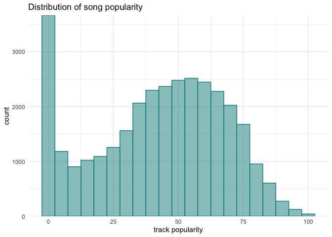<!-- -->

``` r
spotify_songs %>%
    sample_n(200) %>%
    select(danceability, energy, speechiness, acousticness, 
           instrumentalness, liveness, valence) %>%
    ggpairs() +
    theme_minimal(base_size = 6)
```

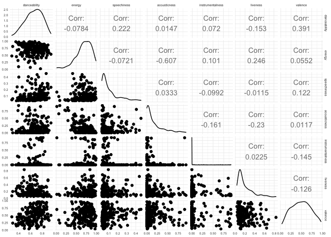<!-- -->

``` r
spotify_songs %>%
    group_by(playlist_genre) %>%
    summarise(n = n_distinct(track_id)) %>%
    ungroup() %>%
    ggplot(aes(x = playlist_genre, y = n)) +
    geom_col(aes(fill = playlist_genre)) +
    scale_y_continuous(expand = expansion(mult = c(0, 0.05))) +
    theme(legend.position = "none") +
    labs(x = "Genre", y = "count", title = "Number of songs per genre")
```

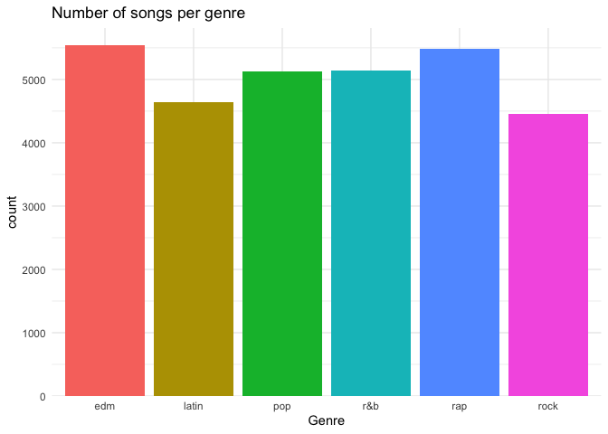<!-- -->

``` r
spotify_songs %>%
    group_by(playlist_genre, playlist_subgenre) %>%
    summarise(n = n_distinct(track_id)) %>%
    ungroup() %>%
    ggplot(aes(x = n, y = playlist_subgenre)) +
    facet_wrap(~ playlist_genre, scales = "free") +
    geom_col(aes(fill = playlist_genre)) +
    scale_x_continuous(expand = expansion(mult = c(0, 0.05))) +
    theme(legend.position = "none") +
    labs(x = "count", y = "Subgrene", title = "Number of songs per subgenre")
```

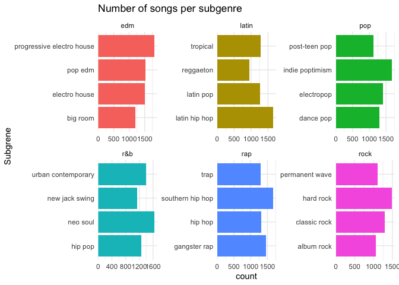<!-- -->

``` r
spotify_songs %>%
    filter(!is.na(track_album_release_date)) %>%
    ggplot(aes(x = track_album_release_date, y = track_popularity)) +
    geom_point(size = 0.5, alpha = 0.2, color = "dodgerblue") +
    geom_density2d(color = "black", lty = 2, size = 1)
```

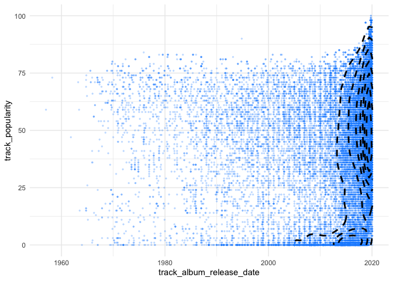<!-- -->

``` r
spotify_songs %>%
    filter(!is.na(track_album_release_date)) %>%
    mutate(track_release_day = yday(track_album_release_date)) %>%
    ggplot(aes(x = track_release_day, y = track_popularity)) +
    geom_point(size = 0.5, alpha = 0.2, color = "dodgerblue") +
    geom_density2d(color = "black", lty = 2, size = 1)
```

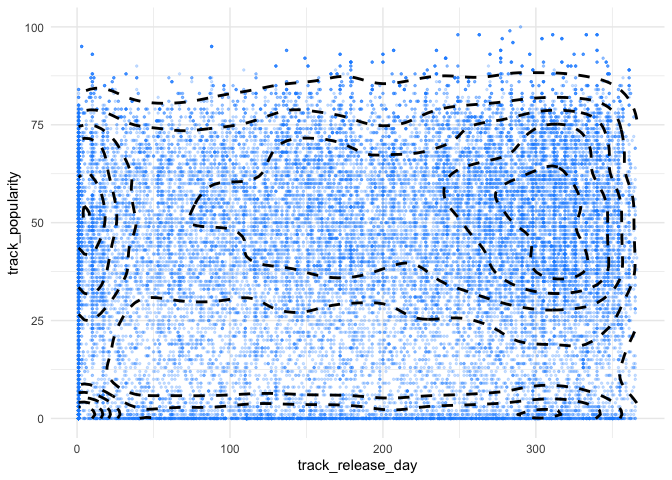<!-- -->

### PCA & t-SNE

``` r
spotify_songs %>%
    select(track_id, danceability:tempo) %>%
    skimr::skim()
```

|                                                  |            |
| :----------------------------------------------- | :--------- |
| Name                                             | Piped data |
| Number of rows                                   | 32833      |
| Number of columns                                | 12         |
| \_\_\_\_\_\_\_\_\_\_\_\_\_\_\_\_\_\_\_\_\_\_\_   |            |
| Column type frequency:                           |            |
| character                                        | 1          |
| numeric                                          | 11         |
| \_\_\_\_\_\_\_\_\_\_\_\_\_\_\_\_\_\_\_\_\_\_\_\_ |            |
| Group variables                                  | None       |

Data summary

**Variable type: character**

| skim\_variable | n\_missing | complete\_rate | min | max | empty | n\_unique | whitespace |
| :------------- | ---------: | -------------: | --: | --: | ----: | --------: | ---------: |
| track\_id      |          0 |              1 |  22 |  22 |     0 |     28356 |          0 |

**Variable type: numeric**

| skim\_variable   | n\_missing | complete\_rate |   mean |    sd |      p0 |    p25 |    p50 |    p75 |   p100 | hist  |
| :--------------- | ---------: | -------------: | -----: | ----: | ------: | -----: | -----: | -----: | -----: | :---- |
| danceability     |          0 |              1 |   0.65 |  0.15 |    0.00 |   0.56 |   0.67 |   0.76 |   0.98 | ▁▁▃▇▃ |
| energy           |          0 |              1 |   0.70 |  0.18 |    0.00 |   0.58 |   0.72 |   0.84 |   1.00 | ▁▁▅▇▇ |
| key              |          0 |              1 |   5.37 |  3.61 |    0.00 |   2.00 |   6.00 |   9.00 |  11.00 | ▇▂▅▅▆ |
| loudness         |          0 |              1 | \-6.72 |  2.99 | \-46.45 | \-8.17 | \-6.17 | \-4.64 |   1.27 | ▁▁▁▂▇ |
| mode             |          0 |              1 |   0.57 |  0.50 |    0.00 |   0.00 |   1.00 |   1.00 |   1.00 | ▆▁▁▁▇ |
| speechiness      |          0 |              1 |   0.11 |  0.10 |    0.00 |   0.04 |   0.06 |   0.13 |   0.92 | ▇▂▁▁▁ |
| acousticness     |          0 |              1 |   0.18 |  0.22 |    0.00 |   0.02 |   0.08 |   0.26 |   0.99 | ▇▂▁▁▁ |
| instrumentalness |          0 |              1 |   0.08 |  0.22 |    0.00 |   0.00 |   0.00 |   0.00 |   0.99 | ▇▁▁▁▁ |
| liveness         |          0 |              1 |   0.19 |  0.15 |    0.00 |   0.09 |   0.13 |   0.25 |   1.00 | ▇▃▁▁▁ |
| valence          |          0 |              1 |   0.51 |  0.23 |    0.00 |   0.33 |   0.51 |   0.69 |   0.99 | ▃▇▇▇▃ |
| tempo            |          0 |              1 | 120.88 | 26.90 |    0.00 |  99.96 | 121.98 | 133.92 | 239.44 | ▁▂▇▂▁ |

``` r
spotify_songs_data <- spotify_songs %>%
    select(track_id, danceability:tempo) %>%
    distinct() %>%
    as.data.frame() %>%
    column_to_rownames("track_id")

song_pca <- prcomp(spotify_songs_data, scale = TRUE, center = TRUE)

summary(song_pca)
```

    #> Importance of components:
    #>                           PC1    PC2    PC3     PC4    PC5     PC6     PC7
    #> Standard deviation     1.4726 1.2331 1.0855 1.04529 0.9883 0.98439 0.93482
    #> Proportion of Variance 0.1971 0.1382 0.1071 0.09933 0.0888 0.08809 0.07944
    #> Cumulative Proportion  0.1971 0.3354 0.4425 0.54182 0.6306 0.71871 0.79815
    #>                            PC8     PC9    PC10    PC11
    #> Standard deviation     0.89893 0.79241 0.74870 0.47308
    #> Proportion of Variance 0.07346 0.05708 0.05096 0.02035
    #> Cumulative Proportion  0.87161 0.92870 0.97965 1.00000

``` r
fviz_eig(song_pca)
```

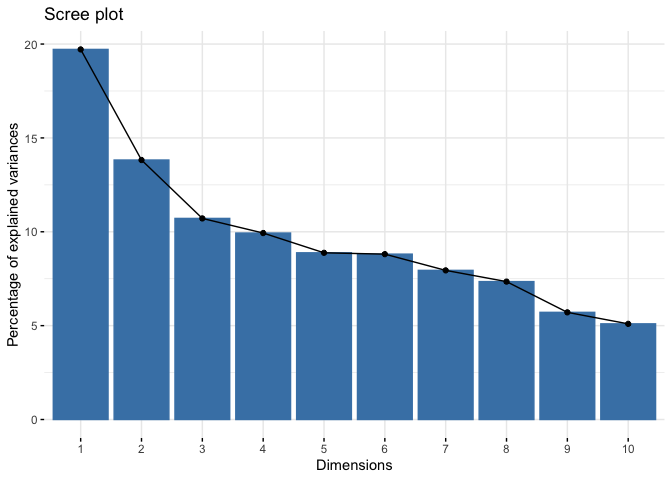<!-- -->

``` r
tibble(
    pc = c(0, seq(1, ncol(song_pca$x))),
    cum_prop = c(0, cumsum(song_pca$sdev^2 / sum(song_pca$sdev^2)))
) %>%
    mutate(label = paste0(round(cum_prop * 100), "%")) %>%
    ggplot(aes(x = pc, y = cum_prop)) +
    geom_hline(yintercept = 0, color = "grey70") +
    geom_vline(xintercept = 0, color = "grey70") +
    geom_line(linetype = 2) +
    geom_point(size = 1.2) +
    geom_text(aes(label = label), family = "Arial", 
              nudge_x = 0.2, nudge_y = -0.03) +
    labs(x = "principal component",
         y = "cumulative proportion")
```

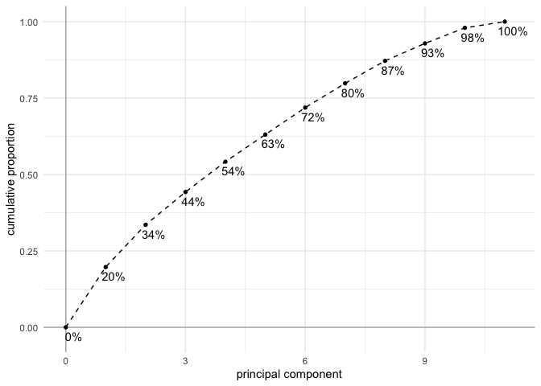<!-- -->

``` r
fviz_pca_var(song_pca, axes = c(1, 2))
```

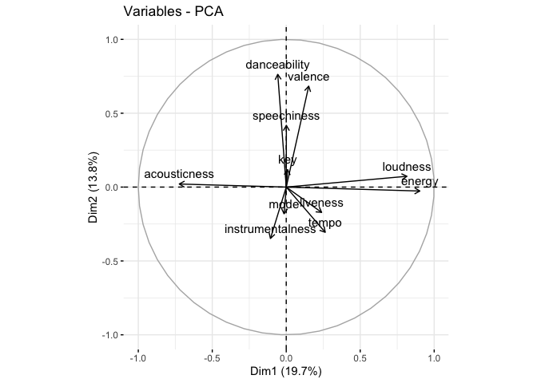<!-- -->

``` r
fviz_pca_var(song_pca, axes = c(1, 3))
```

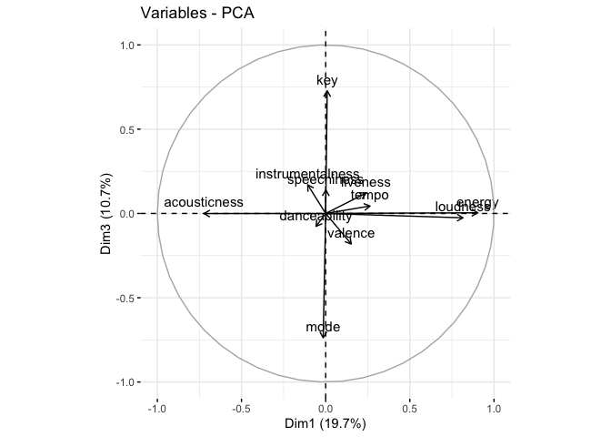<!-- -->

``` r
songs_in_pca_mat <- unique(song_pca$x)

songs_in_pca <- songs_in_pca_mat %>%
    as.data.frame(stringsAsFactors = FALSE) %>%
    rownames_to_column("track_id") %>%
    as_tibble() %>%
    left_join(spotify_songs %>% select(track_id:track_popularity, 
                                       playlist_genre:playlist_subgenre),
              by = "track_id") %>%
    group_by(track_id) %>%
    filter(n() == 1) %>%
    ungroup()

songs_in_pca %>%
    sample_n(3000) %>%
    ggplot(aes(x = PC1, y = PC2, color = playlist_genre)) +
    geom_point(size = 1, alpha = 0.5) +
    labs(color = "genre",
         title = "PCA of songs by their music characteristics",
         subtitle = "Colored by genre")
```

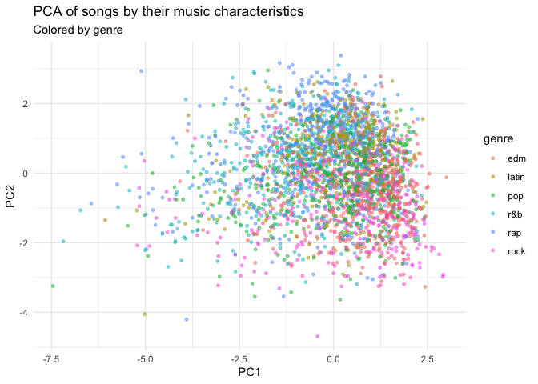<!-- -->

``` r
songs_in_pca %>%
    sample_n(3000) %>%
    ggplot(aes(x = PC1, y = PC3, color = playlist_genre)) +
    geom_point(size = 1, alpha = 0.5) +
    labs(color = "genre",
         title = "PCA of songs by their music characteristics",
         subtitle = "Colored by genre")
```

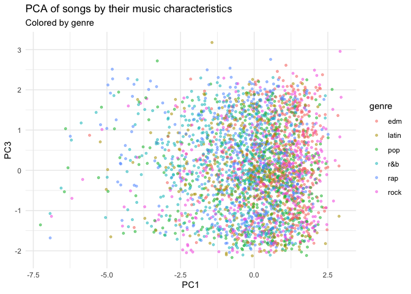<!-- -->

``` r
idx <- sample(seq(1, nrow(songs_in_pca_mat)), 5e3)
songs_tsne <- Rtsne::Rtsne(songs_in_pca_mat[idx, ])
```

``` r
songs_tsne$Y %>%
    as.data.frame() %>%
    as_tibble() %>%
    set_names(c("Z1", "Z2")) %>%
    add_column(track_id = rownames(songs_in_pca_mat)[idx]) %>%
    left_join(spotify_songs %>% select(track_id:track_popularity, 
                                       playlist_genre:playlist_subgenre),
              by = "track_id") %>%
    group_by(track_id) %>%
    filter(n() == 1) %>%
    ungroup() %>%
    ggplot(aes(x = Z1, y = Z2, color = playlist_genre)) +
    geom_point(size = 1, alpha = 0.5) +
    labs(color = "genre", title = "t-SNE of PCA of song information")
```

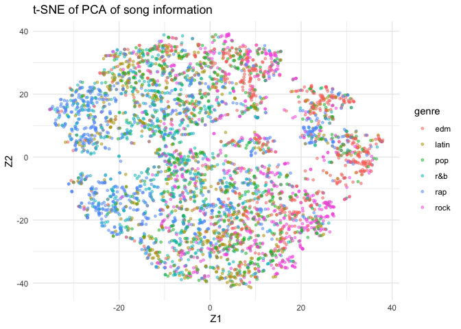<!-- -->

## Model

I would like to get some practice with the ‘tidymodels’ framework, so I
will use it to prepare the date (using ‘rsample’ and ‘recipes’),
instantiate a nd train a random forest model (using ‘parsnip’), measure
the success of the model (using ‘yardstick’), and tune the model’s
hyperparameters (using ‘tune’).

For practicality reasons (as my goal is to practice using the
‘tidymodels’ framework, not replicate Spotify’s data science team), I
will restrict the data two just predicting between 3 groups

``` r
library(tidymodels)
```

    #> ── Attaching packages ─────────────────────────────────────────────────── tidymodels 0.1.0 ──

    #> ✓ broom     0.5.5      ✓ rsample   0.0.6 
    #> ✓ dials     0.0.6      ✓ tune      0.1.0 
    #> ✓ infer     0.5.1      ✓ workflows 0.1.1 
    #> ✓ parsnip   0.1.0      ✓ yardstick 0.0.6 
    #> ✓ recipes   0.1.10

### Preparing the data

``` r
set.seed(0)

spotify_data <- spotify_songs %>%
    filter(playlist_genre %in% c("rock", "rap", "latin")) %>%
    select(track_id, playlist_genre, danceability:tempo) %>%
    distinct() %>%
    group_by(track_id) %>%
    filter(n() == 1) %>%
    ungroup() %>% 
    group_by(playlist_genre) %>%
    sample_frac(0.7) %>%
    ungroup()

spotify_data_split <- initial_split(spotify_data, 
                                    prop = 0.8,
                                    strata = playlist_genre)
spotify_data_train <- training(spotify_data_split)
spotify_data_test <- testing(spotify_data_split)
```

``` r
set.seed(0)
metric_pal <- randomcoloR::distinctColorPalette(11)

spotify_data_train %>%
    select(-track_id) %>%
    pivot_longer(-playlist_genre, names_to = "metric", values_to = "value") %>%
    group_by(playlist_genre, metric) %>%
    summarise(avg_value = mean(value)) %>%
    group_by(metric) %>%
    mutate(avg_value = scales::rescale(avg_value, to = c(0, 1))) %>%
    ungroup() %>%
    ggplot(aes(x = avg_value, y = metric)) +
    facet_wrap(~ playlist_genre, nrow = 1) +
    geom_col(aes(fill = metric)) +
    scale_fill_manual(values = metric_pal, guide = NULL) +
    theme(
        panel.grid.major.y = element_blank()
    ) +
    labs(x = "average value", 
         y = NULL,
         title = "Values of song metrics across genres")
```

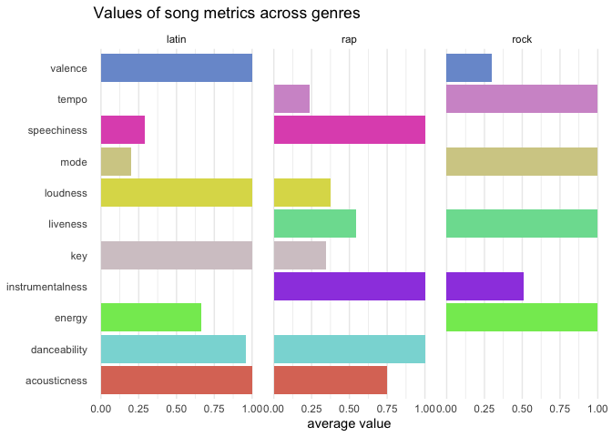<!-- -->

``` r
spotify_recipe <- recipe(playlist_genre ~ ., data = spotify_data_train) %>%
    update_role(track_id, new_role = "ID") %>%
    step_corr(all_predictors())

spotify_prep <- prep(spotify_recipe)
spotify_juiced <- juice(spotify_prep)

spotify_juiced
```

    #> # A tibble: 7,917 x 13
    #>    track_id danceability energy   key loudness  mode speechiness acousticness
    #>    <fct>           <dbl>  <dbl> <dbl>    <dbl> <dbl>       <dbl>        <dbl>
    #>  1 555ix1g…        0.566  0.666     5    -5.74     0      0.163      0.0161  
    #>  2 6HTJZ0T…        0.805  0.858     0    -3.07     1      0.105      0.194   
    #>  3 7H4XjkO…        0.695  0.755     7    -6.87     0      0.0386     0.134   
    #>  4 62E8JJR…        0.658  0.863     7    -3.58     0      0.0352     0.287   
    #>  5 2RruTqd…        0.802  0.611     8    -7.52     1      0.0601     0.356   
    #>  6 7GsMKEG…        0.667  0.867    11    -5.56     0      0.0466     0.046   
    #>  7 0gT1wHT…        0.589  0.838     5    -4.07     0      0.0457     0.00807 
    #>  8 4mNOezZ…        0.654  0.803    10    -5.14     1      0.0544     0.254   
    #>  9 1xh59Kp…        0.399  0.53     10    -7.18     0      0.0532     0.479   
    #> 10 5tXg9mq…        0.712  0.61      6    -9.33     0      0.0376     0.000892
    #> # … with 7,907 more rows, and 5 more variables: instrumentalness <dbl>,
    #> #   liveness <dbl>, valence <dbl>, tempo <dbl>, playlist_genre <fct>

``` r
spotify_tune_spec <- rand_forest(
    mtry = tune(),
    trees = 500,
    min_n = tune()
) %>%
    set_mode("classification") %>%
    set_engine("ranger")
```

``` r
spotify_workflow <- workflow() %>%
    add_recipe(spotify_recipe) %>%
    add_model(spotify_tune_spec)
```

``` r
set.seed(0)
spotify_training_folds <- vfold_cv(spotify_data_train)
spotify_training_folds
```

    #> #  10-fold cross-validation 
    #> # A tibble: 10 x 2
    #>    splits             id    
    #>    <named list>       <chr> 
    #>  1 <split [7.1K/792]> Fold01
    #>  2 <split [7.1K/792]> Fold02
    #>  3 <split [7.1K/792]> Fold03
    #>  4 <split [7.1K/792]> Fold04
    #>  5 <split [7.1K/792]> Fold05
    #>  6 <split [7.1K/792]> Fold06
    #>  7 <split [7.1K/792]> Fold07
    #>  8 <split [7.1K/791]> Fold08
    #>  9 <split [7.1K/791]> Fold09
    #> 10 <split [7.1K/791]> Fold10

``` r
doParallel::registerDoParallel()

set.seed(0)
spotify_tune_1 <- tune_grid(
    spotify_workflow,
    resamples = spotify_training_folds,
    grid = 20
)
```

    #> i Creating pre-processing data to finalize unknown parameter: mtry

``` r
spotify_tune_1
```

    #> #  10-fold cross-validation 
    #> # A tibble: 10 x 4
    #>    splits             id     .metrics          .notes          
    #>    <list>             <chr>  <list>            <list>          
    #>  1 <split [7.1K/792]> Fold01 <tibble [40 × 5]> <tibble [0 × 1]>
    #>  2 <split [7.1K/792]> Fold02 <tibble [40 × 5]> <tibble [0 × 1]>
    #>  3 <split [7.1K/792]> Fold03 <tibble [40 × 5]> <tibble [0 × 1]>
    #>  4 <split [7.1K/792]> Fold04 <tibble [40 × 5]> <tibble [0 × 1]>
    #>  5 <split [7.1K/792]> Fold05 <tibble [40 × 5]> <tibble [0 × 1]>
    #>  6 <split [7.1K/792]> Fold06 <tibble [40 × 5]> <tibble [0 × 1]>
    #>  7 <split [7.1K/792]> Fold07 <tibble [40 × 5]> <tibble [0 × 1]>
    #>  8 <split [7.1K/791]> Fold08 <tibble [40 × 5]> <tibble [0 × 1]>
    #>  9 <split [7.1K/791]> Fold09 <tibble [40 × 5]> <tibble [0 × 1]>
    #> 10 <split [7.1K/791]> Fold10 <tibble [40 × 5]> <tibble [0 × 1]>

``` r
p1 <- spotify_tune_1 %>%
    collect_metrics() %>%
    filter(.metric == "roc_auc") %>%
    ggplot(aes(x = mtry, y = min_n)) +
    geom_point(aes(color = mean, size = mean)) +
    scale_color_gradient2(low = "blue", high = "tomato", midpoint = 0.9) +
    scale_size_continuous(guide = NULL) +
    labs(title = "ROC AUC variation over the hyperparameter space")

p2 <- spotify_tune_1 %>%
    collect_metrics() %>%
    filter(.metric == "roc_auc") %>%
    select(mtry, min_n, mean) %>%
    pivot_longer(-mean, names_to = "parameter", values_to = "value") %>%
    ggplot(aes(x = value, y = mean)) +
    facet_wrap(~ parameter, nrow = 1, scales = "free") +
    geom_point(aes(color = parameter), size = 2) +
    geom_smooth(aes(group = parameter), 
                method = "loess", formula = "y ~ x", 
                color = "grey30", lty = 2, se = FALSE) +
    scale_color_brewer(type = "qual", palette = "Set2", guide = NULL)

 p1 / p2
```

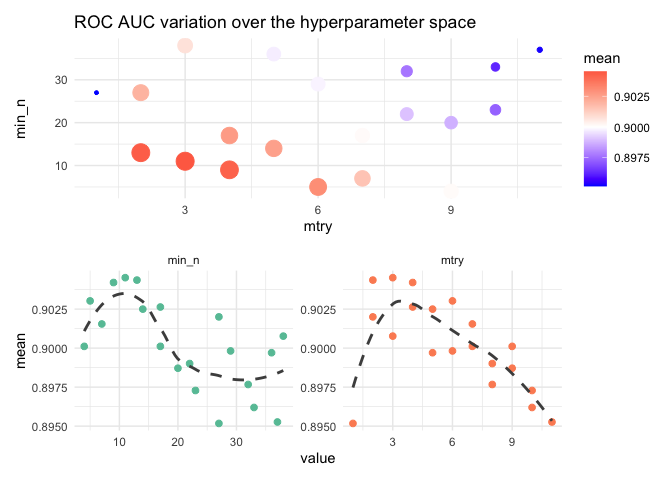<!-- -->

``` r
spotify_tune_grid <- grid_regular(
    mtry(range = c(2, 6)),
    min_n(range = c(5, 15)),
    levels = 5
)

spotify_tune_grid
```

    #> # A tibble: 25 x 2
    #>     mtry min_n
    #>    <int> <int>
    #>  1     2     5
    #>  2     3     5
    #>  3     4     5
    #>  4     5     5
    #>  5     6     5
    #>  6     2     7
    #>  7     3     7
    #>  8     4     7
    #>  9     5     7
    #> 10     6     7
    #> # … with 15 more rows

``` r
set.seed(0)

spotify_tune_2 <- tune_grid(
    spotify_workflow,
    resamples = spotify_training_folds,
    grid = spotify_tune_grid
)
```

    #> i Creating pre-processing data to finalize unknown parameter: mtry

``` r
spotify_tune_2
```

    #> #  10-fold cross-validation 
    #> # A tibble: 10 x 4
    #>    splits             id     .metrics          .notes          
    #>    <list>             <chr>  <list>            <list>          
    #>  1 <split [7.1K/792]> Fold01 <tibble [50 × 5]> <tibble [0 × 1]>
    #>  2 <split [7.1K/792]> Fold02 <tibble [50 × 5]> <tibble [0 × 1]>
    #>  3 <split [7.1K/792]> Fold03 <tibble [50 × 5]> <tibble [0 × 1]>
    #>  4 <split [7.1K/792]> Fold04 <tibble [50 × 5]> <tibble [0 × 1]>
    #>  5 <split [7.1K/792]> Fold05 <tibble [50 × 5]> <tibble [0 × 1]>
    #>  6 <split [7.1K/792]> Fold06 <tibble [50 × 5]> <tibble [0 × 1]>
    #>  7 <split [7.1K/792]> Fold07 <tibble [50 × 5]> <tibble [0 × 1]>
    #>  8 <split [7.1K/791]> Fold08 <tibble [50 × 5]> <tibble [0 × 1]>
    #>  9 <split [7.1K/791]> Fold09 <tibble [50 × 5]> <tibble [0 × 1]>
    #> 10 <split [7.1K/791]> Fold10 <tibble [50 × 5]> <tibble [0 × 1]>

``` r
spotify_tune_2 %>%
    collect_metrics() %>%
    filter(.metric == "roc_auc") %>%
    mutate(min_n = factor(min_n)) %>%
    ggplot(aes(mtry, mean, color = min_n)) +
    geom_line(alpha = 0.5, size = 1.5) +
    geom_point() +
    labs(y = "AUC")
```

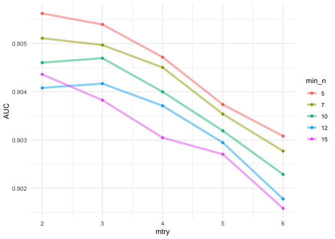<!-- -->

``` r
best_auc <- select_best(spotify_tune_2, "roc_auc")
spotify_rf <- finalize_model(spotify_tune_spec, best_auc)
spotify_rf
```

    #> Random Forest Model Specification (classification)
    #> 
    #> Main Arguments:
    #>   mtry = 2
    #>   trees = 500
    #>   min_n = 5
    #> 
    #> Computational engine: ranger

``` r
spotify_rf %>%
    set_engine("ranger", importance = "permutation") %>%
    fit(playlist_genre ~ ., 
        data = select(spotify_juiced, -track_id)) %>%
    vip(geom = "point")
```

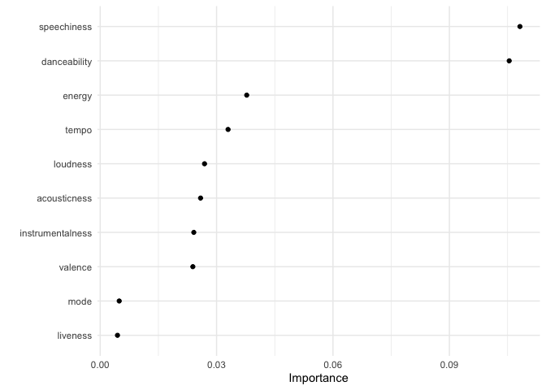<!-- -->

``` r
spotify_workflow_final <- workflow() %>%
    add_recipe(spotify_recipe) %>%
    add_model(spotify_rf)

spotify_random_forest <- last_fit(spotify_workflow_final, spotify_data_split)
```

``` r
spotify_random_forest %>%
    collect_metrics()
```

    #> # A tibble: 2 x 3
    #>   .metric  .estimator .estimate
    #>   <chr>    <chr>          <dbl>
    #> 1 accuracy multiclass     0.763
    #> 2 roc_auc  hand_till      0.905

``` r
spotify_random_forest %>%
    collect_predictions() %>%
    roc_curve(playlist_genre, .pred_latin:.pred_rock) %>%
    autoplot()
```

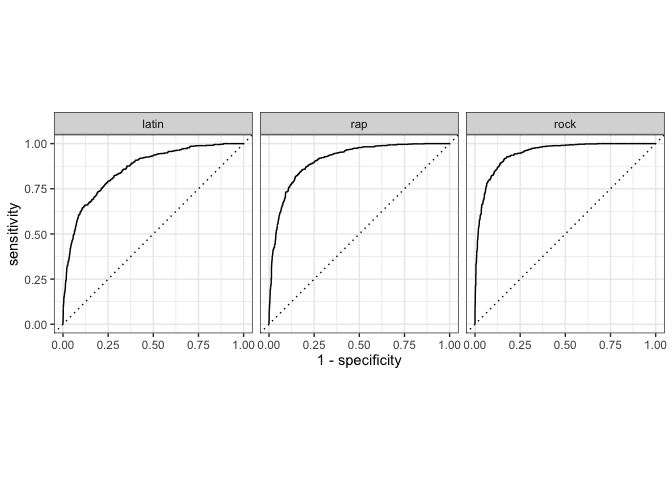<!-- -->
