Hockey Goals
================
Joshua Cook
3/3/2020

## Data preparation

Download the data from the GitHub
[page](https://github.com/rfordatascience/tidytuesday/blob/master/data/2020/2020-03-31/readme.md)

``` bash
cd data

wget 'https://raw.githubusercontent.com/rfordatascience/tidytuesday/master/data/2020/2020-03-03/game_goals.csv'
wget 'https://raw.githubusercontent.com/rfordatascience/tidytuesday/master/data/2020/2020-03-03/top_250.csv'
wget 'https://raw.githubusercontent.com/rfordatascience/tidytuesday/master/data/2020/2020-03-03/season_goals.csv'

cd ..
```

I will use the “game\_goals.csv” data: “Goals for each player and each
game (only for players who started at or after 1979-80 season). This is
due to limited game-level data prior to 1980.”

| variable           | class     | description                                                         |
| :----------------- | :-------- | :------------------------------------------------------------------ |
| player             | character | Player name                                                         |
| season             | double    | Season year                                                         |
| rank               | double    | Rank equivalent to game\_num for most                               |
| date               | double    | Date of game (ISO format)                                           |
| game\_num          | double    | Game number within each season                                      |
| age                | character | Age in year-days                                                    |
| team               | character | NHL team                                                            |
| at                 | character | At: blank if at home, @ if at the opponent arena                    |
| opp                | character | Opponent                                                            |
| location           | character | Location = location of game (home or away)                          |
| outcome            | character | Outcome = Won, Loss, Tie                                            |
| goals              | double    | Goals Scored by player                                              |
| assists            | double    | Assists - helped with goal for other player                         |
| points             | double    | Points - Sum of goals + assists                                     |
| plus\_minus        | double    | Plus Minus - Team points minus opponents points scored while on ice |
| penalty\_min       | double    | Penalty minutes - minutes spent in penalty box                      |
| goals\_even        | double    | Goals scored while even-strength                                    |
| goals\_powerplay   | double    | Goals scored on powerplay                                           |
| goals\_short       | double    | Goals scored while short-handed                                     |
| goals\_gamewinner  | double    | Goals that were gamewinner                                          |
| assists\_even      | double    | Assists while even strength                                         |
| assists\_powerplay | double    | Assists on powerplay                                                |
| assists\_short     | double    | Assists on shorthanded                                              |
| shots              | double    | Shots                                                               |
| shot\_percent      | double    | Shot percent (goals/shots)                                          |

``` r
game_goals <- read_csv(file.path("data", "game_goals.csv")) %>%
  janitor::clean_names()
```

    #> Parsed with column specification:
    #> cols(
    #>   .default = col_double(),
    #>   player = col_character(),
    #>   date = col_date(format = ""),
    #>   age = col_character(),
    #>   team = col_character(),
    #>   at = col_character(),
    #>   opp = col_character(),
    #>   location = col_character(),
    #>   outcome = col_character()
    #> )

    #> See spec(...) for full column specifications.

``` r
game_goals
```

    #> # A tibble: 49,384 x 25
    #>    player season  rank date       game_num age   team  at    opp   location
    #>    <chr>   <dbl> <dbl> <date>        <dbl> <chr> <chr> <chr> <chr> <chr>   
    #>  1 Alex …   2006     1 2005-10-05        1 20-0… WSH   <NA>  CBJ   Home    
    #>  2 Alex …   2006     2 2005-10-07        2 20-0… WSH   <NA>  ATL   Home    
    #>  3 Alex …   2006     3 2005-10-08        3 20-0… WSH   @     ATL   Away    
    #>  4 Alex …   2006     4 2005-10-10        4 20-0… WSH   <NA>  NYR   Home    
    #>  5 Alex …   2006     5 2005-10-12        5 20-0… WSH   @     CAR   Away    
    #>  6 Alex …   2006     6 2005-10-13        6 20-0… WSH   <NA>  NYI   Home    
    #>  7 Alex …   2006     7 2005-10-16        7 20-0… WSH   <NA>  TBL   Home    
    #>  8 Alex …   2006     8 2005-10-20        8 20-0… WSH   @     FLA   Away    
    #>  9 Alex …   2006     9 2005-10-22        9 20-0… WSH   <NA>  CAR   Home    
    #> 10 Alex …   2006    10 2005-10-26       10 20-0… WSH   @     BUF   Away    
    #> # … with 49,374 more rows, and 15 more variables: outcome <chr>, goals <dbl>,
    #> #   assists <dbl>, points <dbl>, plus_minus <dbl>, penalty_min <dbl>,
    #> #   goals_even <dbl>, goals_powerplay <dbl>, goals_short <dbl>,
    #> #   goals_gamewinner <dbl>, assists_even <dbl>, assists_powerplay <dbl>,
    #> #   assists_short <dbl>, shots <dbl>, shot_percent <dbl>

``` r
game_goals %<>%
  select(-at) %>%
  mutate(location = factor(location, levels = c("Home", "Away")))
```

## EDA

``` r
game_goals %>%
  group_by(player) %>%
  summarise(total_goals = sum(goals)) %>%
  ungroup() %>%
  mutate(player = fct_reorder(player, total_goals)) %>%
  ggplot(aes(x = player, y = total_goals)) +
  geom_col() +
  scale_y_continuous(expand = c(0, 0)) +
  coord_flip() +
  theme(
    axis.title.y = element_blank()
  ) +
  labs(y = "total goals")
```

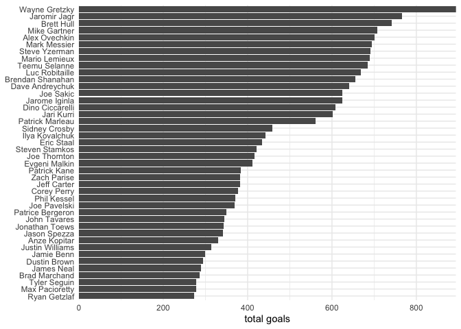<!-- -->

``` r
game_goals %>%
  group_by(player) %>%
  summarise(
    total_goals = sum(goals),
    total_games = n_distinct(date)
  ) %>%
  ungroup() %>%
  mutate(
    goals_per_game = total_goals / total_games,
    player = fct_reorder(player, goals_per_game)
  ) %>%
  ggplot(aes(x = player, y = goals_per_game)) +
  geom_col() +
  scale_y_continuous(expand = c(0, 0)) +
  coord_flip() +
  theme(
    axis.title.y = element_blank()
  ) +
  labs(y = "total goals")
```

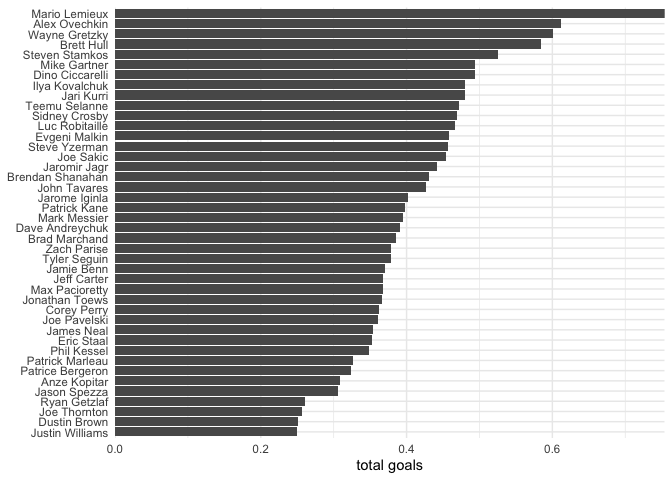<!-- -->

``` r
game_goals %>%
  count(goals) %>%
  mutate(goals = factor(goals)) %>%
  ggplot(aes(x = goals, y = n)) +
  geom_col() +
  labs(
    x = "goals in a game",
    y = "count"
  )
```

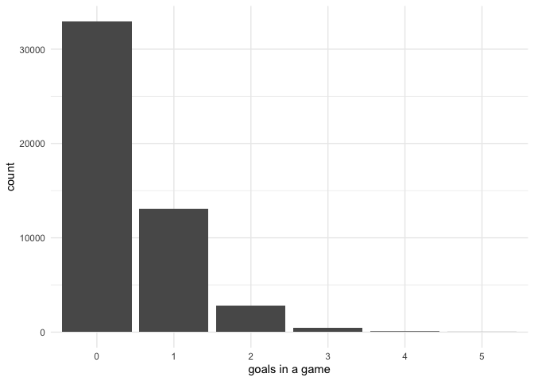<!-- -->

``` r
game_goals %>%
  count(shots, goals, name = "count") %>%
  mutate(count = log10(count + 1)) %>%
  ggplot(aes(x = shots, y = goals)) +
  geom_tile(aes(fill = count), color = NA) +
  scale_fill_viridis_c() +
  labs(fill = "log( count )")
```

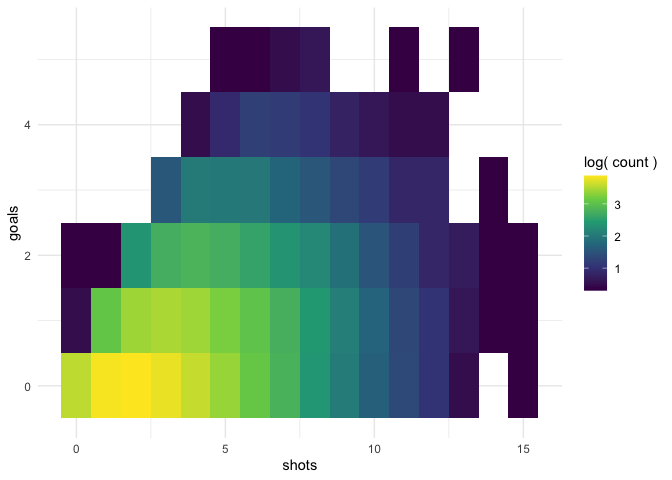<!-- -->

## Model

We will focus on the goals per game for Alex Ovechkin as he is the
reason this data was chosen for Tidytuesday.

``` r
ovechkin_goals <- game_goals %>%
  filter(player == "Alex Ovechkin")
```

### First Poisson Regression

The frist model will be a Poisson regression for the number of goals per
game using the game number in the season, number of shots, the location
(home or away) for the game, the opponent, and the interaction between
the location and the opponent.

``` r
goals_poiss_1 <- glm(goals ~ game_num + shots + penalty_min + location:opp,
  data = ovechkin_goals,
  family = "poisson"
)
summary(goals_poiss_1)
```

    #> 
    #> Call:
    #> glm(formula = goals ~ game_num + shots + penalty_min + location:opp, 
    #>     family = "poisson", data = ovechkin_goals)
    #> 
    #> Deviance Residuals: 
    #>     Min       1Q   Median       3Q      Max  
    #> -2.0603  -0.9988  -0.7197   0.5508   2.8908  
    #> 
    #> Coefficients: (2 not defined because of singularities)
    #>                      Estimate Std. Error z value Pr(>|z|)    
    #> (Intercept)         -1.390062   0.419736  -3.312 0.000927 ***
    #> game_num            -0.001166   0.001748  -0.667 0.504656    
    #> shots                0.144859   0.014783   9.799  < 2e-16 ***
    #> penalty_min         -0.040339   0.033580  -1.201 0.229639    
    #> locationHome:oppANA -0.395537   0.707248  -0.559 0.575983    
    #> locationAway:oppANA  0.340192   0.578903   0.588 0.556768    
    #> locationHome:oppARI  0.202710   0.647494   0.313 0.754229    
    #> locationAway:oppARI -0.922529   1.080759  -0.854 0.393330    
    #> locationHome:oppATL  0.218775   0.488464   0.448 0.654237    
    #> locationAway:oppATL  0.253261   0.479578   0.528 0.597435    
    #> locationHome:oppBOS -0.090783   0.517398  -0.175 0.860718    
    #> locationAway:oppBOS  0.151235   0.483502   0.313 0.754439    
    #> locationHome:oppBUF  0.295154   0.469975   0.628 0.529991    
    #> locationAway:oppBUF  0.039787   0.494212   0.081 0.935835    
    #> locationHome:oppCAR -0.218004   0.472023  -0.462 0.644188    
    #> locationAway:oppCAR  0.248438   0.455260   0.546 0.585268    
    #> locationHome:oppCBJ -0.065751   0.527472  -0.125 0.900799    
    #> locationAway:oppCBJ -0.119758   0.528078  -0.227 0.820594    
    #> locationHome:oppCGY  0.092826   0.558255   0.166 0.867937    
    #> locationAway:oppCGY -0.234749   0.646559  -0.363 0.716549    
    #>  [ reached getOption("max.print") -- omitted 50 rows ]
    #> ---
    #> Signif. codes:  0 '***' 0.001 '**' 0.01 '*' 0.05 '.' 0.1 ' ' 1
    #> 
    #> (Dispersion parameter for poisson family taken to be 1)
    #> 
    #>     Null deviance: 1206.7  on 1145  degrees of freedom
    #> Residual deviance: 1051.9  on 1078  degrees of freedom
    #> AIC: 2341
    #> 
    #> Number of Fisher Scoring iterations: 6

Ovechkin seems to do quite well against MDA away, but the number of
shots is the strongest predictor.

``` r
tidy(goals_poiss_1) %>%
  arrange(-estimate) %>%
  filter(p.value < 0.05)
```

    #> # A tibble: 3 x 5
    #>   term                estimate std.error statistic  p.value
    #>   <chr>                  <dbl>     <dbl>     <dbl>    <dbl>
    #> 1 locationAway:oppMDA    2.04     0.710       2.87 4.06e- 3
    #> 2 shots                  0.145    0.0148      9.80 1.13e-22
    #> 3 (Intercept)           -1.39     0.420      -3.31 9.27e- 4

We can test the fit of the model by comparing the residual with the
deviance. We hope for there to be no statstically detectable difference.

``` r
with(goals_poiss_1, cbind(
  res.deviance = deviance,
  df = df.residual,
  p = pchisq(deviance, df.residual, lower.tail = FALSE)
))
```

    #>      res.deviance   df         p
    #> [1,]     1051.932 1078 0.7093943

It seems like the model had good fit, but the following plots would
suggest there is a better model we could use.

``` r
plot(goals_poiss_1)
```

    #> Warning: not plotting observations with leverage one:
    #>   43

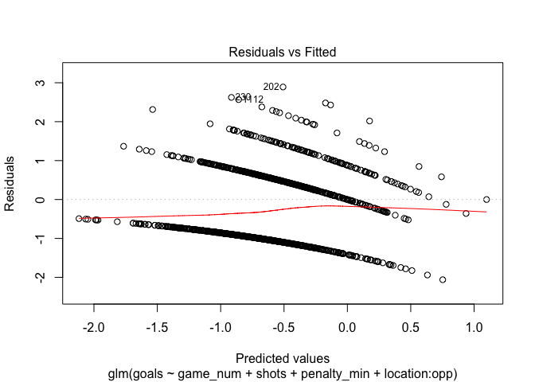<!-- -->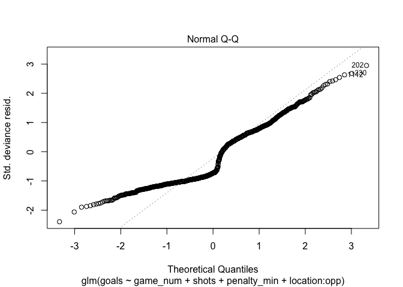<!-- -->

    #> Warning: not plotting observations with leverage one:
    #>   43

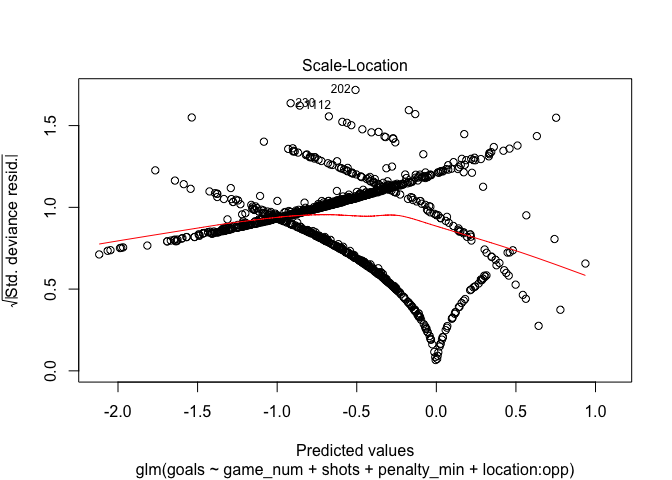<!-- -->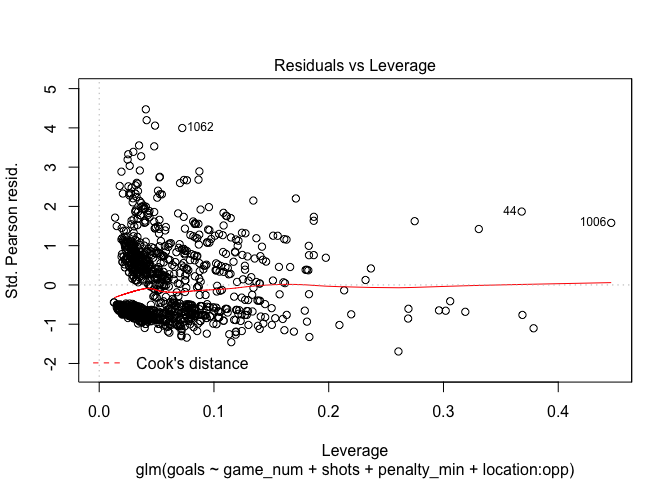<!-- -->

``` r
tibble(
  pred_goals = predict(goals_poiss_1, type = "response"),
  real_goals = ovechkin_goals$goals
) %>%
  mutate(real_goals = factor(real_goals)) %>%
  ggplot(aes(x = real_goals, pred_goals)) +
  ggbeeswarm::geom_quasirandom(size = 1, color = "grey50", alpha = 0.4) +
  geom_boxplot(
    color = "grey20", fill = "grey50", alpha = 0.2,
    outlier.shape = NA
  )
```

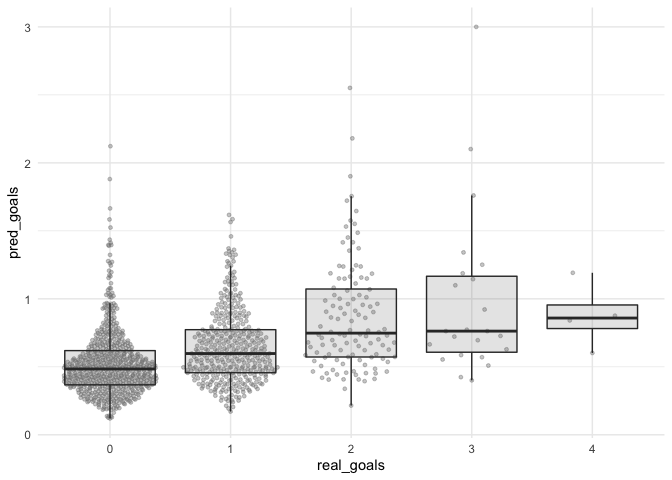<!-- -->

### Second Poisson Regression

Perhaps, the interaction between the opponent and location is not
important. We can test this by fitting another model with the
interaction term and comparing it to the first model.

``` r
goals_poiss_2 <- glm(goals ~ game_num + penalty_min + shots + location + opp,
  data = ovechkin_goals,
  family = "poisson"
)
summary(goals_poiss_2)
```

    #> 
    #> Call:
    #> glm(formula = goals ~ game_num + penalty_min + shots + location + 
    #>     opp, family = "poisson", data = ovechkin_goals)
    #> 
    #> Deviance Residuals: 
    #>     Min       1Q   Median       3Q      Max  
    #> -2.3797  -1.0084  -0.7749   0.5619   2.8350  
    #> 
    #> Coefficients:
    #>               Estimate Std. Error z value Pr(>|z|)    
    #> (Intercept)  -1.359847   0.351008  -3.874 0.000107 ***
    #> game_num     -0.001371   0.001704  -0.804 0.421121    
    #> penalty_min  -0.039812   0.033235  -1.198 0.230954    
    #> shots         0.147136   0.014358  10.247  < 2e-16 ***
    #> locationAway -0.004068   0.076072  -0.053 0.957348    
    #> oppARI       -0.179170   0.558351  -0.321 0.748292    
    #> oppATL        0.201491   0.380876   0.529 0.596791    
    #> oppBOS        0.015636   0.388781   0.040 0.967919    
    #> oppBUF        0.147905   0.378288   0.391 0.695809    
    #> oppCAR       -0.008405   0.367118  -0.023 0.981733    
    #> oppCBJ       -0.127953   0.408797  -0.313 0.754281    
    #> oppCGY       -0.078323   0.451547  -0.173 0.862295    
    #> oppCHI        0.221265   0.460763   0.480 0.631074    
    #> oppCOL       -0.243566   0.486302  -0.501 0.616474    
    #> oppDAL       -0.016729   0.459626  -0.036 0.970966    
    #> oppDET        0.215484   0.406161   0.531 0.595739    
    #> oppEDM        0.285459   0.435237   0.656 0.511908    
    #> oppFLA        0.116411   0.370202   0.314 0.753177    
    #> oppLAK        0.047013   0.449849   0.105 0.916766    
    #> oppMDA        2.012558   0.669610   3.006 0.002651 ** 
    #>  [ reached getOption("max.print") -- omitted 17 rows ]
    #> ---
    #> Signif. codes:  0 '***' 0.001 '**' 0.01 '*' 0.05 '.' 0.1 ' ' 1
    #> 
    #> (Dispersion parameter for poisson family taken to be 1)
    #> 
    #>     Null deviance: 1206.7  on 1145  degrees of freedom
    #> Residual deviance: 1079.6  on 1109  degrees of freedom
    #> AIC: 2306.7
    #> 
    #> Number of Fisher Scoring iterations: 5

First, the new model does seem to fit the data well.

``` r
with(goals_poiss_2, cbind(
  res.deviance = deviance,
  df = df.residual,
  p = pchisq(deviance, df.residual, lower.tail = FALSE)
))
```

    #>      res.deviance   df         p
    #> [1,]     1079.643 1109 0.7306412

Further, the removal of the interaction term does not seem to make the
model worse. Therefore, it should probably be removed from the model
(i.e. use `goals_poiss_2`).

``` r
anova(goals_poiss_1, goals_poiss_2, test = "Chisq")
```

    #> Analysis of Deviance Table
    #> 
    #> Model 1: goals ~ game_num + shots + penalty_min + location:opp
    #> Model 2: goals ~ game_num + penalty_min + shots + location + opp
    #>   Resid. Df Resid. Dev  Df Deviance Pr(>Chi)
    #> 1      1078     1051.9                      
    #> 2      1109     1079.6 -31  -27.711   0.6361

### First Negative Binomial Regression

One possible issue with the previous models is that the Poisson
regression assumes that the (conditional) variance equals the
(conditional) mean, i.e., the data is not over-dispersed. If it is, then
a Negative Binomial regression may work better.

We can test this by first fitting a negative binomial and then using the
`odTest()` from the ‘pscl’ package to test for over-dispersion.

``` r
goals_nb_1 <- glm.nb(goals ~ game_num + shots + location:opp,
  data = ovechkin_goals
)
```

    #> Warning in theta.ml(Y, mu, sum(w), w, limit = control$maxit, trace =
    #> control$trace > : iteration limit reached
    
    #> Warning in theta.ml(Y, mu, sum(w), w, limit = control$maxit, trace =
    #> control$trace > : iteration limit reached

``` r
summary(goals_nb_1)
```

    #> 
    #> Call:
    #> glm.nb(formula = goals ~ game_num + shots + location:opp, data = ovechkin_goals, 
    #>     init.theta = 8726.171791, link = log)
    #> 
    #> Deviance Residuals: 
    #>     Min       1Q   Median       3Q      Max  
    #> -2.0486  -0.9947  -0.7243   0.5467   2.9278  
    #> 
    #> Coefficients: (2 not defined because of singularities)
    #>                       Estimate Std. Error z value Pr(>|z|)    
    #> (Intercept)         -1.4120351  0.4194382  -3.366 0.000761 ***
    #> game_num            -0.0009883  0.0017441  -0.567 0.570934    
    #> shots                0.1449208  0.0147757   9.808  < 2e-16 ***
    #> locationHome:oppANA -0.4012082  0.7072642  -0.567 0.570532    
    #> locationAway:oppANA  0.3239301  0.5787411   0.560 0.575674    
    #> locationHome:oppARI  0.1418080  0.6457345   0.220 0.826177    
    #> locationAway:oppARI -0.9317988  1.0807690  -0.862 0.388598    
    #> locationHome:oppATL  0.2066600  0.4883919   0.423 0.672190    
    #> locationAway:oppATL  0.2417552  0.4794663   0.504 0.614109    
    #> locationHome:oppBOS -0.1164920  0.5170203  -0.225 0.821735    
    #> locationAway:oppBOS  0.1458941  0.4835152   0.302 0.762853    
    #> locationHome:oppBUF  0.2548172  0.4691152   0.543 0.587001    
    #> locationAway:oppBUF  0.0246999  0.4941033   0.050 0.960131    
    #> locationHome:oppCAR -0.2200600  0.4720316  -0.466 0.641074    
    #> locationAway:oppCAR  0.2317539  0.4551096   0.509 0.610594    
    #> locationHome:oppCBJ -0.0884668  0.5272193  -0.168 0.866741    
    #> locationAway:oppCBJ -0.1245740  0.5280765  -0.236 0.813509    
    #> locationHome:oppCGY  0.0926093  0.5582849   0.166 0.868250    
    #> locationAway:oppCGY -0.2224989  0.6464868  -0.344 0.730721    
    #> locationHome:oppCHI  0.5048523  0.5564580   0.907 0.364269    
    #>  [ reached getOption("max.print") -- omitted 49 rows ]
    #> ---
    #> Signif. codes:  0 '***' 0.001 '**' 0.01 '*' 0.05 '.' 0.1 ' ' 1
    #> 
    #> (Dispersion parameter for Negative Binomial(8726.172) family taken to be 1)
    #> 
    #>     Null deviance: 1206.6  on 1145  degrees of freedom
    #> Residual deviance: 1053.4  on 1079  degrees of freedom
    #> AIC: 2342.6
    #> 
    #> Number of Fisher Scoring iterations: 1
    #> 
    #> 
    #>               Theta:  8726 
    #>           Std. Err.:  43269 
    #> Warning while fitting theta: iteration limit reached 
    #> 
    #>  2 x log-likelihood:  -2206.551

``` r
odTest(goals_nb_1)
```

    #> Likelihood ratio test of H0: Poisson, as restricted NB model:
    #> n.b., the distribution of the test-statistic under H0 is non-standard
    #> e.g., see help(odTest) for details/references
    #> 
    #> Critical value of test statistic at the alpha= 0.05 level: 2.7055 
    #> Chi-Square Test Statistic =  -0.012 p-value = 0.5

Since this data does not seem to be over-dispersed, the problem with the
Poisson regressions were likely that the chosen parameters were not
useful.

### Third Poisson Regression

We can try a simpler model by only including the location and the number
of shots.

``` r
goals_poiss_3 <- glm(goals ~ shots,
  data = ovechkin_goals,
  family = "poisson"
)

summary(goals_poiss_3)
```

    #> 
    #> Call:
    #> glm(formula = goals ~ shots, family = "poisson", data = ovechkin_goals)
    #> 
    #> Deviance Residuals: 
    #>     Min       1Q   Median       3Q      Max  
    #> -2.2147  -1.0100  -0.8153   0.6055   2.9174  
    #> 
    #> Coefficients:
    #>             Estimate Std. Error z value Pr(>|z|)    
    #> (Intercept) -1.24437    0.08863  -14.04   <2e-16 ***
    #> shots        0.14276    0.01392   10.26   <2e-16 ***
    #> ---
    #> Signif. codes:  0 '***' 0.001 '**' 0.01 '*' 0.05 '.' 0.1 ' ' 1
    #> 
    #> (Dispersion parameter for poisson family taken to be 1)
    #> 
    #>     Null deviance: 1206.7  on 1145  degrees of freedom
    #> Residual deviance: 1109.0  on 1144  degrees of freedom
    #> AIC: 2266
    #> 
    #> Number of Fisher Scoring iterations: 5

The model seems to have a good fit.

``` r
with(goals_poiss_3, cbind(
  res.deviance = deviance,
  df = df.residual,
  p = pchisq(deviance, df.residual, lower.tail = FALSE)
))
```

    #>      res.deviance   df         p
    #> [1,]     1108.964 1144 0.7661112

However, this model is not much better than the second Poisson
regression model, further suggesting that the largest effect is the
number of shots.

``` r
anova(goals_poiss_2, goals_poiss_3, test = "Chisq")
```

    #> Analysis of Deviance Table
    #> 
    #> Model 1: goals ~ game_num + penalty_min + shots + location + opp
    #> Model 2: goals ~ shots
    #>   Resid. Df Resid. Dev  Df Deviance Pr(>Chi)
    #> 1      1109     1079.6                      
    #> 2      1144     1109.0 -35  -29.322   0.7384

``` r
plot(goals_poiss_3)
```

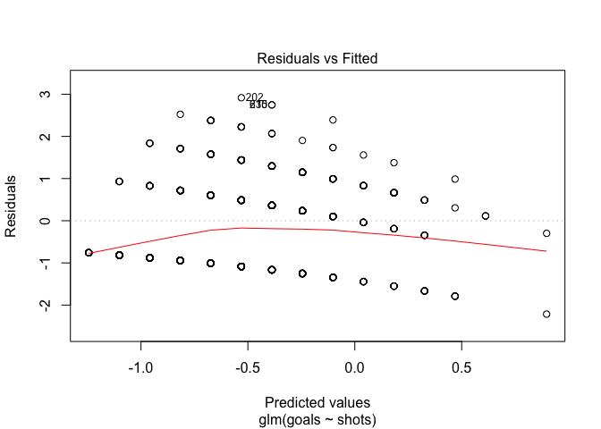<!-- -->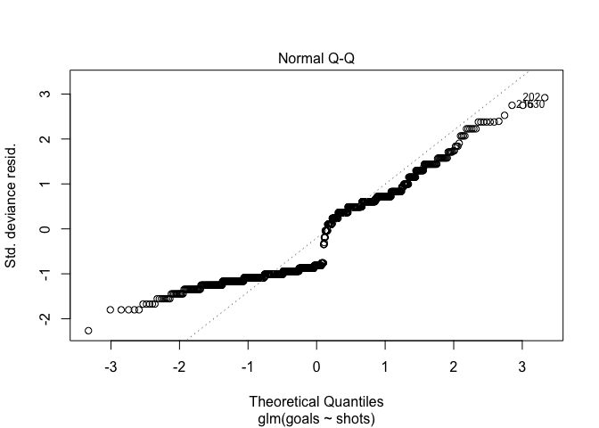<!-- -->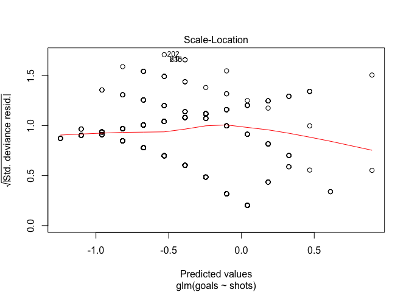<!-- -->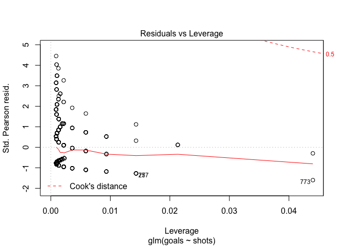<!-- -->

``` r
tibble(
  pred_goals = predict(goals_poiss_3, type = "response"),
  real_goals = ovechkin_goals$goals
) %>%
  mutate(real_goals = factor(real_goals)) %>%
  ggplot(aes(x = real_goals, pred_goals)) +
  ggbeeswarm::geom_quasirandom(size = 1, color = "grey50", alpha = 0.4) +
  geom_boxplot(
    color = "grey20", fill = "grey50", alpha = 0.2,
    outlier.shape = NA
  )
```

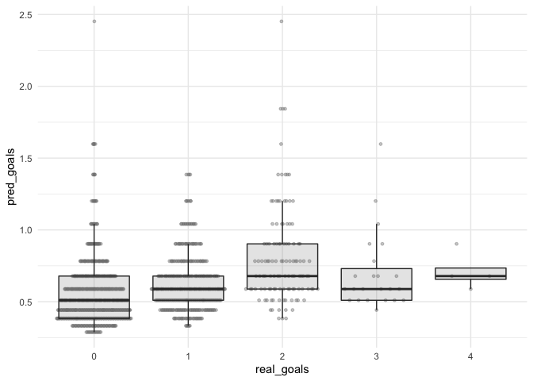<!-- -->

### Second Negative Binomial Regression

We can do the same for the negative binomial.

``` r
goals_nb_2 <- glm.nb(goals ~ shots,
  data = ovechkin_goals
)
```

    #> Warning in theta.ml(Y, mu, sum(w), w, limit = control$maxit, trace =
    #> control$trace > : iteration limit reached
    
    #> Warning in theta.ml(Y, mu, sum(w), w, limit = control$maxit, trace =
    #> control$trace > : iteration limit reached

``` r
summary(goals_nb_2)
```

    #> 
    #> Call:
    #> glm.nb(formula = goals ~ shots, data = ovechkin_goals, init.theta = 7549.879891, 
    #>     link = log)
    #> 
    #> Deviance Residuals: 
    #>     Min       1Q   Median       3Q      Max  
    #> -2.2145  -1.0099  -0.8153   0.6055   2.9172  
    #> 
    #> Coefficients:
    #>             Estimate Std. Error z value Pr(>|z|)    
    #> (Intercept) -1.24439    0.08863  -14.04   <2e-16 ***
    #> shots        0.14277    0.01392   10.26   <2e-16 ***
    #> ---
    #> Signif. codes:  0 '***' 0.001 '**' 0.01 '*' 0.05 '.' 0.1 ' ' 1
    #> 
    #> (Dispersion parameter for Negative Binomial(7549.88) family taken to be 1)
    #> 
    #>     Null deviance: 1206.6  on 1145  degrees of freedom
    #> Residual deviance: 1108.9  on 1144  degrees of freedom
    #> AIC: 2268
    #> 
    #> Number of Fisher Scoring iterations: 1
    #> 
    #> 
    #>               Theta:  7550 
    #>           Std. Err.:  45505 
    #> Warning while fitting theta: iteration limit reached 
    #> 
    #>  2 x log-likelihood:  -2262.038

However, it still does not seem like there is over-dispersion.

``` r
odTest(goals_nb_2)
```

    #> Likelihood ratio test of H0: Poisson, as restricted NB model:
    #> n.b., the distribution of the test-statistic under H0 is non-standard
    #> e.g., see help(odTest) for details/references
    #> 
    #> Critical value of test statistic at the alpha= 0.05 level: 2.7055 
    #> Chi-Square Test Statistic =  -0.0081 p-value = 0.5

### Zero-Inflated Poisson Regression

The last model I want to try is a zero-inflated Poisson. It is possible
that there is zero-inflation in this model because Ovechkin likely did
not play every single minute of every game. The time he is not playing
would count as zero goals, therefore there are two classes of zeros:
those when Ovechkin was playing and did not score and when Ovechkin was
not playing and did not score.

I tried modeling the zero-inflation as a factor of the game number and
minutes in the penalty box. Perhaps as the season progresses, he is more
likely to get injured or be more tired in general.

``` r
goals_zipois <- zeroinfl(goals ~ shots | game_num + penalty_min,
  data = ovechkin_goals
)
summary(goals_zipois)
```

    #> 
    #> Call:
    #> zeroinfl(formula = goals ~ shots | game_num + penalty_min, data = ovechkin_goals)
    #> 
    #> Pearson residuals:
    #>     Min      1Q  Median      3Q     Max 
    #> -1.5660 -0.7142 -0.5765  0.6861  4.4482 
    #> 
    #> Count model coefficients (poisson with log link):
    #>             Estimate Std. Error z value Pr(>|z|)    
    #> (Intercept) -1.24436    0.08863  -14.04   <2e-16 ***
    #> shots        0.14276    0.01392   10.26   <2e-16 ***
    #> 
    #> Zero-inflation model coefficients (binomial with logit link):
    #>             Estimate Std. Error z value Pr(>|z|)
    #> (Intercept)   -6.264    199.129  -0.031    0.975
    #> game_num      -2.346    140.494  -0.017    0.987
    #> penalty_min   -3.283    762.516  -0.004    0.997
    #> ---
    #> Signif. codes:  0 '***' 0.001 '**' 0.01 '*' 0.05 '.' 0.1 ' ' 1 
    #> 
    #> Number of iterations in BFGS optimization: 27 
    #> Log-likelihood: -1131 on 5 Df

However, it does not seem like the zero-inflation model is significant.

## Conclusion


