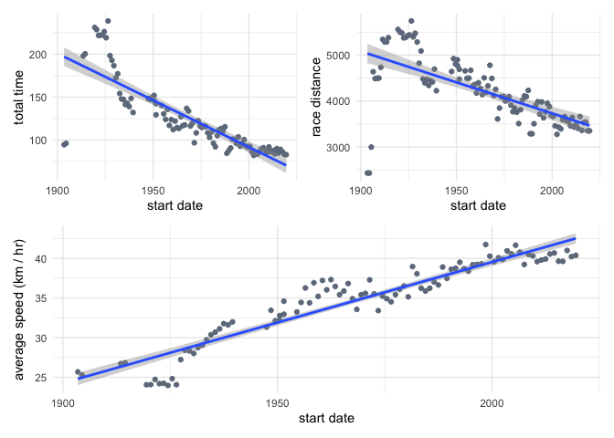
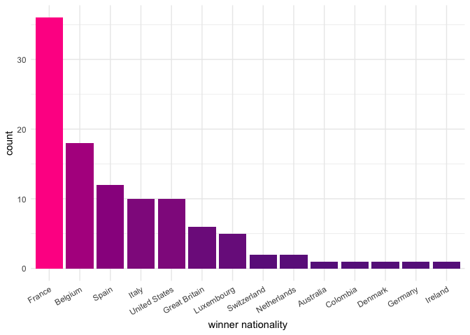
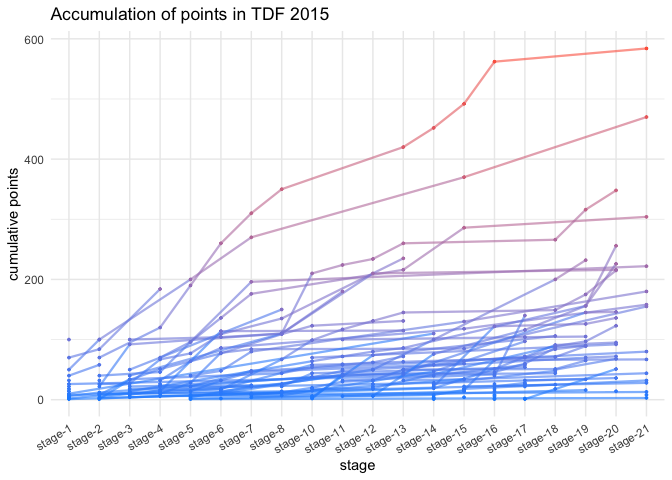

Tour de France
================
Joshua Cook
4/7/2020

``` bash
cd data
wget https://raw.githubusercontent.com/rfordatascience/tidytuesday/master/data/2020/2020-04-07/tdf_winners.csv
wget https://raw.githubusercontent.com/rfordatascience/tidytuesday/master/data/2020/2020-04-07/stage_data.csv
wget https://raw.githubusercontent.com/rfordatascience/tidytuesday/master/data/2020/2020-04-07/tdf_stages.csv
cd ..
```

``` r
library(patchwork)
library(magrittr)
library(tidyverse)
```

    #> ── Attaching packages ───────────────────────────────────────────────────────────────── tidyverse 1.2.1 ──

    #> ✓ ggplot2 3.3.0           ✓ purrr   0.3.3      
    #> ✓ tibble  3.0.0           ✓ dplyr   0.8.99.9002
    #> ✓ tidyr   1.0.0           ✓ stringr 1.4.0      
    #> ✓ readr   1.3.1           ✓ forcats 0.4.0

    #> ── Conflicts ──────────────────────────────────────────────────────────────────── tidyverse_conflicts() ──
    #> x tidyr::extract()   masks magrittr::extract()
    #> x dplyr::filter()    masks stats::filter()
    #> x dplyr::lag()       masks stats::lag()
    #> x purrr::set_names() masks magrittr::set_names()

``` r
theme_set(theme_minimal())
```

## Data

``` r
tdf_winners <- read_csv(
    file.path("data", "tdf_winners.csv"),
    col_types = cols()
)
stage_data <- read_csv(
    file.path("data", "stage_data.csv"),
    col_types = cols(
        edition = col_double(),
        year = col_double(),
        stage_results_id = col_character(),
        rank = col_character(),
        time = col_character(),
        rider = col_character(),
        age = col_double(),
        team = col_character(),
        points = col_double(),
        elapsed = col_character(),
        bib_number = col_double()
    )
)

tdf_stages <- read_csv(
    file.path("data", "tdf_stages.csv"),
    col_types = cols()
)
```

``` r
stage_sublevel_val <- function(x) {
    if (is.na(x)) { 
        return(1) 
    } else {
        return(which(x == letters) + 1)
    }
}

stage_data %<>%
    mutate(
        stage_num = str_extract(stage_results_id, "[:digit:]+"),
        stage_num = as.numeric(stage_num),
        stage_sublvl = str_extract(stage_results_id, "(?<=[:digit:])[:alpha:]$"),
        stage_sublvl = map_dbl(stage_sublvl, stage_sublevel_val) / 10,
        stage_num = stage_num + stage_sublvl,
        stage_id = fct_reorder(stage_results_id, stage_num)
    ) 
```

## Plotting

``` r
time_plot <- tdf_winners %>%
    ggplot(aes(x = start_date, y = time_overall)) +
    geom_point(color = "lightsteelblue4") +
    geom_smooth(method = "lm") +
    labs(x = "start date", 
         y = "total time")
distance_plot <- tdf_winners %>%
    ggplot(aes(x = start_date, y = distance)) +
    geom_point(color = "lightsteelblue4") +
    geom_smooth(method = "lm") +
    labs(x = "start date", 
         y = "race distance")
speed_plot <- tdf_winners %>%
    mutate(avg_speed = distance / time_overall) %>%
    ggplot(aes(x = start_date, y = avg_speed)) +
    geom_point(color = "lightsteelblue4") +
    geom_smooth(method = "lm") +
    labs(x = "start date",
         y = "average speed (km / hr)")
(time_plot | distance_plot) / speed_plot
```

    #> `geom_smooth()` using formula 'y ~ x'

    #> Warning: Removed 8 rows containing non-finite values (stat_smooth).

    #> Warning: Removed 8 rows containing missing values (geom_point).

    #> `geom_smooth()` using formula 'y ~ x'
    #> `geom_smooth()` using formula 'y ~ x'

    #> Warning: Removed 8 rows containing non-finite values (stat_smooth).
    
    #> Warning: Removed 8 rows containing missing values (geom_point).

<!-- -->

``` r
tdf_winners %>%
    count(nationality) %>%
    mutate(nationality = forcats::fct_reorder(nationality, -n)) %>%
    ggplot(aes(x = nationality, y = n, fill = n)) +
    geom_col() +
    scale_fill_gradient(low = "darkorchid4", high = "deeppink", guide = NULL) +
    theme(
        axis.text.x = element_text(angle = 30, hjust = 1)
    ) +
    labs(x = "winner nationality",
         y = "count")
```

<!-- -->

``` r
stage_data %>%
    filter(year == 2015) %>%
    arrange(stage_id) %>%
    filter(!is.na(points)) %>%
    group_by(rider) %>%
    mutate(cumulative_points = cumsum(points)) %>%
    ungroup() %>%
    ggplot(aes(x = stage_id, 
               y = cumulative_points,
               color = cumulative_points)) +
    geom_line(aes(group = rider), 
              alpha = 0.6, 
              size = 0.8) +
    geom_point(size = 0.6) +
    scale_color_gradient(low = "dodgerblue", high = "tomato", guide = FALSE) +
    theme(
        axis.text.x = element_text(angle = 30, hjust = 1)
    ) +
    labs(x = "stage",
         y = "cumulative points",
         title = "Accumulation of points in TDF 2015")
```

<!-- -->
