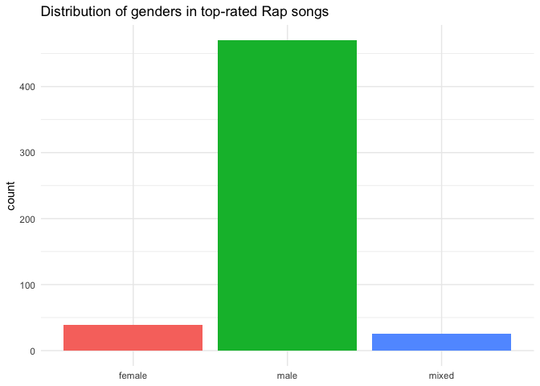
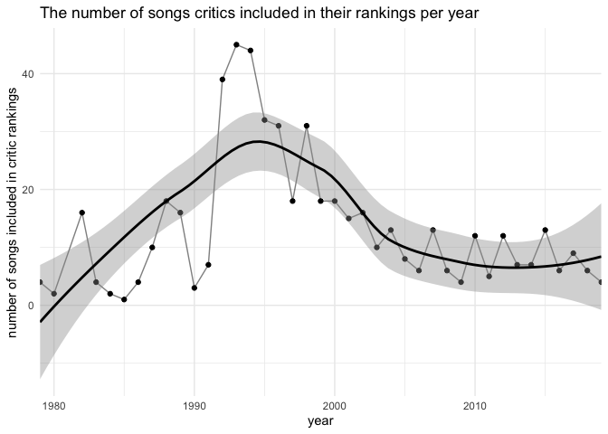
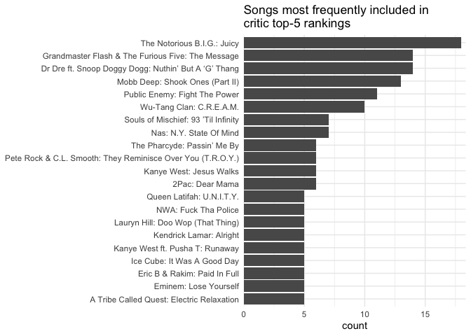
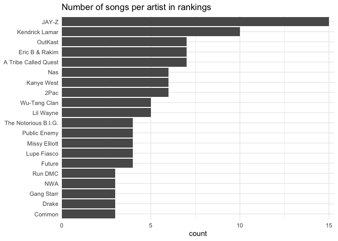
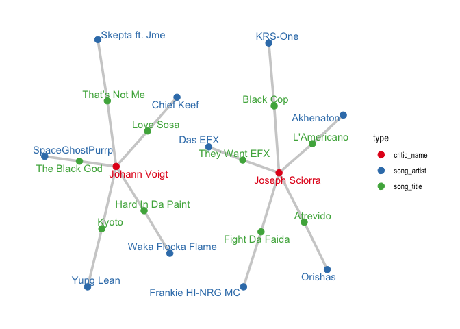
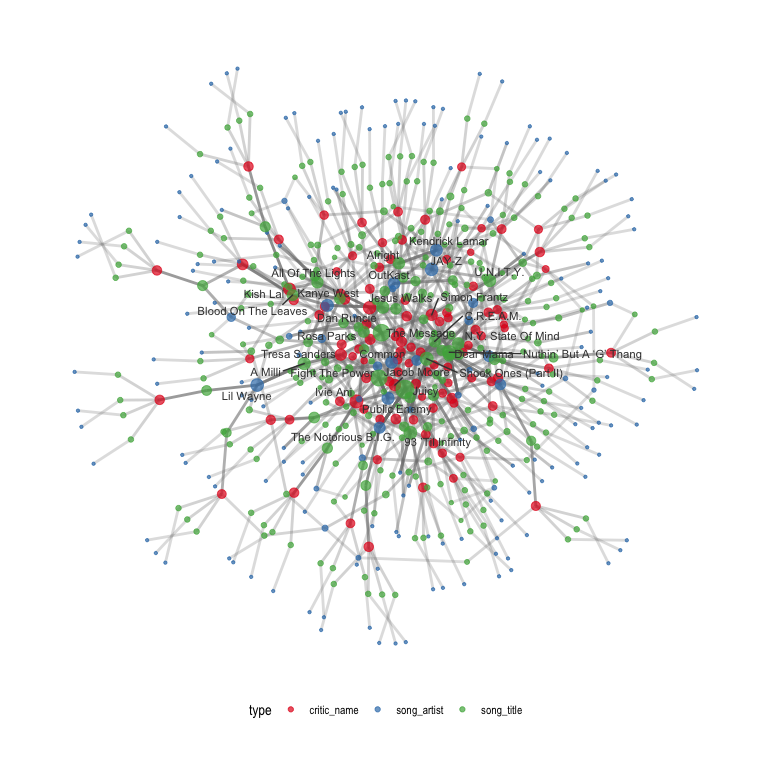
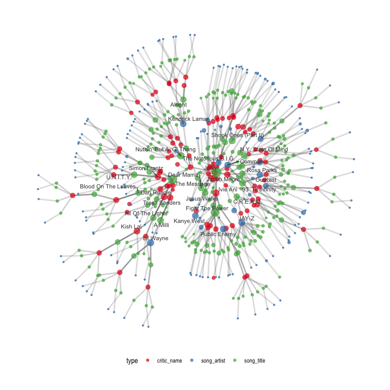
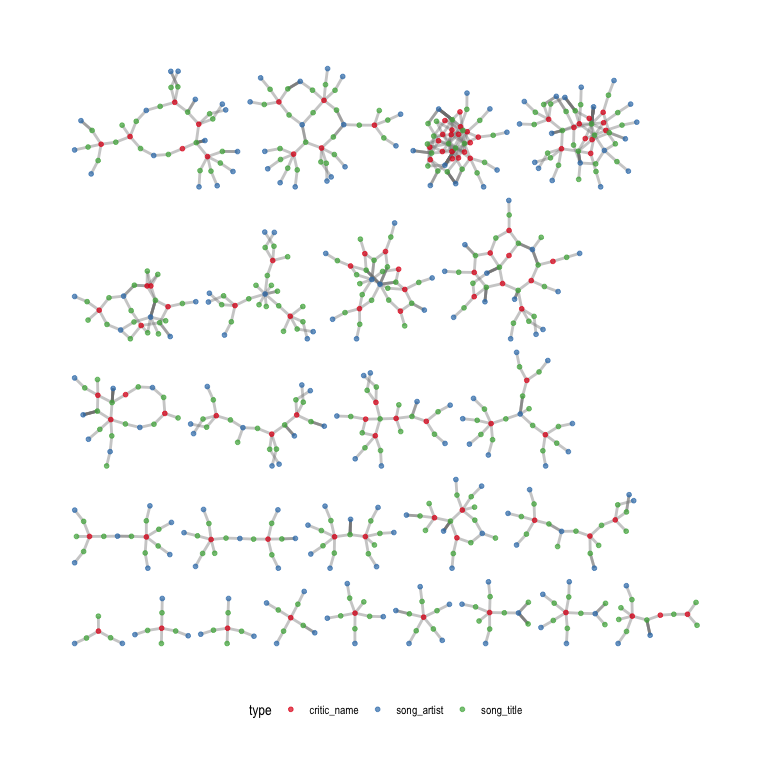

Best Rap Artists
================
Joshua Cook
4/14/2020

## Data

``` bash
cd data
wget 'https://raw.githubusercontent.com/rfordatascience/tidytuesday/master/data/2020/2020-04-14/polls.csv'
wget 'https://raw.githubusercontent.com/rfordatascience/tidytuesday/master/data/2020/2020-04-14/rankings.csv'
cd ..
```

``` r
rap_polls <- read_csv(file.path("data", "polls.csv")) %>%
    janitor::clean_names() %>%
    select(-critic_country2)
```

    ## Parsed with column specification:
    ## cols(
    ##   rank = col_double(),
    ##   title = col_character(),
    ##   artist = col_character(),
    ##   gender = col_character(),
    ##   year = col_double(),
    ##   critic_name = col_character(),
    ##   critic_rols = col_character(),
    ##   critic_country = col_character(),
    ##   critic_country2 = col_character()
    ## )

``` r
rap_rankings <- read_csv(file.path("data", "rankings.csv")) %>%
    janitor::clean_names()
```

    ## Parsed with column specification:
    ## cols(
    ##   ID = col_double(),
    ##   title = col_character(),
    ##   artist = col_character(),
    ##   year = col_double(),
    ##   gender = col_character(),
    ##   points = col_double(),
    ##   n = col_double(),
    ##   n1 = col_double(),
    ##   n2 = col_double(),
    ##   n3 = col_double(),
    ##   n4 = col_double(),
    ##   n5 = col_double()
    ## )

``` r
rap_rankings %>% 
    count(title, artist) %>% 
    filter(n > 1)
```

    ## # A tibble: 1 x 3
    ##   title             artist                                n
    ##   <chr>             <chr>                             <int>
    ## 1 All Of The Lights Kanye West ft. Rihanna & Kid Cudi     2

The song *All Of The Lights* by Kanye West was split into two songs for
some reason in the polls, but I manually combined the data and
reevaluated the rankings.

``` r
kw_all_of_the_light <- rap_rankings %>% 
    filter(title == "All Of The Lights") %>%
    mutate(gender = "mixed") %>%
    group_by(title, artist, year, gender) %>%
    summarise(points = sum(points),
              n = sum(n),
              n1 = sum(n1),
              n2 = sum(n2),
              n3 = sum(n3),
              n4 = sum(n4),
              n5 = sum(n5)) %>%
    ungroup() %>%
    mutate(id = 0) %>%
    select(all_of(colnames(rap_rankings))) %>%
    as_tibble()

rap_rankings %<>%
    filter(title != "All Of The Lights") %>%
    bind_rows(kw_all_of_the_light)
```

## EDA

### `rap_polls`

``` r
rap_polls %>%
    count(gender) %>%
    ggplot(aes(x = gender, y = n)) +
    geom_col(aes(fill = gender)) +
    theme(legend.position = "none",
          axis.title.x = element_blank()) +
    labs(y = "count",
         title = "Distribution of genders in top-rated Rap songs")
```

<!-- -->

``` r
rap_polls %>%
    count(year) %>%
    ggplot(aes(x = year, y = n)) +
    geom_point() +
    geom_line(alpha = 0.5) +
    geom_smooth(color = "black") +
    scale_x_continuous(expand = c(0, 0)) +
    labs(x = "year",
         y = "number of songs included in critic rankings",
         title = "The number of songs critics included in their rankings per year")
```

    ## `geom_smooth()` using method = 'loess' and formula 'y ~ x'

<!-- -->

``` r
rap_polls %>%
    count(title, artist, sort = T) %>%
    top_n(20, wt = n) %>%
    mutate(lbl = paste0(artist, ": ", title),
           lbl = fct_reorder(lbl, n)) %>%
    ggplot(aes(x = n, y = lbl)) +
    geom_col() +
    scale_x_continuous(expand = expansion(mult = c(0, 0.02))) +
    theme(axis.title.y = element_blank()) +
    labs(x = "count",
         title = "Songs most frequently included in\ncritic top-5 rankings")
```

<!-- -->

### `rap_rankings`

``` r
rap_rankings %>%
    select(title, artist, year, points) %>%
    set_names(c("Song", "Artist", "Year", "Points")) %>%
    head(n = 10) %>%
    knitr::kable()
```

| Song                    | Artist                               | Year | Points |
| :---------------------- | :----------------------------------- | ---: | -----: |
| Juicy                   | The Notorious B.I.G.                 | 1994 |    140 |
| Fight The Power         | Public Enemy                         | 1989 |    100 |
| Shook Ones (Part II)    | Mobb Deep                            | 1995 |     94 |
| The Message             | Grandmaster Flash & The Furious Five | 1982 |     90 |
| Nuthin’ But A ‘G’ Thang | Dr Dre ft. Snoop Doggy Dogg          | 1992 |     84 |
| C.R.E.A.M.              | Wu-Tang Clan                         | 1993 |     62 |
| 93 ’Til Infinity        | Souls of Mischief                    | 1993 |     50 |
| Passin’ Me By           | The Pharcyde                         | 1992 |     48 |
| N.Y. State Of Mind      | Nas                                  | 1994 |     46 |
| Dear Mama               | 2Pac                                 | 1995 |     42 |

``` r
rap_rankings %>%
    distinct(title, artist) %>%
    count(artist) %>%
    top_n(20, wt = n) %>%
    mutate(artist = fct_reorder(artist, n)) %>%
    ggplot(aes(x = n, y = artist)) +
    geom_col() +
    scale_x_continuous(expand = expansion(mult = c(0, 0.02))) +
    theme(axis.title.y = element_blank()) +
    labs(x = "count",
         title = "Number of songs per artist in rankings")
```

<!-- -->

## Graph

``` r
rap_rankings_select <- rap_rankings %>%
    select()
rap_polls_select <- rap_polls %>%
    select(-gender, -year) %>%
    rename(critic_rank = rank)
```

``` r
rap_data <- rap_rankings %>%
    select(-(n1:n5)) %>%
    left_join(rap_polls_select, by = c("title", "artist")) %>%
    mutate(title = ifelse(
        title == "Hip Hop", glue("{title} ({artist})"), title
    ))

rap_data
```

    ## # A tibble: 535 x 11
    ##       id title artist  year gender points     n critic_rank critic_name
    ##    <dbl> <chr> <chr>  <dbl> <chr>   <dbl> <dbl>       <dbl> <chr>      
    ##  1     1 Juicy The N…  1994 male      140    18           1 Insanul Ah…
    ##  2     1 Juicy The N…  1994 male      140    18           2 Ivie Ani   
    ##  3     1 Juicy The N…  1994 male      140    18           3 Andrew Bar…
    ##  4     1 Juicy The N…  1994 male      140    18           2 Harley Bro…
    ##  5     1 Juicy The N…  1994 male      140    18           1 Paul Cantor
    ##  6     1 Juicy The N…  1994 male      140    18           1 Georgette …
    ##  7     1 Juicy The N…  1994 male      140    18           2 Andy Cohn  
    ##  8     1 Juicy The N…  1994 male      140    18           3 Common     
    ##  9     1 Juicy The N…  1994 male      140    18           5 Dan Green  
    ## 10     1 Juicy The N…  1994 male      140    18           1 Nadia Jae  
    ## # … with 525 more rows, and 2 more variables: critic_rols <chr>,
    ## #   critic_country <chr>

``` r
rap_el_1 <- rap_data %>%
    select(critic_name, title) %>%
    set_names(c("from", "to"))
rap_el_2 <- rap_data %>%
    select(artist, title) %>%
    set_names(c("from", "to"))


rap_song_data <- rap_data %>%
    distinct(title, year, points)

rap_artist_data <- rap_data %>%
    distinct(title, artist, year, gender, points) %>%
    group_by(artist) %>%
    summarise(total_points = sum(points),
              num_songs = n_distinct(title)) %>%
    ungroup()

rap_critic_data <- rap_data %>%
    distinct(critic_name, critic_rols, critic_rols)

rap_graph <- as_tbl_graph(bind_rows(rap_el_1, rap_el_2)) %N>%
    mutate(type = case_when(
        name %in% rap_data$title ~ "song_title",
        name %in% rap_data$artist ~ "song_artist",
        name %in% rap_data$critic_name ~ "critic_name"
    )) %N>%
    left_join(rap_song_data, by = c("name" = "title")) %>%
    left_join(rap_artist_data, by = c("name" = "artist")) %>%
    left_join(rap_critic_data, by = c("name" = "critic_name"))

rap_graph
```

    ## # A tbl_graph: 622 nodes and 1070 edges
    ## #
    ## # A directed acyclic multigraph with 3 components
    ## #
    ## # Node Data: 622 x 7 (active)
    ##   name            type        year points total_points num_songs critic_rols    
    ##   <chr>           <chr>      <dbl>  <dbl>        <dbl>     <int> <chr>          
    ## 1 Insanul Ahmed   critic_na…    NA     NA           NA        NA Genius         
    ## 2 Ivie Ani        critic_na…    NA     NA           NA        NA Critic         
    ## 3 Andrew Barber   critic_na…    NA     NA           NA        NA Fake Shore Dri…
    ## 4 Harley Brown    critic_na…    NA     NA           NA        NA Critic         
    ## 5 Paul Cantor     critic_na…    NA     NA           NA        NA Critic         
    ## 6 Georgette Cline critic_na…    NA     NA           NA        NA XXL            
    ## # … with 616 more rows
    ## #
    ## # Edge Data: 1,070 x 2
    ##    from    to
    ##   <int> <int>
    ## 1     1   313
    ## 2     2   313
    ## 3     3   313
    ## # … with 1,067 more rows

Three components in total, and two are far smaller than the rest.

``` r
# Number of components.
igraph::count_components(rap_graph)
```

    ## [1] 3

``` r
# Size of components.
igraph::decompose(rap_graph) %>% map_dbl(igraph::vcount)
```

    ## [1] 600  11  11

These subcomponents represent two different critics with completely
unique lists of favorite songs. Further, their songs are all from
artists without any other ranked songs.

``` r
rap_graph %N>%
    jhcutils::filter_component_size(min_size = 0, max_size = 15) %>%
    ggraph(layout = "stress") +
    geom_edge_link(alpha = 0.4, color = "grey50", width = 1.3) +
    geom_node_point(aes(color = type), size = 3) +
    geom_node_text(aes(label = name, color = type), 
                   repel = TRUE, family = "Arial") +
    scale_color_brewer(palette = "Set1") +
    theme_graph()
```

    ## Warning: `as_quosure()` requires an explicit environment as of rlang 0.3.0.
    ## Please supply `env`.
    ## This warning is displayed once per session.

<!-- -->

``` r
rap_graph %N>%
    jhcutils::get_giant_component() %>%
    mutate(centrality = centrality_betweenness(directed = FALSE),
           lbl = ifelse(centrality > quantile(centrality, 0.95), name, NA)) %E>%
    mutate(centrality = centrality_edge_betweenness(directed = FALSE)) %N>%
    ggraph(layout = "stress") +
    geom_edge_link(aes(alpha = centrality), color = "grey50", width = 1) +
    geom_node_point(aes(color = type, size = centrality), alpha = 0.7) +
    geom_node_text(aes(label = lbl), color = "grey25",
                   repel = TRUE, size = 3, family = "Arial") +
    scale_color_brewer(palette = "Set1") +
    scale_edge_alpha_continuous(range = c(0.2, 0.9), guide = NULL) +
    scale_size_continuous(range = c(0.8, 6), guide = NULL) +
    scale_alpha_continuous(range =c(0.2, 0.8), guide = NULL) +
    theme_graph() +
    theme(legend.position = "bottom")
```

    ## Warning: Removed 570 rows containing missing values (geom_text_repel).

<!-- -->

Potentially better visualization by reducing the graph down to the
minimum spanning tree.

``` r
rap_graph %N>%
    jhcutils::get_giant_component() %>%
    mutate(centrality = centrality_betweenness(directed = FALSE),
           lbl = ifelse(centrality > quantile(centrality, 0.95), name, NA)) %E>%
    mutate(centrality = centrality_edge_betweenness(directed = FALSE)) %N>%
    convert(to_minimum_spanning_tree) %>%
    ggraph(layout = "stress") +
    geom_edge_link(aes(alpha = centrality), color = "grey50", width = 1) +
    geom_node_point(aes(color = type, size = centrality), alpha = 0.7) +
    geom_node_text(aes(label = lbl), color = "grey25",
                   repel = TRUE, size = 3, family = "Arial") +
    scale_color_brewer(palette = "Set1") +
    scale_edge_alpha_continuous(range = c(0.2, 0.9), guide = NULL) +
    scale_size_continuous(range = c(0.8, 6), guide = NULL) +
    scale_alpha_continuous(range =c(0.2, 0.8), guide = NULL) +
    theme_graph() +
    theme(legend.position = "bottom")
```

    ## Warning: Removed 570 rows containing missing values (geom_text_repel).

<!-- -->

Group the critics by clustering the graph.

``` r
clustered_rap_graph <- rap_graph %N>%
    jhcutils::get_giant_component() %>%
    convert(to_undirected) %>%
    mutate(cls = group_spinglass()) %E>%
    filter(.N()$cls[from] == .N()$cls[to])

clustered_rap_graph %>%
    ggraph(layout = "stress") +
    geom_edge_link(alpha = 0.4, color = "grey50", width = 1) +
    geom_node_point(aes(color = type), size = 1.3, alpha = 0.7) +
    scale_color_brewer(palette = "Set1") +
    theme_graph() +
    theme(legend.position = "bottom")
```

<!-- -->

The critics clustered based on their relationships in the graph.

``` r
clustered_rap_graph %N>%
    as_tibble() %>%
    select(name, type, cls) %>%
    filter(type == "critic_name") %>%
    arrange(cls) %>%
    group_by(cls) %>%
    summarise(critics = paste0(name, collapse = ", ")) %>%
    knitr::kable()
```

| cls | critics                                                                                                                                                                                                                                                                               |
| --: | :------------------------------------------------------------------------------------------------------------------------------------------------------------------------------------------------------------------------------------------------------------------------------------ |
|   1 | Antonio ‘Rolo’ Alarcon, Rob Harvilla, Kevin Le Gendre, Kevin Powell, Tresa Sanders, Ernest Wilkins, Dart Adams, Hiroshi Egaitsu, Simon Frantz, Judy Miller, Julio César Escovar                                                                                                       |
|   2 | Insanul Ahmed, Andrew Barber, Harley Brown, Paul Cantor, Georgette Cline, Andy Cohn, Dan Green, Brian Josephs, William E. Ketchum III, Sowmya Krishnamurthy, Al Rocco, Brian ‘Z’ Zisook, Ethan Holben, Vivian Host, Toddla T, Alejandro Marin, Nick Fulton, Andrei Nikitin, Joey Akan |
|   3 | Andrew Winistorfer, Taylor Crumpton, Ma’an Abu Taleb, Andrew Nosnitsky, Davide Bortot                                                                                                                                                                                                 |
|   4 | Gabriel Tolliver, Jeff Weiss, Stephen Dowling, Drew Millard, David Ma, Ralf Theil                                                                                                                                                                                                     |
|   5 | Ruby V, Julian Brimmers, Dan Runcie, J. Zoe Camp, J’na Jefferson, Michelle McDevitt, Nick Catchdubs, Kish Lal, Jan Wehn                                                                                                                                                               |
|   6 | Brendan Frederick, Charles Holmes, Polla Garmiany, Sasha Frere-Jones, Kathy Iandoli, Rodney Carmichael, Grant Rindner                                                                                                                                                                 |
|   7 | Bhanuj Kappal, Fionn Birr, Hrishikesh Hirway, Ross Devlin, Jeff Chang, Philip Cosores                                                                                                                                                                                                 |
|   8 | Allyson Toy, Yi-Ling Liu, D.L. Chandler                                                                                                                                                                                                                                               |
|   9 | Viola Funk, Zachary Schwartz, Mike Sunda, Laurent Fintoni                                                                                                                                                                                                                             |
|  10 | Camille Storm, Damola Durosomo, Leslie Horn, Antoinette Isama, Sekese Rasephei                                                                                                                                                                                                        |
|  11 | Cam Curran, Sabelo Mkhabela, Lawrence Burney                                                                                                                                                                                                                                          |
|  12 | Simone Paget, Dimas Sanfiorenzo, Vikki Tobak                                                                                                                                                                                                                                          |
|  13 | Jacob Moore, Dave ‘Davey D’ Cook, Mayuyuka Kaunda, Nate Patrin                                                                                                                                                                                                                        |
|  14 | Nadia Jae, Onyx Collective, Tseliso Monaheng                                                                                                                                                                                                                                          |
|  15 | Brother Ernie, Helen Herimbi                                                                                                                                                                                                                                                          |
|  16 | Kirsten Zemke, Biba Adams                                                                                                                                                                                                                                                             |
|  17 | Reed Jackson, Larry Fitzmaurice                                                                                                                                                                                                                                                       |
|  18 | Justin Sarachik, Pete Tosiello                                                                                                                                                                                                                                                        |
|  19 | Ivie Ani, Zack O’Malley Greenburg, Sharine Taylor                                                                                                                                                                                                                                     |
|  20 | Fabian Wolff                                                                                                                                                                                                                                                                          |
|  21 | Joseph Abajian                                                                                                                                                                                                                                                                        |
|  22 | Jordan Sargent                                                                                                                                                                                                                                                                        |
|  23 | Eamon Whalen                                                                                                                                                                                                                                                                          |

### Future directions

Here are some of the ways this type of data structure could be useful:

1.  Using the closeness on the graph to recommend songs or artists to
    the people based on songs they already know and like.
2.  Finding the core rap songs and artists.
3.  Grouping the critics, artists, or songs by using a graph cutting or
    clustering algorithm.
4.  Predicting similarity of artists, songs, and critics.
