Broadway Weekly Grosses
================
Joshua Cook
April 28, 2020

## Data

``` r
grosses_cols <- cols(
    week_ending = col_date(format = ""),
    week_number = col_double(),
    weekly_gross_overall = col_double(),
    show = col_character(),
    theatre = col_character(),
    weekly_gross = col_double(),
    potential_gross = col_double(),
    avg_ticket_price = col_double(),
    top_ticket_price = col_double(),
    seats_sold = col_double(),
    seats_in_theatre = col_double(),
    pct_capacity = col_double(),
    performances = col_double(),
    previews = col_double()
)

grosses <- read_csv(
    'https://raw.githubusercontent.com/rfordatascience/tidytuesday/master/data/2020/2020-04-28/grosses.csv',
    col_types = grosses_cols
) %>%
    janitor::clean_names()

grosses
```

    #> # A tibble: 47,524 x 14
    #>    week_ending week_number weekly_gross_ov… show  theatre weekly_gross
    #>    <date>            <dbl>            <dbl> <chr> <chr>          <dbl>
    #>  1 1985-06-09            1          3915937 42nd… St. Ja…       282368
    #>  2 1985-06-09            1          3915937 A Ch… Sam S.…       222584
    #>  3 1985-06-09            1          3915937 Aren… Brooks…       249272
    #>  4 1985-06-09            1          3915937 Arms… Circle…        95688
    #>  5 1985-06-09            1          3915937 As Is Lyceum…        61059
    #>  6 1985-06-09            1          3915937 Big … Eugene…       255386
    #>  7 1985-06-09            1          3915937 Bilo… Neil S…       306839
    #>  8 1985-06-09            1          3915937 Brig… 46th S…       107392
    #>  9 1985-06-09            1          3915937 Cats  Winter…       461880
    #> 10 1985-06-09            1          3915937 Doub… Ritz T…        47452
    #> # … with 47,514 more rows, and 8 more variables: potential_gross <dbl>,
    #> #   avg_ticket_price <dbl>, top_ticket_price <dbl>, seats_sold <dbl>,
    #> #   seats_in_theatre <dbl>, pct_capacity <dbl>, performances <dbl>,
    #> #   previews <dbl>

## EDA

``` r
grosses %>%
    mutate(year = year(week_ending)) %>%
    distinct(show, theatre, year, week_ending, weekly_gross_overall) %>%
    ggplot(aes(x = week_ending, y = weekly_gross_overall)) +
    geom_jitter(color = "grey70", alpha = 0.5, size = 0.6) +
    geom_smooth(color = "black", lty = 2, size = 1.3) +
    labs(x = "week", y = "weekly overall gross")
```

    #> `geom_smooth()` using method = 'gam' and formula 'y ~ s(x, bs = "cs")'

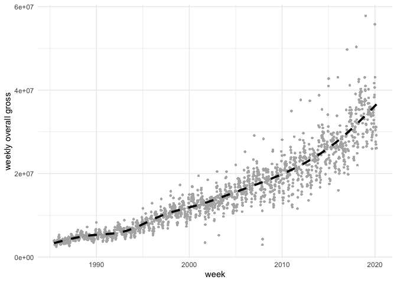<!-- -->

``` r
set.seed(0)
grosses %>%
    sample_frac(0.2) %>%
    ggplot(aes(x = week_ending, y = avg_ticket_price)) +
    geom_point(aes(size = pct_capacity, color = seats_sold), alpha = 0.5) +
    geom_mark_ellipse(aes(filter = avg_ticket_price > 450, 
                          label = "Springsteen On Broadway")) +
    scale_size_continuous(range = c(0.1, 2)) +
    scale_color_distiller(type = "div", palette = "RdYlBu") +
    labs(x = "week", y = "average ticket price", 
         size = "percent capacity", color = "seats sold")
```

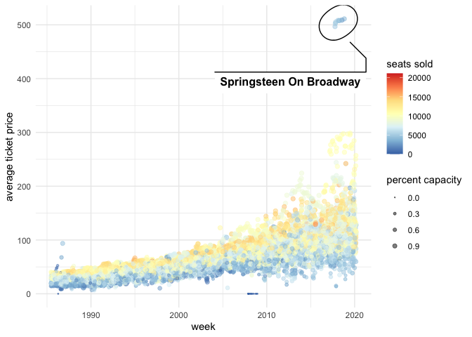<!-- -->

``` r
grosses %>%
    filter(seats_sold > 0) %>%
    group_by(show) %>%
    mutate(med_seats_sold = median(seats_sold)) %>%
    ungroup() %>%
    filter(med_seats_sold > 12000) %>%
    mutate(show = fct_reorder(show, -seats_sold, median, na.rm = TRUE)) %>%
    ggplot(aes(x = log(seats_sold), y = show)) +
    geom_boxplot(outlier.shape = NA, width = 0.6) +
    scale_x_continuous(limits = c(8.75, 10)) +
    labs(x = "log(seats sold)", y = NULL, title = "Most popular shows")
```

    #> Warning: Removed 26 rows containing non-finite values (stat_boxplot).

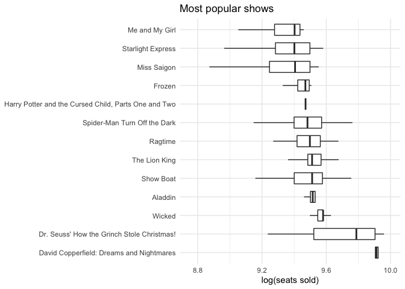<!-- -->

## Modeling

``` r
grosses %>%
    mutate(log_avg_ticket_price = log(avg_ticket_price)) %>%
    select(top_ticket_price, avg_ticket_price, log_avg_ticket_price, pct_capacity) %>%
    pivot_longer(-top_ticket_price, names_to = "cat", values_to = "value") %>%
    sample_frac(0.2) %>%
    ggplot(aes(x = value, y = top_ticket_price)) +
    facet_wrap(~ cat, nrow = 1, scales = "free_x") +
    geom_point(size = 0.6, alpha = 0.3, color = "grey20")
```

    #> Warning: Removed 6856 rows containing missing values (geom_point).

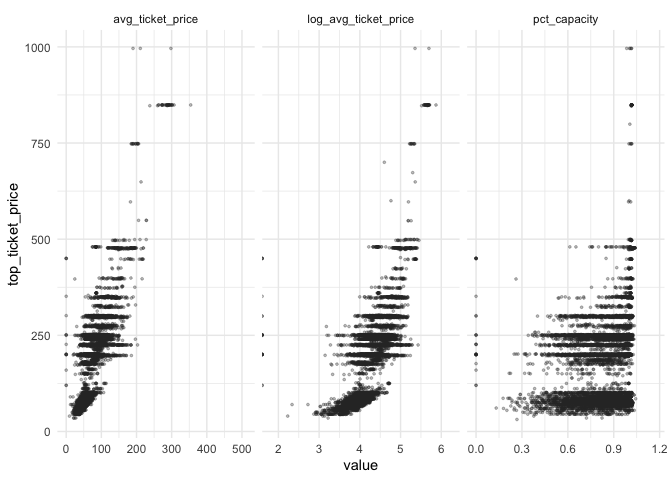<!-- -->

``` r
grosses %>%
    sample_frac(0.2) %>%
    ggplot(aes(x = log(avg_ticket_price), y = pct_capacity)) +
    geom_point(size = 0.6, alpha = 0.3, color = "grey20")
```

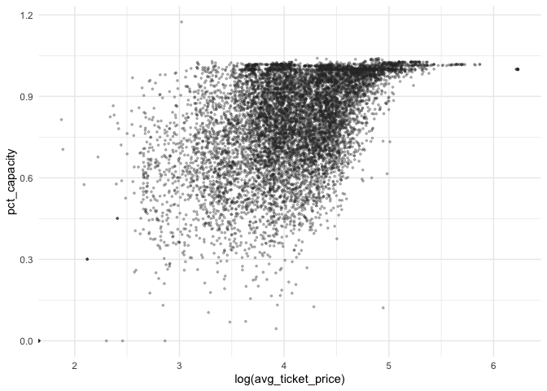<!-- -->

``` r
grosses %>%
    mutate(log_avg_ticket_price = log(avg_ticket_price)) %>%
    select(top_ticket_price, avg_ticket_price, log_avg_ticket_price, pct_capacity) %>%
    pivot_longer(top_ticket_price:pct_capacity) %>%
    sample_frac(0.4) %>%
    ggplot(aes(x = value)) +
    facet_wrap(~ name, nrow = 1, scales = "free_x") +
    geom_histogram(bins = 100)
```

    #> Warning: Removed 4681 rows containing non-finite values (stat_bin).

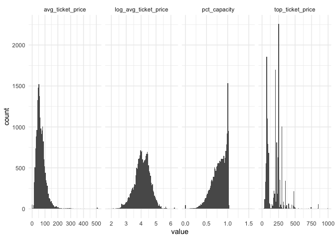<!-- -->

``` r
grosses_data <- grosses %>%
    filter(avg_ticket_price > 0 & year(week_ending) >= 2010)

top_5_shows <- grosses_data %>%
    count(show) %>%
    top_n(5, wt = n)

grosses_data <- grosses_data %>%
    filter(show %in% top_5_shows$show) %>%
    select(show, top_ticket_price, avg_ticket_price, pct_capacity) %>%
    mutate(avg_ticket_price = scale(log(avg_ticket_price))[, 1],
           pct_capacity = scale(pct_capacity)[, 1])
```

``` r
grosses_data %>%
    select(top_ticket_price, avg_ticket_price, pct_capacity) %>%
    pivot_longer(top_ticket_price:pct_capacity) %>%
    sample_frac(0.4) %>%
    ggplot(aes(x = value)) +
    facet_wrap(~ name, nrow = 1, scales = "free_x") +
    geom_histogram(bins = 100)
```

    #> Warning: Removed 2 rows containing non-finite values (stat_bin).

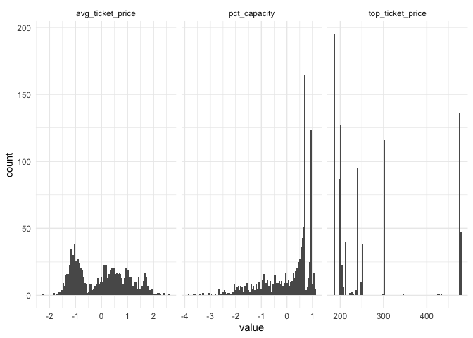<!-- -->

``` r
lm_fit1 <- lm(top_ticket_price ~ avg_ticket_price + pct_capacity, 
              data = grosses_data)
summary(lm_fit1)
```

    #> 
    #> Call:
    #> lm(formula = top_ticket_price ~ avg_ticket_price + pct_capacity, 
    #>     data = grosses_data)
    #> 
    #> Residuals:
    #>      Min       1Q   Median       3Q      Max 
    #> -201.454  -43.831   -4.024   29.586  208.907 
    #> 
    #> Coefficients:
    #>                  Estimate Std. Error t value Pr(>|t|)    
    #> (Intercept)       266.019      1.535 173.247  < 2e-16 ***
    #> avg_ticket_price   57.940      2.339  24.768  < 2e-16 ***
    #> pct_capacity       11.933      2.337   5.106 3.54e-07 ***
    #> ---
    #> Signif. codes:  0 '***' 0.001 '**' 0.01 '*' 0.05 '.' 0.1 ' ' 1
    #> 
    #> Residual standard error: 78.07 on 2582 degrees of freedom
    #>   (5 observations deleted due to missingness)
    #> Multiple R-squared:  0.4271, Adjusted R-squared:  0.4266 
    #> F-statistic: 962.4 on 2 and 2582 DF,  p-value: < 2.2e-16

``` r
glue("lm_fit1 AIC: {AIC(lm_fit1)}")
```

    #> lm_fit1 AIC: 29869.6434682692

``` r
lm_fit2 <- lm(top_ticket_price ~ avg_ticket_price + pct_capacity + show, 
              data = grosses_data)
summary(lm_fit2)
```

    #> 
    #> Call:
    #> lm(formula = top_ticket_price ~ avg_ticket_price + pct_capacity + 
    #>     show, data = grosses_data)
    #> 
    #> Residuals:
    #>      Min       1Q   Median       3Q      Max 
    #> -211.304   -5.450   -0.442    8.910  202.558 
    #> 
    #> Coefficients:
    #>                              Estimate Std. Error t value Pr(>|t|)    
    #> (Intercept)                  198.3007     1.6404 120.888  < 2e-16 ***
    #> avg_ticket_price              11.3000     1.1277  10.021  < 2e-16 ***
    #> pct_capacity                  -1.3368     0.8086  -1.653   0.0984 .  
    #> showThe Book of Mormon       259.2421     2.9617  87.532  < 2e-16 ***
    #> showThe Lion King             14.6193     2.5491   5.735 1.09e-08 ***
    #> showThe Phantom of the Opera  16.4270     1.5967  10.288  < 2e-16 ***
    #> showWicked                    69.8049     2.1973  31.768  < 2e-16 ***
    #> ---
    #> Signif. codes:  0 '***' 0.001 '**' 0.01 '*' 0.05 '.' 0.1 ' ' 1
    #> 
    #> Residual standard error: 25.72 on 2578 degrees of freedom
    #>   (5 observations deleted due to missingness)
    #> Multiple R-squared:  0.9379, Adjusted R-squared:  0.9377 
    #> F-statistic:  6488 on 6 and 2578 DF,  p-value: < 2.2e-16

``` r
glue("lm_fit2 AIC: {AIC(lm_fit2)}")
```

    #> lm_fit2 AIC: 24134.2716929593

``` r
anova(lm_fit1, lm_fit2)
```

    #> Analysis of Variance Table
    #> 
    #> Model 1: top_ticket_price ~ avg_ticket_price + pct_capacity
    #> Model 2: top_ticket_price ~ avg_ticket_price + pct_capacity + show
    #>   Res.Df      RSS Df Sum of Sq      F    Pr(>F)    
    #> 1   2582 15736552                                  
    #> 2   2578  1706047  4  14030506 5300.4 < 2.2e-16 ***
    #> ---
    #> Signif. codes:  0 '***' 0.001 '**' 0.01 '*' 0.05 '.' 0.1 ' ' 1

``` r
glm_fit1 <- glm(top_ticket_price ~ avg_ticket_price + pct_capacity, 
               data = grosses_data)
summary(glm_fit1)
```

    #> 
    #> Call:
    #> glm(formula = top_ticket_price ~ avg_ticket_price + pct_capacity, 
    #>     data = grosses_data)
    #> 
    #> Deviance Residuals: 
    #>      Min        1Q    Median        3Q       Max  
    #> -201.454   -43.831    -4.024    29.586   208.907  
    #> 
    #> Coefficients:
    #>                  Estimate Std. Error t value Pr(>|t|)    
    #> (Intercept)       266.019      1.535 173.247  < 2e-16 ***
    #> avg_ticket_price   57.940      2.339  24.768  < 2e-16 ***
    #> pct_capacity       11.933      2.337   5.106 3.54e-07 ***
    #> ---
    #> Signif. codes:  0 '***' 0.001 '**' 0.01 '*' 0.05 '.' 0.1 ' ' 1
    #> 
    #> (Dispersion parameter for gaussian family taken to be 6094.714)
    #> 
    #>     Null deviance: 27467727  on 2584  degrees of freedom
    #> Residual deviance: 15736552  on 2582  degrees of freedom
    #>   (5 observations deleted due to missingness)
    #> AIC: 29870
    #> 
    #> Number of Fisher Scoring iterations: 2

``` r
glm_fit2 <- glm(top_ticket_price ~ avg_ticket_price + pct_capacity + show, 
               data = grosses_data)
summary(glm_fit2)
```

    #> 
    #> Call:
    #> glm(formula = top_ticket_price ~ avg_ticket_price + pct_capacity + 
    #>     show, data = grosses_data)
    #> 
    #> Deviance Residuals: 
    #>      Min        1Q    Median        3Q       Max  
    #> -211.304    -5.450    -0.442     8.910   202.558  
    #> 
    #> Coefficients:
    #>                              Estimate Std. Error t value Pr(>|t|)    
    #> (Intercept)                  198.3007     1.6404 120.888  < 2e-16 ***
    #> avg_ticket_price              11.3000     1.1277  10.021  < 2e-16 ***
    #> pct_capacity                  -1.3368     0.8086  -1.653   0.0984 .  
    #> showThe Book of Mormon       259.2421     2.9617  87.532  < 2e-16 ***
    #> showThe Lion King             14.6193     2.5491   5.735 1.09e-08 ***
    #> showThe Phantom of the Opera  16.4270     1.5967  10.288  < 2e-16 ***
    #> showWicked                    69.8049     2.1973  31.768  < 2e-16 ***
    #> ---
    #> Signif. codes:  0 '***' 0.001 '**' 0.01 '*' 0.05 '.' 0.1 ' ' 1
    #> 
    #> (Dispersion parameter for gaussian family taken to be 661.7715)
    #> 
    #>     Null deviance: 27467727  on 2584  degrees of freedom
    #> Residual deviance:  1706047  on 2578  degrees of freedom
    #>   (5 observations deleted due to missingness)
    #> AIC: 24134
    #> 
    #> Number of Fisher Scoring iterations: 2

``` r
anova(glm_fit1, glm_fit2)
```

    #> Analysis of Deviance Table
    #> 
    #> Model 1: top_ticket_price ~ avg_ticket_price + pct_capacity
    #> Model 2: top_ticket_price ~ avg_ticket_price + pct_capacity + show
    #>   Resid. Df Resid. Dev Df Deviance
    #> 1      2582   15736552            
    #> 2      2578    1706047  4 14030506

``` r
me_fit1 <- lmer(
    top_ticket_price ~ avg_ticket_price + pct_capacity + (1 | show),
    data = grosses_data
)
summary(me_fit1)
```

    #> Linear mixed model fit by REML ['lmerMod']
    #> Formula: top_ticket_price ~ avg_ticket_price + pct_capacity + (1 | show)
    #>    Data: grosses_data
    #> 
    #> REML criterion at convergence: 24154.9
    #> 
    #> Scaled residuals: 
    #>     Min      1Q  Median      3Q     Max 
    #> -8.2125 -0.2119 -0.0171  0.3473  7.8737 
    #> 
    #> Random effects:
    #>  Groups   Name        Variance Std.Dev.
    #>  show     (Intercept) 11652.3  107.95  
    #>  Residual               661.8   25.72  
    #> Number of obs: 2585, groups:  show, 5
    #> 
    #> Fixed effects:
    #>                  Estimate Std. Error t value
    #> (Intercept)      270.3180    48.2774   5.599
    #> avg_ticket_price  11.3264     1.1275  10.046
    #> pct_capacity      -1.3299     0.8086  -1.645
    #> 
    #> Correlation of Fixed Effects:
    #>             (Intr) avg_t_
    #> avg_tckt_pr  0.000       
    #> pct_capacty  0.000 -0.319

``` r
plot(me_fit1)
```

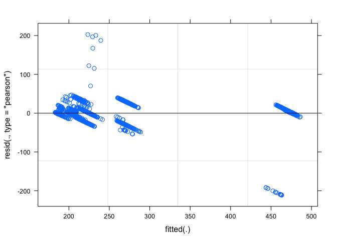<!-- -->

``` r
me_fit2 <- lmer(
    top_ticket_price ~ avg_ticket_price + pct_capacity + (1 + avg_ticket_price | show),
    data = grosses_data
)
summary(me_fit2)
```

    #> Linear mixed model fit by REML ['lmerMod']
    #> Formula: 
    #> top_ticket_price ~ avg_ticket_price + pct_capacity + (1 + avg_ticket_price |  
    #>     show)
    #>    Data: grosses_data
    #> 
    #> REML criterion at convergence: 24077.7
    #> 
    #> Scaled residuals: 
    #>     Min      1Q  Median      3Q     Max 
    #> -8.0769 -0.2734 -0.0181  0.3612  8.2982 
    #> 
    #> Random effects:
    #>  Groups   Name             Variance Std.Dev. Corr
    #>  show     (Intercept)      10009.27 100.046      
    #>           avg_ticket_price    97.17   9.858  0.64
    #>  Residual                    640.12  25.301      
    #> Number of obs: 2585, groups:  show, 5
    #> 
    #> Fixed effects:
    #>                  Estimate Std. Error t value
    #> (Intercept)      269.6487    44.7584   6.025
    #> avg_ticket_price  10.6497     4.5974   2.316
    #> pct_capacity      -1.1108     0.8611  -1.290
    #> 
    #> Correlation of Fixed Effects:
    #>             (Intr) avg_t_
    #> avg_tckt_pr  0.612       
    #> pct_capacty -0.010 -0.125

``` r
plot(me_fit2)
```

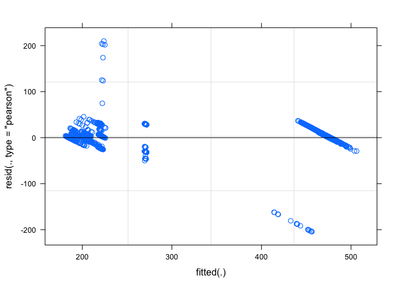<!-- -->

-----

(This is an extension to the above analysis later in the day where I
gave the mixed-effect modeling another look.)

## Data

``` r
dat <- grosses %>%
    filter(avg_ticket_price > 0) %>%
    mutate(year = scale(year(week_ending))[, 1],
           avg_ticket_price = scale(log(avg_ticket_price))[, 1]) %>%
    select(theatre, show, weekly_gross, avg_ticket_price, year)
```

``` r
dat %>%
    sample_n(1000) %>%
    ggplot(aes(x = year, y = avg_ticket_price)) +
    geom_point()
```

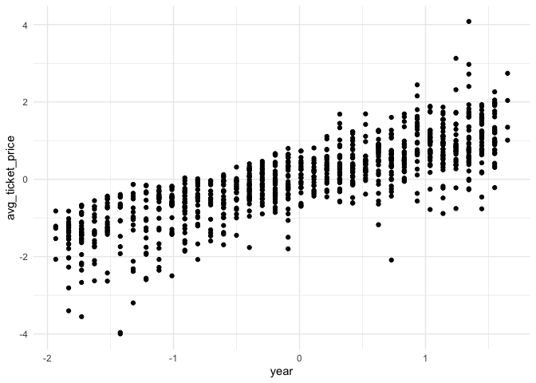<!-- -->

## Linear model

``` r
fit_lm1 <- lm(avg_ticket_price ~ year, data = dat)
summary(fit_lm1)
```

    #> 
    #> Call:
    #> lm(formula = avg_ticket_price ~ year, data = dat)
    #> 
    #> Residuals:
    #>     Min      1Q  Median      3Q     Max 
    #> -6.3088 -0.3291  0.0257  0.3874  2.9832 
    #> 
    #> Coefficients:
    #>               Estimate Std. Error t value Pr(>|t|)    
    #> (Intercept) -6.009e-15  2.612e-03     0.0        1    
    #> year         8.225e-01  2.612e-03   314.8   <2e-16 ***
    #> ---
    #> Signif. codes:  0 '***' 0.001 '**' 0.01 '*' 0.05 '.' 0.1 ' ' 1
    #> 
    #> Residual standard error: 0.5688 on 47397 degrees of freedom
    #> Multiple R-squared:  0.6765, Adjusted R-squared:  0.6765 
    #> F-statistic: 9.913e+04 on 1 and 47397 DF,  p-value: < 2.2e-16

``` r
plot(fit_lm1)
```

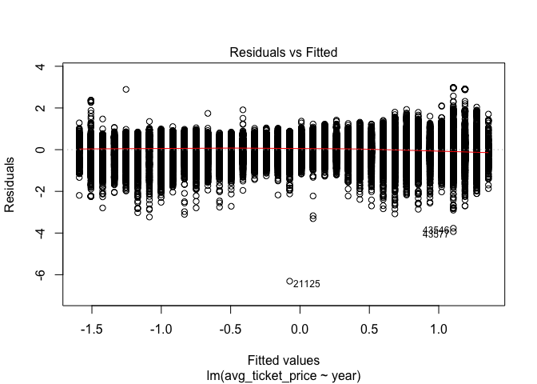<!-- --><!-- -->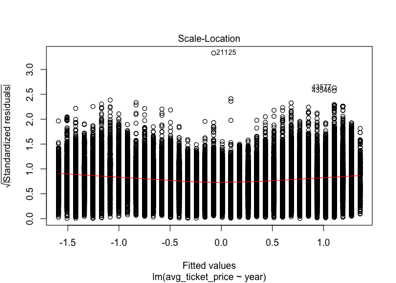<!-- -->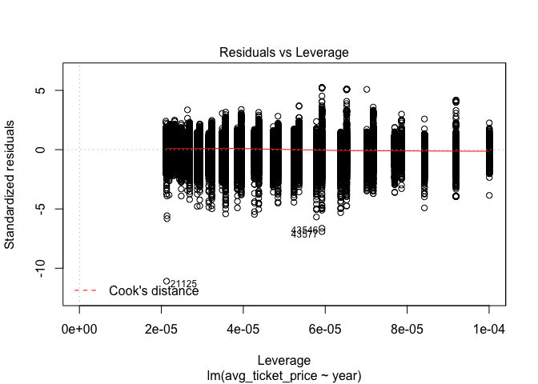<!-- -->

The number of groups to expect from the mixed-effect model.

``` r
x <- dat %>%
    distinct(show, theatre) %>%
    nrow()
glue("Number of show:theatre groups: {x}")
```

    #> Number of show:theatre groups: 1282

``` r
glue("Number of theatre groups: {n_distinct(dat$theatre)}")
```

    #> Number of theatre groups: 58

Mixed-effect model with random intercepts grouping by show.

``` r
fit_me1 <- lmer(avg_ticket_price ~ year + (1 | show),
                data = dat)
summary(fit_me1)
```

    #> Linear mixed model fit by REML ['lmerMod']
    #> Formula: avg_ticket_price ~ year + (1 | show)
    #>    Data: dat
    #> 
    #> REML criterion at convergence: 27555.8
    #> 
    #> Scaled residuals: 
    #>      Min       1Q   Median       3Q      Max 
    #> -17.3851  -0.5888   0.0358   0.6201   8.5547 
    #> 
    #> Random effects:
    #>  Groups   Name        Variance Std.Dev.
    #>  show     (Intercept) 0.42467  0.6517  
    #>  Residual             0.09425  0.3070  
    #> Number of obs: 47399, groups:  show, 1118
    #> 
    #> Fixed effects:
    #>              Estimate Std. Error t value
    #> (Intercept) -0.395575   0.019696  -20.08
    #> year         0.628403   0.002903  216.49
    #> 
    #> Correlation of Fixed Effects:
    #>      (Intr)
    #> year 0.010

``` r
plot(fit_me1)
```

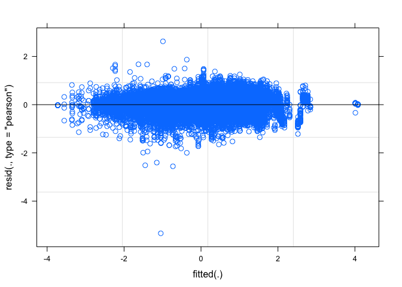<!-- -->

``` r
top_10_shows <- dat %>%
    count(show, sort = TRUE) %>%
    top_n(8, wt = n) %>%
    pull(show)

dat %>%
    mutate(me_pred = predict(fit_me1)) %>%
    filter(show %in% top_10_shows) %>%
    ggplot(aes(x = year, y = avg_ticket_price, color = show)) +
    geom_jitter(size = 0.3, alpha = 0.3, width = 0.02, height = 0.02) +
    geom_line(aes(y = me_pred), size = 0.9, alpha = 0.8, lty = 2) +
    scale_color_brewer(type = "qual", palette = "Dark2") +
    labs(
        x = "year (normalized)",
        y = "average ticket price (normalized)",
        title = "Mixed-effects model with random intercepts",
        color = "show"
    )
```

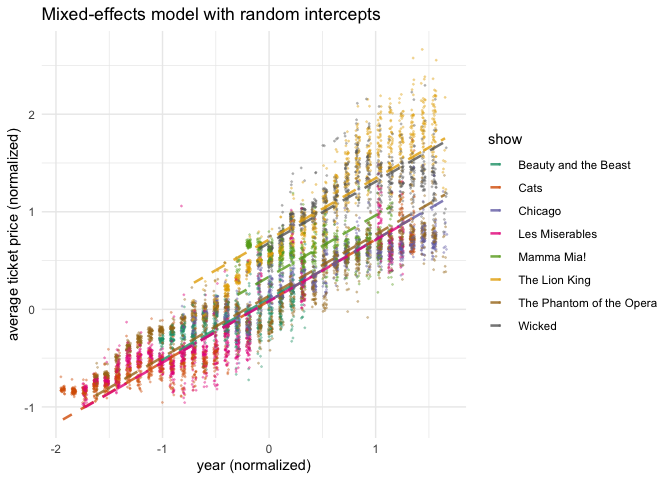<!-- -->

Mixed-effects model with random intercepts and slopes grouping by show.

``` r
fit_me2 <- lmer(avg_ticket_price ~ year + (year | show),
                data = dat)
summary(fit_me2)
```

    #> Linear mixed model fit by REML ['lmerMod']
    #> Formula: avg_ticket_price ~ year + (year | show)
    #>    Data: dat
    #> 
    #> REML criterion at convergence: 12102.8
    #> 
    #> Scaled residuals: 
    #>      Min       1Q   Median       3Q      Max 
    #> -21.2473  -0.4984   0.0498   0.5456  10.2537 
    #> 
    #> Random effects:
    #>  Groups   Name        Variance Std.Dev. Corr 
    #>  show     (Intercept) 1.60747  1.2679        
    #>           year        1.50917  1.2285   -0.38
    #>  Residual             0.06294  0.2509        
    #> Number of obs: 47399, groups:  show, 1118
    #> 
    #> Fixed effects:
    #>             Estimate Std. Error t value
    #> (Intercept) -0.24415    0.04451  -5.486
    #> year         0.33370    0.04785   6.975
    #> 
    #> Correlation of Fixed Effects:
    #>      (Intr)
    #> year -0.307

``` r
plot(fit_me2)
```

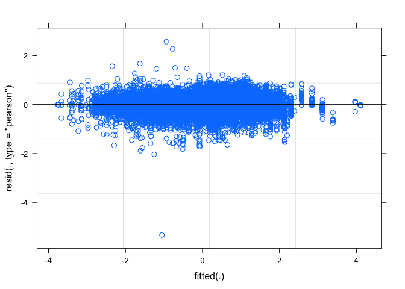<!-- -->

``` r
dat %>%
    mutate(me_pred = predict(fit_me2)) %>%
    filter(show %in% top_10_shows) %>%
    ggplot(aes(x = year, y = avg_ticket_price, color = show)) +
    geom_jitter(size = 0.3, alpha = 0.3, width = 0.02, height = 0.02) +
    geom_line(aes(y = me_pred), size = 0.9, alpha = 0.8, lty = 2) +
    scale_color_brewer(type = "qual", palette = "Dark2") +
    labs(
        x = "year (normalized)",
        y = "average ticket price (normalized)",
        title = "Mixed-effects model with random intercepts and slopes",
        color = "show"
    )
```

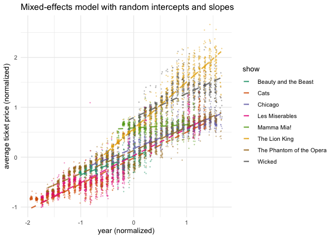<!-- -->
