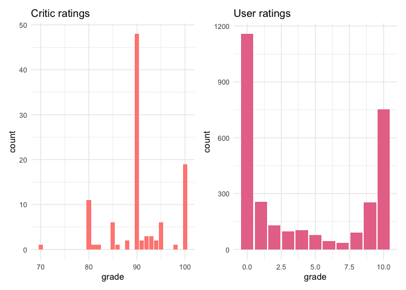
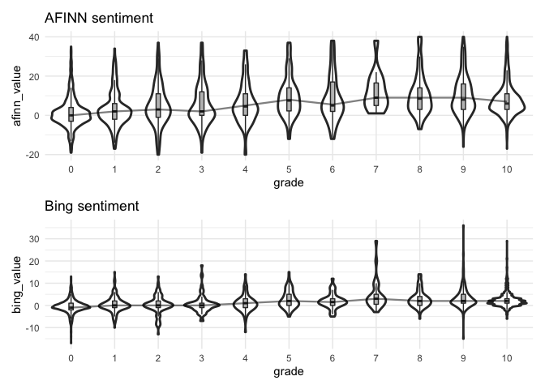
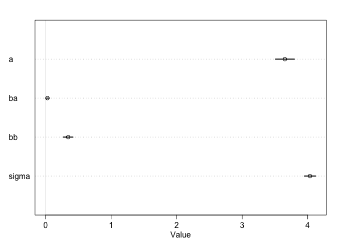
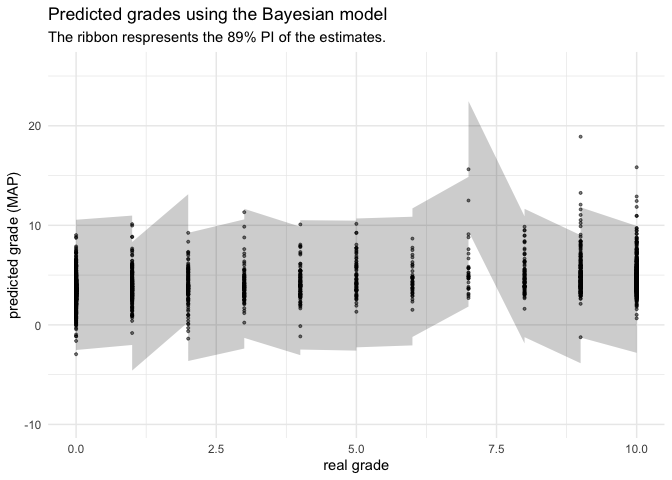
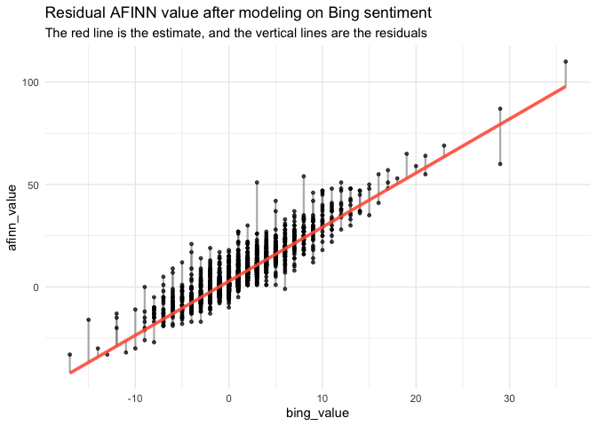
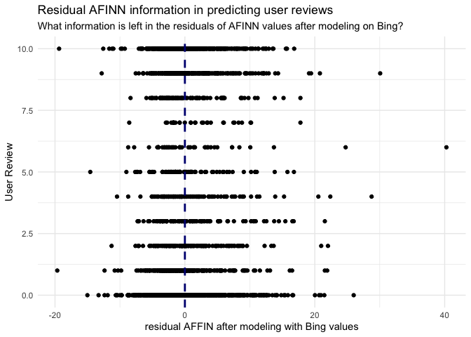
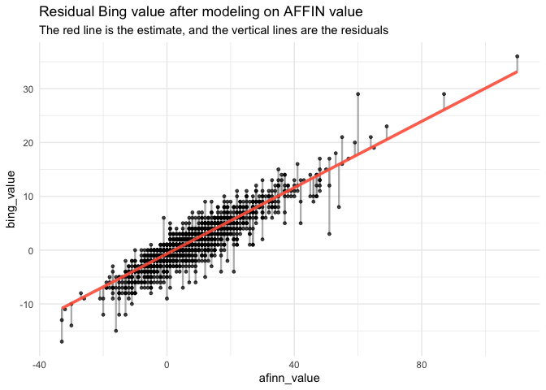
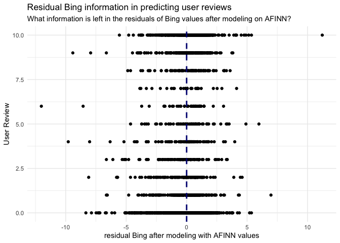
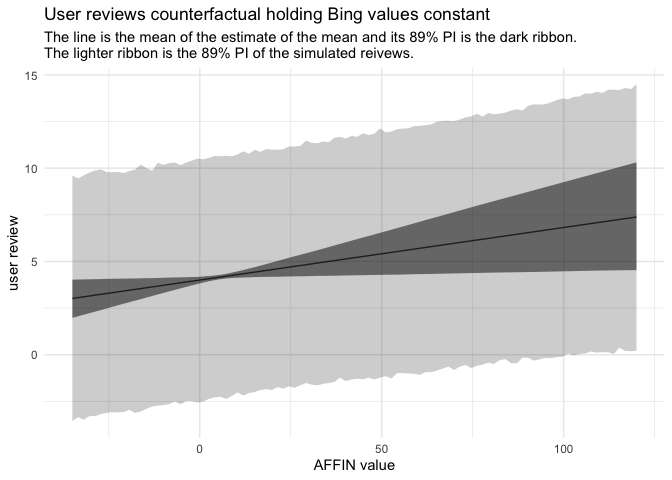
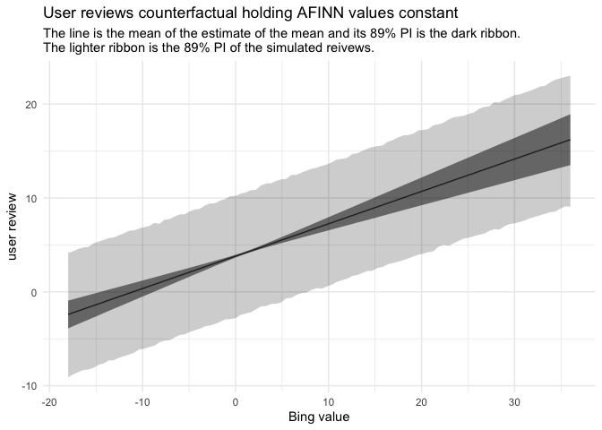

Animal Crossing - New Horizons
================
Joshua Cook
May 5, 2020

Setup
-----

    knitr::opts_chunk$set(echo = TRUE, comment = "#>")

    library(glue)
    library(ggforce)
    library(lubridate)
    library(patchwork)
    library(tidytext)
    library(rethinking)
    library(tidyverse)
    library(conflicted)

    conflict_prefer("filter", "dplyr")

    theme_set(theme_minimal())

Data
----

    critic <- read_tsv(
        "https://raw.githubusercontent.com/rfordatascience/tidytuesday/master/data/2020/2020-05-05/critic.tsv",
        col_types = cols()
    )
    users <- read_tsv(
        "https://raw.githubusercontent.com/rfordatascience/tidytuesday/master/data/2020/2020-05-05/user_reviews.tsv",
        col_types = cols()
    )
    # items <- read_csv(
    #     "https://raw.githubusercontent.com/rfordatascience/tidytuesday/master/data/2020/2020-05-05/items.csv",
    #     col_types = cols()
    # )
    # villagers <- read_csv(
    #     "https://raw.githubusercontent.com/rfordatascience/tidytuesday/master/data/2020/2020-05-05/villagers.csv",
    #     col_types = cols()
    # )

EDA
---

The first plot showed the distribution of cirtic and user reviews. The
former was on a scale of 1 to 100 and the latter on the scale of 1 to
10.

    p1 <- critic %>%
        ggplot(aes(x = grade)) +
        geom_bar(fill = "#FF8A82", color = NA) +
        scale_fill_brewer(palette = "Set2") +
        labs(title = "Critic ratings")
    p2 <- users %>%
        ggplot(aes(x = grade)) +
        geom_bar(fill = "#E87697", color = NA) +
        scale_fill_brewer(palette = "Set2") +
        labs(title = "User ratings")
    p1 | p2

<!-- -->

Sentiment analysis
------------------

To get some numerical values for modeling, I used the ‘tidytext’ and
‘textdata’ packages to perform sentiment analysis on the user reviews.
The AFINN data provides a numeric value for some of the words, so these
were summed up for each review (other metrics such as median could be
useful, too, though I didn’t try that here). The Bing data set is just a
list of “positives” and “negatives”, so the final value for a review was
the number of positives subtracted from the number of negatives.

    sum_bing_sentiments <- function(x) {
        x <- x[!is.na(x)]
        if (length(x) == 0) {
            return(0)
        } else {
            return(sum(x == "positive") - sum(x == "negative"))
        }
    }

    user_text <- users %>%
        unnest_tokens(word, text) %>%
        inner_join(get_sentiments("afinn"), by = "word") %>%
        rename(afinn_value = value) %>%
        left_join(get_sentiments("bing"), by = "word") %>%
        rename(bing_value = sentiment) %>%
        group_by(grade, user_name, date) %>%
        summarise(
            afinn_value = sum(afinn_value),
            bing_value = sum_bing_sentiments(bing_value)
        ) %>%
        ungroup()

    #> `summarise()` regrouping output by 'grade', 'user_name' (override with `.groups` argument)

The following plot showed the trend (maybe) between the two values of
sentiment of the review and the final grade.

    summarised_user_text <- user_text %>%
        mutate(grade = grade + 1) %>%
        group_by(grade) %>%
        summarise(afinn_value = median(afinn_value),
                  bing_value = median(bing_value)) %>%
        ungroup()

    #> `summarise()` ungrouping output (override with `.groups` argument)

    p1 <- user_text %>%
        mutate(grade = factor(grade)) %>%
        ggplot(aes(x = grade, y = afinn_value)) +
        geom_violin(size = 1) +
        geom_boxplot(outlier.shape = NA, width = 0.1, fill = "grey75") +
        geom_line(data = summarised_user_text, 
                  alpha = 0.5, size = 0.8, color = "black") +
        scale_y_continuous(limits = c(-20, 40)) +
        labs(title = "AFINN sentiment")

    p2 <- user_text %>%
        mutate(grade = factor(grade)) %>%
        ggplot(aes(x = grade, y = bing_value)) +
        geom_violin(size = 1) +
        geom_boxplot(outlier.shape = NA, width = 0.1, fill = "grey75") +
        geom_line(data = summarised_user_text, 
                  alpha = 0.5, size = 0.8, color = "black") +
        labs(title = "Bing sentiment")

    p1 / p2

    #> Warning: Removed 46 rows containing non-finite values (stat_ydensity).

    #> Warning: Removed 46 rows containing non-finite values (stat_boxplot).

<!-- -->

Bayesian modeling of grade using review sentiment
-------------------------------------------------

I am still learning how to do Bayesian analysis, so I used the
‘rethinking’ package from the course I am following, [“Statistical
Rethinking”](https://xcelab.net/rm/statistical-rethinking/).

Below is the formula for the model I fit, where *G* is the user’s grade,
*β**A* is the coefficient for the AFINN values, and
*β**B* is the coefficient for the Bing values. The priors are
very uninformative. Looking at the distribution of user reviews, it is
unlikely that I should hade modeled the grades using a normal
distribution. However, because I am still learning about this form of
modeling, I do not know how to use any other distributions. It is fine
for pedagogical purposes.

$$
G\_i \\sim \\text{Normal}(\\mu, \\sigma) \\\\
\\mu = \\alpha + \\beta\_A A\_i + \\beta\_B B\_i \\\\
\\alpha \\sim \\text{Normal}(0, 10) \\\\ 
\\beta\_A \\sim \\text{Normal}(0, 50) \\\\ 
\\beta\_B \\sim \\text{Normal}(0, 50) \\\\ 
\\sigma \\sim \\text{Uniform}(0, 50)
$$

    m1 <- quap(
        alist(
            grade ~ dnorm(mu, sigma),
            mu <- a + ba * afinn_value + bb * bing_value,
            a ~ dnorm(0, 10),
            ba ~ dnorm(0, 50),
            bb ~ dnorm(0, 50),
            sigma ~ dunif(0, 50)
        ),
        data = user_text
    )

    summary(m1)

    #>             mean         sd        5.5%     94.5%
    #> a     3.65214880 0.09019415 3.508001119 3.7962965
    #> ba    0.02765287 0.01579692 0.002406344 0.0528994
    #> bb    0.34314293 0.04628611 0.269168788 0.4171171
    #> sigma 4.03517661 0.05351303 3.949652453 4.1207008

The Bing values seem to be a better indicator of the final grade, though
the error in the posterior (`sigma`) is very high.

    plot(summary(m1))

<!-- -->

Because the model is generative, we can sample from the posterior of the
model using the original data as input (i.e. by not providing an
additional data set to `sim()`). These predictions were compared to the
actual grade in the following plot.

    # A useful function for tidying up the PI values.
    pi_to_df <- function(list_pi) {
        list_pi %>%
            t() %>%
            as.data.frame() %>%
            janitor::clean_names() %>%
            as_tibble()
    }

    # Simulate grades from the original data.
    grade_sim <- sim(m1, n = 1e4)
    grade_sim_MAP <- apply(grade_sim, 2, chainmode)
    grade_sim_pi <- apply(grade_sim, 2, PI) %>% pi_to_df()
    user_text %>%
        bind_cols(grade_sim_pi) %>%
        mutate(grade_sim = grade_sim_MAP) %>%
        ggplot(aes(x = grade, y = grade_sim)) +
        geom_ribbon(aes(ymin = x5_percent, ymax = x94_percent),
                    alpha = 0.2, color = NA, fill = "black") +
        geom_point(color = "black", alpha = 0.5, size = 0.7) +
        labs(x = "real grade", 
             y = "predicted grade (MAP)",
             title = "Predicted grades using the Bayesian model",
             subtitle = "The ribbon respresents the 89% PI of the estimates.")

<!-- -->

### Predictor residual plots

To better understand the effects of each of the predictors, we can
calculate the residuals for each. This involves modeling one predictor
using the other, and then modeling the residual information - that which
is not modeled by the other predictor - on the users reviews. If one
predictor is more informative than the other, then its residuals should
still correlate with the user reviews. This process was repeated for
each predictor.

First, I modeled the AFINN values using the Bing values and plotted the
residuals. The residuals were then compared to the user reviews.

    # Residual of AFINN after accounting for Bing
    m1_afinn_resid <- quap(
        alist(
            afinn_value ~ dnorm(mu, sigma),
            mu <- a + b*bing_value,
            a ~ dnorm(0, 10),
            b ~ dnorm(0, 50),
            sigma ~ dunif(0, 50)
        ),
        data = user_text
    )

    summary(m1_afinn_resid)

    #>           mean         sd     5.5%    94.5%
    #> a     2.809938 0.09321382 2.660965 2.958912
    #> b     2.640003 0.02383918 2.601903 2.678102
    #> sigma 4.790684 0.06353228 4.689147 4.892221

    mu <- coef(m1_afinn_resid)["a"] + coef(m1_afinn_resid)["b"] * user_text$bing_value
    mu_resid <- user_text$afinn_value - mu

    user_text%>%
        mutate(mu = mu,
               resid = mu_resid,
               resid_diff = mu + mu_resid) %>%
        ggplot() +
        geom_linerange(aes(x = bing_value, 
                           ymin = mu, ymax = resid_diff),
                       size = 0.8, color = "grey60", alpha = 0.7) +
        geom_point(aes(x = bing_value, y = afinn_value),
                   color = "black", size = 1, alpha = 0.7) +
        geom_line(aes(x = bing_value, y = mu),
                  color = "tomato", size = 1.3, alpha = 0.9) +
        labs(title = "Residual AFINN value after modeling on Bing sentiment",
             subtitle = "The red line is the estimate, and the vertical lines are the residuals")

<!-- -->

    user_text %>%
        mutate(mu = mu,
               resid = mu_resid) %>%
        ggplot() +
        geom_point(aes(x = resid, y = grade)) +
        geom_vline(xintercept = 0, color = "navy", size = 1, lty = 2) +
        labs(x = "residual AFFIN after modeling with Bing values",
             y = "User Review",
             title = "Residual AFINN information in predicting user reviews",
             subtitle = "What information is left in the residuals of AFINN values after modeling on Bing?")

<!-- -->

The same process was repeated, but this time I modeled the Bing values
on the AFINN values.

    # Residual of Bing after accounting for AFINN
    m1_bing_resid <- quap(
        alist(
            bing_value ~ dnorm(mu, sigma),
            mu <- a + b*afinn_value,
            a ~ dnorm(0, 10),
            b ~ dnorm(0, 50),
            sigma ~ dunif(0, 50)
        ),
        data = user_text
    )

    summary(m1_bing_resid)

    #>             mean          sd       5.5%      94.5%
    #> a     -0.6680589 0.034332192 -0.7229284 -0.6131894
    #> b      0.3075033 0.002776768  0.3030654  0.3119411
    #> sigma  1.6350123 0.021682863  1.6003589  1.6696657

    mu <- coef(m1_bing_resid)["a"] + coef(m1_bing_resid)["b"] * user_text$afinn_value
    mu_resid <- user_text$bing_value - mu

    user_text%>%
        mutate(mu = mu,
               resid = mu_resid,
               resid_diff = mu + mu_resid) %>%
        ggplot() +
        geom_linerange(aes(x = afinn_value, 
                           ymin = mu, ymax = resid_diff),
                       size = 0.8, color = "grey60", alpha = 0.7) +
        geom_point(aes(x = afinn_value, y = bing_value),
                   color = "black", size = 1, alpha = 0.7) +
        geom_line(aes(x = afinn_value, y = mu),
                  color = "tomato", size = 1.3, alpha = 0.9) +
        labs(title = "Residual Bing value after modeling on AFFIN value",
             subtitle = "The red line is the estimate, and the vertical lines are the residuals")

<!-- -->

    user_text %>%
        mutate(mu = mu,
               resid = mu_resid) %>%
        ggplot() +
        geom_point(aes(x = resid, y = grade)) +
        geom_vline(xintercept = 0, color = "navy", size = 1, lty = 2) +
        labs(x = "residual Bing after modeling with AFINN values",
             y = "User Review",
             title = "Residual Bing information in predicting user reviews",
             subtitle = "What information is left in the residuals of Bing values after modeling on AFINN?")

<!-- -->

### Counterfactual plots

Because a Bayesian model is necessarily generative, we can plot the
implied prediction of the model on data it has never seen. I did this by
holding one variable constant and seeing how changing the other effected
the model’s predictions.

First, I held the Bing values constant at the average, and then varied
the AFINN values across their range.

    # Hold Bing constant
    bing_avg <- mean(user_text$bing_value)
    afinn_seq <- seq(-35, 120, length.out = 100)
    pred_data <- tibble(afinn_value = afinn_seq,
                        bing_value = bing_avg)

    mu <- link(m1, data = pred_data)
    mu_mean <- apply(mu, 2, mean)
    mu_pi <- apply(mu, 2, PI) %>% 
        pi_to_df() %>%
        set_names(c("mu_low_pi", "mu_high_pi"))

    grade_sim <- sim(m1, data = pred_data, n = 1e4)
    grade_pi <- apply(grade_sim, 2, PI) %>% 
        pi_to_df() %>%
        set_names(c("grade_low_pi", "grade_high_pi"))

    pred_data %>%
        mutate(mu = mu_mean) %>%
        bind_cols(mu_pi, grade_pi) %>%
        ggplot(aes(x = afinn_value)) +
        geom_ribbon(aes(ymin = grade_low_pi, ymax = grade_high_pi),
                    fill = "black", alpha = 0.2, color = NA) +
        geom_ribbon(aes(ymin = mu_low_pi, ymax = mu_high_pi),
                    fill = "black", alpha = 0.5, color = NA) +
        geom_line(aes(y = mu_mean), lty = 1, color = "black", alpha = 0.7) +
        labs(x = "AFFIN value",
             y = "user review",
             title = "User reviews counterfactual holding Bing values constant",
             subtitle = "The line is the mean of the estimate of the mean and its 89% PI is the dark ribbon.
    The lighter ribbon is the 89% PI of the simulated reivews.")

<!-- -->

I repeated this, but holding the AFINN values at the average and varying
the Bing values.

    # Hold AFINN constant
    afinn_avg <- mean(user_text$afinn_value)
    bing_seq <- seq(-18, 36, length.out = 100)
    pred_data <- tibble(afinn_value = afinn_avg,
                        bing_value = bing_seq)

    # A useful function for tidying up the PI values.
    pi_to_df <- function(list_pi) {
        list_pi %>%
            t() %>%
            as.data.frame() %>%
            janitor::clean_names() %>%
            as_tibble()
    }

    mu <- link(m1, data = pred_data)
    mu_mean <- apply(mu, 2, mean)
    mu_pi <- apply(mu, 2, PI) %>% 
        pi_to_df() %>%
        set_names(c("mu_low_pi", "mu_high_pi"))

    grade_sim <- sim(m1, data = pred_data, n = 1e4)
    grade_pi <- apply(grade_sim, 2, PI) %>% 
        pi_to_df() %>%
        set_names(c("grade_low_pi", "grade_high_pi"))

    pred_data %>%
        mutate(mu = mu_mean) %>%
        bind_cols(mu_pi, grade_pi) %>%
        ggplot(aes(x = bing_value)) +
        geom_ribbon(aes(ymin = grade_low_pi, ymax = grade_high_pi),
                    fill = "black", alpha = 0.2, color = NA) +
        geom_ribbon(aes(ymin = mu_low_pi, ymax = mu_high_pi),
                    fill = "black", alpha = 0.5, color = NA) +
        geom_line(aes(y = mu_mean), lty = 1, color = "black", alpha = 0.7) +
        labs(x = "Bing value",
             y = "user review",
             title = "User reviews counterfactual holding AFINN values constant",
             subtitle = "The line is the mean of the estimate of the mean and its 89% PI is the dark ribbon.
    The lighter ribbon is the 89% PI of the simulated reivews.")

<!-- -->

------------------------------------------------------------------------

Conclusions
-----------

The model was crap, but the practice on multivariate modeling using
Bayesian analysis was good.
