Volcano Eruptions
================
Joshua Cook
May 12, 2020

## Setup

``` r
knitr::opts_chunk$set(echo = TRUE, comment = "#>")

library(glue)
library(naniar)
library(lubridate)
library(patchwork)
library(magrittr)
library(easystats)
```

    ## # Attaching packages
    ## ✔ insight     0.8.3   ✔ bayestestR  0.6.0
    ## ✔ performance 0.4.6   ✔ parameters  0.6.1
    ## ✔ see         0.5.0   ✔ effectsize  0.3.0
    ## ✔ correlation 0.2.1   ✔ modelbased  0.1.2
    ## 
    ## Warnings or errors in CRAN checks for package(s) 'insight', 'effectsize'.

``` r
library(MASS)
library(tidyverse)
library(conflicted)

conflict_prefer("filter", "dplyr")
conflict_prefer("select", "dplyr")

theme_set(theme_minimal())
```

## Data

``` r
volcano <- read_csv("https://raw.githubusercontent.com/rfordatascience/tidytuesday/master/data/2020/2020-05-12/volcano.csv")
```

    #> Parsed with column specification:
    #> cols(
    #>   .default = col_character(),
    #>   volcano_number = col_double(),
    #>   latitude = col_double(),
    #>   longitude = col_double(),
    #>   elevation = col_double(),
    #>   population_within_5_km = col_double(),
    #>   population_within_10_km = col_double(),
    #>   population_within_30_km = col_double(),
    #>   population_within_100_km = col_double()
    #> )

    #> See spec(...) for full column specifications.

``` r
eruptions <- read_csv("https://raw.githubusercontent.com/rfordatascience/tidytuesday/master/data/2020/2020-05-12/eruptions.csv")
```

    #> Parsed with column specification:
    #> cols(
    #>   volcano_number = col_double(),
    #>   volcano_name = col_character(),
    #>   eruption_number = col_double(),
    #>   eruption_category = col_character(),
    #>   area_of_activity = col_character(),
    #>   vei = col_double(),
    #>   start_year = col_double(),
    #>   start_month = col_double(),
    #>   start_day = col_double(),
    #>   evidence_method_dating = col_character(),
    #>   end_year = col_double(),
    #>   end_month = col_double(),
    #>   end_day = col_double(),
    #>   latitude = col_double(),
    #>   longitude = col_double()
    #> )

``` r
# events <- read_csv("https://raw.githubusercontent.com/rfordatascience/tidytuesday/master/data/2020/2020-05-12/events.csv")
# tree_rings <- read_csv("https://raw.githubusercontent.com/rfordatascience/tidytuesday/master/data/2020/2020-05-12/tree_rings.csv")
# sulfur <- read_csv("https://raw.githubusercontent.com/rfordatascience/tidytuesday/master/data/2020/2020-05-12/sulfur.csv")


volcano %<>% janitor::clean_names()
eruptions %<>% janitor::clean_names()
```

Filter only for rows with Volcano Explosivity Index (VEI) values and an
eurption category that shows the eruption was confirmed. Transform the
date information into `date` objects and measure the duration of the
eruptions.

``` r
eruption_data <- eruptions %>%
    filter(!is.na(vei) & !is.na(eruption_category)) %>%
    filter(eruption_category == "Confirmed Eruption") %>%
    filter(!is.na(start_day) & start_day > 0 & start_year > 1000) %>%
    filter(!is.na(end_day) & end_day > 0) %>%
    mutate(start_date = paste(start_year, start_month, start_day, sep = "-"),
           start_date = ymd(start_date),
           end_date = paste(end_year, end_month, end_day, sep = "-"),
           end_date = ymd(end_date),
           duration = end_date - start_date) %>%
    select(volcano_number:vei, latitude:duration)
eruption_data
```

    #> # A tibble: 3,178 x 11
    #>    volcano_number volcano_name eruption_number eruption_catego… area_of_activity
    #>             <dbl> <chr>                  <dbl> <chr>            <chr>           
    #>  1         241040 Whakaari/Wh…           22338 Confirmed Erupt… 1978/90 Crater …
    #>  2         284096 Nishinoshima           22340 Confirmed Erupt… <NA>            
    #>  3         243070 Lateiki                22334 Confirmed Erupt… <NA>            
    #>  4         290240 Sarychev Pe…           22320 Confirmed Erupt… <NA>            
    #>  5         263310 Tengger Cal…           22306 Confirmed Erupt… Bromo           
    #>  6         256010 Tinakula               22313 Confirmed Erupt… <NA>            
    #>  7         267020 Karangetang            22294 Confirmed Erupt… <NA>            
    #>  8         357040 Planchon-Pe…           22297 Confirmed Erupt… <NA>            
    #>  9         282050 Kuchinoerab…           22296 Confirmed Erupt… <NA>            
    #> 10         268060 Gamalama               22295 Confirmed Erupt… <NA>            
    #> # … with 3,168 more rows, and 6 more variables: vei <dbl>, latitude <dbl>,
    #> #   longitude <dbl>, start_date <date>, end_date <date>, duration <drtn>

``` r
volcano_data <- volcano %>%
    select(volcano_name, volcano_number, primary_volcano_type, country, 
           tectonic_settings, major_rock_1) %>%
    distinct()
```

``` r
eruption_data <- inner_join(eruption_data, volcano_data, 
                by = c("volcano_number", "volcano_name"))
```

``` r
miss_var_summary(eruption_data)
```

    #> # A tibble: 15 x 3
    #>    variable             n_miss pct_miss
    #>    <chr>                 <int>    <dbl>
    #>  1 area_of_activity       1233     45.4
    #>  2 volcano_number            0      0  
    #>  3 volcano_name              0      0  
    #>  4 eruption_number           0      0  
    #>  5 eruption_category         0      0  
    #>  6 vei                       0      0  
    #>  7 latitude                  0      0  
    #>  8 longitude                 0      0  
    #>  9 start_date                0      0  
    #> 10 end_date                  0      0  
    #> 11 duration                  0      0  
    #> 12 primary_volcano_type      0      0  
    #> 13 country                   0      0  
    #> 14 tectonic_settings         0      0  
    #> 15 major_rock_1              0      0

## EDA

``` r
eruption_counts <- eruption_data %>%
    count(volcano_name, sort = TRUE)

eruption_data %>%
    filter(volcano_name %in% eruption_counts$volcano_name[1:10]) %>%
    ggplot(aes(x = vei, y = volcano_name)) +
    geom_jitter(height = 0.2, alpha = 0.5) +
    theme(
        legend.position = "none"
    ) +
    labs(x = "volcano explosivity index",
         y = NULL,
         title = "Explosivity of the top-10 most frequently erupting volcanoes")
```

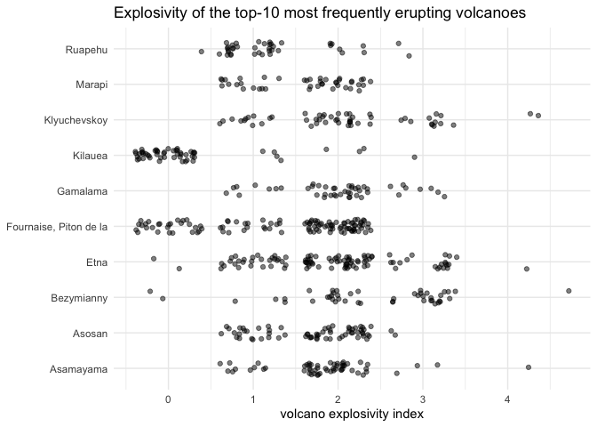<!-- -->

``` r
eruption_data %>%
    ggplot(aes(x = log(as.numeric(duration) + 1))) +
    facet_wrap(~ vei) +
    geom_density() +
    labs(x = "number of days (log + 1)",
         y = "density",
         title = "Duration of eruptions, separated by VEI")
```

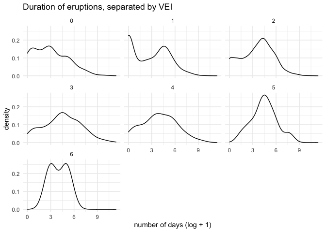<!-- -->

## Modeling

Below, I made a few linear models and played around with the functions
provided by the ‘easystats’ suite of packages. I didn’t do any focussed
analysis, I just wanted to see what was available in these pacakges.

``` r
scale_nums <- function(x) {
    (x - mean(x)) / sd(x)
}

d <- eruption_data %>%
    mutate(days_dur = as.numeric(duration)) %>%
    select(volcano_name, volcano_number, eruption_number,
           vei, latitude, longitude, days_dur,
           primary_volcano_type, tectonic_settings, major_rock_1) %>%
    distinct() %>%
    mutate(log_days = log(days_dur + 1),
           vei = scale_nums(vei),
           latitude = scale_nums(latitude),
           longitude = scale_nums(longitude))
```

``` r
m1 <- lm(log_days ~ vei, data = d)

model_parameters(m1)
```

    #> Parameter   | Coefficient |   SE |       95% CI |     t |   df |      p
    #> -----------------------------------------------------------------------
    #> (Intercept) |        3.48 | 0.04 | [3.39, 3.56] | 82.05 | 2712 | < .001
    #> vei         |        0.49 | 0.04 | [0.40, 0.57] | 11.46 | 2712 | < .001

``` r
model_performance(m1)
```

    #> # Indices of model performance
    #> 
    #>      AIC |      BIC |   R2 | R2_adjusted | RMSE
    #> -----------------------------------------------
    #> 12006.21 | 12023.93 | 0.05 |        0.05 | 2.21

``` r
check_model(m1)
```

    #> Not enough model terms in the conditional part of the model to check for multicollinearity.

    #> `geom_smooth()` using formula 'y ~ x'
    #> `geom_smooth()` using formula 'y ~ x'

    #> Warning in simpleLoess(y, x, w, span, degree = degree, parametric =
    #> parametric, : pseudoinverse used at 2.5049

    #> Warning in simpleLoess(y, x, w, span, degree = degree, parametric =
    #> parametric, : neighborhood radius 1.0564

    #> Warning in simpleLoess(y, x, w, span, degree = degree, parametric =
    #> parametric, : reciprocal condition number 1.2802e-14

    #> `geom_smooth()` using formula 'y ~ x'

    #> Warning in simpleLoess(y, x, w, span, degree = degree, parametric =
    #> parametric, : pseudoinverse used at 2.5049

    #> Warning in simpleLoess(y, x, w, span, degree = degree, parametric =
    #> parametric, : neighborhood radius 1.0564

    #> Warning in simpleLoess(y, x, w, span, degree = degree, parametric =
    #> parametric, : reciprocal condition number 1.2802e-14

    #> `stat_bin()` using `bins = 30`. Pick better value with `binwidth`.

    #> Warning: Removed 2714 rows containing missing values (geom_text_repel).

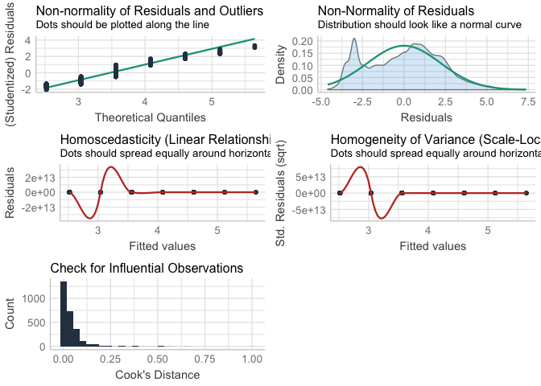<!-- -->

``` r
m2 <- lm(log_days ~ vei + tectonic_settings + major_rock_1, 
         data = d)

model_parameters(m2)
```

    #> Parameter                                                           | Coefficient |   SE |        95% CI |     t |   df |      p
    #> --------------------------------------------------------------------------------------------------------------------------------
    #> (Intercept)                                                         |        3.01 | 0.64 | [ 1.75, 4.28] |  4.68 | 2694 | < .001
    #> vei                                                                 |        0.47 | 0.04 | [ 0.38, 0.55] | 10.44 | 2694 | < .001
    #> tectonic_settings [Intraplate / Intermediate crust (15-25 km)]      |       -1.09 | 1.05 | [-3.15, 0.97] | -1.03 | 2694 | 0.301 
    #> tectonic_settings [Intraplate / Oceanic crust (< 15 km)]            |        0.09 | 0.66 | [-1.20, 1.38] |  0.14 | 2694 | 0.889 
    #> tectonic_settings [Rift zone / Continental crust (>25 km)]          |       -0.24 | 0.72 | [-1.65, 1.18] | -0.33 | 2694 | 0.744 
    #> tectonic_settings [Rift zone / Intermediate crust (15-25 km)]       |       -0.17 | 1.09 | [-2.32, 1.98] | -0.15 | 2694 | 0.877 
    #> tectonic_settings [Rift zone / Oceanic crust (< 15 km)]             |        0.01 | 0.68 | [-1.33, 1.36] |  0.02 | 2694 | 0.985 
    #> tectonic_settings [Subduction zone / Continental crust (>25 km)]    |        0.25 | 0.64 | [-1.01, 1.50] |  0.38 | 2694 | 0.702 
    #> tectonic_settings [Subduction zone / Crustal thickness unknown]     |        0.57 | 0.68 | [-0.75, 1.90] |  0.85 | 2694 | 0.396 
    #> tectonic_settings [Subduction zone / Intermediate crust (15-25 km)] |        0.01 | 0.67 | [-1.31, 1.33] |  0.02 | 2694 | 0.988 
    #> tectonic_settings [Subduction zone / Oceanic crust (< 15 km)]       |        0.05 | 0.66 | [-1.24, 1.34] |  0.08 | 2694 | 0.935 
    #> major_rock_1 [Basalt / Picro-Basalt]                                |        0.43 | 0.10 | [ 0.22, 0.63] |  4.13 | 2694 | < .001
    #> major_rock_1 [Dacite]                                               |        0.93 | 0.33 | [ 0.29, 1.58] |  2.86 | 2694 | 0.004 
    #> major_rock_1 [Foidite]                                              |        2.70 | 0.63 | [ 1.47, 3.94] |  4.30 | 2694 | < .001
    #> major_rock_1 [Phono-tephrite /  Tephri-phonolite]                   |        3.07 | 0.50 | [ 2.09, 4.06] |  6.10 | 2694 | < .001
    #> major_rock_1 [Phonolite]                                            |        1.61 | 0.91 | [-0.16, 3.39] |  1.78 | 2694 | 0.075 
    #> major_rock_1 [Rhyolite]                                             |       -0.60 | 0.46 | [-1.50, 0.30] | -1.30 | 2694 | 0.193 
    #> major_rock_1 [Trachyandesite / Basaltic Trachyandesite]             |       -0.33 | 0.30 | [-0.92, 0.26] | -1.10 | 2694 | 0.270 
    #> major_rock_1 [Trachybasalt / Tephrite Basanite]                     |        1.12 | 0.19 | [ 0.74, 1.50] |  5.82 | 2694 | < .001
    #> major_rock_1 [Trachyte / Trachydacite]                              |       -0.53 | 0.72 | [-1.95, 0.89] | -0.73 | 2694 | 0.466

``` r
model_performance(m2)
```

    #> # Indices of model performance
    #> 
    #>      AIC |      BIC |   R2 | R2_adjusted | RMSE
    #> -----------------------------------------------
    #> 11929.42 | 12053.45 | 0.09 |        0.08 | 2.16

``` r
check_model(m2)
```

    #> `geom_smooth()` using formula 'y ~ x'
    #> `geom_smooth()` using formula 'y ~ x'
    #> `geom_smooth()` using formula 'y ~ x'

    #> `stat_bin()` using `bins = 30`. Pick better value with `binwidth`.

    #> Warning: Removed 2714 rows containing missing values (geom_text_repel).

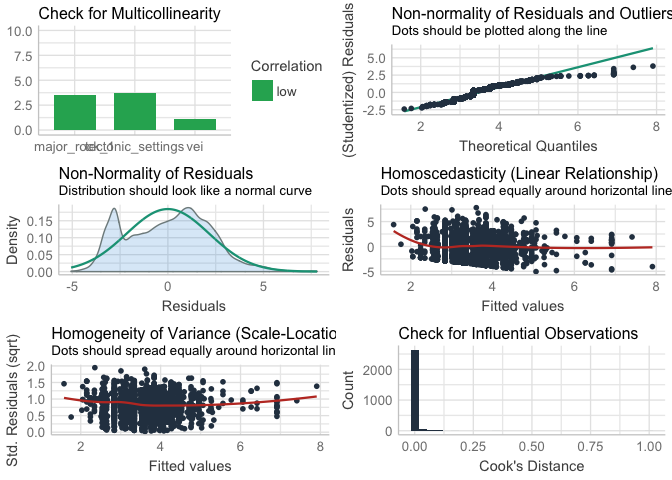<!-- -->

``` r
m3 <- lm(log_days ~ vei + latitude*longitude, data = d)

model_parameters(m3)
```

    #> Parameter            | Coefficient |   SE |         95% CI |     t |   df |      p
    #> ----------------------------------------------------------------------------------
    #> (Intercept)          |        3.48 | 0.04 | [ 3.40,  3.56] | 82.21 | 2709 | < .001
    #> vei                  |        0.50 | 0.04 | [ 0.42,  0.58] | 11.74 | 2709 | < .001
    #> latitude             |       -0.05 | 0.04 | [-0.13,  0.04] | -1.14 | 2709 | 0.256 
    #> longitude            |       -0.14 | 0.04 | [-0.23, -0.06] | -3.32 | 2709 | < .001
    #> latitude * longitude |        0.06 | 0.04 | [-0.02,  0.14] |  1.42 | 2709 | 0.154

``` r
model_performance(m3)
```

    #> # Indices of model performance
    #> 
    #>      AIC |      BIC |   R2 | R2_adjusted | RMSE
    #> -----------------------------------------------
    #> 11999.47 | 12034.91 | 0.05 |        0.05 | 2.20

``` r
check_model(m3)
```

    #> `geom_smooth()` using formula 'y ~ x'
    #> `geom_smooth()` using formula 'y ~ x'
    #> `geom_smooth()` using formula 'y ~ x'

    #> `stat_bin()` using `bins = 30`. Pick better value with `binwidth`.

    #> Warning: Removed 2714 rows containing missing values (geom_text_repel).

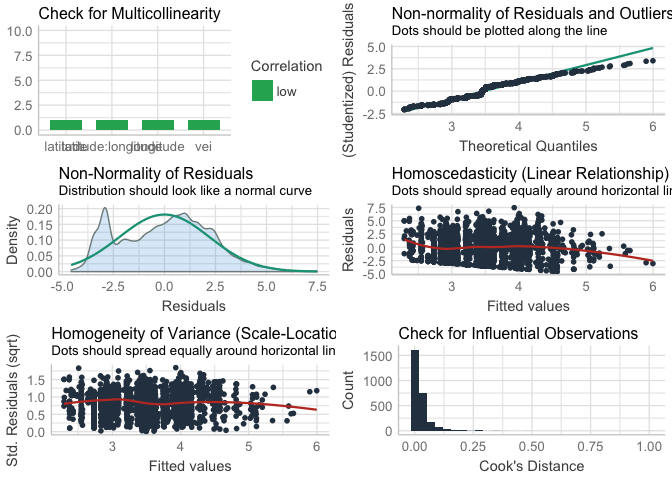<!-- -->

``` r
m4 <- lm(log_days ~ vei + latitude + longitude, data = d)

model_parameters(m4)
```

    #> Parameter   | Coefficient |   SE |         95% CI |     t |   df |      p
    #> -------------------------------------------------------------------------
    #> (Intercept) |        3.48 | 0.04 | [ 3.40,  3.56] | 82.18 | 2710 | < .001
    #> vei         |        0.50 | 0.04 | [ 0.42,  0.58] | 11.71 | 2710 | < .001
    #> latitude    |       -0.05 | 0.04 | [-0.13,  0.04] | -1.10 | 2710 | 0.271 
    #> longitude   |       -0.13 | 0.04 | [-0.22, -0.05] | -3.11 | 2710 | 0.002

``` r
model_performance(m4)
```

    #> # Indices of model performance
    #> 
    #>      AIC |      BIC |   R2 | R2_adjusted | RMSE
    #> -----------------------------------------------
    #> 11999.51 | 12029.04 | 0.05 |        0.05 | 2.20

``` r
check_model(m4)
```

    #> `geom_smooth()` using formula 'y ~ x'
    #> `geom_smooth()` using formula 'y ~ x'
    #> `geom_smooth()` using formula 'y ~ x'

    #> `stat_bin()` using `bins = 30`. Pick better value with `binwidth`.

    #> Warning: Removed 2714 rows containing missing values (geom_text_repel).

<!-- -->

``` r
m5 <- lm(log_days ~ vei + tectonic_settings + major_rock_1 + latitude*longitude, 
         data = d)

model_parameters(m5)
```

    #> Parameter                                                           | Coefficient |   SE |        95% CI |     t |   df |      p
    #> --------------------------------------------------------------------------------------------------------------------------------
    #> (Intercept)                                                         |        2.92 | 0.64 | [ 1.66, 4.18] |  4.53 | 2691 | < .001
    #> vei                                                                 |        0.47 | 0.04 | [ 0.38, 0.56] | 10.52 | 2691 | < .001
    #> tectonic_settings [Intraplate / Intermediate crust (15-25 km)]      |       -1.02 | 1.05 | [-3.08, 1.04] | -0.97 | 2691 | 0.333 
    #> tectonic_settings [Intraplate / Oceanic crust (< 15 km)]            |        0.13 | 0.66 | [-1.15, 1.42] |  0.21 | 2691 | 0.837 
    #> tectonic_settings [Rift zone / Continental crust (>25 km)]          |       -0.20 | 0.72 | [-1.62, 1.21] | -0.28 | 2691 | 0.779 
    #> tectonic_settings [Rift zone / Intermediate crust (15-25 km)]       |       -0.03 | 1.10 | [-2.18, 2.11] | -0.03 | 2691 | 0.976 
    #> tectonic_settings [Rift zone / Oceanic crust (< 15 km)]             |        0.20 | 0.69 | [-1.15, 1.56] |  0.30 | 2691 | 0.767 
    #> tectonic_settings [Subduction zone / Continental crust (>25 km)]    |        0.35 | 0.64 | [-0.91, 1.62] |  0.55 | 2691 | 0.581 
    #> tectonic_settings [Subduction zone / Crustal thickness unknown]     |        0.74 | 0.68 | [-0.59, 2.07] |  1.09 | 2691 | 0.277 
    #> tectonic_settings [Subduction zone / Intermediate crust (15-25 km)] |        0.22 | 0.68 | [-1.11, 1.55] |  0.33 | 2691 | 0.744 
    #> tectonic_settings [Subduction zone / Oceanic crust (< 15 km)]       |        0.16 | 0.66 | [-1.13, 1.46] |  0.25 | 2691 | 0.804 
    #> major_rock_1 [Basalt / Picro-Basalt]                                |        0.37 | 0.11 | [ 0.17, 0.58] |  3.54 | 2691 | < .001
    #> major_rock_1 [Dacite]                                               |        0.95 | 0.33 | [ 0.31, 1.59] |  2.91 | 2691 | 0.004 
    #> major_rock_1 [Foidite]                                              |        2.69 | 0.63 | [ 1.46, 3.93] |  4.28 | 2691 | < .001
    #> major_rock_1 [Phono-tephrite /  Tephri-phonolite]                   |        3.12 | 0.51 | [ 2.12, 4.11] |  6.16 | 2691 | < .001
    #> major_rock_1 [Phonolite]                                            |        1.67 | 0.91 | [-0.11, 3.44] |  1.84 | 2691 | 0.066 
    #> major_rock_1 [Rhyolite]                                             |       -0.53 | 0.46 | [-1.44, 0.38] | -1.14 | 2691 | 0.254 
    #> major_rock_1 [Trachyandesite / Basaltic Trachyandesite]             |       -0.34 | 0.30 | [-0.93, 0.25] | -1.12 | 2691 | 0.264 
    #> major_rock_1 [Trachybasalt / Tephrite Basanite]                     |        1.13 | 0.19 | [ 0.75, 1.51] |  5.80 | 2691 | < .001
    #> major_rock_1 [Trachyte / Trachydacite]                              |       -0.62 | 0.73 | [-2.04, 0.80] | -0.86 | 2691 | 0.391 
    #> latitude                                                            |       -0.08 | 0.04 | [-0.16, 0.01] | -1.71 | 2691 | 0.087 
    #> longitude                                                           |       -0.09 | 0.05 | [-0.18, 0.00] | -1.92 | 2691 | 0.054 
    #> latitude * longitude                                                |        0.05 | 0.04 | [-0.03, 0.14] |  1.25 | 2691 | 0.211

``` r
model_performance(m5)
```

    #> # Indices of model performance
    #> 
    #>      AIC |      BIC |   R2 | R2_adjusted | RMSE
    #> -----------------------------------------------
    #> 11928.22 | 12069.97 | 0.09 |        0.08 | 2.16

``` r
check_model(m5)
```

    #> `geom_smooth()` using formula 'y ~ x'
    #> `geom_smooth()` using formula 'y ~ x'
    #> `geom_smooth()` using formula 'y ~ x'

    #> `stat_bin()` using `bins = 30`. Pick better value with `binwidth`.

    #> Warning: Removed 2714 rows containing missing values (geom_text_repel).

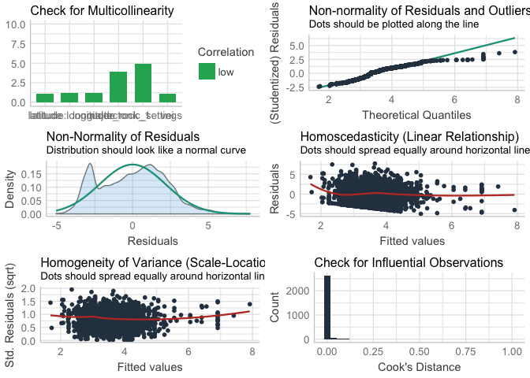<!-- -->

``` r
compare_performance(m1, m2, m3, m4, m5)
```

    #> # Comparison of Model Performance Indices
    #> 
    #> Model | Type |      AIC |      BIC |   R2 | R2_adjusted | RMSE |   BF
    #> ---------------------------------------------------------------------
    #> m1    |   lm | 12006.21 | 12023.93 | 0.05 |        0.05 | 2.21 |     
    #> m2    |   lm | 11929.42 | 12053.45 | 0.09 |        0.08 | 2.16 | 0.00
    #> m3    |   lm | 11999.47 | 12034.91 | 0.05 |        0.05 | 2.20 | 0.00
    #> m4    |   lm | 11999.51 | 12029.04 | 0.05 |        0.05 | 2.20 | 0.08
    #> m5    |   lm | 11928.22 | 12069.97 | 0.09 |        0.08 | 2.16 | 0.00

``` r
plot(compare_performance(m1, m2, m3, m4, m5))
```

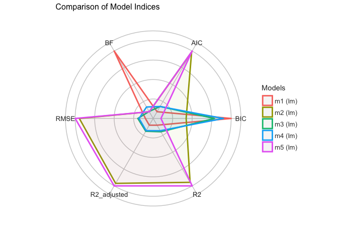<!-- -->

From the ‘insight’ package.

``` r
get_parameters(m5)
```

    #>                                                           Parameter    Estimate
    #> 1                                                       (Intercept)  2.92042068
    #> 2                                                               vei  0.46871664
    #> 3       tectonic_settingsIntraplate / Intermediate crust (15-25 km) -1.01693976
    #> 4             tectonic_settingsIntraplate / Oceanic crust (< 15 km)  0.13478189
    #> 5           tectonic_settingsRift zone / Continental crust (>25 km) -0.20208759
    #> 6        tectonic_settingsRift zone / Intermediate crust (15-25 km) -0.03323086
    #> 7              tectonic_settingsRift zone / Oceanic crust (< 15 km)  0.20492509
    #> 8     tectonic_settingsSubduction zone / Continental crust (>25 km)  0.35466045
    #> 9      tectonic_settingsSubduction zone / Crustal thickness unknown  0.73823468
    #> 10 tectonic_settingsSubduction zone / Intermediate crust (15-25 km)  0.22138590
    #> 11       tectonic_settingsSubduction zone / Oceanic crust (< 15 km)  0.16380840
    #> 12                                major_rock_1Basalt / Picro-Basalt  0.37373473
    #> 13                                               major_rock_1Dacite  0.95219775
    #> 14                                              major_rock_1Foidite  2.69285100
    #> 15                   major_rock_1Phono-tephrite /  Tephri-phonolite  3.11793036
    #> 16                                            major_rock_1Phonolite  1.66859809
    #> 17                                             major_rock_1Rhyolite -0.53061655
    #> 18             major_rock_1Trachyandesite / Basaltic Trachyandesite -0.33592439
    #> 19                     major_rock_1Trachybasalt / Tephrite Basanite  1.12672479
    #> 20                              major_rock_1Trachyte / Trachydacite -0.62177058
    #> 21                                                         latitude -0.07577908
    #> 22                                                        longitude -0.08848633
    #> 23                                               latitude:longitude  0.05331920

``` r
find_algorithm(m5)
```

    #> $algorithm
    #> [1] "OLS"

``` r
find_formula(m5)
```

    #> $conditional
    #> log_days ~ vei + tectonic_settings + major_rock_1 + latitude * 
    #>     longitude

From the ‘parameters’ package.

``` r
select_parameters(m5) %>%
    model_parameters()
```

    #> Parameter                                               | Coefficient |   SE |        95% CI |     t |   df |      p
    #> --------------------------------------------------------------------------------------------------------------------
    #> (Intercept)                                             |        3.25 | 0.06 | [ 3.14, 3.36] | 56.51 | 2702 | < .001
    #> vei                                                     |        0.47 | 0.04 | [ 0.39, 0.56] | 11.11 | 2702 | < .001
    #> major_rock_1 [Basalt / Picro-Basalt]                    |        0.35 | 0.09 | [ 0.17, 0.53] |  3.81 | 2702 | < .001
    #> major_rock_1 [Dacite]                                   |        0.91 | 0.33 | [ 0.27, 1.55] |  2.78 | 2702 | 0.005 
    #> major_rock_1 [Foidite]                                  |        1.93 | 0.45 | [ 1.05, 2.80] |  4.31 | 2702 | < .001
    #> major_rock_1 [Phono-tephrite /  Tephri-phonolite]       |        3.15 | 0.50 | [ 2.16, 4.14] |  6.23 | 2702 | < .001
    #> major_rock_1 [Phonolite]                                |        1.38 | 0.89 | [-0.36, 3.12] |  1.55 | 2702 | 0.121 
    #> major_rock_1 [Rhyolite]                                 |       -0.73 | 0.46 | [-1.63, 0.16] | -1.60 | 2702 | 0.109 
    #> major_rock_1 [Trachyandesite / Basaltic Trachyandesite] |       -0.29 | 0.30 | [-0.88, 0.29] | -0.98 | 2702 | 0.329 
    #> major_rock_1 [Trachybasalt / Tephrite Basanite]         |        1.03 | 0.17 | [ 0.69, 1.37] |  5.94 | 2702 | < .001
    #> major_rock_1 [Trachyte / Trachydacite]                  |       -0.68 | 0.69 | [-2.04, 0.67] | -0.99 | 2702 | 0.322 
    #> latitude                                                |       -0.07 | 0.04 | [-0.16, 0.01] | -1.73 | 2702 | 0.083

Try to improve model 5 using the `stepAIC()` algorithm from the ‘MASS’
package.

``` r
m6 <- stepAIC(m5)
```

    #> Start:  AIC=4224.22
    #> log_days ~ vei + tectonic_settings + major_rock_1 + latitude * 
    #>     longitude
    #> 
    #>                      Df Sum of Sq   RSS    AIC
    #> - tectonic_settings   9     47.73 12701 4216.4
    #> - latitude:longitude  1      7.34 12661 4223.8
    #> <none>                            12653 4224.2
    #> - major_rock_1        9    443.53 13097 4299.7
    #> - vei                 1    520.44 13174 4331.6
    #> 
    #> Step:  AIC=4216.44
    #> log_days ~ vei + major_rock_1 + latitude + longitude + latitude:longitude
    #> 
    #>                      Df Sum of Sq   RSS    AIC
    #> - latitude:longitude  1      7.94 12709 4216.1
    #> <none>                            12701 4216.4
    #> - major_rock_1        9    462.34 13164 4295.5
    #> - vei                 1    586.69 13288 4337.0
    #> 
    #> Step:  AIC=4216.13
    #> log_days ~ vei + major_rock_1 + latitude + longitude
    #> 
    #>                Df Sum of Sq   RSS    AIC
    #> - longitude     1      7.87 12717 4215.8
    #> <none>                      12709 4216.1
    #> - latitude      1     14.56 12724 4217.2
    #> - major_rock_1  9    464.27 13173 4295.5
    #> - vei           1    586.25 13295 4336.5
    #> 
    #> Step:  AIC=4215.81
    #> log_days ~ vei + major_rock_1 + latitude
    #> 
    #>                Df Sum of Sq   RSS    AIC
    #> <none>                      12717 4215.8
    #> - latitude      1     14.12 12731 4216.8
    #> - major_rock_1  9    503.57 13220 4303.2
    #> - vei           1    580.74 13298 4335.0

``` r
compare_performance(m5, m6)
```

    #> # Comparison of Model Performance Indices
    #> 
    #> Model | Type |      AIC |      BIC |   R2 | R2_adjusted | RMSE |               BF
    #> ---------------------------------------------------------------------------------
    #> m5    |   lm | 11928.22 | 12069.97 | 0.09 |        0.08 | 2.16 |                 
    #> m6    |   lm | 11919.81 | 11996.59 | 0.08 |        0.08 | 2.17 | 8572328093770506

``` r
plot(compare_performance(m5, m6))
```

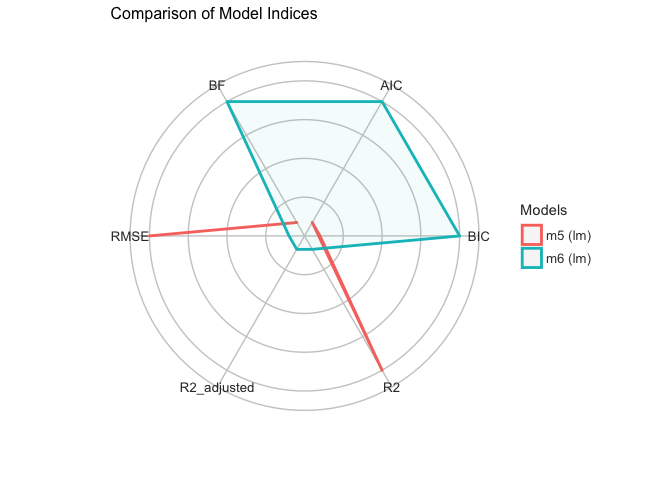<!-- -->

## Mixed effect model

``` r
library(lme4)
```

    #> Loading required package: Matrix

    #> 
    #> Attaching package: 'Matrix'

    #> The following objects are masked from 'package:tidyr':
    #> 
    #>     expand, pack, unpack

``` r
me1 <- lmer(log_days ~ 1 + vei + (1|volcano_name), data = d)

summary(me1)
```

    #> Linear mixed model fit by REML ['lmerMod']
    #> Formula: log_days ~ 1 + vei + (1 | volcano_name)
    #>    Data: d
    #> 
    #> REML criterion at convergence: 11805.7
    #> 
    #> Scaled residuals: 
    #>      Min       1Q   Median       3Q      Max 
    #> -2.62492 -0.77958  0.08182  0.70941  3.11422 
    #> 
    #> Random effects:
    #>  Groups       Name        Variance Std.Dev.
    #>  volcano_name (Intercept) 0.9551   0.9773  
    #>  Residual                 4.1143   2.0284  
    #> Number of obs: 2714, groups:  volcano_name, 311
    #> 
    #> Fixed effects:
    #>             Estimate Std. Error t value
    #> (Intercept)  3.43773    0.07985  43.054
    #> vei          0.43424    0.04637   9.365
    #> 
    #> Correlation of Fixed Effects:
    #>     (Intr)
    #> vei -0.067

``` r
check_model(me1)
```

    #> Not enough model terms in the conditional part of the model to check for multicollinearity.

    #> `geom_smooth()` using formula 'y ~ x'
    #> `geom_smooth()` using formula 'y ~ x'
    #> `geom_smooth()` using formula 'y ~ x'

    #> `stat_bin()` using `bins = 30`. Pick better value with `binwidth`.

    #> Warning: Removed 2703 rows containing missing values (geom_text_repel).

    #> `geom_smooth()` using formula 'y ~ x'

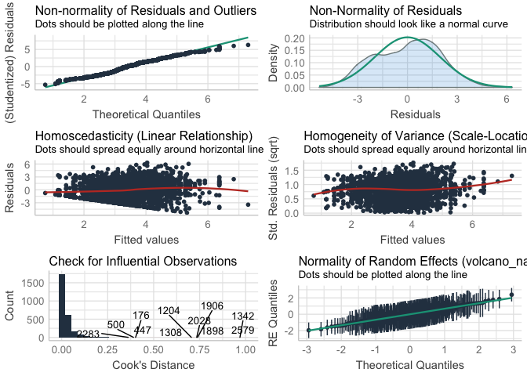<!-- -->

``` r
me2 <- lmer(log_days ~ vei + (1|tectonic_settings/volcano_name), data = d)

summary(me2)
```

    #> Linear mixed model fit by REML ['lmerMod']
    #> Formula: log_days ~ vei + (1 | tectonic_settings/volcano_name)
    #>    Data: d
    #> 
    #> REML criterion at convergence: 11805.6
    #> 
    #> Scaled residuals: 
    #>      Min       1Q   Median       3Q      Max 
    #> -2.62453 -0.77931  0.08103  0.71142  3.12389 
    #> 
    #> Random effects:
    #>  Groups                         Name        Variance Std.Dev.
    #>  volcano_name:tectonic_settings (Intercept) 0.95469  0.9771  
    #>  tectonic_settings              (Intercept) 0.01176  0.1085  
    #>  Residual                                   4.11264  2.0280  
    #> Number of obs: 2714, groups:  
    #> volcano_name:tectonic_settings, 311; tectonic_settings, 10
    #> 
    #> Fixed effects:
    #>             Estimate Std. Error t value
    #> (Intercept)  3.47534    0.10071  34.507
    #> vei          0.43665    0.04643   9.404
    #> 
    #> Correlation of Fixed Effects:
    #>     (Intr)
    #> vei -0.034

``` r
check_model(me2)
```

    #> Not enough model terms in the conditional part of the model to check for multicollinearity.

    #> `geom_smooth()` using formula 'y ~ x'
    #> `geom_smooth()` using formula 'y ~ x'
    #> `geom_smooth()` using formula 'y ~ x'

    #> `stat_bin()` using `bins = 30`. Pick better value with `binwidth`.

    #> Warning: Removed 2703 rows containing missing values (geom_text_repel).

    #> `geom_smooth()` using formula 'y ~ x'

    #> `geom_smooth()` using formula 'y ~ x'

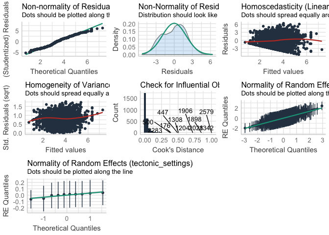<!-- -->

``` r
me3 <- lmer(log_days ~ vei + (vei|volcano_name), data = d)

summary(me3)
```

    #> Linear mixed model fit by REML ['lmerMod']
    #> Formula: log_days ~ vei + (vei | volcano_name)
    #>    Data: d
    #> 
    #> REML criterion at convergence: 11794.1
    #> 
    #> Scaled residuals: 
    #>      Min       1Q   Median       3Q      Max 
    #> -2.55005 -0.75240  0.07251  0.70557  3.15814 
    #> 
    #> Random effects:
    #>  Groups       Name        Variance Std.Dev. Corr 
    #>  volcano_name (Intercept) 0.8838   0.9401        
    #>               vei         0.1650   0.4063   -0.21
    #>  Residual                 4.0237   2.0059        
    #> Number of obs: 2714, groups:  volcano_name, 311
    #> 
    #> Fixed effects:
    #>             Estimate Std. Error t value
    #> (Intercept)  3.44543    0.07935  43.422
    #> vei          0.48014    0.05745   8.357
    #> 
    #> Correlation of Fixed Effects:
    #>     (Intr)
    #> vei -0.146

``` r
check_model(me3)
```

    #> Not enough model terms in the conditional part of the model to check for multicollinearity.

    #> `geom_smooth()` using formula 'y ~ x'
    #> `geom_smooth()` using formula 'y ~ x'
    #> `geom_smooth()` using formula 'y ~ x'

    #> `stat_bin()` using `bins = 30`. Pick better value with `binwidth`.

    #> Warning: Removed 2693 rows containing missing values (geom_text_repel).

    #> `geom_smooth()` using formula 'y ~ x'

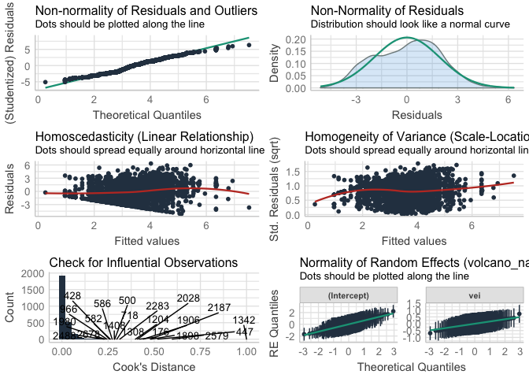<!-- -->

``` r
me4 <- lmer(log_days ~ vei + (1|tectonic_settings), data = d)

summary(me4)
```

    #> Linear mixed model fit by REML ['lmerMod']
    #> Formula: log_days ~ vei + (1 | tectonic_settings)
    #>    Data: d
    #> 
    #> REML criterion at convergence: 12008.6
    #> 
    #> Scaled residuals: 
    #>     Min      1Q  Median      3Q     Max 
    #> -2.0927 -0.8669  0.0774  0.7177  3.3495 
    #> 
    #> Random effects:
    #>  Groups            Name        Variance Std.Dev.
    #>  tectonic_settings (Intercept) 0.03206  0.1791  
    #>  Residual                      4.86689  2.2061  
    #> Number of obs: 2714, groups:  tectonic_settings, 10
    #> 
    #> Fixed effects:
    #>             Estimate Std. Error t value
    #> (Intercept)  3.51802    0.09234   38.10
    #> vei          0.49474    0.04374   11.31
    #> 
    #> Correlation of Fixed Effects:
    #>     (Intr)
    #> vei 0.046

``` r
check_model(me4)
```

    #> Not enough model terms in the conditional part of the model to check for multicollinearity.

    #> `geom_smooth()` using formula 'y ~ x'
    #> `geom_smooth()` using formula 'y ~ x'
    #> `geom_smooth()` using formula 'y ~ x'

    #> `stat_bin()` using `bins = 30`. Pick better value with `binwidth`.

    #> Warning: Removed 2714 rows containing missing values (geom_text_repel).

    #> `geom_smooth()` using formula 'y ~ x'

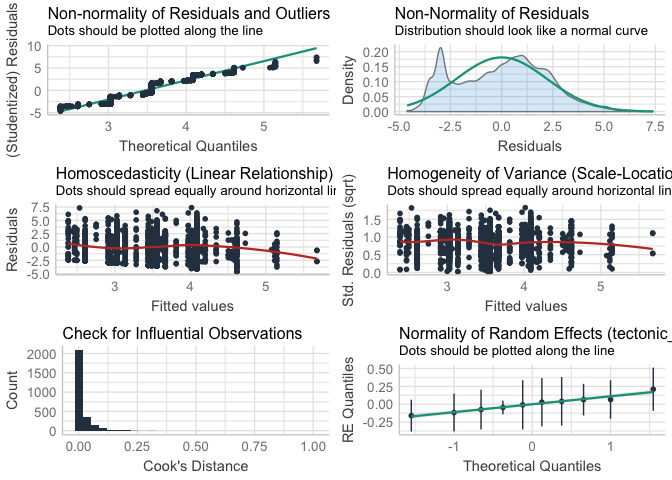<!-- -->

``` r
compare_performance(me1, me2, me3, me4)
```

    #> # Comparison of Model Performance Indices
    #> 
    #> Model |    Type |      AIC |      BIC | R2_conditional | R2_marginal |  ICC | RMSE |   BF
    #> -----------------------------------------------------------------------------------------
    #> me1   | lmerMod | 11813.74 | 11837.36 |           0.22 |        0.04 | 0.19 | 1.97 |     
    #> me2   | lmerMod | 11815.60 | 11845.13 |           0.22 |        0.04 | 0.19 | 1.97 | 0.02
    #> me3   | lmerMod | 11806.06 | 11841.49 |           0.24 |        0.04 | 0.21 | 1.93 | 0.13
    #> me4   | lmerMod | 12016.58 | 12040.21 |           0.05 |        0.05 | 0.01 | 2.20 | 0.00

``` r
anova(me1, me2, me3, me4)
```

    #> refitting model(s) with ML (instead of REML)

    #> Data: d
    #> Models:
    #> me1: log_days ~ 1 + vei + (1 | volcano_name)
    #> me4: log_days ~ vei + (1 | tectonic_settings)
    #> me2: log_days ~ vei + (1 | tectonic_settings/volcano_name)
    #> me3: log_days ~ vei + (vei | volcano_name)
    #>     npar   AIC   BIC  logLik deviance   Chisq Df Pr(>Chisq)    
    #> me1    4 11806 11830 -5899.1    11798                          
    #> me4    4 12008 12032 -6000.1    12000   0.000  0  1.0000000    
    #> me2    5 11808 11838 -5899.1    11798 201.999  1  < 2.2e-16 ***
    #> me3    6 11799 11834 -5893.5    11787  11.286  1  0.0007811 ***
    #> ---
    #> Signif. codes:  0 '***' 0.001 '**' 0.01 '*' 0.05 '.' 0.1 ' ' 1

``` r
volcanos_to_plot <- d %>%
    count(volcano_name) %>%
    top_n(9, wt = n) %>%
    pull(volcano_name)

d %>%
    mutate(pred = predict(me3)) %>%
    filter(volcano_name %in% volcanos_to_plot) %>%
    ggplot(aes(x = vei, color = volcano_name)) +
    geom_jitter(aes(y = log_days), width = 0.2, alpha = 0.5, size = 0.7) +
    geom_line(aes(y = pred), size = 1.2) +
    scale_color_brewer(palette = "Set1") +
    labs(x = "volcanic explosivity index",
         y = "days of eruption (log + 1)",
         title = "Mixed effects model of eruption duration regressed on volcanic explosivity",
         subtitle = "Each volcano was a random effect with a separate intercept and slope.")
```

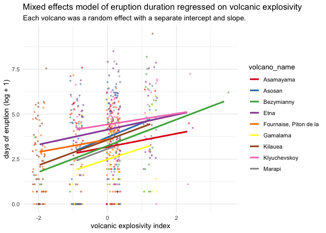<!-- -->

``` r
summary(me3)
```

    #> Linear mixed model fit by REML ['lmerMod']
    #> Formula: log_days ~ vei + (vei | volcano_name)
    #>    Data: d
    #> 
    #> REML criterion at convergence: 11794.1
    #> 
    #> Scaled residuals: 
    #>      Min       1Q   Median       3Q      Max 
    #> -2.55005 -0.75240  0.07251  0.70557  3.15814 
    #> 
    #> Random effects:
    #>  Groups       Name        Variance Std.Dev. Corr 
    #>  volcano_name (Intercept) 0.8838   0.9401        
    #>               vei         0.1650   0.4063   -0.21
    #>  Residual                 4.0237   2.0059        
    #> Number of obs: 2714, groups:  volcano_name, 311
    #> 
    #> Fixed effects:
    #>             Estimate Std. Error t value
    #> (Intercept)  3.44543    0.07935  43.422
    #> vei          0.48014    0.05745   8.357
    #> 
    #> Correlation of Fixed Effects:
    #>     (Intr)
    #> vei -0.146

``` r
head(coefficients(me3)$volcano_name)
```

    #>             (Intercept)       vei
    #> Acatenango     3.685401 0.4887285
    #> Adatarayama    2.683387 0.6173177
    #> Agua de Pau    2.905458 0.3993362
    #> Agung          3.823879 0.5535186
    #> Ahyi           3.292905 0.5395400
    #> Aira           3.857587 0.8666356

``` r
ggeffects::ggpredict(me3, terms = "vei") %>%
    ggplot(aes(x = x , y = predicted)) +
    geom_ribbon(aes(ymin = predicted - std.error, ymax = predicted + std.error),
                alpha = 0.2) +
    geom_line(size = 1.3, lty = 2, color = "skyblue4") +
    geom_jitter(data = d, aes(x = vei, y = log_days, color = volcano_name), 
                size = 0.3, alpha = 0.4) +
    theme(legend.position = "none") +
    labs(x = "volcanic explosivity index",
         y = "days of eruption (log + 1)",
         title = "Mixed effects model predictions",
         subtitle = "Each volcano was a random effect with a separate intercept and slope.")
```

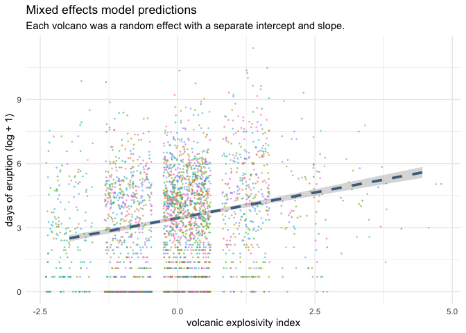<!-- -->

``` r
stargazer::stargazer(me3, type = "text", digits = 3, digit.separator = "")
```

    #> 
    #> ===============================================
    #>                         Dependent variable:    
    #>                     ---------------------------
    #>                              log_days          
    #> -----------------------------------------------
    #> vei                          0.480***          
    #>                               (0.057)          
    #>                                                
    #> Constant                     3.445***          
    #>                               (0.079)          
    #>                                                
    #> -----------------------------------------------
    #> Observations                   2714            
    #> Log Likelihood               -5897.029         
    #> Akaike Inf. Crit.            11806.060         
    #> Bayesian Inf. Crit.          11841.490         
    #> ===============================================
    #> Note:               *p<0.1; **p<0.05; ***p<0.01
