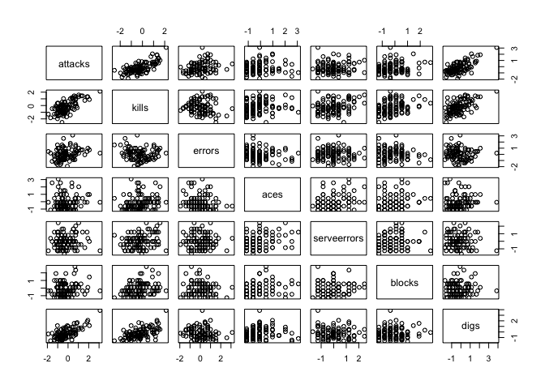
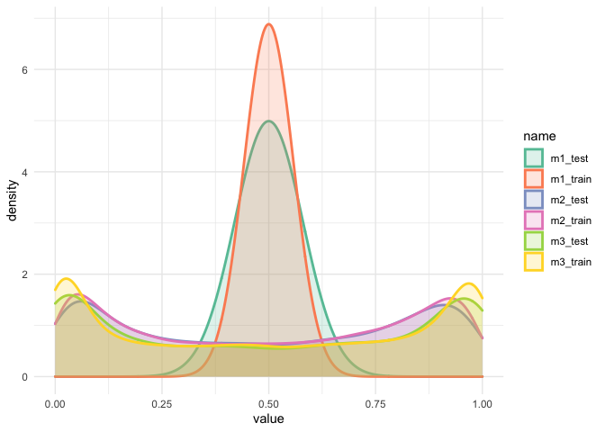
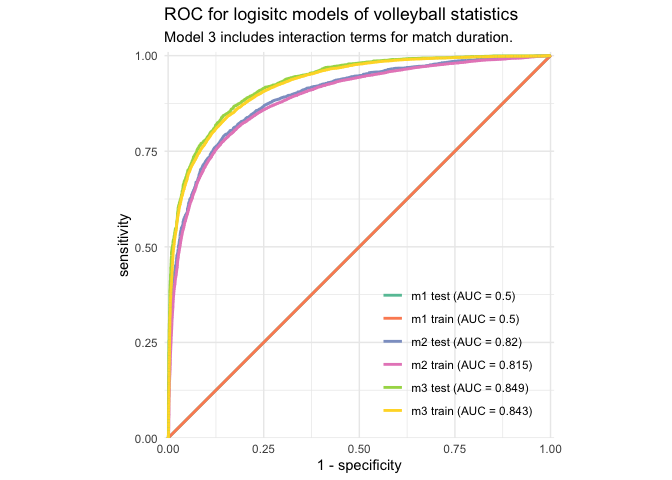

Beach Volleyball
================
Joshua Cook
May 19, 2020

## Setup

``` r
knitr::opts_chunk$set(echo = TRUE, comment = "#>")

library(glue)
library(naniar)
library(lubridate)
library(patchwork)
library(magrittr)
library(broom)
library(yardstick)
library(tidyverse)
library(conflicted)

conflict_prefer("filter", "dplyr")
conflict_prefer("select", "dplyr")

theme_set(theme_minimal())
```

## Data

``` r
vb_matches <- read_csv(
    "https://raw.githubusercontent.com/rfordatascience/tidytuesday/master/data/2020/2020-05-19/vb_matches.csv",
    guess_max = 76000,
    col_types = cols()
) %>%
    janitor::clean_names()
```

## EDA

``` r
skimr::skim(vb_matches)
```

|                                                  |             |
| :----------------------------------------------- | :---------- |
| Name                                             | vb\_matches |
| Number of rows                                   | 76756       |
| Number of columns                                | 65          |
| \_\_\_\_\_\_\_\_\_\_\_\_\_\_\_\_\_\_\_\_\_\_\_   |             |
| Column type frequency:                           |             |
| character                                        | 17          |
| Date                                             | 5           |
| difftime                                         | 1           |
| numeric                                          | 42          |
| \_\_\_\_\_\_\_\_\_\_\_\_\_\_\_\_\_\_\_\_\_\_\_\_ |             |
| Group variables                                  | None        |

Data summary

**Variable type: character**

| skim\_variable | n\_missing | complete\_rate | min | max | empty | n\_unique | whitespace |
| :------------- | ---------: | -------------: | --: | --: | ----: | --------: | ---------: |
| circuit        |          0 |           1.00 |   3 |   4 |     0 |         2 |          0 |
| tournament     |          0 |           1.00 |   3 |  22 |     0 |       177 |          0 |
| country        |          0 |           1.00 |   4 |  22 |     0 |        51 |          0 |
| gender         |          0 |           1.00 |   1 |   1 |     0 |         2 |          0 |
| w\_player1     |          0 |           1.00 |   6 |  29 |     0 |      3388 |          0 |
| w\_p1\_country |         12 |           1.00 |   4 |  20 |     0 |        85 |          0 |
| w\_player2     |          0 |           1.00 |   5 |  30 |     0 |      3431 |          0 |
| w\_p2\_country |          5 |           1.00 |   4 |  20 |     0 |        87 |          0 |
| w\_rank        |        148 |           1.00 |   1 |   7 |     0 |       812 |          0 |
| l\_player1     |          0 |           1.00 |   5 |  29 |     0 |      5713 |          0 |
| l\_p1\_country |         18 |           1.00 |   4 |  20 |     0 |       109 |          0 |
| l\_player2     |          0 |           1.00 |   5 |  30 |     0 |      5689 |          0 |
| l\_p2\_country |         10 |           1.00 |   4 |  20 |     0 |       111 |          0 |
| l\_rank        |       1240 |           0.98 |   1 |   7 |     0 |       837 |          0 |
| score          |         22 |           1.00 |   4 |  25 |     0 |      6624 |          0 |
| bracket        |          0 |           1.00 |   6 |  21 |     0 |        36 |          0 |
| round          |       4939 |           0.94 |   7 |   8 |     0 |        10 |          0 |

**Variable type: Date**

| skim\_variable   | n\_missing | complete\_rate | min        | max        | median     | n\_unique |
| :--------------- | ---------: | -------------: | :--------- | :--------- | :--------- | --------: |
| date             |          0 |           1.00 | 2000-09-16 | 2019-08-29 | 2009-08-25 |       658 |
| w\_p1\_birthdate |        383 |           1.00 | 1953-06-13 | 2004-07-15 | 1981-10-30 |      2805 |
| w\_p2\_birthdate |        408 |           0.99 | 1952-10-11 | 2004-06-08 | 1981-10-15 |      2847 |
| l\_p1\_birthdate |       1059 |           0.99 | 1953-06-13 | 2004-12-01 | 1982-03-28 |      4236 |
| l\_p2\_birthdate |        959 |           0.99 | 1949-12-04 | 2004-08-12 | 1982-03-20 |      4282 |

**Variable type: difftime**

| skim\_variable | n\_missing | complete\_rate | min      | max       | median   | n\_unique |
| :------------- | ---------: | -------------: | :------- | :-------- | :------- | --------: |
| duration       |       2249 |           0.97 | 120 secs | 8040 secs | 00:42:00 |       108 |

**Variable type: numeric**

| skim\_variable            | n\_missing | complete\_rate |    mean |    sd |      p0 |     p25 |     p50 |     p75 |    p100 | hist  |
| :------------------------ | ---------: | -------------: | ------: | ----: | ------: | ------: | ------: | ------: | ------: | :---- |
| year                      |          0 |           1.00 | 2010.29 |  5.48 | 2000.00 | 2006.00 | 2009.00 | 2015.00 | 2019.00 | ▃▇▆▅▇ |
| match\_num                |          0 |           1.00 |   31.84 | 23.55 |    1.00 |   13.00 |   27.00 |   47.00 |  137.00 | ▇▅▂▁▁ |
| w\_p1\_age                |        383 |           1.00 |   28.73 |  5.05 |   13.55 |   25.01 |   28.34 |   32.05 |   59.86 | ▂▇▃▁▁ |
| w\_p1\_hgt                |       3966 |           0.95 |   73.71 |  3.64 |   63.00 |   71.00 |   74.00 |   76.00 |   85.00 | ▁▅▇▃▁ |
| w\_p2\_age                |        408 |           0.99 |   28.83 |  4.85 |   13.41 |   25.30 |   28.60 |   31.95 |   52.40 | ▁▇▆▁▁ |
| w\_p2\_hgt                |       4016 |           0.95 |   73.73 |  3.69 |   61.00 |   71.00 |   74.00 |   76.00 |   85.00 | ▁▃▇▆▁ |
| l\_p1\_age                |       1059 |           0.99 |   28.34 |  5.26 |   13.23 |   24.54 |   27.94 |   31.68 |   60.86 | ▂▇▂▁▁ |
| l\_p1\_hgt                |       6988 |           0.91 |   73.40 |  3.62 |   61.00 |   71.00 |   73.00 |   76.00 |   85.00 | ▁▃▇▅▁ |
| l\_p2\_age                |        959 |           0.99 |   28.37 |  5.12 |   13.41 |   24.71 |   28.01 |   31.58 |   67.76 | ▂▇▁▁▁ |
| l\_p2\_hgt                |       6983 |           0.91 |   73.52 |  3.65 |   61.00 |   71.00 |   74.00 |   76.00 |   85.00 | ▁▃▇▅▁ |
| w\_p1\_tot\_attacks       |      62178 |           0.19 |   25.89 | 10.00 |    0.00 |   19.00 |   24.00 |   32.00 |  142.00 | ▇▅▁▁▁ |
| w\_p1\_tot\_kills         |      62178 |           0.19 |   14.73 |  5.34 |    0.00 |   11.00 |   14.00 |   18.00 |   40.00 | ▂▇▅▁▁ |
| w\_p1\_tot\_errors        |      62413 |           0.19 |    2.90 |  2.27 |    0.00 |    1.00 |    2.00 |    4.00 |   32.00 | ▇▁▁▁▁ |
| w\_p1\_tot\_hitpct        |      62185 |           0.19 |    0.48 |  0.23 |  \-0.70 |    0.38 |    0.48 |    0.58 |   20.00 | ▇▁▁▁▁ |
| w\_p1\_tot\_aces          |      60560 |           0.21 |    1.32 |  1.45 |    0.00 |    0.00 |    1.00 |    2.00 |   14.00 | ▇▂▁▁▁ |
| w\_p1\_tot\_serve\_errors |      62417 |           0.19 |    2.03 |  1.65 |    0.00 |    1.00 |    2.00 |    3.00 |   13.00 | ▇▃▁▁▁ |
| w\_p1\_tot\_blocks        |      60560 |           0.21 |    1.70 |  2.15 |    0.00 |    0.00 |    1.00 |    3.00 |   14.00 | ▇▂▁▁▁ |
| w\_p1\_tot\_digs          |      62178 |           0.19 |    8.35 |  5.48 |    0.00 |    4.00 |    8.00 |   12.00 |   46.00 | ▇▅▁▁▁ |
| w\_p2\_tot\_attacks       |      62174 |           0.19 |   26.11 | 10.09 |    0.00 |   19.00 |   25.00 |   32.00 |  124.00 | ▇▇▁▁▁ |
| w\_p2\_tot\_kills         |      62174 |           0.19 |   14.80 |  5.33 |    0.00 |   11.00 |   14.00 |   18.00 |   41.00 | ▂▇▅▁▁ |
| w\_p2\_tot\_errors        |      62413 |           0.19 |    2.92 |  2.29 |    0.00 |    1.00 |    2.00 |    4.00 |   34.00 | ▇▁▁▁▁ |
| w\_p2\_tot\_hitpct        |      62181 |           0.19 |    0.48 |  0.16 |  \-0.68 |    0.37 |    0.47 |    0.58 |    3.50 | ▁▇▁▁▁ |
| w\_p2\_tot\_aces          |      60556 |           0.21 |    1.19 |  1.36 |    0.00 |    0.00 |    1.00 |    2.00 |   10.00 | ▇▁▁▁▁ |
| w\_p2\_tot\_serve\_errors |      62413 |           0.19 |    1.93 |  1.62 |    0.00 |    1.00 |    2.00 |    3.00 |   13.00 | ▇▃▁▁▁ |
| w\_p2\_tot\_blocks        |      60556 |           0.21 |    1.69 |  2.19 |    0.00 |    0.00 |    1.00 |    3.00 |   16.00 | ▇▂▁▁▁ |
| w\_p2\_tot\_digs          |      62174 |           0.19 |    8.54 |  5.56 |    0.00 |    4.00 |    8.00 |   12.00 |   52.00 | ▇▃▁▁▁ |
| l\_p1\_tot\_attacks       |      62179 |           0.19 |   27.13 | 11.11 |    0.00 |   19.00 |   26.00 |   34.00 |  330.00 | ▇▁▁▁▁ |
| l\_p1\_tot\_kills         |      62179 |           0.19 |   12.77 |  5.76 |    0.00 |    9.00 |   12.00 |   16.00 |   41.00 | ▃▇▃▁▁ |
| l\_p1\_tot\_errors        |      62413 |           0.19 |    4.38 |  2.76 |    0.00 |    2.00 |    4.00 |    6.00 |   30.00 | ▇▂▁▁▁ |
| l\_p1\_tot\_hitpct        |      62189 |           0.19 |    0.31 |  0.18 |  \-0.80 |    0.21 |    0.32 |    0.42 |    4.25 | ▃▇▁▁▁ |
| l\_p1\_tot\_aces          |      60561 |           0.21 |    0.78 |  1.04 |    0.00 |    0.00 |    0.00 |    1.00 |    9.00 | ▇▂▁▁▁ |
| l\_p1\_tot\_serve\_errors |      62418 |           0.19 |    2.10 |  1.66 |    0.00 |    1.00 |    2.00 |    3.00 |   12.00 | ▇▃▁▁▁ |
| l\_p1\_tot\_blocks        |      60561 |           0.21 |    1.00 |  1.53 |    0.00 |    0.00 |    0.00 |    2.00 |   14.00 | ▇▁▁▁▁ |
| l\_p1\_tot\_digs          |      62179 |           0.19 |    7.19 |  5.17 |    0.00 |    3.00 |    6.00 |   10.00 |   51.00 | ▇▂▁▁▁ |
| l\_p2\_tot\_attacks       |      62178 |           0.19 |   26.68 | 10.81 |  \-6.00 |   19.00 |   26.00 |   33.00 |  128.00 | ▃▇▁▁▁ |
| l\_p2\_tot\_kills         |      62178 |           0.19 |   12.57 |  5.66 |    0.00 |    8.00 |   12.00 |   16.00 |   42.00 | ▃▇▃▁▁ |
| l\_p2\_tot\_errors        |      62413 |           0.19 |    4.32 |  2.71 |    0.00 |    2.00 |    4.00 |    6.00 |   28.00 | ▇▃▁▁▁ |
| l\_p2\_tot\_hitpct        |      62189 |           0.19 |    0.31 |  0.18 |  \-0.67 |    0.21 |    0.32 |    0.42 |    3.50 | ▂▇▁▁▁ |
| l\_p2\_tot\_aces          |      60560 |           0.21 |    0.78 |  1.06 |    0.00 |    0.00 |    0.00 |    1.00 |   11.00 | ▇▁▁▁▁ |
| l\_p2\_tot\_serve\_errors |      62417 |           0.19 |    2.05 |  1.66 |    0.00 |    1.00 |    2.00 |    3.00 |   15.00 | ▇▂▁▁▁ |
| l\_p2\_tot\_blocks        |      60560 |           0.21 |    1.06 |  1.56 |    0.00 |    0.00 |    0.00 |    2.00 |   13.00 | ▇▁▁▁▁ |
| l\_p2\_tot\_digs          |      62178 |           0.19 |    7.14 |  5.18 |    0.00 |    3.00 |    6.00 |   10.00 |   41.00 | ▇▃▁▁▁ |

## Prepare model data

Prepare data to use for modeling wins and losses. Only gameplay
statistics and duration will be used for the model.

``` r
vb_match_stats <- vb_matches %>%
    select(tournament:match_num,
           w_rank, l_rank, score, duration,
           w_p1_tot_attacks:w_p1_tot_errors, w_p1_tot_aces:w_p1_tot_digs,
           w_p2_tot_attacks:w_p2_tot_errors, w_p2_tot_aces:w_p2_tot_digs,
           l_p1_tot_attacks:l_p1_tot_errors, l_p1_tot_aces:l_p1_tot_digs,
           l_p2_tot_attacks:l_p2_tot_errors, l_p2_tot_aces:l_p2_tot_digs) %>%
    filter_all(all_vars(!is.na(.))) %>%
    mutate(match_idx = row_number())
```

The gameplay statstics are summed for each team.

``` r
vb_data <- vb_match_stats %>%
    mutate(
        w_attacks = w_p1_tot_attacks + w_p2_tot_attacks,
        w_kills = w_p1_tot_kills + w_p2_tot_kills,
        w_errors = w_p1_tot_errors + w_p2_tot_errors,
        w_aces = w_p1_tot_aces + w_p2_tot_aces,
        w_serveerrors = w_p1_tot_serve_errors + w_p2_tot_serve_errors,
        w_blocks = w_p1_tot_blocks + w_p2_tot_blocks,
        w_digs = w_p1_tot_digs + w_p2_tot_digs,
        l_attacks = l_p1_tot_attacks + l_p2_tot_attacks,
        l_kills = l_p1_tot_kills + l_p2_tot_kills,
        l_errors = l_p1_tot_errors + l_p2_tot_errors,
        l_aces = l_p1_tot_aces + l_p2_tot_aces,
        l_serveerrors = l_p1_tot_serve_errors + l_p2_tot_serve_errors,
        l_blocks = l_p1_tot_blocks + l_p2_tot_blocks,
        l_digs = l_p1_tot_digs + l_p2_tot_digs
    ) %>%
    select(match_idx, tournament:match_num,
           w_rank, l_rank, score, duration,
           w_attacks:l_digs) %>%
    mutate(l_rank = as.numeric(str_extract(l_rank, "^[:digit:]+(?=,|$)")),
           w_rank = as.numeric(str_extract(w_rank, "^[:digit:]+(?=,|$)")),
           rank_diff = w_rank - l_rank) %>%
    filter(!is.na(l_rank) & !is.na(w_rank))
```

``` r
scale2 <- function(x, na.rm = FALSE) {
    (x - mean(x, na.rm = na.rm)) / sd(x, na.rm = na.rm)
}

d_all <- vb_data %>%
    mutate(duration = as.numeric(duration) / 60) %>%
    select(duration, w_attacks:l_digs)

d_winners <- d_all %>% 
    select(duration, w_attacks:w_digs) %>% 
    add_column(result = 1)
d_losers <- d_all %>% 
    select(duration, l_attacks:l_digs) %>% 
    add_column(result = 0)
colnames(d_winners) <- str_remove_all(colnames(d_winners), "^w_")
colnames(d_losers) <- str_remove_all(colnames(d_losers), "^l_")
d <- bind_rows(d_winners, d_losers) %>%
    mutate_at(c("duration", "attacks", "kills", "errors", "aces", 
                "serveerrors", "blocks", "digs"), scale2)
```

The modeling data was split into testing and training.

``` r
set.seed(0)
test_idx <- sample(1:nrow(d), 0.2 * nrow(d), replace = FALSE)
test_data <- d[test_idx, ]
train_data <- d[!(1:nrow(d) %in% test_data), ]
```

It is important to check for colinearity of predictors.

``` r
train_data %>% 
    select(-duration, -result) %>%
    sample_n(100) %>%
    pairs()
```

<!-- -->

## Modeling Wins vs. Losses

### Model 1. Just an intercept

This model will serve as the baseline: what would be expected given the
average results of games. Since there is always one winner and one
loser, the intercept should be 0.5.

``` r
m1 <- glm(result ~ 1, data = train_data, family = "binomial")
```

### Model 2. All gameplay statistics

``` r
m2 <- glm(result ~ attacks + kills + errors + aces + serveerrors + blocks,
          data = train_data,
          family = "binomial")
summary(m2)
```

    #> 
    #> Call:
    #> glm(formula = result ~ attacks + kills + errors + aces + serveerrors + 
    #>     blocks, family = "binomial", data = train_data)
    #> 
    #> Deviance Residuals: 
    #>     Min       1Q   Median       3Q      Max  
    #> -4.0064  -0.6205   0.0030   0.6614   5.7561  
    #> 
    #> Coefficients:
    #>             Estimate Std. Error z value Pr(>|z|)    
    #> (Intercept) -0.07233    0.01632  -4.433  9.3e-06 ***
    #> attacks     -1.22475    0.03114 -39.328  < 2e-16 ***
    #> kills        1.82592    0.03169  57.625  < 2e-16 ***
    #> errors      -0.90964    0.02128 -42.737  < 2e-16 ***
    #> aces         0.78724    0.01854  42.462  < 2e-16 ***
    #> serveerrors -0.42568    0.01716 -24.805  < 2e-16 ***
    #> blocks       0.81710    0.01806  45.249  < 2e-16 ***
    #> ---
    #> Signif. codes:  0 '***' 0.001 '**' 0.01 '*' 0.05 '.' 0.1 ' ' 1
    #> 
    #> (Dispersion parameter for binomial family taken to be 1)
    #> 
    #>     Null deviance: 39229  on 28297  degrees of freedom
    #> Residual deviance: 24101  on 28291  degrees of freedom
    #> AIC: 24115
    #> 
    #> Number of Fisher Scoring iterations: 5

``` r
performance::check_collinearity(m2)
```

    #> # Check for Multicollinearity
    #> 
    #> Low Correlation
    #> 
    #>    Parameter  VIF Increased SE
    #>      attacks 3.62         1.90
    #>        kills 3.33         1.82
    #>       errors 1.35         1.16
    #>         aces 1.14         1.07
    #>  serveerrors 1.16         1.08
    #>       blocks 1.09         1.04

### Model 3. All gameplay statistics and their interaction with match duration

``` r
m3 <- glm(result ~ duration * ., data = train_data, family = "binomial")
```

    #> Warning: glm.fit: fitted probabilities numerically 0 or 1 occurred

``` r
summary(m3)
```

    #> 
    #> Call:
    #> glm(formula = result ~ duration * ., family = "binomial", data = train_data)
    #> 
    #> Deviance Residuals: 
    #>     Min       1Q   Median       3Q      Max  
    #> -5.0197  -0.5044   0.0002   0.5297   5.8614  
    #> 
    #> Coefficients:
    #>                      Estimate Std. Error z value Pr(>|z|)    
    #> (Intercept)          -0.02104    0.02123  -0.991    0.322    
    #> duration             -0.34551    0.02800 -12.341  < 2e-16 ***
    #> attacks              -2.58420    0.05399 -47.864  < 2e-16 ***
    #> kills                 2.54957    0.04308  59.179  < 2e-16 ***
    #> errors               -0.69223    0.02648 -26.139  < 2e-16 ***
    #> aces                  0.89792    0.02300  39.046  < 2e-16 ***
    #> serveerrors          -0.29443    0.02137 -13.777  < 2e-16 ***
    #> blocks                1.12252    0.02440  46.003  < 2e-16 ***
    #> digs                  1.29745    0.03276  39.610  < 2e-16 ***
    #> duration:attacks      0.91832    0.04220  21.763  < 2e-16 ***
    #> duration:kills       -0.80592    0.03214 -25.072  < 2e-16 ***
    #> duration:errors       0.21027    0.02119   9.922  < 2e-16 ***
    #> duration:aces        -0.31548    0.01935 -16.305  < 2e-16 ***
    #> duration:serveerrors  0.10006    0.01717   5.829 5.58e-09 ***
    #> duration:blocks      -0.29729    0.01842 -16.137  < 2e-16 ***
    #> duration:digs        -0.41259    0.02673 -15.433  < 2e-16 ***
    #> ---
    #> Signif. codes:  0 '***' 0.001 '**' 0.01 '*' 0.05 '.' 0.1 ' ' 1
    #> 
    #> (Dispersion parameter for binomial family taken to be 1)
    #> 
    #>     Null deviance: 39229  on 28297  degrees of freedom
    #> Residual deviance: 20170  on 28282  degrees of freedom
    #> AIC: 20202
    #> 
    #> Number of Fisher Scoring iterations: 6

``` r
performance::check_collinearity(m3)
```

    #> # Check for Multicollinearity
    #> 
    #> Low Correlation
    #> 
    #>             Parameter  VIF Increased SE
    #>              duration 2.70         1.64
    #>                errors 1.89         1.37
    #>                  aces 1.52         1.23
    #>           serveerrors 1.63         1.28
    #>                blocks 1.78         1.33
    #>                  digs 3.52         1.88
    #>       duration:errors 1.98         1.41
    #>         duration:aces 1.52         1.23
    #>  duration:serveerrors 1.76         1.33
    #>       duration:blocks 1.71         1.31
    #>         duration:digs 3.56         1.89
    #> 
    #> Moderate Correlation
    #> 
    #>       Parameter  VIF Increased SE
    #>         attacks 9.59         3.10
    #>           kills 5.28         2.30
    #>  duration:kills 6.42         2.53
    #> 
    #> High Correlation
    #> 
    #>         Parameter   VIF Increased SE
    #>  duration:attacks 11.19         3.35

## Model evaluation

### Predictions on training and testing data

``` r
m1_train_pred <- predict(m1, type = "response")
m1_test_pred <- predict(m1, newdata = test_data, type = "response")

m2_train_pred <- predict(m2, type = "response")
m2_test_pred <- predict(m2, newdata = test_data, type = "response")

m3_train_pred <- predict(m3, type = "response")
m3_test_pred <- predict(m3, newdata = test_data, type = "response")
```

``` r
tibble(name = c("m1_train", "m1_test", 
                "m2_train", "m2_test", 
                "m3_train", "m3_test"),
       value = c(list(m1_train_pred),
                 list(m1_test_pred),
                 list(m2_train_pred),
                 list(m2_test_pred),
                 list(m3_train_pred),
                 list(m3_test_pred))
       ) %>%
    unnest(value) %>%
    ggplot(aes(x = value, color = name, fill = name)) +
    geom_density(alpha = 0.2, size = 1) +
    scale_color_brewer(palette = "Set2") +
    scale_fill_brewer(palette = "Set2")
```

<!-- -->

### Accuracy

\[
\text{Accuracy} = \frac{TP + TN}{TP + FP + FN + TN}
\]

``` r
my_accuracy <- function(truth, estimate) {
    accuracy(tibble(truth = factor(truth, levels = c(0, 1)),
                estimate = factor(round(estimate), levels = c(0, 1))),
         truth, estimate)
}


bind_rows(
    my_accuracy(train_data$result, m1_train_pred),
    my_accuracy(test_data$result, m1_test_pred),
    my_accuracy(train_data$result, m2_train_pred),
    my_accuracy(test_data$result, m2_test_pred),
    my_accuracy(train_data$result, m3_train_pred),
    my_accuracy(test_data$result, m3_test_pred)
) %>%
    mutate(name = c("m1 train", "m1 test", "m2 train", "m2 test", "m3 train", "m3 test"))
```

    #> # A tibble: 6 x 4
    #>   .metric  .estimator .estimate name    
    #>   <chr>    <chr>          <dbl> <chr>   
    #> 1 accuracy binary         0.5   m1 train
    #> 2 accuracy binary         0.509 m1 test 
    #> 3 accuracy binary         0.815 m2 train
    #> 4 accuracy binary         0.819 m2 test 
    #> 5 accuracy binary         0.843 m3 train
    #> 6 accuracy binary         0.849 m3 test

### Precision

\[
\text{Precision} = \frac{TP}{TP + FP}
\]

``` r
my_precision <- function(truth, estimate) {
    precision(tibble(truth = factor(truth, levels = c(0, 1)),
                     estimate = factor(round(estimate), levels = c(0, 1))),
              truth, estimate)
}


bind_rows(
    my_precision(train_data$result, m1_train_pred),
    my_precision(test_data$result, m1_test_pred),
    my_precision(train_data$result, m2_train_pred),
    my_precision(test_data$result, m2_test_pred),
    my_precision(train_data$result, m3_train_pred),
    my_precision(test_data$result, m3_test_pred)
) %>%
    mutate(name = c("m1 train", "m1 test", "m2 train", "m2 test", "m3 train", "m3 test"))
```

    #> # A tibble: 6 x 4
    #>   .metric   .estimator .estimate name    
    #>   <chr>     <chr>          <dbl> <chr>   
    #> 1 precision binary         0.5   m1 train
    #> 2 precision binary         0.509 m1 test 
    #> 3 precision binary         0.822 m2 train
    #> 4 precision binary         0.830 m2 test 
    #> 5 precision binary         0.845 m3 train
    #> 6 precision binary         0.855 m3 test

### Recall

\[
\text{Recall} = \frac{TP}{TP + FN}
\]

``` r
my_recall <- function(truth, estimate) {
    recall(tibble(truth = factor(truth, levels = c(0, 1)),
                  estimate = factor(round(estimate), levels = c(0, 1))),
           truth, estimate)
}


bind_rows(
    my_recall(train_data$result, m1_train_pred),
    my_recall(test_data$result, m1_test_pred),
    my_recall(train_data$result, m2_train_pred),
    my_recall(test_data$result, m2_test_pred),
    my_recall(train_data$result, m3_train_pred),
    my_recall(test_data$result, m3_test_pred)
) %>%
    mutate(name = c("m1 train", "m1 test", "m2 train", "m2 test", "m3 train", "m3 test"))
```

    #> # A tibble: 6 x 4
    #>   .metric .estimator .estimate name    
    #>   <chr>   <chr>          <dbl> <chr>   
    #> 1 recall  binary         1     m1 train
    #> 2 recall  binary         1     m1 test 
    #> 3 recall  binary         0.805 m2 train
    #> 4 recall  binary         0.812 m2 test 
    #> 5 recall  binary         0.841 m3 train
    #> 6 recall  binary         0.846 m3 test

### ROC curves

``` r
my_roc_auc <- function(truth, estimate) {
    roc_auc(tibble(truth = factor(truth, levels = c(0, 1)),
                   estimate = round(estimate)),
            truth = "truth", 
            estimate,
            estimator = "binary")
}


model_roc_auc <- bind_rows(
    my_roc_auc(train_data$result, m1_train_pred),
    my_roc_auc(test_data$result, m1_test_pred),
    my_roc_auc(train_data$result, m2_train_pred),
    my_roc_auc(test_data$result, m2_test_pred),
    my_roc_auc(train_data$result, m3_train_pred),
    my_roc_auc(test_data$result, m3_test_pred)
) %>%
    mutate(name = c("m1 train", "m1 test", "m2 train", "m2 test", "m3 train", "m3 test"))
model_roc_auc
```

    #> # A tibble: 6 x 4
    #>   .metric .estimator .estimate name    
    #>   <chr>   <chr>          <dbl> <chr>   
    #> 1 roc_auc binary         0.5   m1 train
    #> 2 roc_auc binary         0.5   m1 test 
    #> 3 roc_auc binary         0.815 m2 train
    #> 4 roc_auc binary         0.820 m2 test 
    #> 5 roc_auc binary         0.843 m3 train
    #> 6 roc_auc binary         0.849 m3 test

``` r
my_roc_curve <- function(truth, estimate) {
    roc_curve(tibble(truth = factor(truth, levels = c(0, 1)),
                 estimate = estimate),
          estimate,
          truth = truth)
}


bind_rows(
    my_roc_curve(train_data$result, m1_train_pred) %>%
        add_column(name = "m1 train"),
    my_roc_curve(test_data$result, m1_test_pred) %>%
        add_column(name = "m1 test"),
    my_roc_curve(train_data$result, m2_train_pred) %>%
        add_column(name = "m2 train"),
    my_roc_curve(test_data$result, m2_test_pred) %>%
        add_column(name = "m2 test"),
    my_roc_curve(train_data$result, m3_train_pred) %>%
        add_column(name = "m3 train"),
    my_roc_curve(test_data$result, m3_test_pred) %>%
        add_column(name = "m3 test")
) %>%
    left_join(model_roc_auc, by = "name") %>%
    mutate(label = paste0(name, " (AUC = ", round(.estimate, 3), ")")) %>%
    ggplot(aes(x = 1 - specificity, y = sensitivity)) +
    geom_line(aes(group = name, color = label), size = 1) +
    scale_color_brewer(palette = "Set2") +
    scale_x_continuous(limits = c(0, 1), expand = expansion(mult = c(0.01, 0.01))) +
    scale_y_continuous(limits = c(0, 1), expand = expansion(mult = c(0, 0.01))) +
    theme(
        legend.position = c(0.75, 0.23)
    ) +
    coord_fixed() +
    labs(title = "ROC for logisitc models of volleyball statistics",
         subtitle = "Model 3 includes interaction terms for match duration.",
         color = NULL)
```

<!-- -->

## Conclusion

Including the interactions with duration improved the model without
causing overfitting. This is not suprising as it is reasonable that the
number of errors might increase in longer games and that longer games
have more time for attacks, digs, etc.

Instead of the interaction terms, I could have divided the number of
gameplay moves by the duration (e.g. number of attacks per minute).
However, I think the interaction term is more informative than the rate
of a gameplay statistic, because, as noted above, the rate could be
different depending on the duration. If I had more time, this would be
worth exploring further.
