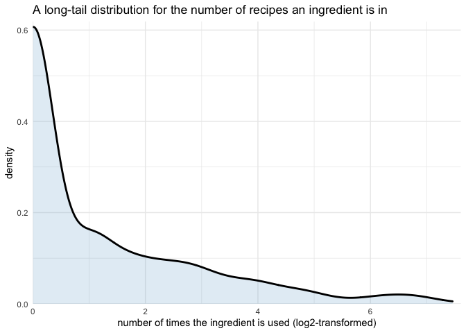
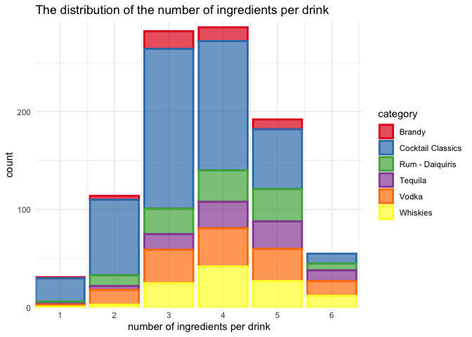
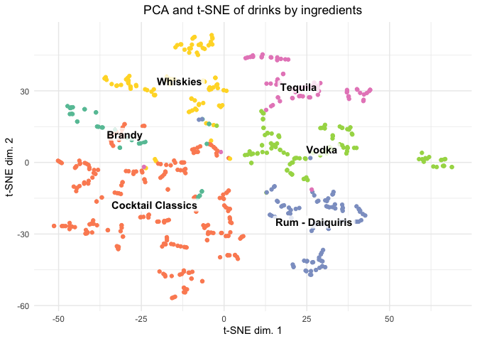

Cocktails
================
Joshua Cook
May 26, 2020

## Setup

TidyTuesday link:
<https://github.com/rfordatascience/tidytuesday/blob/master/data/2020/2020-05-26/readme.md>

``` r
knitr::opts_chunk$set(echo = TRUE, comment = "#>")

library(glue)
library(lubridate)
library(patchwork)
library(magrittr)
library(tidytext)
library(testthat)
library(tidyverse)
library(conflicted)

conflict_prefer("filter", "dplyr")
conflict_prefer("select", "dplyr")

theme_set(theme_minimal())
```

## Data

``` r
# cocktails <- read_csv("https://raw.githubusercontent.com/rfordatascience/tidytuesday/master/data/2020/2020-05-26/cocktails.csv")
boston_cocktails <- read_csv("https://raw.githubusercontent.com/rfordatascience/tidytuesday/master/data/2020/2020-05-26/boston_cocktails.csv") %>%
    janitor::clean_names()
```

    #> Parsed with column specification:
    #> cols(
    #>   name = col_character(),
    #>   category = col_character(),
    #>   row_id = col_double(),
    #>   ingredient_number = col_double(),
    #>   ingredient = col_character(),
    #>   measure = col_character()
    #> )

## EDA

``` r
boston_cocktails %>%
    count(ingredient) %>%
    ggplot(aes(x = log2(n))) +
    geom_density(size = 1, fill = "skyblue3", alpha = 0.2) +
    scale_x_continuous(expand = expansion(mult = c(0, 0.02))) +
    scale_y_continuous(expand = expansion(mult = c(0, 0.02))) +
    labs(x = "number of times the ingredient is used (log2-transformed)",
         y = "density",
         title = "A long-tail distribution for the number of recipes an ingredient is in") 
```

<!-- -->

``` r
boston_cocktails %>%
    summarise(num_drinks = n_distinct(name),
              num_categories = n_distinct(category),
              num_ingredients = n_distinct(ingredient))
```

    #> # A tibble: 1 x 3
    #>   num_drinks num_categories num_ingredients
    #>        <int>          <int>           <int>
    #> 1        989             11             569

``` r
boston_cocktails %>%
    group_by(category) %>%
    summarise(num_ingredients = n_distinct(ingredient),
              num_drinks = n_distinct(name)) %>%
    ungroup() %>%
    arrange(num_ingredients)
```

    #> # A tibble: 11 x 3
    #>    category              num_ingredients num_drinks
    #>    <chr>                           <int>      <int>
    #>  1 Non-alcoholic Drinks                3          1
    #>  2 Rum                                 4          1
    #>  3 Shooters                            4          2
    #>  4 Cordials and Liqueurs              15          8
    #>  5 Gin                                29         17
    #>  6 Brandy                             59         47
    #>  7 Rum - Daiquiris                   126        111
    #>  8 Tequila                           129         87
    #>  9 Whiskies                          142        110
    #> 10 Vodka                             179        138
    #> 11 Cocktail Classics                 228        467

``` r
boston_cocktails %>%
    count(name, category, name = "num_ingredients") %>%
    group_by(category) %>%
    filter(n_distinct(name) > 20) %>%
    ungroup() %>%
    ggplot(aes(x = num_ingredients)) +
    geom_bar(aes(fill = category, color = category), 
             size = 1, alpha = 0.7) +
    scale_color_brewer(palette = "Set1") +
    scale_fill_brewer(palette = "Set1") +
    scale_x_continuous(expand = expansion(mult = c(0, 0.02)),
                       breaks = 1:6) +
    scale_y_continuous(expand = expansion(mult = c(0, 0.02))) +
    labs(x = "number of ingredients per drink",
         y = "count",
         title = "The distribution of the number of ingredients per drink") 
```

<!-- -->

## Modeling

### Data preparation and feature engineering

``` r
most_common_ingredients <- boston_cocktails %>%
    select(category, ingredient) %>%
    mutate(ingredient = str_to_lower(ingredient)) %>%
    unnest_tokens(word, ingredient) %>%
    anti_join(stop_words, by = "word") %>%
    count(category, word) %>%
    group_by(category) %>%
    top_n(10, wt = n) %>%
    ungroup()
```

``` r
parse_ounces <- function(val) {
    if (val == "For glass") { return(1) }
    
    if (str_detect(val, "or")) {
        val <- str_remove(val, "or.+$")
    }
    
    val_pieces <- str_remove_all(val, "oz|slices|tsp|dash") %>% 
        str_trim() %>%
        str_split(" ") %>% 
        unlist() %>% 
        str_trim()
    
    val_pieces <- val_pieces[str_length(val_pieces) > 0]

    map_dbl(val_pieces, function(x){
        if (str_detect(x, "/")) {
            x_frac <- str_split(x, "/") %>% unlist() %>% as.numeric()
            return(x_frac[[1]] / x_frac[[2]])
        } else {
            return(as.numeric(x))
        }
    }) %>%
        sum()
}

test_that("The ounces are parsed correctly.", {
    expect_equal(parse_ounces("1 oz"), 1)
    expect_equal(parse_ounces("1/2 oz"), 0.5)
    expect_equal(parse_ounces("1 1/2 oz"), 1.5)
    expect_equal(parse_ounces("For glass"), 1)
    expect_equal(parse_ounces("1/2 or 1"), 0.5)
    expect_equal(parse_ounces("1  3/4 oz"), 1.75)
    expect_equal(parse_ounces("1 dash"), 1)
})
```

``` r
cocktails <- boston_cocktails %>%
    group_by(category) %>%
    filter(n_distinct(name) > 20) %>%
    ungroup() %>%
    mutate(ingredient = str_to_lower(ingredient)) %>%
    unnest_tokens(word, ingredient) %>%
    inner_join(most_common_ingredients,
               by = c("category", "word")) %>%
    group_by(name, category, word) %>%
    slice(1) %>%
    ungroup()

cocktails %<>%
    mutate(amount = map_dbl(measure, parse_ounces))

stopifnot(!any(is.na(cocktails$amount)))
```

``` r
cocktails_wide <- cocktails %>%
    pivot_wider(c(name, category), names_from = word, values_from = amount) %>%
    mutate_if(is.numeric, function(x) ifelse(is.na(x), 0, x))
```

### Clustering

``` r
library(Rtsne)

pca_data <- cocktails_wide %>%
    select(-c(name, category)) %>%
    as.data.frame()

rownames(pca_data) <- cocktails_wide %>%
    mutate(rowname = paste0(name, "___", category) %>% str_replace_all(" ", "_")) %>%
    pull(rowname)

pca_data <- unique(pca_data)

drinks_pca <- prcomp(pca_data, center = TRUE, scale. = TRUE)

tsne_drinks <- Rtsne(drinks_pca$x[], perplexity = 5)

tsne_drinks_tib <- as_tibble(tsne_drinks$Y) %>%
    set_names(c("z1", "z2")) %>%
    mutate(rowname = rownames(pca_data)) %>%
    separate(rowname, into = c("name", "category"), sep = "___") %>%
    mutate(name = str_replace_all(name, "_", " "),
           category = str_replace_all(category, "_", " "))
```

    #> Warning: The `x` argument of `as_tibble.matrix()` must have column names if `.name_repair` is omitted as of tibble 2.0.0.
    #> Using compatibility `.name_repair`.
    #> This warning is displayed once every 8 hours.
    #> Call `lifecycle::last_warnings()` to see where this warning was generated.

``` r
tsne_drinks_summary <- tsne_drinks_tib %>%
    group_by(category) %>%
    summarise(avg_z1 = mean(z1), avg_z2 = mean(z2)) %>%
    ungroup()

tsne_drinks_tib %>%
    ggplot(aes(z1, z2)) +
    geom_point(aes(color = category)) +
    geom_label(aes(label = category, x = avg_z1, y = avg_z2),
               data = tsne_drinks_summary,
               label.size = 0, 
               label.padding = unit(1, "mm"),
               fill = "white", 
               fontface = "bold",
               alpha = 0.8) +
    scale_color_brewer(palette = "Set2") +
    theme(
        plot.title = element_text(hjust = 0.5),
        legend.position = "none"
    ) +
    labs(x = "t-SNE dim. 1",
         y = "t-SNE dim. 2",
         title = "PCA and t-SNE of drinks by ingredients")
```

<!-- -->
