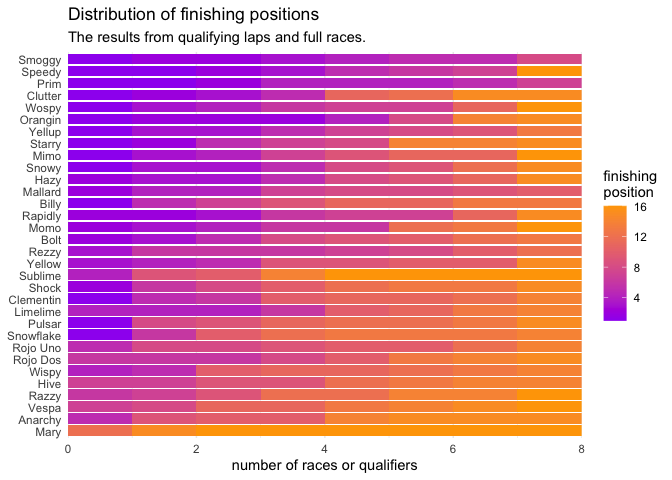
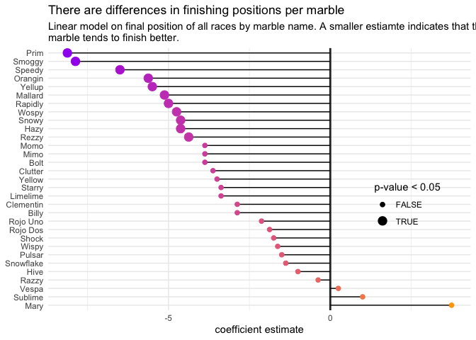
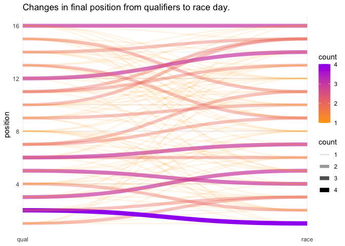
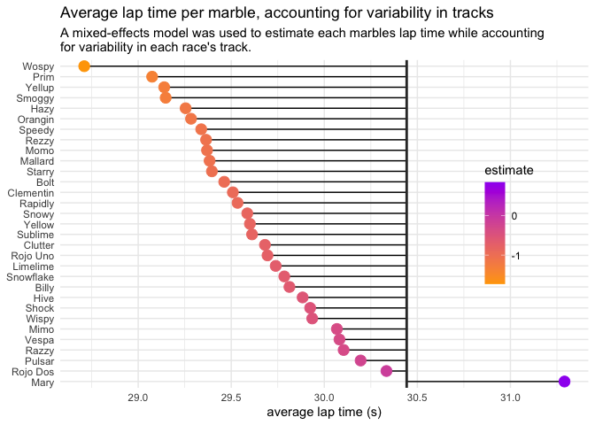

Marble Racing
================
Joshua Cook
June 2, 2020

## Setup

TidyTuesday link:
<https://github.com/rfordatascience/tidytuesday/blob/master/data/2020/2020-06-02/readme.md>

``` r
knitr::opts_chunk$set(echo = TRUE, comment = "#>", cache = TRUE)

library(glue)
library(magrittr)
library(ggtext)
library(ggforce)
library(tidyverse)
library(conflicted)

conflict_prefer("filter", "dplyr")
conflict_prefer("select", "dplyr")

theme_set(theme_minimal())
```

## Data

``` r
marbles <- read_csv(
    "https://raw.githubusercontent.com/rfordatascience/tidytuesday/master/data/2020/2020-06-02/marbles.csv"
) %>%
    janitor::clean_names() %>%
    mutate(race_type = ifelse(str_detect(race, "Q"), "qual", "race"),
           race_num = str_extract(race, "(?<=Q|R)[:digit:]+$"))
```

    #> Parsed with column specification:
    #> cols(
    #>   date = col_character(),
    #>   race = col_character(),
    #>   site = col_character(),
    #>   source = col_character(),
    #>   marble_name = col_character(),
    #>   team_name = col_character(),
    #>   time_s = col_double(),
    #>   pole = col_character(),
    #>   points = col_double(),
    #>   track_length_m = col_double(),
    #>   number_laps = col_double(),
    #>   avg_time_lap = col_double(),
    #>   host = col_character(),
    #>   notes = col_character()
    #> )

## EDA

``` r
marbles %>% filter(!is.na(notes)) %>% pull(notes)
```

    #> [1] "Note: Came to complete stop in Lap 14"                                                               
    #> [2] "*Note: A yellow SAFETY flag is issued due to incident in Lap 1."                                     
    #> [3] "Shortly after, a red SUSPENDED flag is issued to restart the race, due to major blockage."           
    #> [4] "**Note: Upon the restart, another red flag is issued due to a track invasion incident by a rowdy fan"
    #> [5] "Race resumed normally after the culprit is escorted by security marbles"                             
    #> [6] "*Note: Slight incident between Speedy and Clementin"                                                 
    #> [7] "Ultimately, JMRC reviews and deems no action is necessary"

## Modeling Questions

### Are finishes spread evenly?

``` r
marbles %>%
    group_by(race) %>%
    mutate(position = row_number()) %>%
    ungroup() %>%
    count(marble_name, position) %>%
    mutate(marble_name = fct_reorder(marble_name, -n*position*position)) %>%
    ggplot(aes(x = n, y = marble_name)) +
    geom_col(aes(fill = position)) +
    scale_fill_gradient(low = "purple", high = "orange") +
    scale_x_continuous(expand = c(0, 0)) +
    theme(axis.title.y = element_blank()) +
    labs(x = "number of races or qualifiers",
         fill = "finishing\nposition",
         title = "Distribution of finishing positions",
         subtitle = "The results from qualifying laps and full races.")
```

<!-- -->

``` r
final_positions <- marbles %>%
    mutate(race_type = ifelse(str_detect(race, "Q"), "qualifying", "race")) %>%
    group_by(race) %>%
    mutate(position = row_number()) %>%
    ungroup() %>%
    select(marble_name, position)

summary(aov(position ~ marble_name, data = final_positions))
```

    #>              Df Sum Sq Mean Sq F value   Pr(>F)    
    #> marble_name  31   1594   51.44   2.996 1.45e-06 ***
    #> Residuals   224   3845   17.17                     
    #> ---
    #> Signif. codes:  0 '***' 0.001 '**' 0.01 '*' 0.05 '.' 0.1 ' ' 1

``` r
position_model <- lm(position ~ marble_name, data = final_positions)
summary(position_model)
```

    #> 
    #> Call:
    #> lm(formula = position ~ marble_name, data = final_positions)
    #> 
    #> Residuals:
    #>     Min      1Q  Median      3Q     Max 
    #> -9.2500 -3.1563  0.4375  2.7500 10.8750 
    #> 
    #> Coefficients:
    #>                      Estimate Std. Error t value Pr(>|t|)    
    #> (Intercept)            11.625      1.465   7.936 9.96e-14 ***
    #> marble_nameBilly       -2.875      2.072  -1.388 0.166588    
    #> marble_nameBolt        -3.875      2.072  -1.870 0.062724 .  
    #> marble_nameClementin   -2.875      2.072  -1.388 0.166588    
    #> marble_nameClutter     -3.625      2.072  -1.750 0.081524 .  
    #> marble_nameHazy        -4.625      2.072  -2.232 0.026572 *  
    #> marble_nameHive        -1.000      2.072  -0.483 0.629780    
    #> marble_nameLimelime    -3.375      2.072  -1.629 0.104694    
    #> marble_nameMallard     -5.125      2.072  -2.474 0.014110 *  
    #> marble_nameMary         3.750      2.072   1.810 0.071616 .  
    #> marble_nameMimo        -3.875      2.072  -1.870 0.062724 .  
    #> marble_nameMomo        -3.875      2.072  -1.870 0.062724 .  
    #> marble_nameOrangin     -5.625      2.072  -2.715 0.007140 ** 
    #> marble_namePrim        -8.125      2.072  -3.922 0.000117 ***
    #> marble_namePulsar      -1.500      2.072  -0.724 0.469790    
    #> marble_nameRapidly     -5.000      2.072  -2.414 0.016604 *  
    #> marble_nameRazzy       -0.375      2.072  -0.181 0.856521    
    #> marble_nameRezzy       -4.375      2.072  -2.112 0.035810 *  
    #> marble_nameRojo Dos    -1.875      2.072  -0.905 0.366404    
    #> marble_nameRojo Uno    -2.125      2.072  -1.026 0.306121    
    #>  [ reached getOption("max.print") -- omitted 12 rows ]
    #> ---
    #> Signif. codes:  0 '***' 0.001 '**' 0.01 '*' 0.05 '.' 0.1 ' ' 1
    #> 
    #> Residual standard error: 4.143 on 224 degrees of freedom
    #> Multiple R-squared:  0.2931, Adjusted R-squared:  0.1953 
    #> F-statistic: 2.996 on 31 and 224 DF,  p-value: 1.447e-06

``` r
broom::tidy(position_model) %>%
    janitor::clean_names() %>%
    filter(term != "(Intercept)") %>%
    mutate(
        term = str_remove(term, "marble_name"),
        term = fct_reorder(term, -estimate),
        p_val_sig = p_value < 0.05,
    ) %>%
    ggplot(aes(estimate, term)) +
    geom_vline(xintercept = 0, color = "grey20", size = 1) +
    geom_linerange(aes(xmin = 0, xmax = estimate)) +
    geom_point(aes(color = estimate, size = p_val_sig)) +
    scale_color_gradient(low = "purple", high = "orange", guide = FALSE) +
    scale_size_manual(values = c(2, 4)) + 
    theme(legend.position = c(0.85, 0.4),
          axis.title.y = element_blank()) +
    labs(x = "coefficient estimate",
         size = "p-value < 0.05",
         title = "There are differences in finishing positions per marble",
         subtitle = "Linear model on final position of all races by marble name. A smaller estiamte indicates that the\nmarble tends to finish better.")
```

<!-- -->

### Can predict the race result from the pole position?

``` r
position_changes <- marbles %>%
    group_by(race) %>%
    mutate(position = row_number()) %>%
    ungroup() %>%
    select(race_num, race_type, marble_name, position) %>%
    pivot_wider(c(race_num, marble_name),
                names_from = race_type,
                values_from = position)

position_changes %>%
    count(qual, race) %>%
    ggplot() +
    geom_diagonal(aes(x = "qual", xend = "race",
                      y = qual, yend = race,
                      color = n, size = n, alpha = n)) +
    scale_color_gradient(low = "orange", high = "purple") +
    scale_size_continuous(range = c(1, 3)) +
    scale_x_discrete(expand = c(0, 0)) +
    theme(axis.title.x = element_blank()) +
    labs(y = "position",
         color = "count",
         size = "count",
         alpha = "count",
         title = "Changes in final position from qualifiers to race day.")
```

<!-- -->

``` r
pos_change_model <- lm(race ~ qual, data = position_changes)
summary(pos_change_model)
```

    #> 
    #> Call:
    #> lm(formula = race ~ qual, data = position_changes)
    #> 
    #> Residuals:
    #>    Min     1Q Median     3Q    Max 
    #> -9.397 -2.960 -0.271  3.187 11.564 
    #> 
    #> Coefficients:
    #>             Estimate Std. Error t value Pr(>|t|)    
    #> (Intercept)  3.89375    0.72398   5.378 3.52e-07 ***
    #> qual         0.54191    0.07487   7.238 3.95e-11 ***
    #> ---
    #> Signif. codes:  0 '***' 0.001 '**' 0.01 '*' 0.05 '.' 0.1 ' ' 1
    #> 
    #> Residual standard error: 3.905 on 126 degrees of freedom
    #> Multiple R-squared:  0.2937, Adjusted R-squared:  0.2881 
    #> F-statistic: 52.39 on 1 and 126 DF,  p-value: 3.951e-11

``` r
mdl_vals <- broom::glance(pos_change_model) %>% janitor::clean_names()
mdl_rsq <- round(mdl_vals$r_squared[[1]], 3)
mdl_pval <- mdl_vals$p_value[[1]]
mdl_intercept <- round(coef(pos_change_model)["(Intercept)"], 3)
mdl_coef <- round(coef(pos_change_model)["qual"], 3)
sub_ttl <- glue("*R*<sup>2</sup>: {mdl_rsq}, *p*-value: 3.95 x 10<sup>-11</sup>, *y*-intercept: {mdl_intercept}, slope: {mdl_coef}")

position_changes %>%
    ggplot(aes(x = qual, y = race)) +
    geom_jitter(width = 0.2, height = 0.2) +
    geom_smooth(method = "lm", formula = "y~x") +
    theme(plot.subtitle = element_markdown()) +
    labs(x = "qualifying position",
         y = "race position",
         title = "Effect of qualifying position on final position on race day",
         subtitle = glue(sub_ttl))
```

<!-- -->

### Model the lap time of each marble accounting for variability in the tracks.

``` r
library(lme4)
```

    #> Loading required package: Matrix

    #> 
    #> Attaching package: 'Matrix'

    #> The following objects are masked from 'package:tidyr':
    #> 
    #>     expand, pack, unpack

``` r
lap_time_data <- marbles %>%
    select(site, marble_name, avg_time_lap)

lap_time_model <- lmer(avg_time_lap ~ marble_name + (1|site),
                       data = lap_time_data)
summary(lap_time_model)
```

    #> Linear mixed model fit by REML ['lmerMod']
    #> Formula: avg_time_lap ~ marble_name + (1 | site)
    #>    Data: lap_time_data
    #> 
    #> REML criterion at convergence: 1132.7
    #> 
    #> Scaled residuals: 
    #>      Min       1Q   Median       3Q      Max 
    #> -1.95210 -0.90449  0.08856  0.88556  1.39173 
    #> 
    #> Random effects:
    #>  Groups   Name        Variance Std.Dev.
    #>  site     (Intercept) 28.749   5.362   
    #>  Residual              6.274   2.505   
    #> Number of obs: 253, groups:  site, 8
    #> 
    #> Fixed effects:
    #>                      Estimate Std. Error t value
    #> (Intercept)           30.4427     2.1037  14.471
    #> marble_nameBilly      -0.6300     1.2524  -0.503
    #> marble_nameBolt       -0.9804     1.2822  -0.765
    #> marble_nameClementin  -0.9340     1.3159  -0.710
    #> marble_nameClutter    -0.7616     1.3266  -0.574
    #> marble_nameHazy       -1.1878     1.3266  -0.895
    #> marble_nameHive       -0.5591     1.2822  -0.436
    #> marble_nameLimelime   -0.7038     1.2658  -0.556
    #> marble_nameMallard    -1.0591     1.3266  -0.798
    #> marble_nameMary        0.8481     1.3118   0.647
    #> marble_nameMimo       -0.3750     1.2524  -0.299
    #> marble_nameMomo       -1.0728     1.3266  -0.809
    #> marble_nameOrangin    -1.1588     1.2658  -0.915
    #> marble_namePrim       -1.3678     1.3159  -1.039
    #> marble_namePulsar     -0.2475     1.2524  -0.198
    #> marble_nameRapidly    -0.9088     1.2658  -0.718
    #> marble_nameRazzy      -0.3387     1.2933  -0.262
    #> marble_nameRezzy      -1.0779     1.2822  -0.841
    #> marble_nameRojo Dos   -0.1087     1.2524  -0.087
    #> marble_nameRojo Uno   -0.7478     1.3266  -0.564
    #> marble_nameShock      -0.5187     1.2933  -0.401
    #> marble_nameSmoggy     -1.2950     1.2524  -1.034
    #> marble_nameSnowflake  -0.6575     1.2658  -0.519
    #> marble_nameSnowy      -0.8565     1.3159  -0.651
    #> marble_nameSpeedy     -1.1040     1.3159  -0.839
    #> marble_nameStarry     -1.0466     1.3266  -0.789
    #> marble_nameSublime    -0.8308     1.3674  -0.608
    #> marble_nameVespa      -0.3612     1.2933  -0.279
    #> marble_nameWispy      -0.5075     1.2933  -0.392
    #> marble_nameWospy      -1.7326     1.3309  -1.302
    #> marble_nameYellow     -0.8425     1.2933  -0.651
    #> marble_nameYellup     -1.3029     1.2822  -1.016

    #> 
    #> Correlation matrix not shown by default, as p = 32 > 12.
    #> Use print(x, correlation=TRUE)  or
    #>     vcov(x)        if you need it

``` r
lap_time_coefs <- summary(lap_time_model)$coefficients %>%
    as.data.frame() %>%
    rownames_to_column(var = "term") %>%
    as_tibble() %>%
    janitor::clean_names()

lap_time_intercept <- lap_time_coefs %>%
    filter(term == "(Intercept)") %>%
    pull(estimate)

lap_time_coefs %>%
    filter(term != "(Intercept)") %>%
    mutate(estimate_adj = estimate + !!lap_time_intercept,
           marble_name = str_remove(term, "marble_name"),
           marble_name = fct_reorder(marble_name, -estimate)) %>%
    ggplot(aes(x = estimate_adj, y = marble_name)) +
    geom_linerange(aes(xmin = estimate_adj, xmax = estimate_adj - estimate)) + 
    geom_vline(xintercept = lap_time_intercept, color = "grey20", size = 1) +
    geom_point(aes(color = estimate), size = 4) +
    scale_color_gradient(low = "orange", high = "purple") +
    theme(axis.title.y = element_blank(),
          legend.position = c(0.85, 0.5)) +
    labs(x = "average lap time (s)",
         title = "Average lap time per marble, accounting for variability in tracks",
         subtitle = "A mixed-effects model was used to estimate each marbles lap time while accounting\nfor variability in each race's track.")
```

<!-- -->
