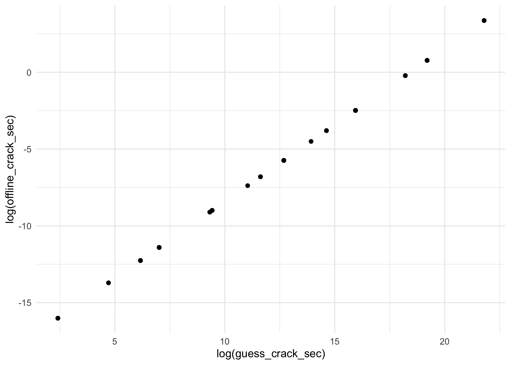
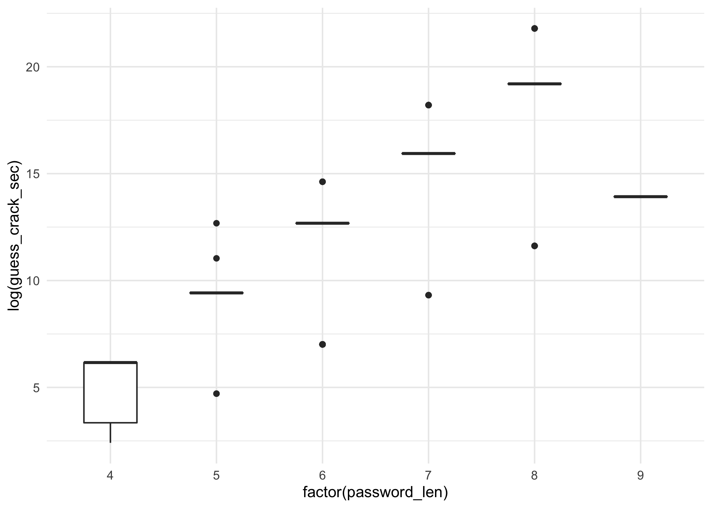
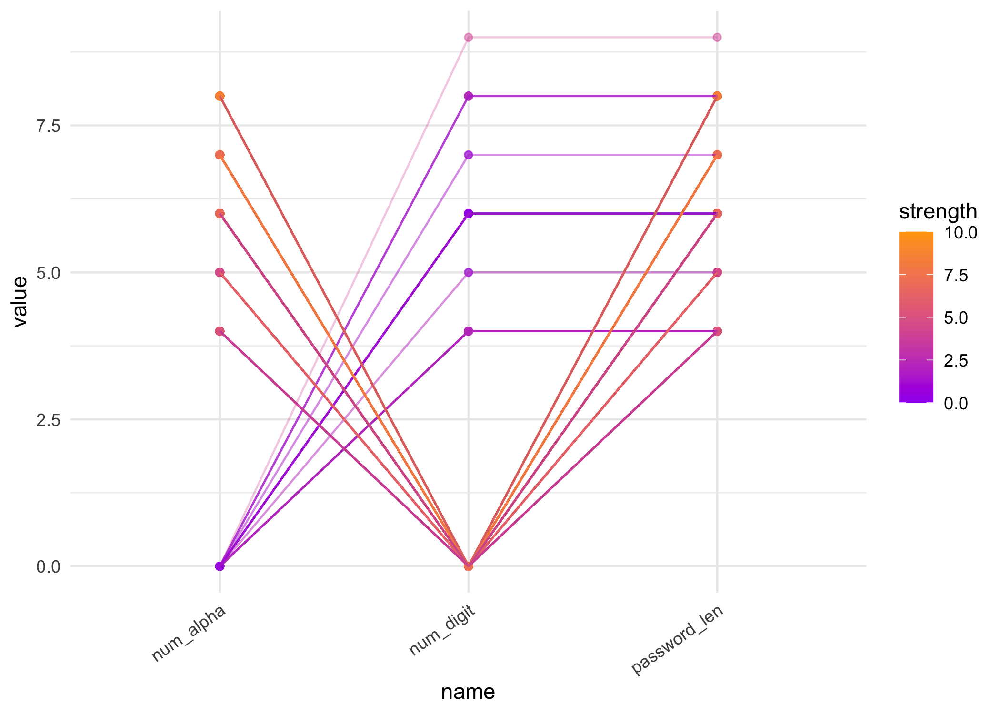
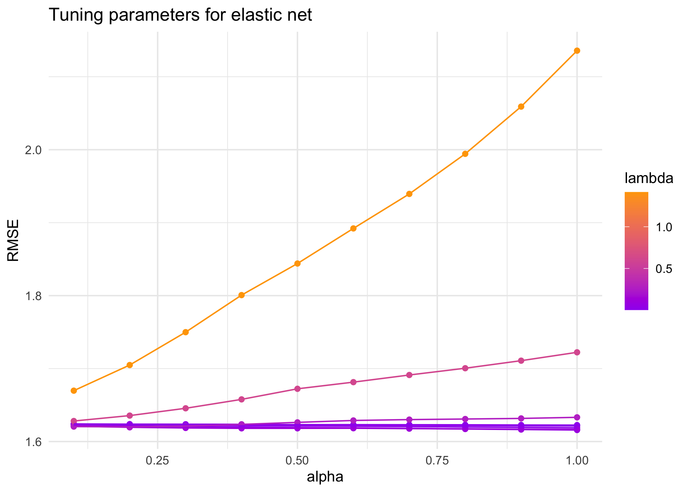
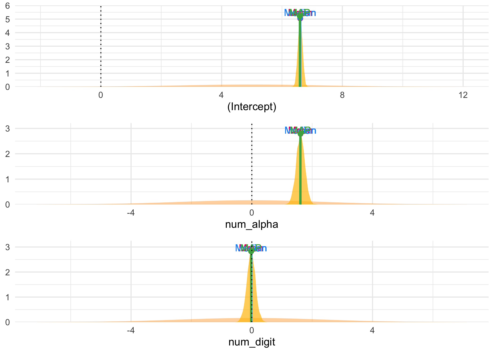
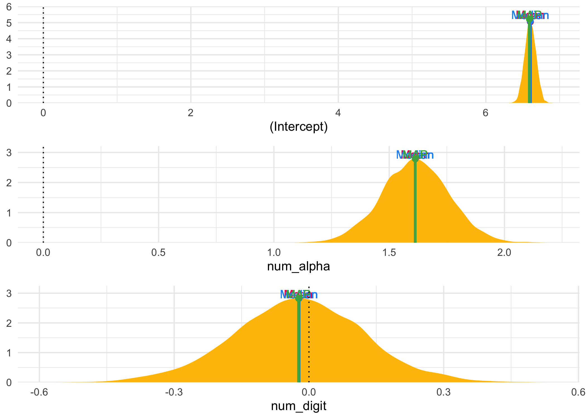
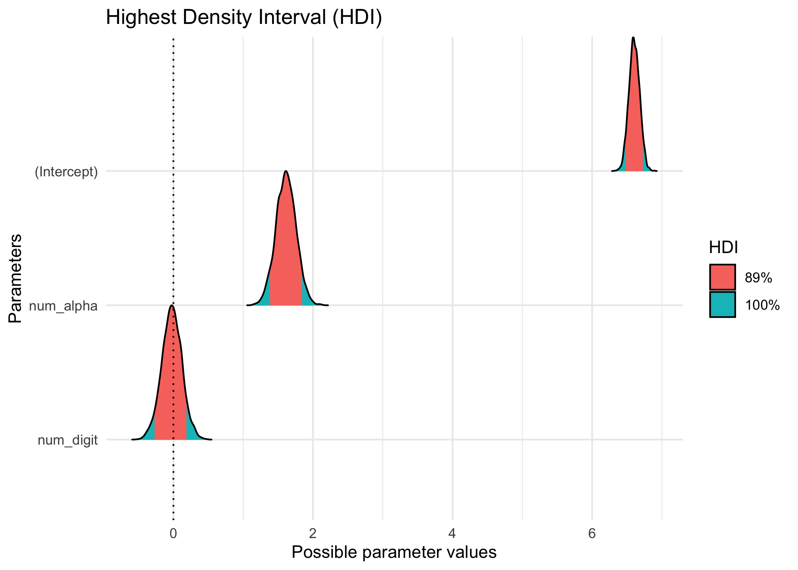
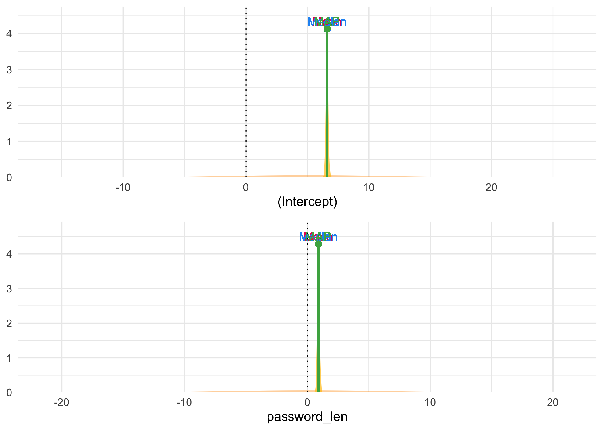
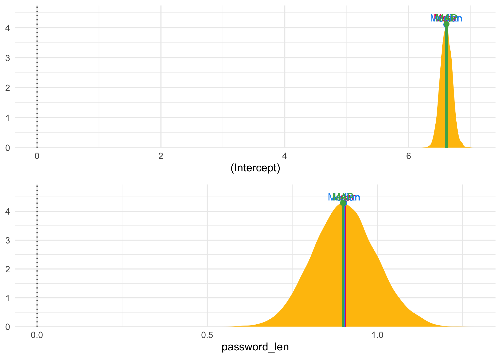
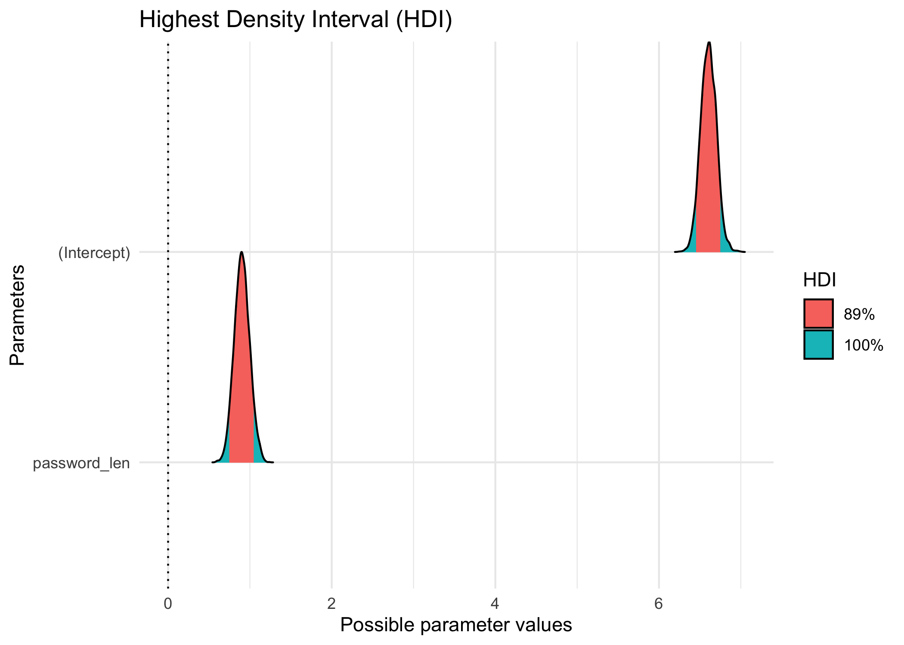

Passwords
================
Joshua Cook
June 9, 2020

## Setup

TidyTuesday link:
<https://github.com/rfordatascience/tidytuesday/blob/master/data/2020/2020-01-14/readme.md>

``` r
knitr::opts_chunk$set(echo = TRUE, 
                      comment = "#>", 
                      cache = TRUE, 
                      dpi = 300)

library(mustashe)
library(glue)
library(magrittr)
library(rstanarm)
library(bayestestR)
library(see)
library(MASS)
library(tidyverse)
library(conflicted)

conflict_prefer("filter", "dplyr")
conflict_prefer("select", "dplyr")

theme_set(theme_minimal())
```

## Data

``` r
passwords <- read_csv(
    "https://raw.githubusercontent.com/rfordatascience/tidytuesday/master/data/2020/2020-01-14/passwords.csv"
) %>%
    janitor::clean_names() %>%
    filter(!is.na(password)) %>%
    select(-font_size) %>%
    filter(strength <= 10)
```

    #> Parsed with column specification:
    #> cols(
    #>   rank = col_double(),
    #>   password = col_character(),
    #>   category = col_character(),
    #>   value = col_double(),
    #>   time_unit = col_character(),
    #>   offline_crack_sec = col_double(),
    #>   rank_alt = col_double(),
    #>   strength = col_double(),
    #>   font_size = col_double()
    #> )

``` r
time_table <- tribble(
    ~ time_unit, ~ in_sec,
    "years", 60*60*24*365,
    "months", 60*60*24*30.42,
    "weeks", 60*60*24*7,
    "days", 60*60*24,
    "hours", 60*60,
    "minutes", 60,
    "seconds",  1
)

passwords %<>%
    mutate(password_len = str_length(password)) %>%
    left_join(time_table, by = "time_unit") %>%
    mutate(guess_crack_sec = value * in_sec) %>%
    select(-c(in_sec, value, time_unit))
```

## EDA

``` r
passwords %>%
    count(category, sort = TRUE)
```

    #> # A tibble: 10 x 2
    #>    category                n
    #>    <chr>               <int>
    #>  1 name                  183
    #>  2 cool-macho             79
    #>  3 simple-alphanumeric    61
    #>  4 fluffy                 44
    #>  5 sport                  37
    #>  6 nerdy-pop              30
    #>  7 animal                 29
    #>  8 password-related       15
    #>  9 food                   11
    #> 10 rebellious-rude        11

``` r
set.seed(0)
categories <- sort(unique(passwords$category))
category_pal <- randomcoloR::distinctColorPalette(length(categories))
names(category_pal) <- categories

passwords %>%
    ggplot(aes(log(guess_crack_sec))) +
    geom_density(aes(color = category, fill = category), size = 1.2, alpha = 0.2) +
    scale_color_manual(values = category_pal) +
    scale_fill_manual(values = category_pal) +
    theme(legend.position = "top") +
    labs(x = "time to guess the password (log(sec))",
         y = "density",
         title = "Time taken to guess the passwords of different categories")
```

<!-- -->

``` r
passwords %>%
    ggplot(aes(x = log(guess_crack_sec), y = log(offline_crack_sec))) +
    geom_point()
```

<!-- -->

``` r
passwords %>%
    ggplot(aes(x = factor(password_len), y = log(guess_crack_sec))) +
    geom_boxplot(width = 0.5)
```

<!-- -->

``` r
passwords %<>%
    mutate(num_alpha = str_count(password, "[:alpha:]"),
           num_digit = str_count(password, "[:digit:]"))
```

``` r
passwords %>%
    select(password, strength, password_len, num_alpha, num_digit) %>%
    pivot_longer(-c(password, strength)) %>%
    ggplot(aes(x = name, y = value, color = strength)) +
    geom_point(alpha = 0.5) +
    geom_line(aes(group = password), alpha = 0.3) +
    scale_color_gradient(low = "purple", high = "orange") +
    theme(axis.text.x = element_text(angle = 35, hjust = 1))
```

<!-- -->

## Modeling properties of strong passwords

### Stepwise variable selection

``` r
scale2 <- function(x, na.rm = FALSE) {
    (x - mean(x, na.rm = na.rm)) / sd(x, na.rm)
}

m1_data <- passwords %>%
    select(strength, password_len, num_alpha, num_digit) %>%
    mutate(password_len = scale2(password_len),
           num_alpha = scale2(num_alpha),
           num_digit = scale2(num_digit))
```

``` r
m1 <- lm(
    strength ~ .^2,
    data = m1_data
)
m1_step <- stepAIC(m1, direction = "both", trace = 0)
```

``` r
summary(m1)
```

    #> 
    #> Call:
    #> lm(formula = strength ~ .^2, data = m1_data)
    #> 
    #> Residuals:
    #>     Min      1Q  Median      3Q     Max 
    #> -8.5050 -0.8464  0.3246  1.1536  6.2074 
    #> 
    #> Coefficients: (2 not defined because of singularities)
    #>                          Estimate Std. Error t value Pr(>|t|)    
    #> (Intercept)             6.6059505  0.0911029  72.511   <2e-16 ***
    #> password_len           -0.0128339  0.0925889  -0.139    0.890    
    #> num_alpha               1.6427485  0.0925505  17.750   <2e-16 ***
    #> num_digit                      NA         NA      NA       NA    
    #> password_len:num_alpha  0.0006545  0.0979508   0.007    0.995    
    #> password_len:num_digit  0.0059876  0.1004507   0.060    0.952    
    #> num_alpha:num_digit            NA         NA      NA       NA    
    #> ---
    #> Signif. codes:  0 '***' 0.001 '**' 0.01 '*' 0.05 '.' 0.1 ' ' 1
    #> 
    #> Residual standard error: 1.635 on 480 degrees of freedom
    #> Multiple R-squared:  0.5019, Adjusted R-squared:  0.4978 
    #> F-statistic: 120.9 on 4 and 480 DF,  p-value: < 2.2e-16

``` r
summary(m1_step)
```

    #> 
    #> Call:
    #> lm(formula = strength ~ password_len + num_digit, data = m1_data)
    #> 
    #> Residuals:
    #>     Min      1Q  Median      3Q     Max 
    #> -8.5085 -0.8457  0.3229  1.1543  6.1832 
    #> 
    #> Coefficients:
    #>              Estimate Std. Error t value Pr(>|t|)    
    #> (Intercept)   6.60619    0.07411   89.14   <2e-16 ***
    #> password_len  0.87495    0.07420   11.79   <2e-16 ***
    #> num_digit    -1.36241    0.07420  -18.36   <2e-16 ***
    #> ---
    #> Signif. codes:  0 '***' 0.001 '**' 0.01 '*' 0.05 '.' 0.1 ' ' 1
    #> 
    #> Residual standard error: 1.632 on 482 degrees of freedom
    #> Multiple R-squared:  0.5019, Adjusted R-squared:  0.4999 
    #> F-statistic: 242.9 on 2 and 482 DF,  p-value: < 2.2e-16

``` r
anova(m1, m1_step)
```

    #> Analysis of Variance Table
    #> 
    #> Model 1: strength ~ (password_len + num_alpha + num_digit)^2
    #> Model 2: strength ~ password_len + num_digit
    #>   Res.Df    RSS Df Sum of Sq      F Pr(>F)
    #> 1    480 1283.9                           
    #> 2    482 1283.9 -2 -0.022948 0.0043 0.9957

``` r
AIC(m1, m1_step)
```

    #>         df      AIC
    #> m1       6 1860.527
    #> m1_step  4 1856.536

## Elastic net

``` r
library(caret)
library(glmnet)

m_elastic <- train(
    strength ~ .^2,
    data = m1_data,
    method = "glmnet",
    trControl = trainControl("cv", number = 10),
    tuneLength = 10
)
```

``` r
m_elastic$results %>%
    ggplot(aes(alpha, RMSE)) +
    geom_point(aes(color = lambda)) +
    geom_line(aes(color = lambda, group = factor(lambda))) +
    scale_color_gradient(low = "purple", high = "orange") +
    labs(x = "alpha", y = "RMSE", color = "lambda",
         title = "Tuning parameters for elastic net")
```

<!-- -->

``` r
m_elastic$bestTune
```

    #>    alpha     lambda
    #> 76     1 0.04964918

``` r
coef(m_elastic$finalModel, m_elastic$bestTune$lambda)
```

    #> 7 x 1 sparse Matrix of class "dgCMatrix"
    #>                               1
    #> (Intercept)            6.606186
    #> password_len           .       
    #> num_alpha              1.585278
    #> num_digit              .       
    #> password_len:num_alpha .       
    #> password_len:num_digit .       
    #> num_alpha:num_digit    .

## STAN Bayesian model

``` r
m1_stan <- stan_glm(
    strength ~ num_alpha + num_digit,
    data = m1_data,
    family = gaussian(link = "identity"),
    prior = normal(location = 0, scale = 1),
    prior_intercept = normal(location = 5, scale = 1),
    cores = 1,
    seed = 0
)
```

    #> 
    #> SAMPLING FOR MODEL 'continuous' NOW (CHAIN 1).
    #> Chain 1: 
    #> Chain 1: Gradient evaluation took 0.000247 seconds
    #> Chain 1: 1000 transitions using 10 leapfrog steps per transition would take 2.47 seconds.
    #> Chain 1: Adjust your expectations accordingly!
    #> Chain 1: 
    #> Chain 1: 
    #> Chain 1: Iteration:    1 / 2000 [  0%]  (Warmup)
    #> Chain 1: Iteration:  200 / 2000 [ 10%]  (Warmup)
    #> Chain 1: Iteration:  400 / 2000 [ 20%]  (Warmup)
    #> Chain 1: Iteration:  600 / 2000 [ 30%]  (Warmup)
    #> Chain 1: Iteration:  800 / 2000 [ 40%]  (Warmup)
    #> Chain 1: Iteration: 1000 / 2000 [ 50%]  (Warmup)
    #> Chain 1: Iteration: 1001 / 2000 [ 50%]  (Sampling)
    #> Chain 1: Iteration: 1200 / 2000 [ 60%]  (Sampling)
    #> Chain 1: Iteration: 1400 / 2000 [ 70%]  (Sampling)
    #> Chain 1: Iteration: 1600 / 2000 [ 80%]  (Sampling)
    #> Chain 1: Iteration: 1800 / 2000 [ 90%]  (Sampling)
    #> Chain 1: Iteration: 2000 / 2000 [100%]  (Sampling)
    #> Chain 1: 
    #> Chain 1:  Elapsed Time: 0.163457 seconds (Warm-up)
    #> Chain 1:                0.170333 seconds (Sampling)
    #> Chain 1:                0.33379 seconds (Total)
    #> Chain 1: 
    #> 
    #> SAMPLING FOR MODEL 'continuous' NOW (CHAIN 2).
    #> Chain 2: 
    #> Chain 2: Gradient evaluation took 5.1e-05 seconds
    #> Chain 2: 1000 transitions using 10 leapfrog steps per transition would take 0.51 seconds.
    #> Chain 2: Adjust your expectations accordingly!
    #> Chain 2: 
    #> Chain 2: 
    #> Chain 2: Iteration:    1 / 2000 [  0%]  (Warmup)
    #> Chain 2: Iteration:  200 / 2000 [ 10%]  (Warmup)
    #> Chain 2: Iteration:  400 / 2000 [ 20%]  (Warmup)
    #> Chain 2: Iteration:  600 / 2000 [ 30%]  (Warmup)
    #> Chain 2: Iteration:  800 / 2000 [ 40%]  (Warmup)
    #> Chain 2: Iteration: 1000 / 2000 [ 50%]  (Warmup)
    #> Chain 2: Iteration: 1001 / 2000 [ 50%]  (Sampling)
    #> Chain 2: Iteration: 1200 / 2000 [ 60%]  (Sampling)
    #> Chain 2: Iteration: 1400 / 2000 [ 70%]  (Sampling)
    #> Chain 2: Iteration: 1600 / 2000 [ 80%]  (Sampling)
    #> Chain 2: Iteration: 1800 / 2000 [ 90%]  (Sampling)
    #> Chain 2: Iteration: 2000 / 2000 [100%]  (Sampling)
    #> Chain 2: 
    #> Chain 2:  Elapsed Time: 0.139026 seconds (Warm-up)
    #> Chain 2:                0.29007 seconds (Sampling)
    #> Chain 2:                0.429096 seconds (Total)
    #> Chain 2: 
    #> 
    #> SAMPLING FOR MODEL 'continuous' NOW (CHAIN 3).
    #> Chain 3: 
    #> Chain 3: Gradient evaluation took 6.5e-05 seconds
    #> Chain 3: 1000 transitions using 10 leapfrog steps per transition would take 0.65 seconds.
    #> Chain 3: Adjust your expectations accordingly!
    #> Chain 3: 
    #> Chain 3: 
    #> Chain 3: Iteration:    1 / 2000 [  0%]  (Warmup)
    #> Chain 3: Iteration:  200 / 2000 [ 10%]  (Warmup)
    #> Chain 3: Iteration:  400 / 2000 [ 20%]  (Warmup)
    #> Chain 3: Iteration:  600 / 2000 [ 30%]  (Warmup)
    #> Chain 3: Iteration:  800 / 2000 [ 40%]  (Warmup)
    #> Chain 3: Iteration: 1000 / 2000 [ 50%]  (Warmup)
    #> Chain 3: Iteration: 1001 / 2000 [ 50%]  (Sampling)
    #> Chain 3: Iteration: 1200 / 2000 [ 60%]  (Sampling)
    #> Chain 3: Iteration: 1400 / 2000 [ 70%]  (Sampling)
    #> Chain 3: Iteration: 1600 / 2000 [ 80%]  (Sampling)
    #> Chain 3: Iteration: 1800 / 2000 [ 90%]  (Sampling)
    #> Chain 3: Iteration: 2000 / 2000 [100%]  (Sampling)
    #> Chain 3: 
    #> Chain 3:  Elapsed Time: 0.115051 seconds (Warm-up)
    #> Chain 3:                0.134907 seconds (Sampling)
    #> Chain 3:                0.249958 seconds (Total)
    #> Chain 3: 
    #> 
    #> SAMPLING FOR MODEL 'continuous' NOW (CHAIN 4).
    #> Chain 4: 
    #> Chain 4: Gradient evaluation took 1.1e-05 seconds
    #> Chain 4: 1000 transitions using 10 leapfrog steps per transition would take 0.11 seconds.
    #> Chain 4: Adjust your expectations accordingly!
    #> Chain 4: 
    #> Chain 4: 
    #> Chain 4: Iteration:    1 / 2000 [  0%]  (Warmup)
    #> Chain 4: Iteration:  200 / 2000 [ 10%]  (Warmup)
    #> Chain 4: Iteration:  400 / 2000 [ 20%]  (Warmup)
    #> Chain 4: Iteration:  600 / 2000 [ 30%]  (Warmup)
    #> Chain 4: Iteration:  800 / 2000 [ 40%]  (Warmup)
    #> Chain 4: Iteration: 1000 / 2000 [ 50%]  (Warmup)
    #> Chain 4: Iteration: 1001 / 2000 [ 50%]  (Sampling)
    #> Chain 4: Iteration: 1200 / 2000 [ 60%]  (Sampling)
    #> Chain 4: Iteration: 1400 / 2000 [ 70%]  (Sampling)
    #> Chain 4: Iteration: 1600 / 2000 [ 80%]  (Sampling)
    #> Chain 4: Iteration: 1800 / 2000 [ 90%]  (Sampling)
    #> Chain 4: Iteration: 2000 / 2000 [100%]  (Sampling)
    #> Chain 4: 
    #> Chain 4:  Elapsed Time: 0.131352 seconds (Warm-up)
    #> Chain 4:                0.146845 seconds (Sampling)
    #> Chain 4:                0.278197 seconds (Total)
    #> Chain 4:

``` r
summary(m1_stan)
```

    #> 
    #> Model Info:
    #>  function:     stan_glm
    #>  family:       gaussian [identity]
    #>  formula:      strength ~ num_alpha + num_digit
    #>  algorithm:    sampling
    #>  sample:       4000 (posterior sample size)
    #>  priors:       see help('prior_summary')
    #>  observations: 485
    #>  predictors:   3
    #> 
    #> Estimates:
    #>               mean   sd   10%   50%   90%
    #> (Intercept)  6.6    0.1  6.5   6.6   6.7 
    #> num_alpha    1.6    0.1  1.4   1.6   1.8 
    #> num_digit    0.0    0.1 -0.2   0.0   0.2 
    #> sigma        1.6    0.1  1.6   1.6   1.7 
    #> 
    #> Fit Diagnostics:
    #>            mean   sd   10%   50%   90%
    #> mean_PPD 6.6    0.1  6.5   6.6   6.7  
    #> 
    #> The mean_ppd is the sample average posterior predictive distribution of the outcome variable (for details see help('summary.stanreg')).
    #> 
    #> MCMC diagnostics
    #>               mcse Rhat n_eff
    #> (Intercept)   0.0  1.0  3258 
    #> num_alpha     0.0  1.0  2233 
    #> num_digit     0.0  1.0  2288 
    #> sigma         0.0  1.0  3218 
    #> mean_PPD      0.0  1.0  3624 
    #> log-posterior 0.0  1.0  1593 
    #> 
    #> For each parameter, mcse is Monte Carlo standard error, n_eff is a crude measure of effective sample size, and Rhat is the potential scale reduction factor on split chains (at convergence Rhat=1).

``` r
describe_posterior(m1_stan)
```

    #> Possible multicollinearity between num_digit and num_alpha (r = 0.85). This might lead to inappropriate results. See 'Details' in '?rope'.

    #> # Description of Posterior Distributions
    #> 
    #> Parameter   | Median |          89% CI |    pd |        89% ROPE | % in ROPE |  Rhat |      ESS
    #> -----------------------------------------------------------------------------------------------
    #> (Intercept) |  6.602 | [ 6.487, 6.730] | 1.000 | [-0.231, 0.231] |     0.000 | 1.000 | 3258.098
    #> num_alpha   |  1.613 | [ 1.386, 1.846] | 1.000 | [-0.231, 0.231] |     0.000 | 1.000 | 2232.847
    #> num_digit   | -0.022 | [-0.267, 0.190] | 0.565 | [-0.231, 0.231] |    96.855 | 1.002 | 2287.809

``` r
plot(point_estimate(m1_stan), show_intercept = TRUE, priors = TRUE)
```

<!-- -->

``` r
plot(point_estimate(m1_stan), show_intercept = TRUE, priors = FALSE)
```

<!-- -->

``` r
plot(hdi(m1_stan), show_intercept = TRUE)
```

<!-- -->

``` r
m2_stan <- stan_glm(
    strength ~ password_len,
    data = m1_data,
    family = gaussian(link = "identity"),
    prior = normal(location = 0, scale = 3),
    prior_intercept = normal(location = 5, scale = 3),
    cores = 1,
    seed = 0
)
```

    #> 
    #> SAMPLING FOR MODEL 'continuous' NOW (CHAIN 1).
    #> Chain 1: 
    #> Chain 1: Gradient evaluation took 6.8e-05 seconds
    #> Chain 1: 1000 transitions using 10 leapfrog steps per transition would take 0.68 seconds.
    #> Chain 1: Adjust your expectations accordingly!
    #> Chain 1: 
    #> Chain 1: 
    #> Chain 1: Iteration:    1 / 2000 [  0%]  (Warmup)
    #> Chain 1: Iteration:  200 / 2000 [ 10%]  (Warmup)
    #> Chain 1: Iteration:  400 / 2000 [ 20%]  (Warmup)
    #> Chain 1: Iteration:  600 / 2000 [ 30%]  (Warmup)
    #> Chain 1: Iteration:  800 / 2000 [ 40%]  (Warmup)
    #> Chain 1: Iteration: 1000 / 2000 [ 50%]  (Warmup)
    #> Chain 1: Iteration: 1001 / 2000 [ 50%]  (Sampling)
    #> Chain 1: Iteration: 1200 / 2000 [ 60%]  (Sampling)
    #> Chain 1: Iteration: 1400 / 2000 [ 70%]  (Sampling)
    #> Chain 1: Iteration: 1600 / 2000 [ 80%]  (Sampling)
    #> Chain 1: Iteration: 1800 / 2000 [ 90%]  (Sampling)
    #> Chain 1: Iteration: 2000 / 2000 [100%]  (Sampling)
    #> Chain 1: 
    #> Chain 1:  Elapsed Time: 0.09362 seconds (Warm-up)
    #> Chain 1:                0.183637 seconds (Sampling)
    #> Chain 1:                0.277257 seconds (Total)
    #> Chain 1: 
    #> 
    #> SAMPLING FOR MODEL 'continuous' NOW (CHAIN 2).
    #> Chain 2: 
    #> Chain 2: Gradient evaluation took 5.1e-05 seconds
    #> Chain 2: 1000 transitions using 10 leapfrog steps per transition would take 0.51 seconds.
    #> Chain 2: Adjust your expectations accordingly!
    #> Chain 2: 
    #> Chain 2: 
    #> Chain 2: Iteration:    1 / 2000 [  0%]  (Warmup)
    #> Chain 2: Iteration:  200 / 2000 [ 10%]  (Warmup)
    #> Chain 2: Iteration:  400 / 2000 [ 20%]  (Warmup)
    #> Chain 2: Iteration:  600 / 2000 [ 30%]  (Warmup)
    #> Chain 2: Iteration:  800 / 2000 [ 40%]  (Warmup)
    #> Chain 2: Iteration: 1000 / 2000 [ 50%]  (Warmup)
    #> Chain 2: Iteration: 1001 / 2000 [ 50%]  (Sampling)
    #> Chain 2: Iteration: 1200 / 2000 [ 60%]  (Sampling)
    #> Chain 2: Iteration: 1400 / 2000 [ 70%]  (Sampling)
    #> Chain 2: Iteration: 1600 / 2000 [ 80%]  (Sampling)
    #> Chain 2: Iteration: 1800 / 2000 [ 90%]  (Sampling)
    #> Chain 2: Iteration: 2000 / 2000 [100%]  (Sampling)
    #> Chain 2: 
    #> Chain 2:  Elapsed Time: 0.081471 seconds (Warm-up)
    #> Chain 2:                0.100919 seconds (Sampling)
    #> Chain 2:                0.18239 seconds (Total)
    #> Chain 2: 
    #> 
    #> SAMPLING FOR MODEL 'continuous' NOW (CHAIN 3).
    #> Chain 3: 
    #> Chain 3: Gradient evaluation took 3.2e-05 seconds
    #> Chain 3: 1000 transitions using 10 leapfrog steps per transition would take 0.32 seconds.
    #> Chain 3: Adjust your expectations accordingly!
    #> Chain 3: 
    #> Chain 3: 
    #> Chain 3: Iteration:    1 / 2000 [  0%]  (Warmup)
    #> Chain 3: Iteration:  200 / 2000 [ 10%]  (Warmup)
    #> Chain 3: Iteration:  400 / 2000 [ 20%]  (Warmup)
    #> Chain 3: Iteration:  600 / 2000 [ 30%]  (Warmup)
    #> Chain 3: Iteration:  800 / 2000 [ 40%]  (Warmup)
    #> Chain 3: Iteration: 1000 / 2000 [ 50%]  (Warmup)
    #> Chain 3: Iteration: 1001 / 2000 [ 50%]  (Sampling)
    #> Chain 3: Iteration: 1200 / 2000 [ 60%]  (Sampling)
    #> Chain 3: Iteration: 1400 / 2000 [ 70%]  (Sampling)
    #> Chain 3: Iteration: 1600 / 2000 [ 80%]  (Sampling)
    #> Chain 3: Iteration: 1800 / 2000 [ 90%]  (Sampling)
    #> Chain 3: Iteration: 2000 / 2000 [100%]  (Sampling)
    #> Chain 3: 
    #> Chain 3:  Elapsed Time: 0.089727 seconds (Warm-up)
    #> Chain 3:                0.129634 seconds (Sampling)
    #> Chain 3:                0.219361 seconds (Total)
    #> Chain 3: 
    #> 
    #> SAMPLING FOR MODEL 'continuous' NOW (CHAIN 4).
    #> Chain 4: 
    #> Chain 4: Gradient evaluation took 1.2e-05 seconds
    #> Chain 4: 1000 transitions using 10 leapfrog steps per transition would take 0.12 seconds.
    #> Chain 4: Adjust your expectations accordingly!
    #> Chain 4: 
    #> Chain 4: 
    #> Chain 4: Iteration:    1 / 2000 [  0%]  (Warmup)
    #> Chain 4: Iteration:  200 / 2000 [ 10%]  (Warmup)
    #> Chain 4: Iteration:  400 / 2000 [ 20%]  (Warmup)
    #> Chain 4: Iteration:  600 / 2000 [ 30%]  (Warmup)
    #> Chain 4: Iteration:  800 / 2000 [ 40%]  (Warmup)
    #> Chain 4: Iteration: 1000 / 2000 [ 50%]  (Warmup)
    #> Chain 4: Iteration: 1001 / 2000 [ 50%]  (Sampling)
    #> Chain 4: Iteration: 1200 / 2000 [ 60%]  (Sampling)
    #> Chain 4: Iteration: 1400 / 2000 [ 70%]  (Sampling)
    #> Chain 4: Iteration: 1600 / 2000 [ 80%]  (Sampling)
    #> Chain 4: Iteration: 1800 / 2000 [ 90%]  (Sampling)
    #> Chain 4: Iteration: 2000 / 2000 [100%]  (Sampling)
    #> Chain 4: 
    #> Chain 4:  Elapsed Time: 0.043329 seconds (Warm-up)
    #> Chain 4:                0.105976 seconds (Sampling)
    #> Chain 4:                0.149305 seconds (Total)
    #> Chain 4:

``` r
describe_posterior(m2_stan)
```

    #> # Description of Posterior Distributions
    #> 
    #> Parameter    | Median |         89% CI | pd |        89% ROPE | % in ROPE |  Rhat |      ESS
    #> --------------------------------------------------------------------------------------------
    #> (Intercept)  |  6.605 | [6.456, 6.753] |  1 | [-0.231, 0.231] |         0 | 1.000 | 4345.994
    #> password_len |  0.902 | [0.752, 1.050] |  1 | [-0.231, 0.231] |         0 | 1.000 | 4621.807

``` r
plot(point_estimate(m2_stan), show_intercept = TRUE, priors = TRUE)
```

<!-- -->

``` r
plot(point_estimate(m2_stan), show_intercept = TRUE, priors = FALSE)
```

<!-- -->

``` r
plot(hdi(m2_stan), show_intercept = TRUE)
```

<!-- -->

``` r
m2_data <- passwords %>%
    mutate(password_len = scale2(password_len),
           char_password = str_detect(password, "[:alpha:]")) %>%
    select(strength, category, password_len, char_password)
m2_data
```

    #> # A tibble: 485 x 4
    #>    strength category            password_len char_password
    #>       <dbl> <chr>                      <dbl> <lgl>        
    #>  1        8 password-related           1.73  TRUE         
    #>  2        4 simple-alphanumeric       -0.172 FALSE        
    #>  3        4 simple-alphanumeric        1.73  FALSE        
    #>  4        4 simple-alphanumeric       -2.07  FALSE        
    #>  5        8 simple-alphanumeric       -0.172 TRUE         
    #>  6        4 simple-alphanumeric       -1.12  FALSE        
    #>  7        8 animal                    -0.172 TRUE         
    #>  8        4 sport                      1.73  TRUE         
    #>  9        7 sport                      1.73  TRUE         
    #> 10        8 password-related           0.778 TRUE         
    #> # … with 475 more rows
