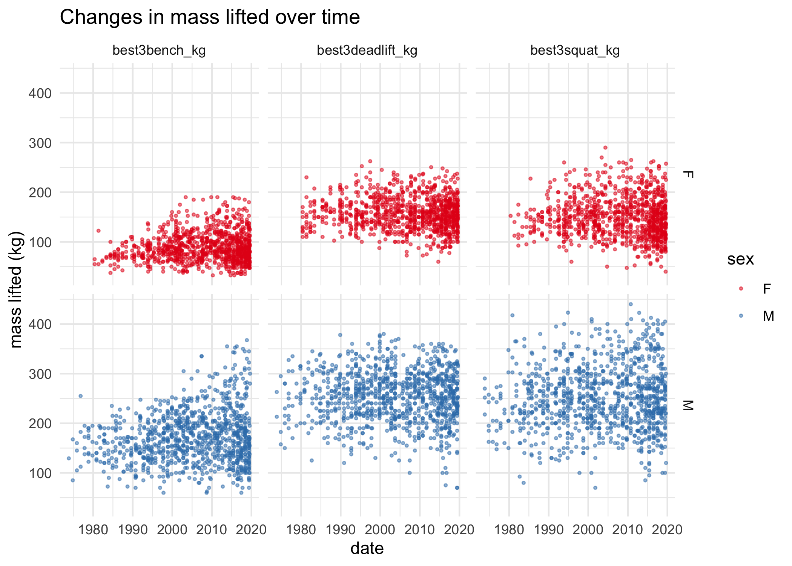
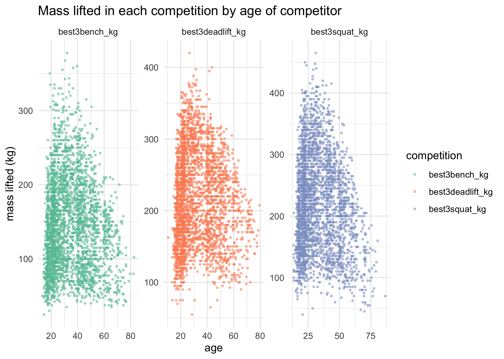
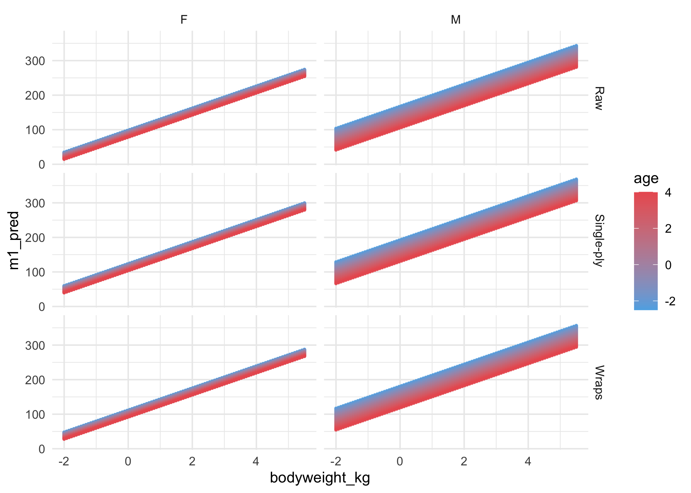
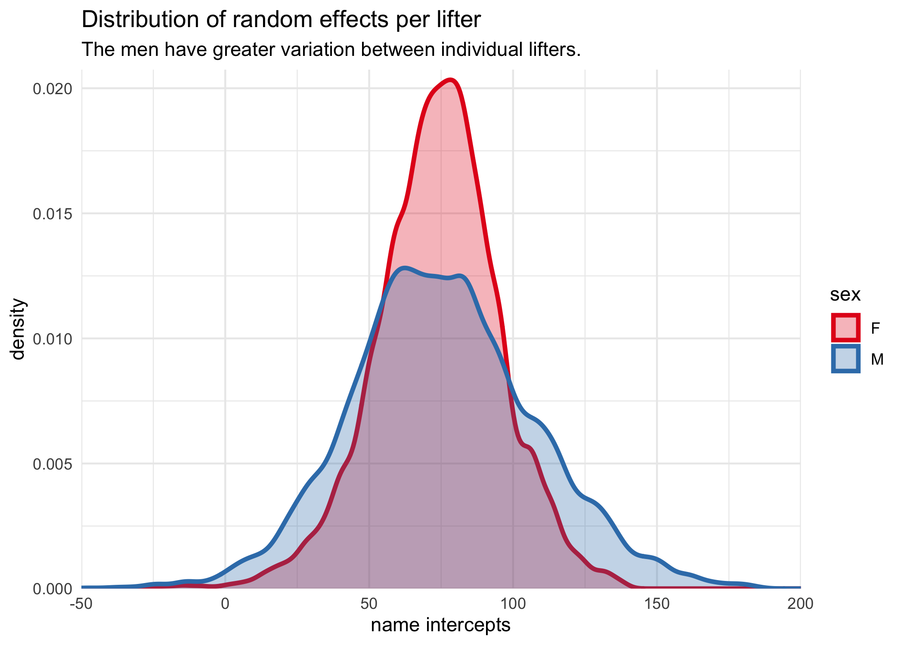
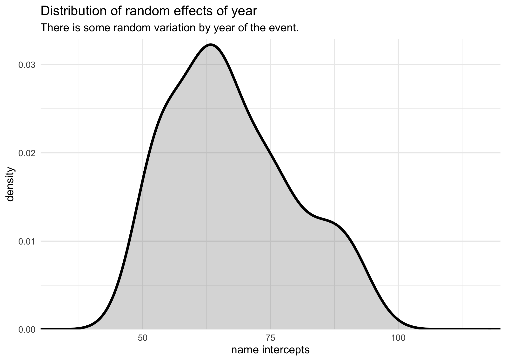

International Powerlifting
================
Joshua Cook
June 16, 2020

## Setup

TidyTuesday link:
<https://github.com/rfordatascience/tidytuesday/tree/master/data/2019/2019-10-08>

``` r
knitr::opts_chunk$set(echo = TRUE, 
                      comment = "#>", 
                      cache = TRUE, 
                      dpi = 300)

library(mustashe)
library(glue)
library(magrittr)
library(tidyverse)
library(conflicted)

conflict_prefer("filter", "dplyr")
conflict_prefer("select", "dplyr")

blue <- "#5eafe6"
red <- "#eb5e60"

theme_set(theme_minimal())
```

## Data

``` r
ipf_lifts <- read_csv(
    "https://raw.githubusercontent.com/rfordatascience/tidytuesday/master/data/2019/2019-10-08/ipf_lifts.csv"
) %>%
    janitor::clean_names()
```

    #> Parsed with column specification:
    #> cols(
    #>   name = col_character(),
    #>   sex = col_character(),
    #>   event = col_character(),
    #>   equipment = col_character(),
    #>   age = col_double(),
    #>   age_class = col_character(),
    #>   division = col_character(),
    #>   bodyweight_kg = col_double(),
    #>   weight_class_kg = col_character(),
    #>   best3squat_kg = col_double(),
    #>   best3bench_kg = col_double(),
    #>   best3deadlift_kg = col_double(),
    #>   place = col_character(),
    #>   date = col_date(format = ""),
    #>   federation = col_character(),
    #>   meet_name = col_character()
    #> )

## EDA

``` r
ipf_lifts %>%
    naniar::miss_var_summary()
```

    #> # A tibble: 16 x 3
    #>    variable         n_miss pct_miss
    #>    <chr>             <int>    <dbl>
    #>  1 best3deadlift_kg  14028 34.1    
    #>  2 best3squat_kg     13698 33.3    
    #>  3 age                2906  7.06   
    #>  4 age_class          2884  7.01   
    #>  5 best3bench_kg      2462  5.98   
    #>  6 division            627  1.52   
    #>  7 bodyweight_kg       187  0.454  
    #>  8 weight_class_kg       1  0.00243
    #>  9 name                  0  0      
    #> 10 sex                   0  0      
    #> 11 event                 0  0      
    #> 12 equipment             0  0      
    #> 13 place                 0  0      
    #> 14 date                  0  0      
    #> 15 federation            0  0      
    #> 16 meet_name             0  0

``` r
ipf_lifts %>%
    select(date, name, sex, best3deadlift_kg, best3squat_kg, best3bench_kg) %>%
    pivot_longer(-c(date, name, sex), names_to = "comp", values_to = "kg") %>%
    filter(!is.na(kg)) %>%
    group_by(sex, comp) %>%
    sample_n(1e3) %>%
    ungroup() %>%
    ggplot(aes(date, kg)) +
    facet_grid(sex ~ comp) +
    geom_point(aes(color = sex), size = 0.6, alpha = 0.5) +
    scale_color_brewer(palette = "Set1") +
    labs(x = "date",
         y = "mass lifted (kg)",
         color = "sex",
         title = "Changes in mass lifted over time")
```

<!-- -->

``` r
ipf_lifts %>%
    filter(!is.na(age)) %>%
    select(name, age, best3deadlift_kg, best3squat_kg, best3bench_kg) %>%
    pivot_longer(-c(name, age), names_to = "comp", values_to = "kg") %>%
    filter(!is.na(kg)) %>%
    group_by(comp) %>%
    sample_n(3e3) %>%
    ungroup() %>%
    ggplot(aes(x = age, y = kg)) +
    facet_wrap(~ comp, scales = "free", nrow = 1) +
    geom_point(aes(color = comp), size = 0.6, alpha = 0.5) +
    scale_color_brewer(palette = "Set2") +
    labs(x = "age",
         y = "mass lifted (kg)",
         color = "competition",
         title = "Mass lifted in each competition by age of competitor")
```

<!-- -->

``` r
table(ipf_lifts$equipment)
```

    #> 
    #>        Raw Single-ply      Wraps 
    #>       7567      33309        276

## Modeling

### Modeling 1. Linear models to see what factors are important for bench press.

``` r
scale2 <- function(x, na.rm = FALSE) {
    (x - mean(x, na.rm = na.rm)) / sd(x, na.rm = na.rm)
}

modeling_data1 <- ipf_lifts %>%
    select(name, sex, equipment, age, bodyweight_kg, best3bench_kg, date) %>%
    filter_all(all_vars(!is.na(.))) %>%
    mutate(sex = as.numeric(sex == "M"),
           age = scale2(age),
           bodyweight_kg = scale2(bodyweight_kg),
           year = lubridate::year(date)) %>%
    select(-date)

modeling_data1
```

    #> # A tibble: 35,889 x 7
    #>    name                sex equipment      age bodyweight_kg best3bench_kg  year
    #>    <chr>             <dbl> <chr>        <dbl>         <dbl>         <dbl> <dbl>
    #>  1 David Mannering       1 Single-ply -0.727         -0.533          132.  1985
    #>  2 Eddy Pengelly         1 Single-ply  0.0550        -0.533          158.  1985
    #>  3 Nanda Talambanua      1 Single-ply -1.03          -0.533          110   1985
    #>  4 Wilfried Dörner       1 Single-ply -0.149         -0.533          140   1985
    #>  5 Claudio Ardini        1 Single-ply -0.217          0.370          215   1985
    #>  6 Tokiharu Maeda        1 Single-ply  0.395          0.370          170   1985
    #>  7 Andrzej Stanaszek     1 Raw        -0.897         -1.19           158.  1993
    #>  8 Christian Klein       1 Single-ply -0.829         -1.17           125   1993
    #>  9 Štefan Koľšovský      1 Single-ply -0.217         -1.19           115   1993
    #> 10 Svein Walstad         1 Single-ply -0.625         -1.27           102.  1993
    #> # … with 35,879 more rows

``` r
m1_age <- lm(best3bench_kg ~ 1 + age, data = modeling_data1)
summary(m1_age)
```

    #> 
    #> Call:
    #> lm(formula = best3bench_kg ~ 1 + age, data = modeling_data1)
    #> 
    #> Residuals:
    #>      Min       1Q   Median       3Q      Max 
    #> -308.270  -48.690   -5.104   40.063  269.145 
    #> 
    #> Coefficients:
    #>             Estimate Std. Error t value Pr(>|t|)    
    #> (Intercept) 145.2397     0.3202 453.534  < 2e-16 ***
    #> age          -2.4494     0.3202  -7.649 2.08e-14 ***
    #> ---
    #> Signif. codes:  0 '***' 0.001 '**' 0.01 '*' 0.05 '.' 0.1 ' ' 1
    #> 
    #> Residual standard error: 60.67 on 35887 degrees of freedom
    #> Multiple R-squared:  0.001628,   Adjusted R-squared:  0.0016 
    #> F-statistic:  58.5 on 1 and 35887 DF,  p-value: 2.082e-14

``` r
m1_age_sex <- lm(best3bench_kg ~ 1 + age + sex, data = modeling_data1)
summary(m1_age_sex)
```

    #> 
    #> Call:
    #> lm(formula = best3bench_kg ~ 1 + age + sex, data = modeling_data1)
    #> 
    #> Residuals:
    #>     Min      1Q  Median      3Q     Max 
    #> -342.58  -29.71   -5.07   25.47  239.14 
    #> 
    #> Coefficients:
    #>             Estimate Std. Error t value Pr(>|t|)    
    #> (Intercept)  89.8176     0.4145  216.68   <2e-16 ***
    #> age          -6.8163     0.2432  -28.03   <2e-16 ***
    #> sex          84.3316     0.5124  164.59   <2e-16 ***
    #> ---
    #> Signif. codes:  0 '***' 0.001 '**' 0.01 '*' 0.05 '.' 0.1 ' ' 1
    #> 
    #> Residual standard error: 45.8 on 35886 degrees of freedom
    #> Multiple R-squared:  0.4311, Adjusted R-squared:  0.4311 
    #> F-statistic: 1.36e+04 on 2 and 35886 DF,  p-value: < 2.2e-16

``` r
m1_agesex <- lm(best3bench_kg ~ 1 + age * sex, data = modeling_data1)
summary(m1_agesex)
```

    #> 
    #> Call:
    #> lm(formula = best3bench_kg ~ 1 + age * sex, data = modeling_data1)
    #> 
    #> Residuals:
    #>     Min      1Q  Median      3Q     Max 
    #> -344.43  -29.43   -5.19   25.70  238.68 
    #> 
    #> Coefficients:
    #>             Estimate Std. Error t value Pr(>|t|)    
    #> (Intercept)  90.3035     0.4178 216.143  < 2e-16 ***
    #> age          -3.6000     0.4408  -8.166 3.28e-16 ***
    #> sex          83.9563     0.5136 163.456  < 2e-16 ***
    #> age:sex      -4.6193     0.5283  -8.744  < 2e-16 ***
    #> ---
    #> Signif. codes:  0 '***' 0.001 '**' 0.01 '*' 0.05 '.' 0.1 ' ' 1
    #> 
    #> Residual standard error: 45.75 on 35885 degrees of freedom
    #> Multiple R-squared:  0.4323, Adjusted R-squared:  0.4323 
    #> F-statistic:  9109 on 3 and 35885 DF,  p-value: < 2.2e-16

``` r
anova(m1_age, m1_age_sex, m1_agesex)
```

    #> Analysis of Variance Table
    #> 
    #> Model 1: best3bench_kg ~ 1 + age
    #> Model 2: best3bench_kg ~ 1 + age + sex
    #> Model 3: best3bench_kg ~ 1 + age * sex
    #>   Res.Df       RSS Df Sum of Sq         F    Pr(>F)    
    #> 1  35887 132084039                                     
    #> 2  35886  75266242  1  56817797 27146.971 < 2.2e-16 ***
    #> 3  35885  75106228  1    160014    76.453 < 2.2e-16 ***
    #> ---
    #> Signif. codes:  0 '***' 0.001 '**' 0.01 '*' 0.05 '.' 0.1 ' ' 1

``` r
AIC(m1_age, m1_age_sex, m1_agesex)
```

    #>            df      AIC
    #> m1_age      3 396530.6
    #> m1_age_sex  4 376348.4
    #> m1_agesex   5 376274.0

``` r
m1_agesex_bdywt <- lm(best3bench_kg ~ 1 + age * sex + bodyweight_kg, 
                      data = modeling_data1)
summary(m1_agesex_bdywt)
```

    #> 
    #> Call:
    #> lm(formula = best3bench_kg ~ 1 + age * sex + bodyweight_kg, data = modeling_data1)
    #> 
    #> Residuals:
    #>     Min      1Q  Median      3Q     Max 
    #> -354.67  -22.71   -2.13   20.07  155.01 
    #> 
    #> Coefficients:
    #>               Estimate Std. Error t value Pr(>|t|)    
    #> (Intercept)   110.0293     0.3531  311.57   <2e-16 ***
    #> age            -3.7536     0.3458  -10.86   <2e-16 ***
    #> sex            54.0356     0.4496  120.18   <2e-16 ***
    #> bodyweight_kg  31.7823     0.2121  149.83   <2e-16 ***
    #> age:sex        -5.8193     0.4144  -14.04   <2e-16 ***
    #> ---
    #> Signif. codes:  0 '***' 0.001 '**' 0.01 '*' 0.05 '.' 0.1 ' ' 1
    #> 
    #> Residual standard error: 35.88 on 35884 degrees of freedom
    #> Multiple R-squared:  0.6508, Adjusted R-squared:  0.6507 
    #> F-statistic: 1.672e+04 on 4 and 35884 DF,  p-value: < 2.2e-16

``` r
m1_agesex_bdywt_eqpt <- lm(
    best3bench_kg ~ 1 + age * sex + bodyweight_kg + equipment, 
    data = modeling_data1
)
summary(m1_agesex_bdywt_eqpt)
```

    #> 
    #> Call:
    #> lm(formula = best3bench_kg ~ 1 + age * sex + bodyweight_kg + 
    #>     equipment, data = modeling_data1)
    #> 
    #> Residuals:
    #>     Min      1Q  Median      3Q     Max 
    #> -359.81  -21.49   -1.75   19.67  150.00 
    #> 
    #> Coefficients:
    #>                     Estimate Std. Error t value Pr(>|t|)    
    #> (Intercept)          90.9496     0.4805 189.263  < 2e-16 ***
    #> age                  -3.1654     0.3318  -9.541  < 2e-16 ***
    #> sex                  52.7927     0.4321 122.175  < 2e-16 ***
    #> bodyweight_kg        31.9414     0.2035 156.964  < 2e-16 ***
    #> equipmentSingle-ply  25.1561     0.4496  55.955  < 2e-16 ***
    #> equipmentWraps       13.1556     4.2587   3.089  0.00201 ** 
    #> age:sex              -6.5804     0.3977 -16.546  < 2e-16 ***
    #> ---
    #> Signif. codes:  0 '***' 0.001 '**' 0.01 '*' 0.05 '.' 0.1 ' ' 1
    #> 
    #> Residual standard error: 34.41 on 35882 degrees of freedom
    #> Multiple R-squared:  0.6788, Adjusted R-squared:  0.6788 
    #> F-statistic: 1.264e+04 on 6 and 35882 DF,  p-value: < 2.2e-16

``` r
anova(m1_age, m1_age_sex, m1_agesex, m1_agesex_bdywt, m1_agesex_bdywt_eqpt)
```

    #> Analysis of Variance Table
    #> 
    #> Model 1: best3bench_kg ~ 1 + age
    #> Model 2: best3bench_kg ~ 1 + age + sex
    #> Model 3: best3bench_kg ~ 1 + age * sex
    #> Model 4: best3bench_kg ~ 1 + age * sex + bodyweight_kg
    #> Model 5: best3bench_kg ~ 1 + age * sex + bodyweight_kg + equipment
    #>   Res.Df       RSS Df Sum of Sq        F    Pr(>F)    
    #> 1  35887 132084039                                    
    #> 2  35886  75266242  1  56817797 47980.22 < 2.2e-16 ***
    #> 3  35885  75106228  1    160014   135.12 < 2.2e-16 ***
    #> 4  35884  46202225  1  28904004 24408.21 < 2.2e-16 ***
    #> 5  35882  42491178  2   3711046  1566.91 < 2.2e-16 ***
    #> ---
    #> Signif. codes:  0 '***' 0.001 '**' 0.01 '*' 0.05 '.' 0.1 ' ' 1

``` r
AIC(m1_age, m1_age_sex, m1_agesex, m1_agesex_bdywt, m1_agesex_bdywt_eqpt)
```

    #>                      df      AIC
    #> m1_age                3 396530.6
    #> m1_age_sex            4 376348.4
    #> m1_agesex             5 376274.0
    #> m1_agesex_bdywt       6 358838.5
    #> m1_agesex_bdywt_eqpt  8 355837.4

``` r
age_seq <- seq(-2.5, 4, length.out = 100)
bdywt_seq <- seq(-2, 5.5, length.out = 100)
eqpt_seq <- unique(modeling_data1$equipment)
pred_data <- tibble(sex = 0:1) %>%
    mutate(age = map(row_number(), ~ age_seq)) %>%
    unnest(age) %>%
    mutate(bodyweight_kg = map(row_number(), ~ bdywt_seq)) %>%
    unnest(bodyweight_kg) %>%
    mutate(equipment = map(row_number(), ~ eqpt_seq)) %>%
    unnest(equipment)

pred_data
```

    #> # A tibble: 60,000 x 4
    #>      sex   age bodyweight_kg equipment 
    #>    <int> <dbl>         <dbl> <chr>     
    #>  1     0  -2.5         -2    Single-ply
    #>  2     0  -2.5         -2    Raw       
    #>  3     0  -2.5         -2    Wraps     
    #>  4     0  -2.5         -1.92 Single-ply
    #>  5     0  -2.5         -1.92 Raw       
    #>  6     0  -2.5         -1.92 Wraps     
    #>  7     0  -2.5         -1.85 Single-ply
    #>  8     0  -2.5         -1.85 Raw       
    #>  9     0  -2.5         -1.85 Wraps     
    #> 10     0  -2.5         -1.77 Single-ply
    #> # … with 59,990 more rows

``` r
pred_data$m1_pred <- predict(m1_agesex_bdywt_eqpt, newdata = pred_data)
```

``` r
pred_data %>%
    mutate(sex = ifelse(sex == 0, "F", "M")) %>%
    ggplot(aes(x = bodyweight_kg, y = m1_pred)) +
    facet_grid(equipment ~ sex) +
    geom_point(aes(color = age), size = 0.5, alpha = 0.5) +
    scale_color_gradient(low = blue, high = red)
```

<!-- -->

### Modeling 2. Mixed-effects model to identify importance of factors with varying intercepts.

``` r
library(lme4)
```

    #> Loading required package: Matrix

    #> 
    #> Attaching package: 'Matrix'

    #> The following objects are masked from 'package:tidyr':
    #> 
    #>     expand, pack, unpack

``` r
m2 <- lm(
    best3bench_kg ~ 1 + equipment + sex + age + bodyweight_kg,
    data = modeling_data1
)
summary(m2)
```

    #> 
    #> Call:
    #> lm(formula = best3bench_kg ~ 1 + equipment + sex + age + bodyweight_kg, 
    #>     data = modeling_data1)
    #> 
    #> Residuals:
    #>     Min      1Q  Median      3Q     Max 
    #> -357.11  -21.75   -1.68   19.67  149.65 
    #> 
    #> Coefficients:
    #>                     Estimate Std. Error t value Pr(>|t|)    
    #> (Intercept)          90.4102     0.4813  187.86  < 2e-16 ***
    #> equipmentSingle-ply  24.9035     0.4510   55.22  < 2e-16 ***
    #> equipmentWraps       13.5100     4.2748    3.16  0.00158 ** 
    #> sex                  53.3983     0.4322  123.55  < 2e-16 ***
    #> age                  -7.7455     0.1836  -42.20  < 2e-16 ***
    #> bodyweight_kg        31.8752     0.2042  156.08  < 2e-16 ***
    #> ---
    #> Signif. codes:  0 '***' 0.001 '**' 0.01 '*' 0.05 '.' 0.1 ' ' 1
    #> 
    #> Residual standard error: 34.54 on 35883 degrees of freedom
    #> Multiple R-squared:  0.6764, Adjusted R-squared:  0.6763 
    #> F-statistic: 1.5e+04 on 5 and 35883 DF,  p-value: < 2.2e-16

``` r
m2_me_nameyear <- lmer(
    best3bench_kg ~ 1 + equipment + sex + age + bodyweight_kg + (1|name) + (1|year),
    data = modeling_data1
)
summary(m2_me_nameyear)
```

    #> Linear mixed model fit by REML ['lmerMod']
    #> Formula: best3bench_kg ~ 1 + equipment + sex + age + bodyweight_kg + (1 |  
    #>     name) + (1 | year)
    #>    Data: modeling_data1
    #> 
    #> REML criterion at convergence: 323569.6
    #> 
    #> Scaled residuals: 
    #>      Min       1Q   Median       3Q      Max 
    #> -19.3044  -0.3431   0.0203   0.3858   7.5230 
    #> 
    #> Random effects:
    #>  Groups   Name        Variance Std.Dev.
    #>  name     (Intercept) 832.3    28.85   
    #>  year     (Intercept) 145.3    12.05   
    #>  Residual             192.1    13.86   
    #> Number of obs: 35889, groups:  name, 15404; year, 47
    #> 
    #> Fixed effects:
    #>                     Estimate Std. Error t value
    #> (Intercept)          67.4047     1.9216  35.078
    #> equipmentSingle-ply  35.2401     0.3792  92.933
    #> equipmentWraps       21.9343     4.4890   4.886
    #> sex                  51.3497     0.5994  85.672
    #> age                  -4.7843     0.2310 -20.708
    #> bodyweight_kg        33.5320     0.2582 129.862
    #> 
    #> Correlation of Fixed Effects:
    #>             (Intr) eqpmS- eqpmnW sex    age   
    #> eqpmntSngl- -0.168                            
    #> equpmntWrps -0.173  0.060                     
    #> sex         -0.231 -0.002 -0.007              
    #> age          0.093 -0.035  0.024 -0.091       
    #> bodywght_kg  0.099 -0.017  0.004 -0.413 -0.085

``` r
m2_me_name <- lmer(
    best3bench_kg ~ 1 + equipment + sex + age + bodyweight_kg + (1|name),
    data = modeling_data1
)
summary(m2_me_name)
```

    #> Linear mixed model fit by REML ['lmerMod']
    #> Formula: best3bench_kg ~ 1 + equipment + sex + age + bodyweight_kg + (1 |  
    #>     name)
    #>    Data: modeling_data1
    #> 
    #> REML criterion at convergence: 326954.8
    #> 
    #> Scaled residuals: 
    #>      Min       1Q   Median       3Q      Max 
    #> -18.6405  -0.3399   0.0102   0.3699   7.1757 
    #> 
    #> Random effects:
    #>  Groups   Name        Variance Std.Dev.
    #>  name     (Intercept) 938.5    30.64   
    #>  Residual             210.1    14.50   
    #> Number of obs: 35889, groups:  name, 15404
    #> 
    #> Fixed effects:
    #>                     Estimate Std. Error t value
    #> (Intercept)          87.2505     0.5522 158.017
    #> equipmentSingle-ply  26.4461     0.3459  76.461
    #> equipmentWraps       22.7206     2.3429   9.697
    #> sex                  46.1061     0.6275  73.475
    #> age                   0.9777     0.2211   4.423
    #> bodyweight_kg        35.2921     0.2711 130.198
    #> 
    #> Correlation of Fixed Effects:
    #>             (Intr) eqpmS- eqpmnW sex    age   
    #> eqpmntSngl- -0.407                            
    #> equpmntWrps -0.048  0.145                     
    #> sex         -0.746 -0.064 -0.026              
    #> age          0.021  0.146  0.075 -0.031       
    #> bodywght_kg  0.284  0.024  0.015 -0.402 -0.148

``` r
AIC(m2, m2_me_nameyear, m2_me_name)
```

    #>                df      AIC
    #> m2              7 356108.2
    #> m2_me_nameyear  9 323587.6
    #> m2_me_name      8 326970.8

``` r
m2_me_nameyear_coef <- coef(m2_me_nameyear)
```

``` r
as.data.frame(m2_me_nameyear_coef$name) %>%
    rownames_to_column(var = "name") %>%
    as_tibble() %>%
    janitor::clean_names() %>%
    left_join(modeling_data1 %>% select(name, sex), by = "name") %>%
    mutate(sex.y = ifelse(sex.y == 0, "F", "M")) %>%
    ggplot(aes(intercept, color = sex.y, fill = sex.y)) +
    geom_density(size = 1.2, alpha = 0.3) +
    scale_color_brewer(palette = "Set1") +
    scale_fill_brewer(palette = "Set1") +
    scale_x_continuous(limits = c(-50, 200), expand = c(0, 0)) +
    scale_y_continuous(expand = expansion(mult = c(0, 0.02))) +
    labs(x = "name intercepts",
         y = "density",
         title = "Distribution of random effects per lifter",
         subtitle = "The men have greater variation between individual lifters.",
         color = "sex", fill = "sex")
```

    #> Warning: Removed 8 rows containing non-finite values (stat_density).

<!-- -->

``` r
as.data.frame(m2_me_nameyear_coef$year) %>%
    rownames_to_column(var = "year") %>%
    as_tibble() %>%
    janitor::clean_names() %>%
    ggplot(aes(intercept)) +
    geom_density(fill = "grey50", size = 1.2, alpha = 0.3) +
    scale_x_continuous(limits = c(30, 120), expand = c(0, 0)) +
    scale_y_continuous(expand = expansion(mult = c(0, 0.02))) +
    labs(x = "name intercepts",
         y = "density",
         title = "Distribution of random effects of year",
         subtitle = "There is some random variation by year of the event.")
```

<!-- -->
