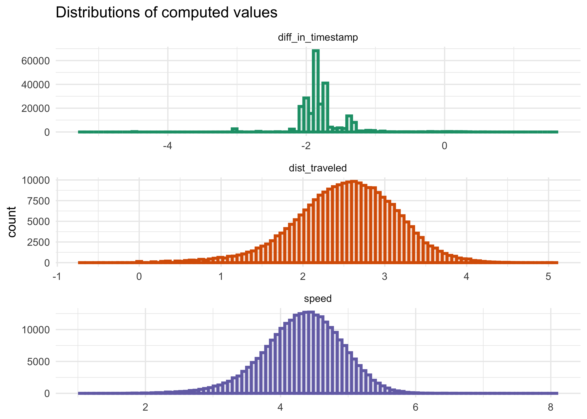
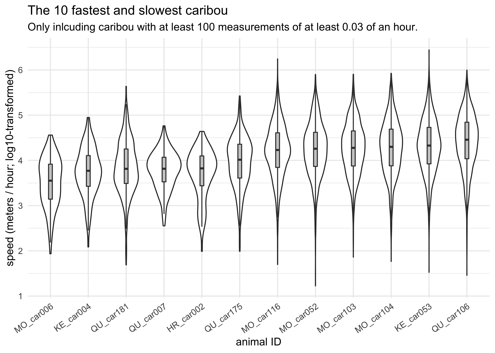
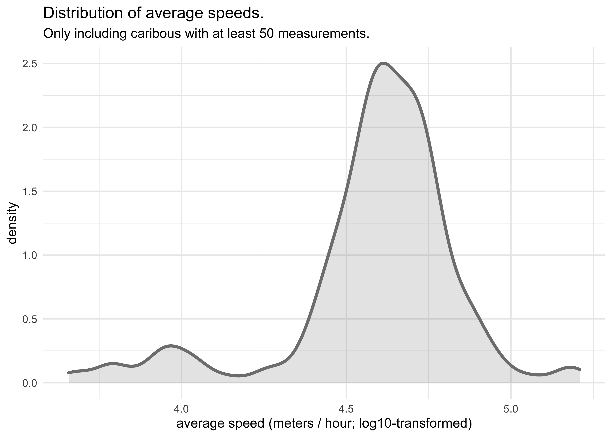
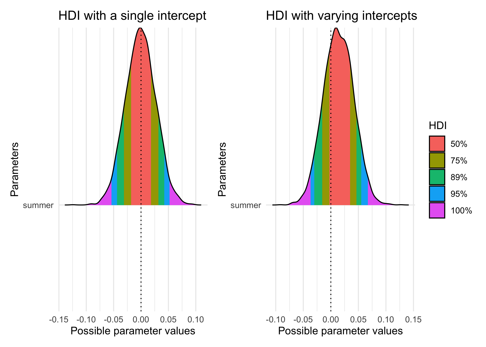
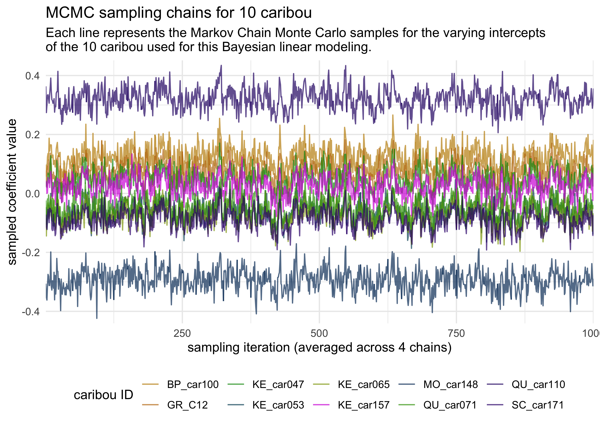
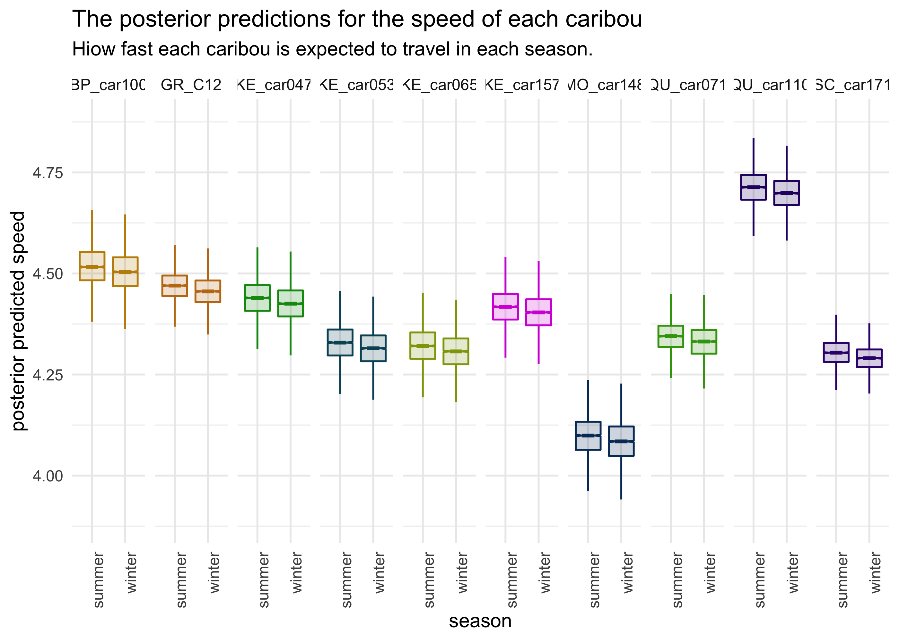

Caribou Location Tracking
================
Joshua Cook
June 23, 2020

## Setup

TidyTuesday link:
<https://github.com/rfordatascience/tidytuesday/blob/master/data/2020/2020-06-23/readme.md>

``` r
knitr::opts_chunk$set(echo = TRUE, comment = "#>", cache = TRUE, dpi = 400)

library(mustashe)
library(glue)
library(magrittr)
library(lubridate)
library(easystats)
```

    ## # Attaching packages
    ## ✔ insight     0.8.5.1   ✔ bayestestR  0.7.0  
    ## ✔ performance 0.4.7     ✔ parameters  0.8.0  
    ## ✔ see         0.5.1     ✔ effectsize  0.3.1.1
    ## ✔ correlation 0.3.0     ✔ modelbased  0.2.0

``` r
library(rstanarm)
library(tidybayes)
library(patchwork)
library(tidyverse)
library(conflicted)

conflict_prefer("filter", "dplyr")
conflict_prefer("select", "dplyr")
conflict_prefer("setdiff", "dplyr")

blue <- "#5eafe6"
red <- "#eb5e60"
light_grey <- "grey80"
grey <- "grey50"
dark_grey <- "grey25"

theme_set(theme_minimal())

# To shutup `summarise()`.
options(dplyr.summarise.inform = FALSE)

memoise_cache <- memoise::cache_filesystem("./.memoise")

set.seed(0)
```

## Data

``` r
caribou_indiv <- read_csv(
    "https://raw.githubusercontent.com/rfordatascience/tidytuesday/master/data/2020/2020-06-23/individuals.csv"
) %>%
    janitor::clean_names()
```

    #> Parsed with column specification:
    #> cols(
    #>   animal_id = col_character(),
    #>   sex = col_character(),
    #>   life_stage = col_character(),
    #>   pregnant = col_logical(),
    #>   with_calf = col_logical(),
    #>   death_cause = col_character(),
    #>   study_site = col_character(),
    #>   deploy_on_longitude = col_double(),
    #>   deploy_on_latitude = col_double(),
    #>   deploy_on_comments = col_character(),
    #>   deploy_off_longitude = col_double(),
    #>   deploy_off_latitude = col_double(),
    #>   deploy_off_type = col_character(),
    #>   deploy_off_comments = col_character()
    #> )

``` r
caribou_indiv
```

    #> # A tibble: 286 x 14
    #>    animal_id sex   life_stage pregnant with_calf death_cause study_site
    #>    <chr>     <chr> <chr>      <lgl>    <lgl>     <chr>       <chr>     
    #>  1 HR_151.5… f     <NA>       NA       NA        <NA>        Hart Rang…
    #>  2 GR_C04    f     <NA>       NA       NA        <NA>        Graham    
    #>  3 GR_C03    f     <NA>       NA       NA        <NA>        Graham    
    #>  4 HR_151.8… f     <NA>       NA       NA        <NA>        Hart Rang…
    #>  5 HR_151.7… f     <NA>       NA       NA        <NA>        Hart Rang…
    #>  6 HR_151.7… f     <NA>       NA       NA        <NA>        Hart Rang…
    #>  7 GR_C18    f     <NA>       NA       NA        <NA>        Graham    
    #>  8 KE_car120 f     <NA>       NA       NA        <NA>        Kennedy   
    #>  9 KE_car118 f     <NA>       NA       NA        Unknown     Kennedy   
    #> 10 HR_151.5… f     <NA>       NA       NA        <NA>        Hart Rang…
    #> # … with 276 more rows, and 7 more variables: deploy_on_longitude <dbl>,
    #> #   deploy_on_latitude <dbl>, deploy_on_comments <chr>,
    #> #   deploy_off_longitude <dbl>, deploy_off_latitude <dbl>,
    #> #   deploy_off_type <chr>, deploy_off_comments <chr>

``` r
naniar::miss_var_summary(caribou_indiv)
```

    #> # A tibble: 14 x 3
    #>    variable             n_miss pct_miss
    #>    <chr>                 <int>    <dbl>
    #>  1 pregnant                267     93.4
    #>  2 death_cause             232     81.1
    #>  3 deploy_off_longitude    230     80.4
    #>  4 deploy_off_latitude     230     80.4
    #>  5 deploy_off_comments     230     80.4
    #>  6 life_stage              219     76.6
    #>  7 with_calf               202     70.6
    #>  8 deploy_on_comments      199     69.6
    #>  9 deploy_on_longitude     133     46.5
    #> 10 deploy_on_latitude      133     46.5
    #> 11 animal_id                 0      0  
    #> 12 sex                       0      0  
    #> 13 study_site                0      0  
    #> 14 deploy_off_type           0      0

``` r
caribou_locations <- read_csv(
    "https://raw.githubusercontent.com/rfordatascience/tidytuesday/master/data/2020/2020-06-23/locations.csv"
) %>%
    janitor::clean_names()
```

    #> Parsed with column specification:
    #> cols(
    #>   event_id = col_double(),
    #>   animal_id = col_character(),
    #>   study_site = col_character(),
    #>   season = col_character(),
    #>   timestamp = col_datetime(format = ""),
    #>   longitude = col_double(),
    #>   latitude = col_double()
    #> )

``` r
caribou_locations
```

    #> # A tibble: 249,450 x 7
    #>      event_id animal_id study_site season timestamp           longitude latitude
    #>         <dbl> <chr>     <chr>      <chr>  <dttm>                  <dbl>    <dbl>
    #>  1 2259197332 GR_C01    Graham     Winter 2001-02-21 05:00:00     -123.     56.2
    #>  2 2259197333 GR_C01    Graham     Winter 2001-02-21 09:00:00     -123.     56.2
    #>  3 2259197334 GR_C01    Graham     Winter 2001-02-21 13:00:00     -123.     56.2
    #>  4 2259197335 GR_C01    Graham     Winter 2001-02-21 17:01:00     -123.     56.2
    #>  5 2259197336 GR_C01    Graham     Winter 2001-02-21 21:00:00     -123.     56.2
    #>  6 2259197337 GR_C01    Graham     Winter 2001-02-22 01:00:00     -123.     56.2
    #>  7 2259197338 GR_C01    Graham     Winter 2001-02-22 05:00:00     -123.     56.2
    #>  8 2259197339 GR_C01    Graham     Winter 2001-02-22 09:00:00     -123.     56.2
    #>  9 2259197340 GR_C01    Graham     Winter 2001-02-22 13:00:00     -123.     56.2
    #> 10 2259197341 GR_C01    Graham     Winter 2001-02-22 17:00:00     -123.     56.2
    #> # … with 249,440 more rows

``` r
naniar::miss_var_summary(caribou_locations)
```

    #> # A tibble: 7 x 3
    #>   variable   n_miss pct_miss
    #>   <chr>       <int>    <dbl>
    #> 1 event_id        0        0
    #> 2 animal_id       0        0
    #> 3 study_site      0        0
    #> 4 season          0        0
    #> 5 timestamp       0        0
    #> 6 longitude       0        0
    #> 7 latitude        0        0

``` r
n_distinct(caribou_locations$animal_id)
```

    #> [1] 260

``` r
caribou_locations %>%
    count(animal_id, sort = TRUE)
```

    #> # A tibble: 260 x 2
    #>    animal_id     n
    #>    <chr>     <int>
    #>  1 QU_car143  4885
    #>  2 NA_car133  4700
    #>  3 NA_car132  4247
    #>  4 MO_car150  3973
    #>  5 SC_car171  3510
    #>  6 QU_car163  3423
    #>  7 BP_car145  3226
    #>  8 QU_car159  3193
    #>  9 QU_car172  3164
    #> 10 MO_car147  3106
    #> # … with 250 more rows

## Data preparation

``` r
# Get the distance between each longitude and latitude point (in meters).
get_distance_between_event <- function(lng, lat) {
    dist_traveled <- c(0)
    for (i in seq(2, length(lat))) {
        d <- geosphere::distm(c(lng[[i-1]], lat[[i-1]]),
                              c(lng[[i]], lat[[i]]),
                              fun = geosphere::distHaversine)
        dist_traveled <- c(dist_traveled, d)
    }
    return(dist_traveled)
}
get_distance_between_event <- memoise::memoise(get_distance_between_event,
                                               cache = memoise_cache)


caribou_locations %<>%
    arrange(animal_id, timestamp) %>%
    group_by(animal_id) %>%
    filter(n() > 1) %>%
    mutate(dist_traveled = get_distance_between_event(longitude, latitude)) %>%
    ungroup()
```

``` r
# The duration (in hours) between each successive timestamp value.
get_duration_between_event <- function(ts) {
    as.numeric(ts - dplyr::lag(ts, n = 1, default = ts[[1]])) / (1810800)
}
get_duration_between_event <- memoise::memoise(get_duration_between_event,
                                               cache = memoise_cache)


caribou_locations %<>%
    arrange(animal_id, timestamp) %>%
    group_by(animal_id) %>%
    mutate(diff_in_timestamp = get_duration_between_event(timestamp)) %>%
    ungroup()
```

``` r
caribou_locations %<>%
    mutate(speed = dist_traveled / diff_in_timestamp)
```

## EDA

``` r
caribou_locations %>%
    group_by(animal_id) %>%
    slice(-1) %>%
    ungroup() %>%
    select(event_id, dist_traveled, diff_in_timestamp, speed) %>%
    pivot_longer(-event_id) %>%
    ggplot(aes(log10(value))) +
    facet_wrap(~ name, nrow = 3, scales = "free") +
    geom_histogram(aes(color = name, fill = name), size = 1.2, alpha = 0.2, bins = 100) +
    scale_fill_brewer(palette = "Dark2") +
    scale_color_brewer(palette = "Dark2") +
    theme(axis.title.x = element_blank(),
          legend.title = element_blank(),
          legend.position = "none") +
    labs(title = "Distributions of computed values",
         x = "value (log10-transformed)",
         y = "count")
```

    #> Warning: Removed 120 rows containing non-finite values (stat_bin).

<!-- -->

``` r
summary(caribou_locations$diff_in_timestamp)
```

    #>     Min.  1st Qu.   Median     Mean  3rd Qu.     Max. 
    #>  0.00000  0.01193  0.01392  0.03336  0.01789 37.16899

``` r
mean_reading_duration <- mean(caribou_locations$diff_in_timestamp)
```

``` r
top_bottom_fastest_caribou <- caribou_locations %>%
    filter(diff_in_timestamp >= mean_reading_duration) %>%
    group_by(animal_id) %>%
    slice(-1) %>%
    filter(n() > 100) %>%
    summarise(avg_speed = mean(speed)) %>%
    ungroup() %>%
    arrange(avg_speed)
top_bottom_fastest_caribou <- bind_rows(
    head(top_bottom_fastest_caribou),
    tail(top_bottom_fastest_caribou)
)

caribou_locations %>%
    filter(animal_id %in% top_bottom_fastest_caribou$animal_id) %>%
    group_by(animal_id) %>%
    slice(-1) %>%
    ungroup() %>%
    mutate(animal_id = fct_reorder(animal_id, speed, .fun = median)) %>%
    ggplot(aes(animal_id, log10(speed))) +
    geom_violin(fill = "white") +
    geom_boxplot(width = 0.1, outlier.shape = NA, fill = light_grey, color = dark_grey) +
    theme(axis.text.x = element_text(angle = 35, hjust = 1)) +
    labs(x = "animal ID",
         y = "speed (meters / hour; log10-transformed)",
         title = "The 10 fastest and slowest caribou",
         subtitle = glue("Only inlcuding caribou with at least 100 measurements of at least {round(mean_reading_duration, 2)} of an hour."))
```

<!-- -->

``` r
caribou_locations %>%
    group_by(animal_id) %>%
    slice(-1) %>%
    filter(n() >= 50) %>%
    summarise(avg_speed = mean(speed)) %>%
    ungroup() %>%
    ggplot(aes(log10(avg_speed))) +
    geom_density(color = grey, fill = grey, size = 1.2, alpha = 0.2) +
    labs(x = "average speed (meters / hour; log10-transformed)",
         y = "density",
         title = "Distribution of average speeds.",
         subtitle = "Only including caribous with at least 50 measurements.")
```

<!-- -->

``` r
caribou_locations %>%
    distinct(animal_id, study_site) %>%
    count(animal_id) %>%
    filter(n > 1)
```

    #> # A tibble: 0 x 2
    #> # … with 2 variables: animal_id <chr>, n <int>

## Modeling

Model the speed of the caribou with and without varying intercepts.

``` r
d <- caribou_locations %>%
    group_by(animal_id) %>%
    slice(-1) %>%
    filter(n() >= 50) %>%
    ungroup() %>%
    select(animal_id, event_id, season, dist_traveled, diff_in_timestamp, speed) %>%
    mutate(event_id = as.character(event_id),
           summer = as.numeric(season == "Summer"),
           speed = log10(speed)) %>%
    filter(is.finite(speed))

# Sample 10 caribou randomly.
sample_caribou <- d %>%
    count(animal_id) %>%
    filter(n > 1e3) %>%
    sample_n(10) %>%
    jhcutils::u_pull(animal_id)
    
# Sample 1/4 of the data points for each of the 10 random caribou.
d <- d %>% 
    filter(animal_id %in% !!sample_caribou) %>%
    group_by(animal_id) %>%
    sample_frac(0.1) %>%
    ungroup()
```

``` r
naniar::miss_var_summary(d)
```

    #> # A tibble: 7 x 3
    #>   variable          n_miss pct_miss
    #>   <chr>              <int>    <dbl>
    #> 1 animal_id              0        0
    #> 2 event_id               0        0
    #> 3 season                 0        0
    #> 4 dist_traveled          0        0
    #> 5 diff_in_timestamp      0        0
    #> 6 speed                  0        0
    #> 7 summer                 0        0

With a single global intercept.

``` r
stash("caribou_speed_m1", depends_on = "d", {
    caribou_speed_m1 <- stan_glm(
        speed ~ 1 + summer,
        data = d,
        prior_intercept = normal(),
        prior = normal(),
        cores = 1
    )
})
```

    #> Updating stash.

    #> 
    #> SAMPLING FOR MODEL 'continuous' NOW (CHAIN 1).
    #> Chain 1: 
    #> Chain 1: Gradient evaluation took 0.001603 seconds
    #> Chain 1: 1000 transitions using 10 leapfrog steps per transition would take 16.03 seconds.
    #> Chain 1: Adjust your expectations accordingly!
    #> Chain 1: 
    #> Chain 1: 
    #> Chain 1: Iteration:    1 / 2000 [  0%]  (Warmup)
    #> Chain 1: Iteration:  200 / 2000 [ 10%]  (Warmup)
    #> Chain 1: Iteration:  400 / 2000 [ 20%]  (Warmup)
    #> Chain 1: Iteration:  600 / 2000 [ 30%]  (Warmup)
    #> Chain 1: Iteration:  800 / 2000 [ 40%]  (Warmup)
    #> Chain 1: Iteration: 1000 / 2000 [ 50%]  (Warmup)
    #> Chain 1: Iteration: 1001 / 2000 [ 50%]  (Sampling)
    #> Chain 1: Iteration: 1200 / 2000 [ 60%]  (Sampling)
    #> Chain 1: Iteration: 1400 / 2000 [ 70%]  (Sampling)
    #> Chain 1: Iteration: 1600 / 2000 [ 80%]  (Sampling)
    #> Chain 1: Iteration: 1800 / 2000 [ 90%]  (Sampling)
    #> Chain 1: Iteration: 2000 / 2000 [100%]  (Sampling)
    #> Chain 1: 
    #> Chain 1:  Elapsed Time: 0.053816 seconds (Warm-up)
    #> Chain 1:                0.225051 seconds (Sampling)
    #> Chain 1:                0.278867 seconds (Total)
    #> Chain 1: 
    #> 
    #> SAMPLING FOR MODEL 'continuous' NOW (CHAIN 2).
    #> Chain 2: 
    #> Chain 2: Gradient evaluation took 5.1e-05 seconds
    #> Chain 2: 1000 transitions using 10 leapfrog steps per transition would take 0.51 seconds.
    #> Chain 2: Adjust your expectations accordingly!
    #> Chain 2: 
    #> Chain 2: 
    #> Chain 2: Iteration:    1 / 2000 [  0%]  (Warmup)
    #> Chain 2: Iteration:  200 / 2000 [ 10%]  (Warmup)
    #> Chain 2: Iteration:  400 / 2000 [ 20%]  (Warmup)
    #> Chain 2: Iteration:  600 / 2000 [ 30%]  (Warmup)
    #> Chain 2: Iteration:  800 / 2000 [ 40%]  (Warmup)
    #> Chain 2: Iteration: 1000 / 2000 [ 50%]  (Warmup)
    #> Chain 2: Iteration: 1001 / 2000 [ 50%]  (Sampling)
    #> Chain 2: Iteration: 1200 / 2000 [ 60%]  (Sampling)
    #> Chain 2: Iteration: 1400 / 2000 [ 70%]  (Sampling)
    #> Chain 2: Iteration: 1600 / 2000 [ 80%]  (Sampling)
    #> Chain 2: Iteration: 1800 / 2000 [ 90%]  (Sampling)
    #> Chain 2: Iteration: 2000 / 2000 [100%]  (Sampling)
    #> Chain 2: 
    #> Chain 2:  Elapsed Time: 0.096085 seconds (Warm-up)
    #> Chain 2:                0.343543 seconds (Sampling)
    #> Chain 2:                0.439628 seconds (Total)
    #> Chain 2: 
    #> 
    #> SAMPLING FOR MODEL 'continuous' NOW (CHAIN 3).
    #> Chain 3: 
    #> Chain 3: Gradient evaluation took 3.5e-05 seconds
    #> Chain 3: 1000 transitions using 10 leapfrog steps per transition would take 0.35 seconds.
    #> Chain 3: Adjust your expectations accordingly!
    #> Chain 3: 
    #> Chain 3: 
    #> Chain 3: Iteration:    1 / 2000 [  0%]  (Warmup)
    #> Chain 3: Iteration:  200 / 2000 [ 10%]  (Warmup)
    #> Chain 3: Iteration:  400 / 2000 [ 20%]  (Warmup)
    #> Chain 3: Iteration:  600 / 2000 [ 30%]  (Warmup)
    #> Chain 3: Iteration:  800 / 2000 [ 40%]  (Warmup)
    #> Chain 3: Iteration: 1000 / 2000 [ 50%]  (Warmup)
    #> Chain 3: Iteration: 1001 / 2000 [ 50%]  (Sampling)
    #> Chain 3: Iteration: 1200 / 2000 [ 60%]  (Sampling)
    #> Chain 3: Iteration: 1400 / 2000 [ 70%]  (Sampling)
    #> Chain 3: Iteration: 1600 / 2000 [ 80%]  (Sampling)
    #> Chain 3: Iteration: 1800 / 2000 [ 90%]  (Sampling)
    #> Chain 3: Iteration: 2000 / 2000 [100%]  (Sampling)
    #> Chain 3: 
    #> Chain 3:  Elapsed Time: 0.082663 seconds (Warm-up)
    #> Chain 3:                0.260628 seconds (Sampling)
    #> Chain 3:                0.343291 seconds (Total)
    #> Chain 3: 
    #> 
    #> SAMPLING FOR MODEL 'continuous' NOW (CHAIN 4).
    #> Chain 4: 
    #> Chain 4: Gradient evaluation took 3.2e-05 seconds
    #> Chain 4: 1000 transitions using 10 leapfrog steps per transition would take 0.32 seconds.
    #> Chain 4: Adjust your expectations accordingly!
    #> Chain 4: 
    #> Chain 4: 
    #> Chain 4: Iteration:    1 / 2000 [  0%]  (Warmup)
    #> Chain 4: Iteration:  200 / 2000 [ 10%]  (Warmup)
    #> Chain 4: Iteration:  400 / 2000 [ 20%]  (Warmup)
    #> Chain 4: Iteration:  600 / 2000 [ 30%]  (Warmup)
    #> Chain 4: Iteration:  800 / 2000 [ 40%]  (Warmup)
    #> Chain 4: Iteration: 1000 / 2000 [ 50%]  (Warmup)
    #> Chain 4: Iteration: 1001 / 2000 [ 50%]  (Sampling)
    #> Chain 4: Iteration: 1200 / 2000 [ 60%]  (Sampling)
    #> Chain 4: Iteration: 1400 / 2000 [ 70%]  (Sampling)
    #> Chain 4: Iteration: 1600 / 2000 [ 80%]  (Sampling)
    #> Chain 4: Iteration: 1800 / 2000 [ 90%]  (Sampling)
    #> Chain 4: Iteration: 2000 / 2000 [100%]  (Sampling)
    #> Chain 4: 
    #> Chain 4:  Elapsed Time: 0.059736 seconds (Warm-up)
    #> Chain 4:                0.262084 seconds (Sampling)
    #> Chain 4:                0.32182 seconds (Total)
    #> Chain 4:

``` r
summary(caribou_speed_m1)
```

    #> 
    #> Model Info:
    #>  function:     stan_glm
    #>  family:       gaussian [identity]
    #>  formula:      speed ~ 1 + summer
    #>  algorithm:    sampling
    #>  sample:       4000 (posterior sample size)
    #>  priors:       see help('prior_summary')
    #>  observations: 1996
    #>  predictors:   2
    #> 
    #> Estimates:
    #>               mean   sd   10%   50%   90%
    #> (Intercept) 4.4    0.0  4.4   4.4   4.4  
    #> summer      0.0    0.0  0.0   0.0   0.0  
    #> sigma       0.6    0.0  0.6   0.6   0.6  
    #> 
    #> Fit Diagnostics:
    #>            mean   sd   10%   50%   90%
    #> mean_PPD 4.4    0.0  4.4   4.4   4.4  
    #> 
    #> The mean_ppd is the sample average posterior predictive distribution of the outcome variable (for details see help('summary.stanreg')).
    #> 
    #> MCMC diagnostics
    #>               mcse Rhat n_eff
    #> (Intercept)   0.0  1.0  4347 
    #> summer        0.0  1.0  4156 
    #> sigma         0.0  1.0  4411 
    #> mean_PPD      0.0  1.0  4071 
    #> log-posterior 0.0  1.0  1764 
    #> 
    #> For each parameter, mcse is Monte Carlo standard error, n_eff is a crude measure of effective sample size, and Rhat is the potential scale reduction factor on split chains (at convergence Rhat=1).

With varying intercepts for each caribou.

``` r
stash("caribou_speed_m2", depends_on = "d", {
    caribou_speed_m2 <- stan_lmer(
        speed ~ 1 + summer + (1 | animal_id),
        data = d,
        prior_intercept = normal(),
        prior = normal(),
        prior_aux = exponential(),
        prior_covariance = decov(),
        cores = 1
    )
})
```

    #> Updating stash.

    #> 
    #> SAMPLING FOR MODEL 'continuous' NOW (CHAIN 1).
    #> Chain 1: 
    #> Chain 1: Gradient evaluation took 0.000446 seconds
    #> Chain 1: 1000 transitions using 10 leapfrog steps per transition would take 4.46 seconds.
    #> Chain 1: Adjust your expectations accordingly!
    #> Chain 1: 
    #> Chain 1: 
    #> Chain 1: Iteration:    1 / 2000 [  0%]  (Warmup)
    #> Chain 1: Iteration:  200 / 2000 [ 10%]  (Warmup)
    #> Chain 1: Iteration:  400 / 2000 [ 20%]  (Warmup)
    #> Chain 1: Iteration:  600 / 2000 [ 30%]  (Warmup)
    #> Chain 1: Iteration:  800 / 2000 [ 40%]  (Warmup)
    #> Chain 1: Iteration: 1000 / 2000 [ 50%]  (Warmup)
    #> Chain 1: Iteration: 1001 / 2000 [ 50%]  (Sampling)
    #> Chain 1: Iteration: 1200 / 2000 [ 60%]  (Sampling)
    #> Chain 1: Iteration: 1400 / 2000 [ 70%]  (Sampling)
    #> Chain 1: Iteration: 1600 / 2000 [ 80%]  (Sampling)
    #> Chain 1: Iteration: 1800 / 2000 [ 90%]  (Sampling)
    #> Chain 1: Iteration: 2000 / 2000 [100%]  (Sampling)
    #> Chain 1: 
    #> Chain 1:  Elapsed Time: 6.62096 seconds (Warm-up)
    #> Chain 1:                4.52116 seconds (Sampling)
    #> Chain 1:                11.1421 seconds (Total)
    #> Chain 1: 
    #> 
    #> SAMPLING FOR MODEL 'continuous' NOW (CHAIN 2).
    #> Chain 2: 
    #> Chain 2: Gradient evaluation took 0.000118 seconds
    #> Chain 2: 1000 transitions using 10 leapfrog steps per transition would take 1.18 seconds.
    #> Chain 2: Adjust your expectations accordingly!
    #> Chain 2: 
    #> Chain 2: 
    #> Chain 2: Iteration:    1 / 2000 [  0%]  (Warmup)
    #> Chain 2: Iteration:  200 / 2000 [ 10%]  (Warmup)
    #> Chain 2: Iteration:  400 / 2000 [ 20%]  (Warmup)
    #> Chain 2: Iteration:  600 / 2000 [ 30%]  (Warmup)
    #> Chain 2: Iteration:  800 / 2000 [ 40%]  (Warmup)
    #> Chain 2: Iteration: 1000 / 2000 [ 50%]  (Warmup)
    #> Chain 2: Iteration: 1001 / 2000 [ 50%]  (Sampling)
    #> Chain 2: Iteration: 1200 / 2000 [ 60%]  (Sampling)
    #> Chain 2: Iteration: 1400 / 2000 [ 70%]  (Sampling)
    #> Chain 2: Iteration: 1600 / 2000 [ 80%]  (Sampling)
    #> Chain 2: Iteration: 1800 / 2000 [ 90%]  (Sampling)
    #> Chain 2: Iteration: 2000 / 2000 [100%]  (Sampling)
    #> Chain 2: 
    #> Chain 2:  Elapsed Time: 6.83613 seconds (Warm-up)
    #> Chain 2:                5.85434 seconds (Sampling)
    #> Chain 2:                12.6905 seconds (Total)
    #> Chain 2: 
    #> 
    #> SAMPLING FOR MODEL 'continuous' NOW (CHAIN 3).
    #> Chain 3: 
    #> Chain 3: Gradient evaluation took 0.000495 seconds
    #> Chain 3: 1000 transitions using 10 leapfrog steps per transition would take 4.95 seconds.
    #> Chain 3: Adjust your expectations accordingly!
    #> Chain 3: 
    #> Chain 3: 
    #> Chain 3: Iteration:    1 / 2000 [  0%]  (Warmup)
    #> Chain 3: Iteration:  200 / 2000 [ 10%]  (Warmup)
    #> Chain 3: Iteration:  400 / 2000 [ 20%]  (Warmup)
    #> Chain 3: Iteration:  600 / 2000 [ 30%]  (Warmup)
    #> Chain 3: Iteration:  800 / 2000 [ 40%]  (Warmup)
    #> Chain 3: Iteration: 1000 / 2000 [ 50%]  (Warmup)
    #> Chain 3: Iteration: 1001 / 2000 [ 50%]  (Sampling)
    #> Chain 3: Iteration: 1200 / 2000 [ 60%]  (Sampling)
    #> Chain 3: Iteration: 1400 / 2000 [ 70%]  (Sampling)
    #> Chain 3: Iteration: 1600 / 2000 [ 80%]  (Sampling)
    #> Chain 3: Iteration: 1800 / 2000 [ 90%]  (Sampling)
    #> Chain 3: Iteration: 2000 / 2000 [100%]  (Sampling)
    #> Chain 3: 
    #> Chain 3:  Elapsed Time: 6.91855 seconds (Warm-up)
    #> Chain 3:                5.52183 seconds (Sampling)
    #> Chain 3:                12.4404 seconds (Total)
    #> Chain 3: 
    #> 
    #> SAMPLING FOR MODEL 'continuous' NOW (CHAIN 4).
    #> Chain 4: 
    #> Chain 4: Gradient evaluation took 0.000114 seconds
    #> Chain 4: 1000 transitions using 10 leapfrog steps per transition would take 1.14 seconds.
    #> Chain 4: Adjust your expectations accordingly!
    #> Chain 4: 
    #> Chain 4: 
    #> Chain 4: Iteration:    1 / 2000 [  0%]  (Warmup)
    #> Chain 4: Iteration:  200 / 2000 [ 10%]  (Warmup)
    #> Chain 4: Iteration:  400 / 2000 [ 20%]  (Warmup)
    #> Chain 4: Iteration:  600 / 2000 [ 30%]  (Warmup)
    #> Chain 4: Iteration:  800 / 2000 [ 40%]  (Warmup)
    #> Chain 4: Iteration: 1000 / 2000 [ 50%]  (Warmup)
    #> Chain 4: Iteration: 1001 / 2000 [ 50%]  (Sampling)
    #> Chain 4: Iteration: 1200 / 2000 [ 60%]  (Sampling)
    #> Chain 4: Iteration: 1400 / 2000 [ 70%]  (Sampling)
    #> Chain 4: Iteration: 1600 / 2000 [ 80%]  (Sampling)
    #> Chain 4: Iteration: 1800 / 2000 [ 90%]  (Sampling)
    #> Chain 4: Iteration: 2000 / 2000 [100%]  (Sampling)
    #> Chain 4: 
    #> Chain 4:  Elapsed Time: 6.41094 seconds (Warm-up)
    #> Chain 4:                5.93567 seconds (Sampling)
    #> Chain 4:                12.3466 seconds (Total)
    #> Chain 4:

``` r
summary(caribou_speed_m2)
```

    #> 
    #> Model Info:
    #>  function:     stan_lmer
    #>  family:       gaussian [identity]
    #>  formula:      speed ~ 1 + summer + (1 | animal_id)
    #>  algorithm:    sampling
    #>  sample:       4000 (posterior sample size)
    #>  priors:       see help('prior_summary')
    #>  observations: 1996
    #>  groups:       animal_id (10)
    #> 
    #> Estimates:
    #>                                            mean   sd   10%   50%   90%
    #> (Intercept)                               4.4    0.1  4.3   4.4   4.5 
    #> summer                                    0.0    0.0  0.0   0.0   0.0 
    #> b[(Intercept) animal_id:BP_car100]        0.1    0.1  0.0   0.1   0.2 
    #> b[(Intercept) animal_id:GR_C12]           0.1    0.1  0.0   0.1   0.2 
    #> b[(Intercept) animal_id:KE_car047]        0.0    0.1  0.0   0.0   0.1 
    #> b[(Intercept) animal_id:KE_car053]       -0.1    0.1 -0.2  -0.1   0.0 
    #> b[(Intercept) animal_id:KE_car065]       -0.1    0.1 -0.2  -0.1   0.0 
    #> b[(Intercept) animal_id:KE_car157]        0.0    0.1 -0.1   0.0   0.1 
    #> b[(Intercept) animal_id:MO_car148]       -0.3    0.1 -0.4  -0.3  -0.2 
    #> b[(Intercept) animal_id:QU_car071]        0.0    0.1 -0.1   0.0   0.0 
    #> b[(Intercept) animal_id:QU_car110]        0.3    0.1  0.2   0.3   0.4 
    #> b[(Intercept) animal_id:SC_car171]       -0.1    0.1 -0.2  -0.1   0.0 
    #> sigma                                     0.6    0.0  0.6   0.6   0.6 
    #> Sigma[animal_id:(Intercept),(Intercept)]  0.0    0.0  0.0   0.0   0.1 
    #> 
    #> Fit Diagnostics:
    #>            mean   sd   10%   50%   90%
    #> mean_PPD 4.4    0.0  4.4   4.4   4.4  
    #> 
    #> The mean_ppd is the sample average posterior predictive distribution of the outcome variable (for details see help('summary.stanreg')).
    #> 
    #> MCMC diagnostics
    #>                                          mcse Rhat n_eff
    #> (Intercept)                              0.0  1.0   744 
    #> summer                                   0.0  1.0  3260 
    #> b[(Intercept) animal_id:BP_car100]       0.0  1.0   990 
    #> b[(Intercept) animal_id:GR_C12]          0.0  1.0   815 
    #> b[(Intercept) animal_id:KE_car047]       0.0  1.0  1037 
    #> b[(Intercept) animal_id:KE_car053]       0.0  1.0   925 
    #> b[(Intercept) animal_id:KE_car065]       0.0  1.0   920 
    #> b[(Intercept) animal_id:KE_car157]       0.0  1.0   944 
    #> b[(Intercept) animal_id:MO_car148]       0.0  1.0  1045 
    #> b[(Intercept) animal_id:QU_car071]       0.0  1.0   876 
    #> b[(Intercept) animal_id:QU_car110]       0.0  1.0   973 
    #> b[(Intercept) animal_id:SC_car171]       0.0  1.0   784 
    #> sigma                                    0.0  1.0  3618 
    #> Sigma[animal_id:(Intercept),(Intercept)] 0.0  1.0  1020 
    #> mean_PPD                                 0.0  1.0  3982 
    #> log-posterior                            0.1  1.0   852 
    #> 
    #> For each parameter, mcse is Monte Carlo standard error, n_eff is a crude measure of effective sample size, and Rhat is the potential scale reduction factor on split chains (at convergence Rhat=1).

Compare the two models using leave-one-out cross validation.

``` r
caribou_speed_m1_loo <- loo(caribou_speed_m1, cores = 1)
caribou_speed_m2_loo <- loo(caribou_speed_m2, cores = 1)
loo_compare(list(caribou_speed_m1_loo, caribou_speed_m2_loo))
```

    #>                  elpd_diff se_diff
    #> caribou_speed_m2   0.0       0.0  
    #> caribou_speed_m1 -54.2      10.1

Highest density intervals

``` r
m1_hdi_plot <- plot(bayestestR::hdi(caribou_speed_m1, ci = c(0.5, 0.75, 0.89, 0.95))) +
    theme(legend.position = "none") +
    labs(title = "HDI with a single intercept")
m2_hdi_plot <- plot(bayestestR::hdi(caribou_speed_m2, ci = c(0.5, 0.75, 0.89, 0.95))) +
    theme(legend.position = "right") +
    labs(title = "HDI with varying intercepts")

(
    m1_hdi_plot | m2_hdi_plot | guide_area()
) +
    plot_layout(widths = c(3, 3, 1), guides = "collect")
```

<!-- -->

``` r
caribou_pal <- randomcoloR::randomColor(n_distinct(d$animal_id), 
                                        luminosity = "dark")
names(caribou_pal) <- sort(unique(d$animal_id))

caribou_speed_m2 %>%
    spread_draws(b[term,group]) %>%
    mutate(group = str_remove(group, "animal_id\\:")) %>%
    group_by(term, group, .iteration) %>%
    mutate(avg_b = mean(b)) %>%
    ungroup() %>%
    ggplot(aes(x = .iteration, y = avg_b)) +
    geom_line(aes(group = group, color = group), alpha = 0.7) +
    scale_x_continuous(expand = c(0, 0)) +
    scale_y_continuous(expand = expansion(mult = c(0.02, 0.02))) +
    scale_color_manual(values = caribou_pal) +
    theme(legend.position ="bottom") +
    labs(x = "sampling iteration (averaged across 4 chains)",
         y = "sampled coefficient value",
         title = "MCMC sampling chains for 10 caribou",
         subtitle = "Each line represents the Markov Chain Monte Carlo samples for the varying intercepts\nof the 10 caribou used for this Bayesian linear modeling.",
         color = "caribou ID")
```

<!-- -->

``` r
post <- d %>%
    modelr::data_grid(animal_id, summer) %>%
    add_fitted_draws(caribou_speed_m2)

post %>%
    mutate(summer = ifelse(summer == 1, "summer", "winter")) %>%
    ggplot(aes(x = summer, y = .value)) +
    facet_wrap(~ animal_id, nrow = 1) +
    geom_boxplot(aes(color = animal_id, fill = animal_id),
                 alpha = 0.2, outlier.shape = NA, notch = TRUE) +
    scale_color_manual(values = caribou_pal, guide = FALSE) +
    scale_fill_manual(values = caribou_pal, guide = FALSE) +
    theme(axis.text.x = element_text(angle = 90, hjust = 1)) +
    labs(x = "season",
         y = "posterior predicted speed",
         title = "The posterior predictions for the speed of each caribou",
         subtitle = "Hiow fast each caribou is expected to travel in each season.")
```

<!-- -->
