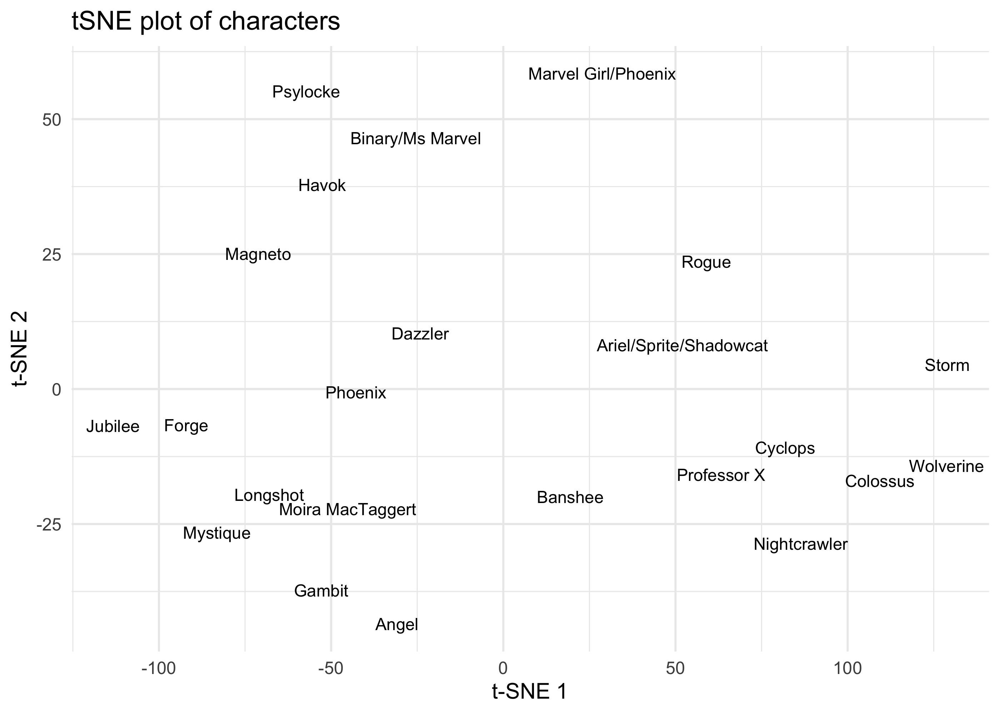
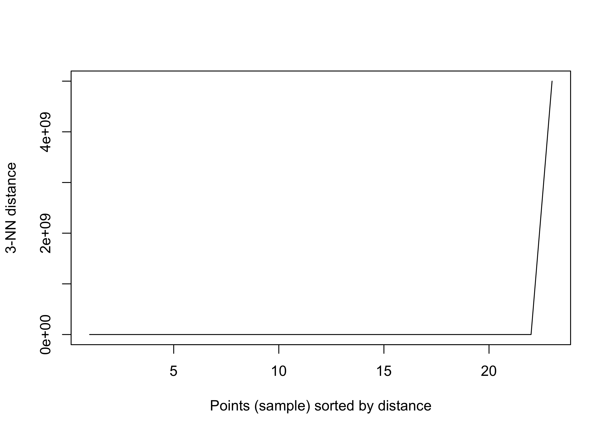
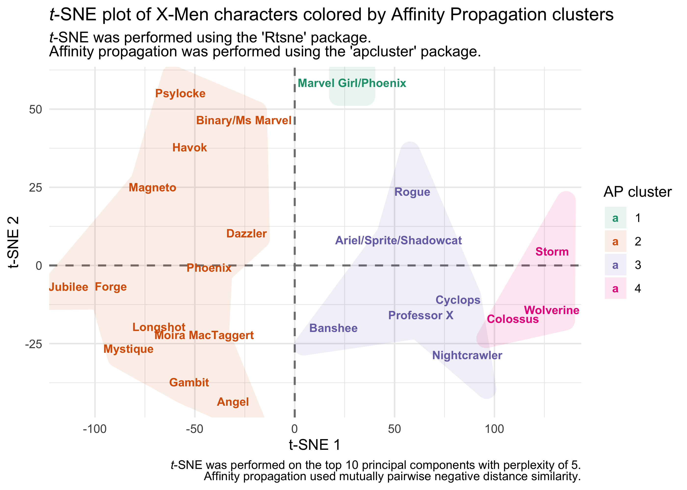

Uncanny X-men
================
Joshua Cook
June 30, 2020

## Setup

TidyTuesday link:
<https://github.com/rfordatascience/tidytuesday/blob/master/data/2020/2020-06-30/readme.md>

``` r
knitr::opts_chunk$set(echo = TRUE, comment = "#>", dpi = 400)

library(mustashe)
library(glue)
library(magrittr)
library(ggtext)
library(RColorBrewer)
library(pheatmap)
library(Rtsne)
library(dbscan)
library(apcluster)
library(ggforce)
library(patchwork)
library(tidyverse)
library(conflicted)

conflict_prefer("filter", "dplyr")
conflict_prefer("select", "dplyr")
conflict_prefer("setdiff", "dplyr")

blue <- "#5eafe6"
red <- "#eb5e60"
light_grey <- "grey80"
grey <- "grey50"
dark_grey <- "grey25"

theme_set(theme_minimal())

# To shutup `summarise()`.
options(dplyr.summarise.inform = FALSE)

memoise_cache <- memoise::cache_filesystem("./.memoise")

set.seed(0)
```

## Data

``` r
xmen_characters <- read_csv(
    "https://raw.githubusercontent.com/rfordatascience/tidytuesday/master/data/2020/2020-06-30/characters.csv"
) %>%
    janitor::clean_names()
```

    #> Parsed with column specification:
    #> cols(
    #>   .default = col_double(),
    #>   character = col_character(),
    #>   initiates_physical_conflict = col_character(),
    #>   on_a_date_with_which_character = col_character(),
    #>   kiss_with_which_character = col_character(),
    #>   hand_holding_with_which_character = col_character(),
    #>   dancing_with_which_character = col_character(),
    #>   flying_with_another_character = col_character(),
    #>   arm_in_arm_with_which_character = col_character(),
    #>   hugging_with_which_character = col_character(),
    #>   physical_contact_other = col_character(),
    #>   carrying_with_which_character = col_character(),
    #>   shared_bed_with_which_character = col_logical(),
    #>   shared_room_domestically_with_which_character = col_logical(),
    #>   explicitly_states_i_love_you_to_whom = col_character(),
    #>   shared_undress = col_character(),
    #>   special_notes = col_character()
    #> )

    #> See spec(...) for full column specifications.

## EDA

``` r
naniar::miss_var_summary(xmen_characters)
```

    #> # A tibble: 34 x 3
    #>    variable                                      n_miss pct_miss
    #>    <chr>                                          <int>    <dbl>
    #>  1 shared_bed_with_which_character                 4209    100  
    #>  2 shared_room_domestically_with_which_character   4209    100  
    #>  3 shared_undress                                  4205     99.9
    #>  4 dancing_with_which_character                    4195     99.7
    #>  5 on_a_date_with_which_character                  4190     99.5
    #>  6 expresses_reluctance_to_fight                   4189     99.5
    #>  7 arm_in_arm_with_which_character                 4173     99.1
    #>  8 explicitly_states_i_love_you_to_whom            4157     98.8
    #>  9 hand_holding_with_which_character               4121     97.9
    #> 10 kiss_with_which_character                       4094     97.3
    #> # … with 24 more rows

``` r
xmen_issue_data <- xmen_characters %>%
    select(issue:number_of_kills_non_humans, 
           visible_tears_number_of_intances, 
           depicted_eating_food)
xmen_issue_data
```

    #> # A tibble: 4,209 x 15
    #>    issue character rendered_unconc… captured declared_dead redressed depowered
    #>    <dbl> <chr>                <dbl>    <dbl>         <dbl>     <dbl>     <dbl>
    #>  1    97 Professo…                0        0             0         0         0
    #>  2    97 Wolverin…                0        0             0         0         0
    #>  3    97 Cyclops …                0        0             0         0         0
    #>  4    97 Marvel G…                1        0             0         0         0
    #>  5    97 Storm = …                0        0             0         0         0
    #>  6    97 Colossus…                0        0             0         0         0
    #>  7    97 Nightcra…                0        0             0         0         0
    #>  8    97 Banshee …                0        0             0         0         0
    #>  9    97 Angel = …                0        0             0         0         0
    #> 10    97 Ariel/Sp…                0        0             0         0         0
    #> # … with 4,199 more rows, and 8 more variables: clothing_torn <dbl>,
    #> #   subject_to_torture <dbl>, quits_team <dbl>, surrenders <dbl>,
    #> #   number_of_kills_humans <dbl>, number_of_kills_non_humans <dbl>,
    #> #   visible_tears_number_of_intances <dbl>, depicted_eating_food <dbl>

``` r
xmen_issue_data %>%
    count(issue, character) %>%
    filter(n > 1)
```

    #> # A tibble: 0 x 3
    #> # … with 3 variables: issue <dbl>, character <chr>, n <int>

``` r
xmen_data <- xmen_issue_data %>%
    select(-issue) %>%
    group_by(character) %>%
    summarise_if(is.numeric, sum) %>%
    ungroup()

xmen_data
```

    #> # A tibble: 23 x 14
    #>    character rendered_unconc… captured declared_dead redressed depowered
    #>    <chr>                <dbl>    <dbl>         <dbl>     <dbl>     <dbl>
    #>  1 Angel = …                3        5             1         1         2
    #>  2 Ariel/Sp…               19        7             2         2         6
    #>  3 Banshee …               10        8             1         0         6
    #>  4 Binary/M…                5        3             1         1         0
    #>  5 Colossus…               26       15             3         5        13
    #>  6 Cyclops …               16       13             7         5        10
    #>  7 Dazzler …                8        1             4         1         1
    #>  8 Forge = …                0        3             0         0         0
    #>  9 Gambit =…                2        2             0         0         0
    #> 10 Havok = …                5        2             2         0         1
    #> # … with 13 more rows, and 8 more variables: clothing_torn <dbl>,
    #> #   subject_to_torture <dbl>, quits_team <dbl>, surrenders <dbl>,
    #> #   number_of_kills_humans <dbl>, number_of_kills_non_humans <dbl>,
    #> #   visible_tears_number_of_intances <dbl>, depicted_eating_food <dbl>

``` r
stash("stat_correlations", depends_on = "xmen_data", {
    stat_correlations <- expand.grid(colnames(xmen_data)[-1], 
                                     colnames(xmen_data)[-1]) %>%
        as_tibble() %>%
        set_names("stat_1", "stat_2") %>%
        mutate(correlation = map2_dbl(stat_1, stat_2, function(x, y) {
            cor(xmen_data[x], xmen_data[y])
        }))
})
```

    #> Loading stashed object.

``` r
hm_data <- stat_correlations %>%
    pivot_wider(stat_1, names_from = stat_2, values_from = correlation) %>%
    as.data.frame() %>%
    column_to_rownames("stat_1")

colnames(hm_data) <- str_replace_all(colnames(hm_data), "_", " ")
rownames(hm_data) <- str_replace_all(rownames(hm_data), "_", " ")

hm_pal <- c(
    "#71cfeb",
    "#e8faff",
    colorRampPalette(c("#ede353", "#eda853", "#ed5353"))(5)
)

pheatmap(hm_data,
         color = hm_pal, #colorRampPalette(rev(brewer.pal(n = 7, name = "RdYlBu")))(7),
         border_color = NA,
         treeheight_row = 30,
         treeheight_col = 30,
         main = "Correlations between character measurements")
```

<!-- -->

## Clustering

``` r
tsne_input_df <- xmen_data %>%
    as.data.frame() %>%
    column_to_rownames("character") %>%
    as.matrix()

set.seed(0)
xmen_tsne <- Rtsne(tsne_input_df, initial_dims = 10, perplexity = 5)

xmen_tsne$Y %>%
    as_tibble() %>%
    mutate(character = xmen_data$character,
           character = str_remove(character, " =.+"),
           character = str_remove(character, "\\(.+")) %>%
    ggplot(aes(V1, V2)) +
    geom_text(aes(label = character), size = 3) +
    labs(x = "t-SNE 1", y = "t-SNE 2",
         title = "tSNE plot of characters")
```

    #> Warning: The `x` argument of `as_tibble.matrix()` must have column names if `.name_repair` is omitted as of tibble 2.0.0.
    #> Using compatibility `.name_repair`.
    #> This warning is displayed once every 8 hours.
    #> Call `lifecycle::last_warnings()` to see where this warning was generated.

<!-- -->

``` r
set.seed(0)
kNNdistplot(tsne_input_df, k = 3)
```

<!-- -->

``` r
set.seed(0)
xmen_dbscan <- dbscan(tsne_input_df, eps = 10, minPts = 3)
print(xmen_dbscan)
```

    #> DBSCAN clustering for 23 objects.
    #> Parameters: eps = 10, minPts = 3
    #> The clustering contains 1 cluster(s) and 10 noise points.
    #> 
    #>  0  1 
    #> 10 13 
    #> 
    #> Available fields: cluster, eps, minPts

``` r
set.seed(0)
xmen_afincls <- apcluster(negDistMat(r = 2), tsne_input_df)
print(xmen_afincls)
```

    #> 
    #> APResult object
    #> 
    #> Number of samples     =  23 
    #> Number of iterations  =  134 
    #> Input preference      =  -457 
    #> Sum of similarities   =  -2243 
    #> Sum of preferences    =  -1828 
    #> Net similarity        =  -4071 
    #> Number of clusters    =  4 
    #> 
    #> Exemplars:
    #>    Marvel Girl/Phoenix = Jean Grey Phoenix(2) = Rachel Summers Professor X 
    #>    Wolverine = Logan
    #> Clusters:
    #>    Cluster 1, exemplar Marvel Girl/Phoenix = Jean Grey:
    #>       Marvel Girl/Phoenix = Jean Grey
    #>    Cluster 2, exemplar Phoenix(2) = Rachel Summers:
    #>       Angel = Warren Worthington Binary/Ms Marvel = Carol Danvers 
    #>       Dazzler = Alison Blaire Forge = Name Unknown Gambit = Name Unknown 
    #>       Havok = Alex Summers Jubilee = Jubilation Lee 
    #>       Longshot = (unknown real name) Magneto = Erik Magnus 
    #>       Moira MacTaggert (scientist helper) Mystique = Name Unknown 
    #>       Phoenix(2) = Rachel Summers Psylocke = Elizabeth (Betsy) Braddock
    #>    Cluster 3, exemplar Professor X:
    #>       Ariel/Sprite/Shadowcat = Kitty Pryde Banshee = Sean Cassidy 
    #>       Cyclops = Scott Summers Nightcrawler = Kurt Wagner Professor X 
    #>       Rogue = Name Unknown
    #>    Cluster 4, exemplar Wolverine = Logan:
    #>       Colossus = Peter (Piotr) Rasputin Storm = Ororo Munroe Wolverine = Logan

``` r
xmen_afincls@clusters
```

    #> [[1]]
    #> Marvel Girl/Phoenix = Jean Grey 
    #>                              14 
    #> 
    #> [[2]]
    #>            Angel = Warren Worthington      Binary/Ms Marvel = Carol Danvers 
    #>                                     1                                     4 
    #>               Dazzler = Alison Blaire                  Forge = Name Unknown 
    #>                                     7                                     8 
    #>                 Gambit = Name Unknown                  Havok = Alex Summers 
    #>                                     9                                    10 
    #>              Jubilee = Jubilation Lee        Longshot = (unknown real name) 
    #>                                    11                                    12 
    #>                 Magneto = Erik Magnus   Moira MacTaggert (scientist helper) 
    #>                                    13                                    15 
    #>               Mystique = Name Unknown           Phoenix(2) = Rachel Summers 
    #>                                    16                                    18 
    #> Psylocke = Elizabeth (Betsy) Braddock 
    #>                                    20 
    #> 
    #> [[3]]
    #> Ariel/Sprite/Shadowcat = Kitty Pryde               Banshee = Sean Cassidy 
    #>                                    2                                    3 
    #>              Cyclops = Scott Summers           Nightcrawler = Kurt Wagner 
    #>                                    6                                   17 
    #>                          Professor X                 Rogue = Name Unknown 
    #>                                   19                                   21 
    #> 
    #> [[4]]
    #> Colossus = Peter (Piotr) Rasputin              Storm = Ororo Munroe 
    #>                                 5                                22 
    #>                 Wolverine = Logan 
    #>                                23

``` r
afincls_df <- tibble(cluster = 1:length(xmen_afincls@clusters)) %>%
    mutate(character = map(xmen_afincls@clusters, ~ names(.x))) %>%
    unnest(character)

xmen_tsne$Y %>%
    as_tibble() %>%
    mutate(character = xmen_data$character) %>%
    left_join(afincls_df, by = "character") %>%
    mutate(character = str_remove(character, " =.+"),
           character = str_remove(character, "\\(.+")) %>%
    ggplot(aes(V1, V2)) +
    geom_hline(yintercept = 0, lty = 2, color = "grey50", size = 0.7) +
    geom_vline(xintercept = 0, lty = 2, color = "grey50", size = 0.7) +
    geom_mark_hull(aes(fill = factor(cluster)), 
                   alpha = 0.1, color = NA, 
                   expand = unit(6, "mm")) +
    geom_text(aes(label = character, color = factor(cluster)), 
              size = 3, family = "Arial", fontface = "bold") +
    scale_color_brewer(palette = "Dark2") +
    scale_fill_brewer(palette = "Dark2") +
    scale_x_continuous(expand = expansion(mult = c(0.04, 0.06))) +
    theme(
        plot.title = element_markdown(),
        plot.subtitle = element_markdown(),
        plot.caption = element_markdown()
    ) +
    labs(x = "t-SNE 1", y = "t-SNE 2", 
         color = "AP cluster", fill = "AP cluster",
         title = "*t*-SNE plot of X-Men characters colored by Affinity Propagation clusters",
         subtitle = "*t*-SNE was performed using the 'Rtsne' package.<br>Affinity propagation was performed using the 'apcluster' package.",
         caption = "*t*-SNE was performed on the top 10 principal components with perplexity of 5.<br>Affinity propagation used mutually pairwise negative distance similarity.")
```

<!-- -->
