Astronaut database
================
Joshua Cook
July 14, 2020

## Setup

TidyTuesday link:
[2020/2020-07-14/readme.md](https://github.com/rfordatascience/tidytuesday/blob/master/data/2020/2020-07-14/readme.md)

``` r
knitr::opts_chunk$set(echo = TRUE, comment = "#>", dpi = 400)

library(mustashe)
library(glue)
library(magrittr)
library(ggtext)
library(ggforce)
library(patchwork)
library(tidyverse)
library(conflicted)

conflict_prefer("filter", "dplyr")
conflict_prefer("select", "dplyr")
conflict_prefer("setdiff", "dplyr")

blue <- "#5eafe6"
dark_blue <- "#408ec2"
red <- "#eb5e60"
light_grey <- "grey80"
grey <- "grey50"
dark_grey <- "grey25"

theme_set(theme_minimal())

# To shut-up `summarise()`.
options(dplyr.summarise.inform = FALSE)

set.seed(0)
```

## Data

``` r
astronauts <- read_csv("https://raw.githubusercontent.com/rfordatascience/tidytuesday/master/data/2020/2020-07-14/astronauts.csv") %>%
    janitor::clean_names()
```

    #> Parsed with column specification:
    #> cols(
    #>   .default = col_double(),
    #>   name = col_character(),
    #>   original_name = col_character(),
    #>   sex = col_character(),
    #>   nationality = col_character(),
    #>   military_civilian = col_character(),
    #>   selection = col_character(),
    #>   occupation = col_character(),
    #>   mission_title = col_character(),
    #>   ascend_shuttle = col_character(),
    #>   in_orbit = col_character(),
    #>   descend_shuttle = col_character()
    #> )

    #> See spec(...) for full column specifications.

## EDA

``` r
p1 <- astronauts %>%
    mutate(label = ifelse(eva_hrs_mission > 75, name, NA)) %>%
    ggplot(aes(x = hours_mission, y = eva_hrs_mission)) +
    geom_point(color = dark_blue, alpha = 0.5) +
    geom_text(aes(label = label), nudge_x = 1800, family = "Arial") +
    labs(x = "duration of mission (hrs.)",
         y = "time spent on EVA (hrs.)")

p2 <- astronauts %>%
    ggplot(aes(x = hours_mission)) +
    geom_density(color = dark_blue, alpha = 0.2, size = 1) +
    scale_y_continuous(expand = expansion(mult = c(0, 0.02))) +
    theme(axis.title = element_blank(),
          axis.text.x = element_blank())

p3 <- astronauts %>%
    ggplot(aes(x = eva_hrs_mission)) +
    geom_density(color = dark_blue, alpha = 0.2, size = 1) +
    scale_y_continuous(expand = expansion(mult = c(0, 0.02))) +
    theme(axis.title = element_blank(),
          axis.text.y = element_blank()) +
    coord_flip()


design = "
AAAAAA#
BBBBBBC
BBBBBBC
BBBBBBC
BBBBBBC
BBBBBBC
BBBBBBC
"
p2 + p1 + p3 + plot_layout(design = design)
```

    #> Warning: Removed 1276 rows containing missing values (geom_text).

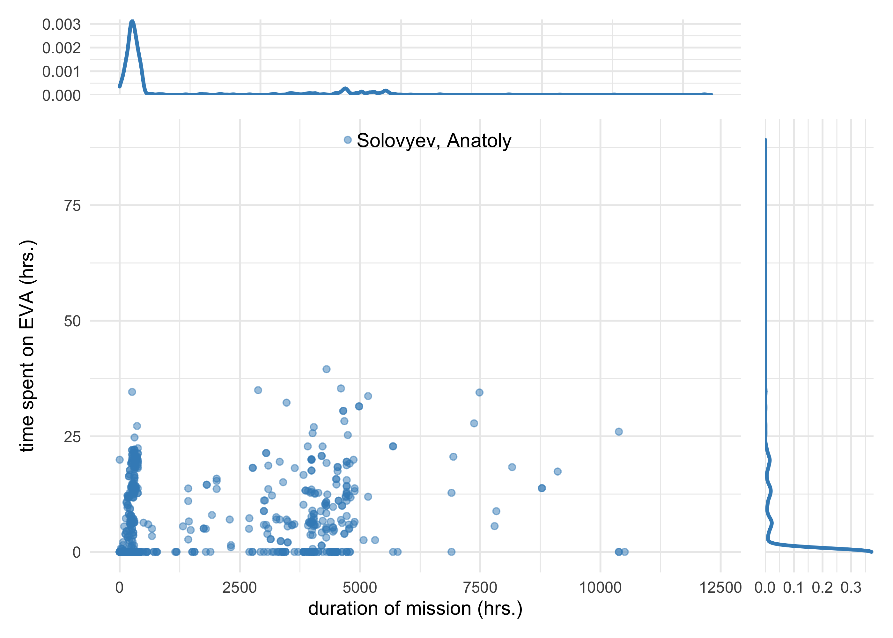<!-- -->

``` r
astronauts %>% 
    distinct(name, mission_number, mission_title) %>%
    count(name, name = "num_missions") %>%
    ggplot(aes(x = num_missions)) +
    geom_bar()
```

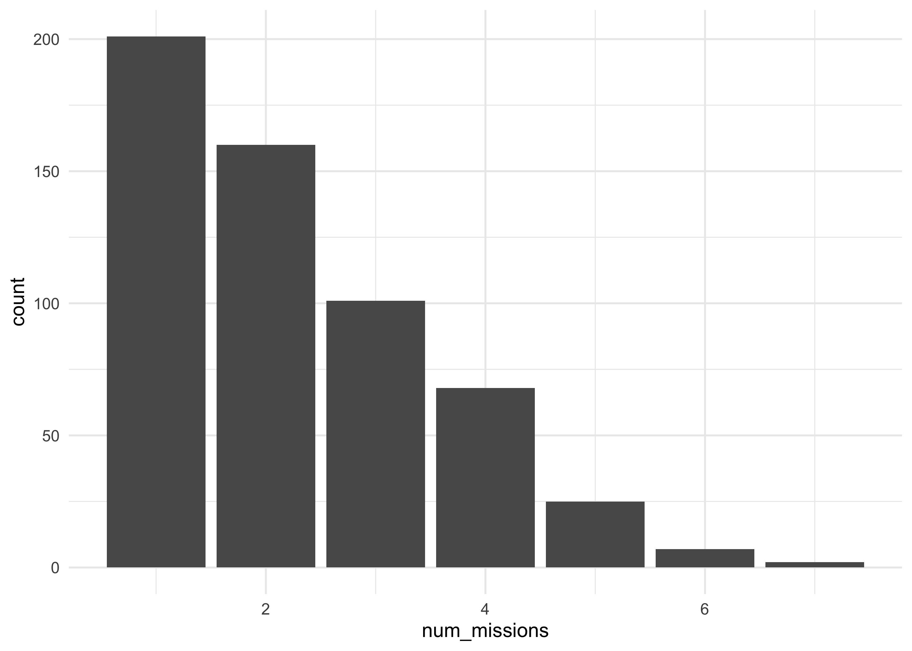<!-- -->

## Model

Model the number of missions taken using various features of the
astronaut.

``` r
library(rstanarm)
```

    #> Loading required package: Rcpp

    #> rstanarm (Version 2.19.3, packaged: 2020-02-11 05:16:41 UTC)

    #> - Do not expect the default priors to remain the same in future rstanarm versions.

    #> Thus, R scripts should specify priors explicitly, even if they are just the defaults.

    #> - For execution on a local, multicore CPU with excess RAM we recommend calling

    #> options(mc.cores = parallel::detectCores())

    #> - bayesplot theme set to bayesplot::theme_default()

    #>    * Does _not_ affect other ggplot2 plots

    #>    * See ?bayesplot_theme_set for details on theme setting

``` r
library(bayestestR)
library(see)
library(ggmcmc)
```

    #> Warning: package 'ggmcmc' was built under R version 4.0.1

    #> Registered S3 method overwritten by 'GGally':
    #>   method from   
    #>   +.gg   ggplot2

``` r
library(tidybayes)
```

``` r
d <- astronauts %>% 
    distinct(total_number_of_missions, 
             name, year_of_birth, sex, 
             military_civilian, occupation) %>%
    mutate(
        military = military_civilian == "military",
        male = sex == "male",
        occupation = str_to_lower(occupation),
        occupation = fct_lump_min(occupation, 100)
    ) %>%
    rename(num_missions = total_number_of_missions)
```

``` r
glue("mean of the number of missions: {round(mean(d$num_missions), 2)}")
```

    #> mean of the number of missions: 2.48

``` r
glue("variance of the number of missions: {round(var(d$num_missions), 2)}")
```

    #> variance of the number of missions: 1.68

``` r
make_missions_barplot <- function(fill_column) {
    d %>% 
        ggplot(aes(x = num_missions)) +
        geom_bar(aes(fill = {{ fill_column }}), position = "dodge")
}

(make_missions_barplot(male) | 
    make_missions_barplot(occupation)) /
    (make_missions_barplot(military) | plot_spacer())
```

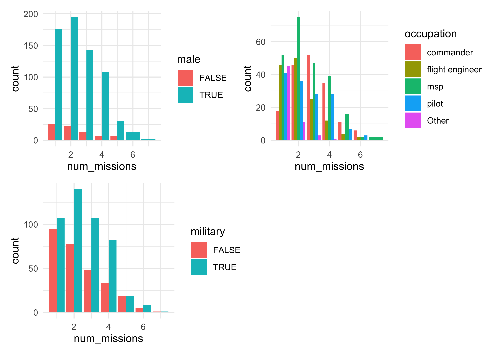<!-- -->

``` r
freq_pois_m1 <- glm(
    num_missions ~ year_of_birth + male + military + occupation,
    data = d,
    family = poisson(link = "log")
)

summary(freq_pois_m1)
```

    #> 
    #> Call:
    #> glm(formula = num_missions ~ year_of_birth + male + military + 
    #>     occupation, family = poisson(link = "log"), data = d)
    #> 
    #> Deviance Residuals: 
    #>     Min       1Q   Median       3Q      Max  
    #> -1.3273  -0.5759  -0.1775   0.5107   2.3107  
    #> 
    #> Coefficients:
    #>                             Estimate Std. Error z value Pr(>|z|)    
    #> (Intercept)                0.3533700  3.9249157   0.090   0.9283    
    #> year_of_birth              0.0003717  0.0020060   0.185   0.8530    
    #> maleTRUE                   0.0726244  0.0846810   0.858   0.3911    
    #> militaryTRUE              -0.0719240  0.0569752  -1.262   0.2068    
    #> occupationflight engineer -0.3359159  0.0790877  -4.247 2.16e-05 ***
    #> occupationmsp             -0.1535577  0.0674581  -2.276   0.0228 *  
    #> occupationpilot           -0.1551689  0.0694453  -2.234   0.0255 *  
    #> occupationOther           -0.8417388  0.1270053  -6.628 3.41e-11 ***
    #> ---
    #> Signif. codes:  0 '***' 0.001 '**' 0.01 '*' 0.05 '.' 0.1 ' ' 1
    #> 
    #> (Dispersion parameter for poisson family taken to be 1)
    #> 
    #>     Null deviance: 490.91  on 742  degrees of freedom
    #> Residual deviance: 428.78  on 735  degrees of freedom
    #> AIC: 2445.3
    #> 
    #> Number of Fisher Scoring iterations: 4

``` r
plot(freq_pois_m1)
```

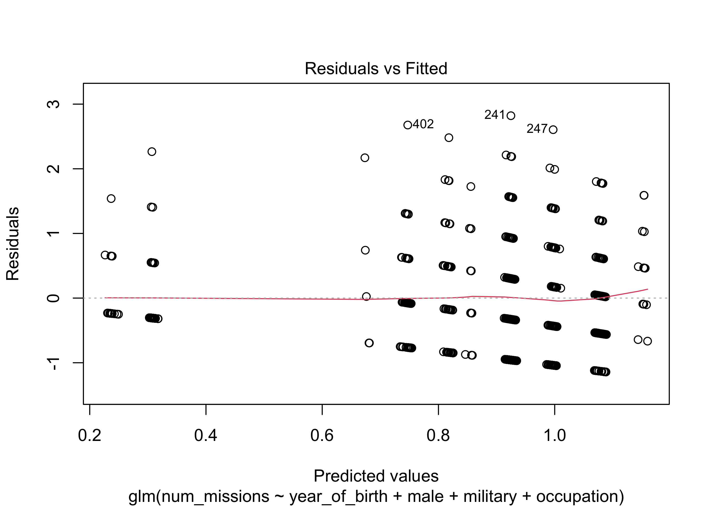<!-- -->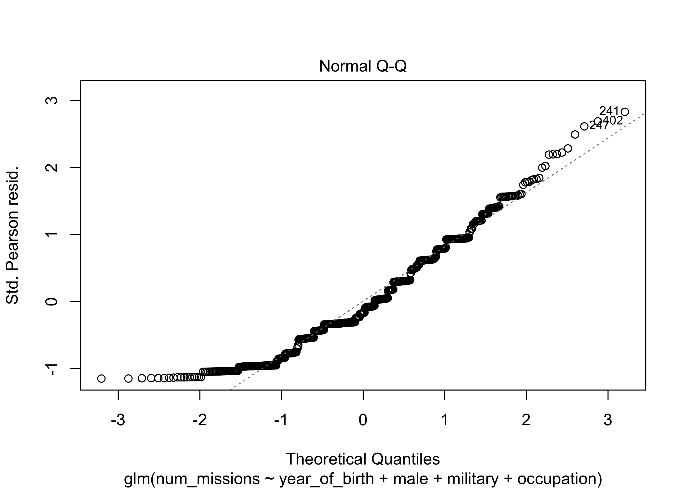<!-- -->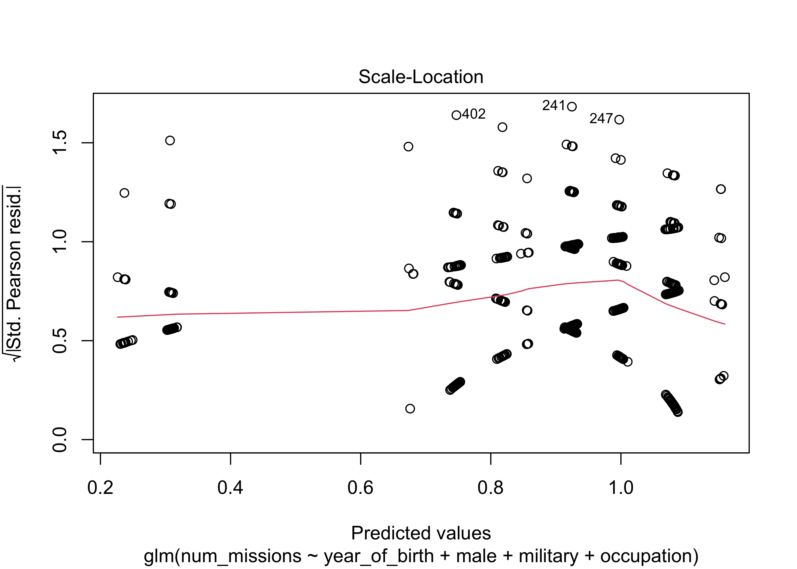<!-- -->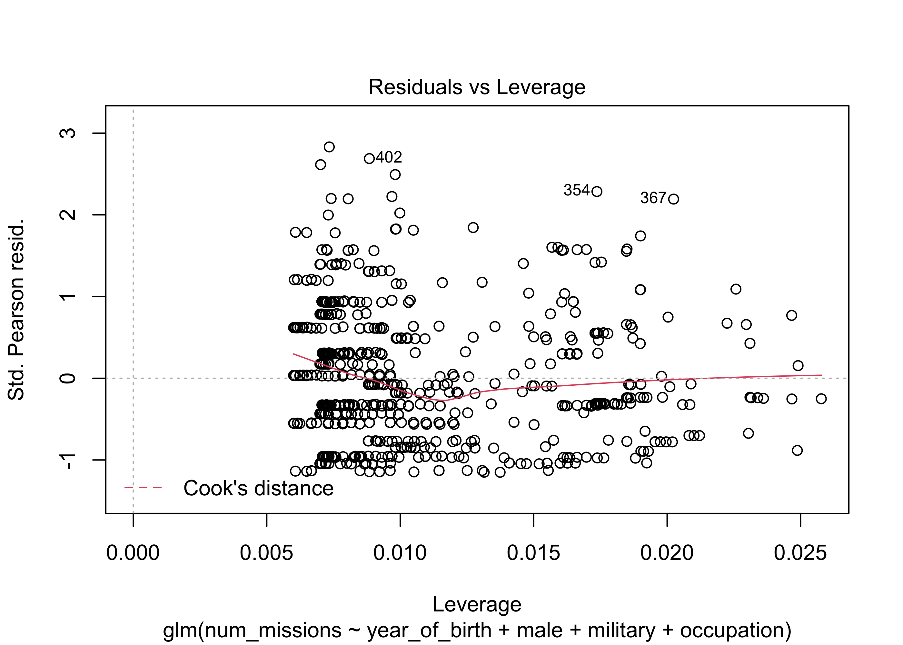<!-- -->

``` r
pred <- predict(freq_pois_m1, type = "response")

d_summary <- d %>%
    mutate(pred = !!pred) %>%
    group_by(num_missions, occupation) %>%
    summarise(pred = mean(pred)) %>%
    ungroup()

p1 <- d %>%
    mutate(pred = !!pred) %>%
    ggplot(aes(x = num_missions, y = pred)) +
    geom_jitter(aes(color = occupation),
                width = 0.1, height = 0.1, alpha = 0.5) +
    geom_line(aes(color = occupation),
              data = d_summary,
              size = 1, lty = 2) +
    scale_color_brewer(palette = "Dark2") +
    labs(x = "real number of missions",
         y = "predicted number of missions",
         title = "Frequentist Poisson regression of number of missions")
p1
```

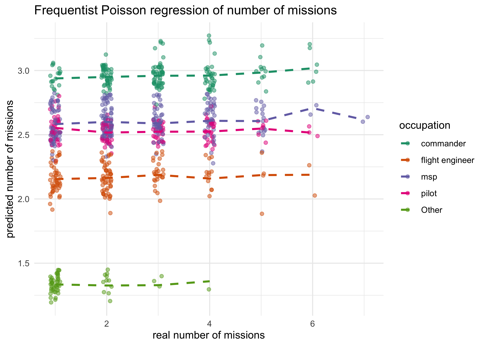<!-- -->

``` r
set.seed(0)

bayes_pois_m1 <- stan_glm(
    num_missions ~ year_of_birth + male + military + occupation,
    data = d,
    family = poisson(link = "log"),
    prior_intercept = normal(),
    prior = normal(),
    refresh = 0,
    cores = 1
)
```

``` r
summary(bayes_pois_m1)
```

    #> 
    #> Model Info:
    #>  function:     stan_glm
    #>  family:       poisson [log]
    #>  formula:      num_missions ~ year_of_birth + male + military + occupation
    #>  algorithm:    sampling
    #>  sample:       4000 (posterior sample size)
    #>  priors:       see help('prior_summary')
    #>  observations: 743
    #>  predictors:   8
    #> 
    #> Estimates:
    #>                             mean   sd   10%   50%   90%
    #> (Intercept)                0.4    4.0 -4.6   0.4   5.4 
    #> year_of_birth              0.0    0.0  0.0   0.0   0.0 
    #> maleTRUE                   0.1    0.1  0.0   0.1   0.2 
    #> militaryTRUE              -0.1    0.1 -0.1  -0.1   0.0 
    #> occupationflight engineer -0.3    0.1 -0.4  -0.3  -0.2 
    #> occupationmsp             -0.2    0.1 -0.2  -0.2  -0.1 
    #> occupationpilot           -0.2    0.1 -0.2  -0.2  -0.1 
    #> occupationOther           -0.8    0.1 -1.0  -0.8  -0.7 
    #> 
    #> Fit Diagnostics:
    #>            mean   sd   10%   50%   90%
    #> mean_PPD 2.5    0.1  2.4   2.5   2.6  
    #> 
    #> The mean_ppd is the sample average posterior predictive distribution of the outcome variable (for details see help('summary.stanreg')).
    #> 
    #> MCMC diagnostics
    #>                           mcse Rhat n_eff
    #> (Intercept)               0.1  1.0  3298 
    #> year_of_birth             0.0  1.0  3310 
    #> maleTRUE                  0.0  1.0  3666 
    #> militaryTRUE              0.0  1.0  2848 
    #> occupationflight engineer 0.0  1.0  2547 
    #> occupationmsp             0.0  1.0  2216 
    #> occupationpilot           0.0  1.0  2816 
    #> occupationOther           0.0  1.0  2731 
    #> mean_PPD                  0.0  1.0  3793 
    #> log-posterior             0.0  1.0  1960 
    #> 
    #> For each parameter, mcse is Monte Carlo standard error, n_eff is a crude measure of effective sample size, and Rhat is the potential scale reduction factor on split chains (at convergence Rhat=1).

``` r
plot(bayes_pois_m1)
```

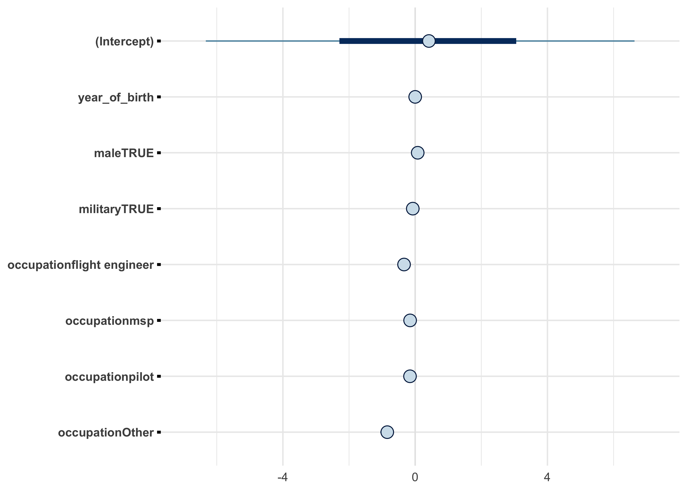<!-- -->

``` r
as.data.frame(describe_posterior(bayes_pois_m1))
```

    #>                   Parameter        Median CI       CI_low     CI_high      pd
    #> 1               (Intercept)  0.4155209265 89 -5.998167412  6.54388202 0.54125
    #> 8             year_of_birth  0.0003403457 89 -0.002891329  0.00353606 0.56950
    #> 2                  maleTRUE  0.0767551273 89 -0.059776652  0.19887318 0.80775
    #> 3              militaryTRUE -0.0722460052 89 -0.164871600  0.01328324 0.90800
    #> 4 occupationflight engineer -0.3365511539 89 -0.461636301 -0.21625243 1.00000
    #> 5             occupationmsp -0.1530392764 89 -0.260717041 -0.04993052 0.98950
    #> 7           occupationpilot -0.1563371065 89 -0.267639627 -0.04283283 0.98850
    #> 6           occupationOther -0.8440887457 89 -1.047946613 -0.64453812 1.00000
    #>   ROPE_CI ROPE_low ROPE_high ROPE_Percentage      Rhat      ESS
    #> 1      89     -0.1       0.1      0.02218478 0.9999143 3298.360
    #> 8      89     -0.1       0.1      1.00000000 0.9999047 3309.561
    #> 2      89     -0.1       0.1      0.63324909 0.9996161 3666.454
    #> 3      89     -0.1       0.1      0.70766639 1.0006100 2848.028
    #> 4      89     -0.1       0.1      0.00000000 0.9993928 2547.440
    #> 5      89     -0.1       0.1      0.16708790 0.9999946 2216.213
    #> 7      89     -0.1       0.1      0.18618366 0.9997595 2816.016
    #> 6      89     -0.1       0.1      0.00000000 0.9999130 2731.229

``` r
pred <- predict(bayes_pois_m1, type = "response")

d_summary <- d %>%
    mutate(pred = !!pred) %>%
    group_by(num_missions, occupation) %>%
    summarise(pred = mean(pred)) %>%
    ungroup()

p2 <- d %>%
    mutate(pred = !!pred) %>%
    ggplot(aes(x = num_missions, y = pred)) +
    geom_jitter(aes(color = occupation),
                width = 0.1, height = 0.1, alpha = 0.5) +
    geom_line(aes(color = occupation),
              data = d_summary,
              size = 1, lty = 2) +
    scale_color_brewer(palette = "Dark2") +
    labs(x = "real number of missions",
         y = "predicted number of missions",
         title = "Bayesian Poisson regression of number of missions")
p2
```

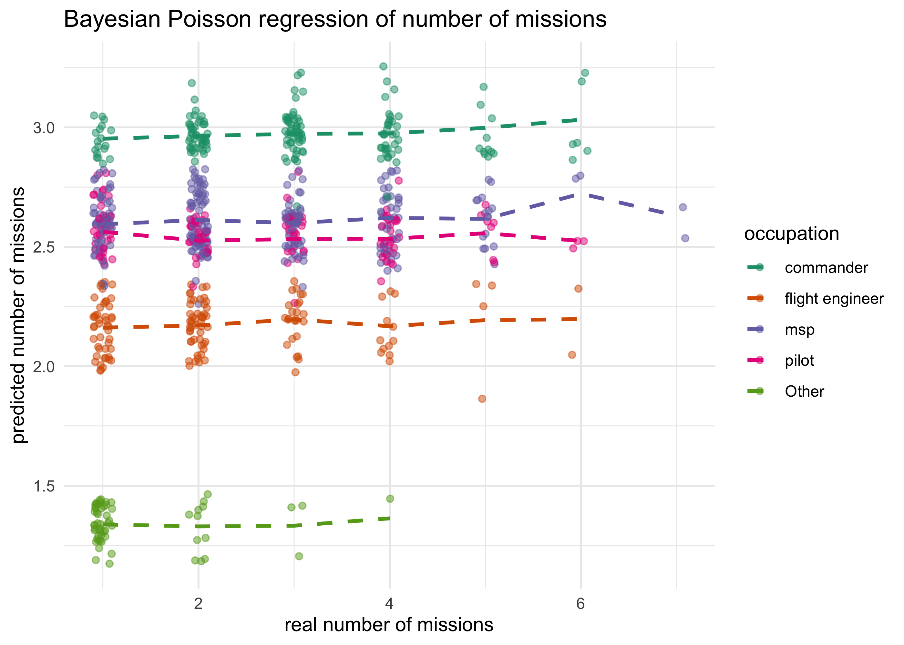<!-- -->

``` r
freq_pred <- predict(freq_pois_m1, type = "response")
bayes_pred <- predict(bayes_pois_m1, type = "response")
p3 <- d %>% 
    mutate(freq = freq_pred,
           bayes = bayes_pred) %>%
    ggplot(aes(x = freq, y = bayes)) +
    geom_point(aes(color = occupation), alpha = 0.5) +
    scale_color_brewer(palette = "Dark2") +
    labs(x = "frequentist model prediction",
         y = "Bayesian model prediciton",
         title = "Comparison of model predictions")
p3
```

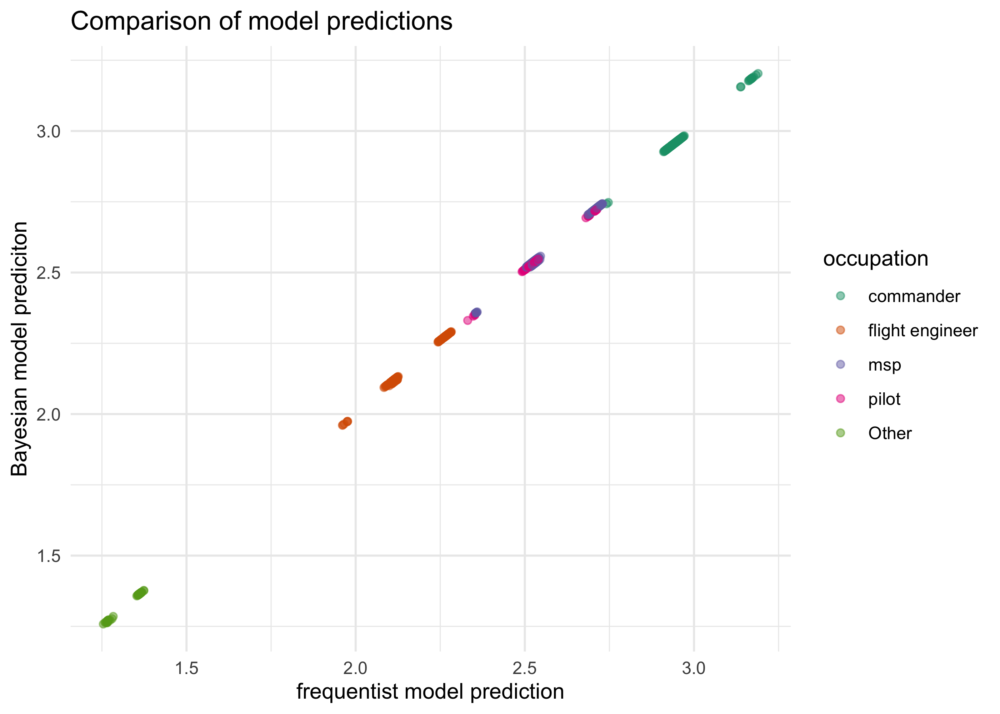<!-- -->

``` r
p4 <- d %>% 
    mutate(freq = freq_pred,
           bayes = bayes_pred,
           diff_pred = freq - bayes,
           i = row_number()) %>%
    ggplot(aes(x = i, y = diff_pred)) +
    geom_hline(yintercept = 0, lty = 2, color = grey, size = 1.2) +
    geom_point(aes(color = occupation, shape = sex), alpha = 0.5) +
    scale_color_brewer(palette = "Dark2") +
    scale_shape_manual(values = c(17, 16)) +
    labs(x = "astronuat",
         y = "difference between model predicitons\n(freq. - Bayes)",
         title = "Comparison of model predictions")
p4
```

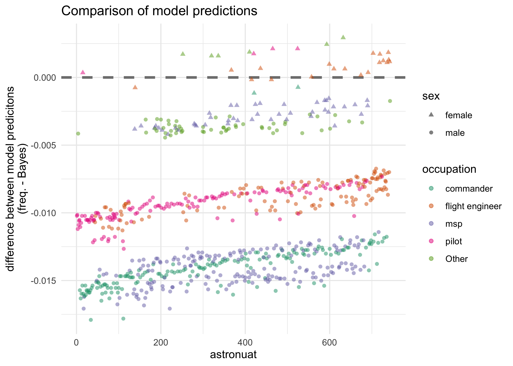<!-- -->

``` r
coef(freq_pois_m1)
```

    #>               (Intercept)             year_of_birth                  maleTRUE 
    #>              0.3533700034              0.0003717399              0.0726244301 
    #>              militaryTRUE occupationflight engineer             occupationmsp 
    #>             -0.0719239970             -0.3359159359             -0.1535577102 
    #>           occupationpilot           occupationOther 
    #>             -0.1551689327             -0.8417387656

``` r
coef(bayes_pois_m1)
```

    #>               (Intercept)             year_of_birth                  maleTRUE 
    #>              0.4155209265              0.0003403457              0.0767551273 
    #>              militaryTRUE occupationflight engineer             occupationmsp 
    #>             -0.0722460052             -0.3365511539             -0.1530392764 
    #>           occupationpilot           occupationOther 
    #>             -0.1563371065             -0.8440887457

``` r
d %>% 
    mutate(freq = freq_pred,
           bayes = bayes_pred,
           diff_pred = freq - bayes,
           i = row_number()) %>%
    filter(diff_pred > 0.005)
```

    #> # A tibble: 0 x 12
    #> # … with 12 variables: name <chr>, sex <chr>, year_of_birth <dbl>,
    #> #   military_civilian <chr>, num_missions <dbl>, occupation <fct>,
    #> #   military <lgl>, male <lgl>, freq <dbl>, bayes <dbl>, diff_pred <dbl>,
    #> #   i <int>

``` r
final_plot <- (p1 | p2) / (p3 | p4)

ggsave(
    file.path("2020-07-14_astronaut-database_files", 
              "model-comparison-plots.png"), 
    final_plot, 
    width = 11, height = 8.5, units = "in"
)

final_plot
```

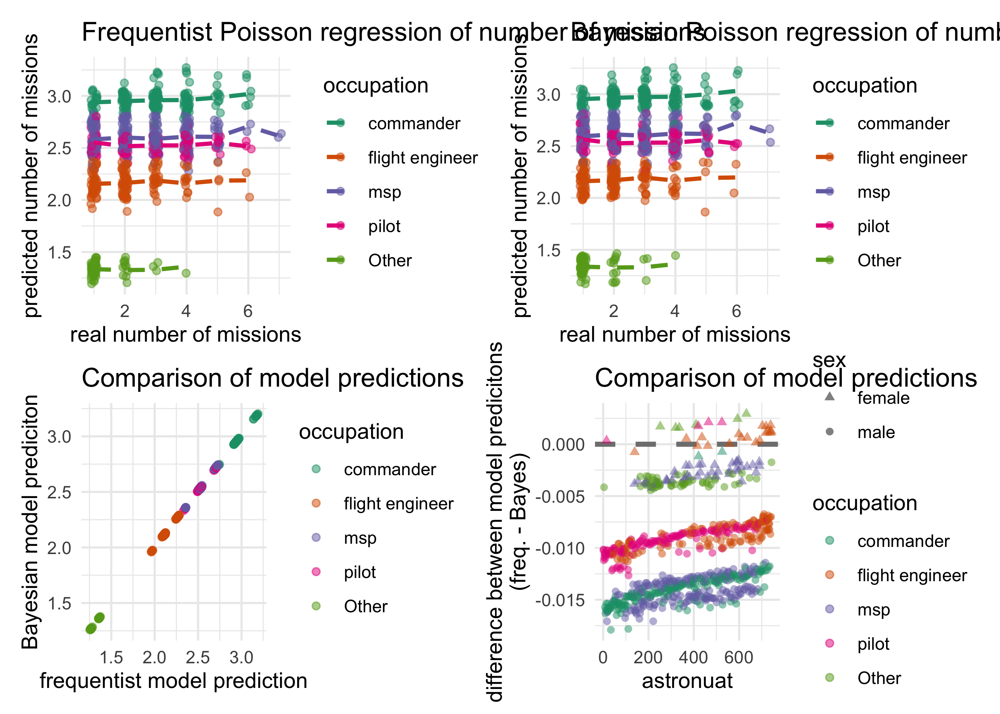<!-- -->
