Palmer Penguins
================
Joshua Cook
July 28, 2020

Setup
-----

TidyTuesday link:
[2020/2020-07-28/readme.md](https://github.com/rfordatascience/tidytuesday/blob/master/data/2020/2020-07-28/readme.md)

    knitr::opts_chunk$set(echo = TRUE, comment = "#>", dpi = 400)

    library(mustashe)
    library(glue)
    library(magrittr)
    library(Rtsne)
    library(see)
    library(bayestestR)
    library(ggeffects)
    library(lme4)
    library(rstanarm)
    library(patchwork)
    library(tidyverse)
    library(conflicted)

    conflict_prefer("filter", "dplyr")
    conflict_prefer("select", "dplyr")
    conflict_prefer("setdiff", "dplyr")

    blue <- "#5eafe6"
    dark_blue <- "#408ec2"
    red <- "#eb5e60"
    light_grey <- "grey80"
    grey <- "grey50"
    dark_grey <- "grey25"

    theme_set(theme_minimal())

    # To shut-up `summarise()`.
    options(dplyr.summarise.inform = FALSE)

    set.seed(0)

Data
----

    penguins <- read_csv("https://raw.githubusercontent.com/rfordatascience/tidytuesday/master/data/2020/2020-07-28/penguins.csv") %>%
        janitor::clean_names() %>%
        na.omit()

    #> Parsed with column specification:
    #> cols(
    #>   species = col_character(),
    #>   island = col_character(),
    #>   bill_length_mm = col_double(),
    #>   bill_depth_mm = col_double(),
    #>   flipper_length_mm = col_double(),
    #>   body_mass_g = col_double(),
    #>   sex = col_character(),
    #>   year = col_double()
    #> )

EDA
---

    penguins %>%
        count(species) %>%
        ggplot(aes(x = species, y = n)) +
        geom_col()

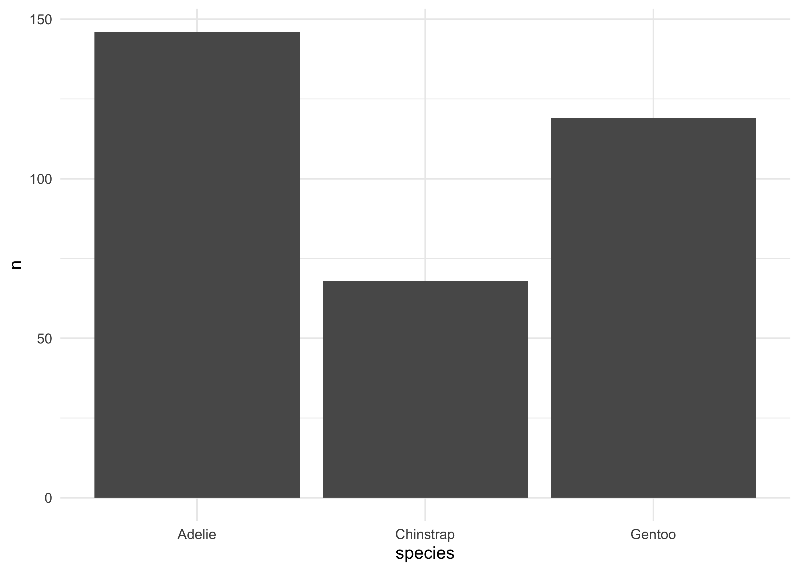<!-- -->

    penguins %>%
        select(species, bill_length_mm:body_mass_g) %>%
        pivot_longer(-species, names_to = "measurement", values_to = "value") %>%
        ggplot(aes(x = value)) +
        facet_wrap(~ measurement, ncol = 2, scales = "free") +
        geom_density(aes(color = species, fill = species), size = 1.2, alpha = 0.2) +
        scale_color_brewer(palette = "Set1") +
        scale_fill_brewer(palette = "Set1")

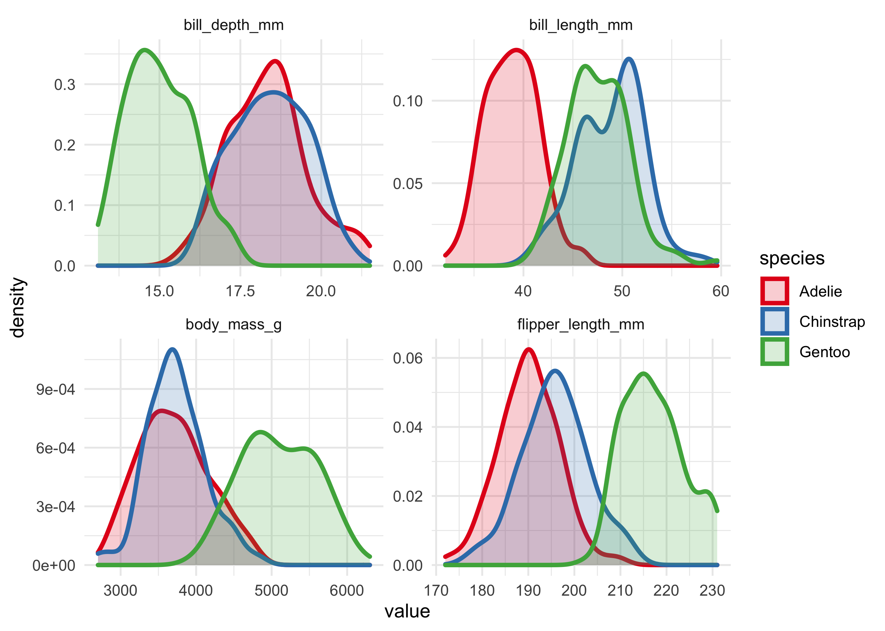<!-- -->

    set.seed(123)

    scale_nums <- function(x) {
        (x - mean(x)) / sd(x)
    }

    tsne_data <- penguins %>% 
        select(bill_length_mm:body_mass_g) %>%
        mutate_all(scale_nums)
    penguins_tsne <- Rtsne(tsne_data, pca = FALSE)

    penguins_tsne$Y %>%
        as.data.frame() %>%
        as_tibble() %>%
        set_names(c("z1", "z2")) %>%
        mutate(species = penguins$species,
               sex = penguins$sex) %>%
        ggplot(aes(z1, z2)) +
        geom_point(aes(color = species)) +
        scale_color_brewer(palette = "Set1") +
        labs(title = "t-SNE of penguin data")

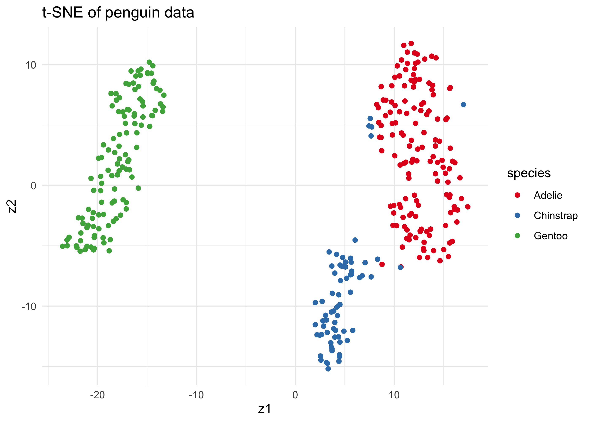<!-- -->

Modeling
--------

    d <- penguins %>%
        mutate(male = sex == "male") %>%
        select(male, species, bill_length_mm:body_mass_g) %>%
        mutate_if(is.numeric, scale_nums) %>%
        mutate(male = as.numeric(male))
    sex_log_m1 <- glm(male ~ ., 
                      data = d,
                      family = binomial(link = "logit"))

    summary(sex_log_m1)

    #> 
    #> Call:
    #> glm(formula = male ~ ., family = binomial(link = "logit"), data = d)
    #> 
    #> Deviance Residuals: 
    #>     Min       1Q   Median       3Q      Max  
    #> -3.3822  -0.2150   0.0023   0.1551   2.8095  
    #> 
    #> Coefficients:
    #>                   Estimate Std. Error z value Pr(>|z|)    
    #> (Intercept)         4.6835     1.1865   3.947 7.90e-05 ***
    #> speciesChinstrap   -6.9803     1.5743  -4.434 9.25e-06 ***
    #> speciesGentoo      -8.3539     2.5235  -3.310 0.000932 ***
    #> bill_length_mm      3.3566     0.7164   4.685 2.80e-06 ***
    #> bill_depth_mm       3.1958     0.6546   4.882 1.05e-06 ***
    #> flipper_length_mm   0.2912     0.6704   0.434 0.664046    
    #> body_mass_g         4.7228     0.8723   5.414 6.15e-08 ***
    #> ---
    #> Signif. codes:  0 '***' 0.001 '**' 0.01 '*' 0.05 '.' 0.1 ' ' 1
    #> 
    #> (Dispersion parameter for binomial family taken to be 1)
    #> 
    #>     Null deviance: 461.61  on 332  degrees of freedom
    #> Residual deviance: 127.11  on 326  degrees of freedom
    #> AIC: 141.11
    #> 
    #> Number of Fisher Scoring iterations: 7

    ggpredict(sex_log_m1, "bill_depth_mm [all]") %>%
        plot()

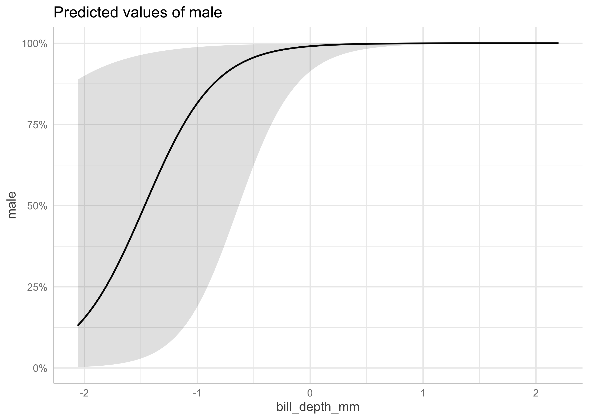<!-- -->

    ggpredict(sex_log_m1, c("bill_depth_mm [all]", "bill_length_mm")) %>%
        plot()

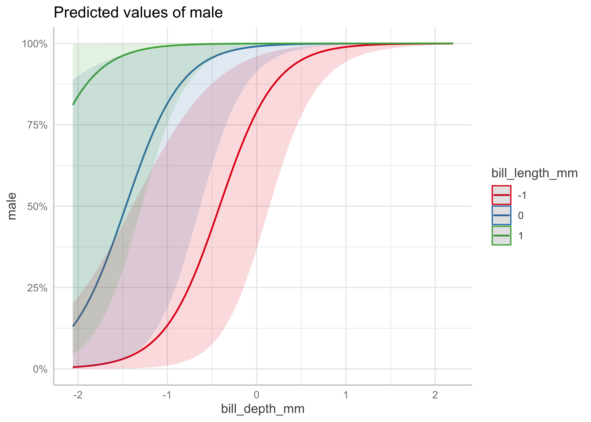<!-- -->

    ggpredict(sex_log_m1, c("bill_depth_mm [all]", "species")) %>%
        plot()

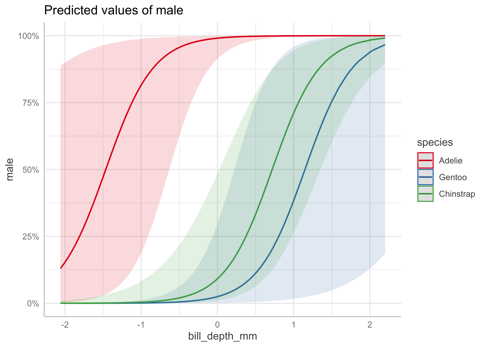<!-- -->

    ggpredict(sex_log_m1, 
              c("body_mass_g [all]", "bill_length_mm", "bill_depth_mm", "flipper_length_mm")) %>%
        plot()

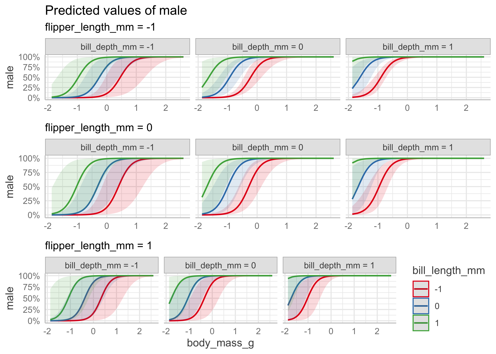<!-- -->

    sex_log_m2 <- glmer(
        male ~ 1 + body_mass_g + bill_length_mm + bill_depth_mm + flipper_length_mm + (1|species), 
        data = d,
        family = binomial(link = "logit")
    )

    summary(sex_log_m1)

    #> 
    #> Call:
    #> glm(formula = male ~ ., family = binomial(link = "logit"), data = d)
    #> 
    #> Deviance Residuals: 
    #>     Min       1Q   Median       3Q      Max  
    #> -3.3822  -0.2150   0.0023   0.1551   2.8095  
    #> 
    #> Coefficients:
    #>                   Estimate Std. Error z value Pr(>|z|)    
    #> (Intercept)         4.6835     1.1865   3.947 7.90e-05 ***
    #> speciesChinstrap   -6.9803     1.5743  -4.434 9.25e-06 ***
    #> speciesGentoo      -8.3539     2.5235  -3.310 0.000932 ***
    #> bill_length_mm      3.3566     0.7164   4.685 2.80e-06 ***
    #> bill_depth_mm       3.1958     0.6546   4.882 1.05e-06 ***
    #> flipper_length_mm   0.2912     0.6704   0.434 0.664046    
    #> body_mass_g         4.7228     0.8723   5.414 6.15e-08 ***
    #> ---
    #> Signif. codes:  0 '***' 0.001 '**' 0.01 '*' 0.05 '.' 0.1 ' ' 1
    #> 
    #> (Dispersion parameter for binomial family taken to be 1)
    #> 
    #>     Null deviance: 461.61  on 332  degrees of freedom
    #> Residual deviance: 127.11  on 326  degrees of freedom
    #> AIC: 141.11
    #> 
    #> Number of Fisher Scoring iterations: 7

    bind_rows(
        ggpredict(sex_log_m1, "body_mass_g [all]") %>% as_tibble() %>% add_column(effects = "FE"),
        ggpredict(sex_log_m2, "body_mass_g [all]") %>% as_tibble() %>% add_column(effects = "ME")
    ) %>%
        ggplot(aes(x, predicted)) +
        geom_ribbon(aes(ymin = conf.low, ymax = conf.high, fill = effects), alpha = 0.2) +
        geom_line(aes(group = effects, color = effects), size = 1.3) +
        scale_color_brewer(palette = "Set2") +
        scale_fill_brewer(palette = "Set2")

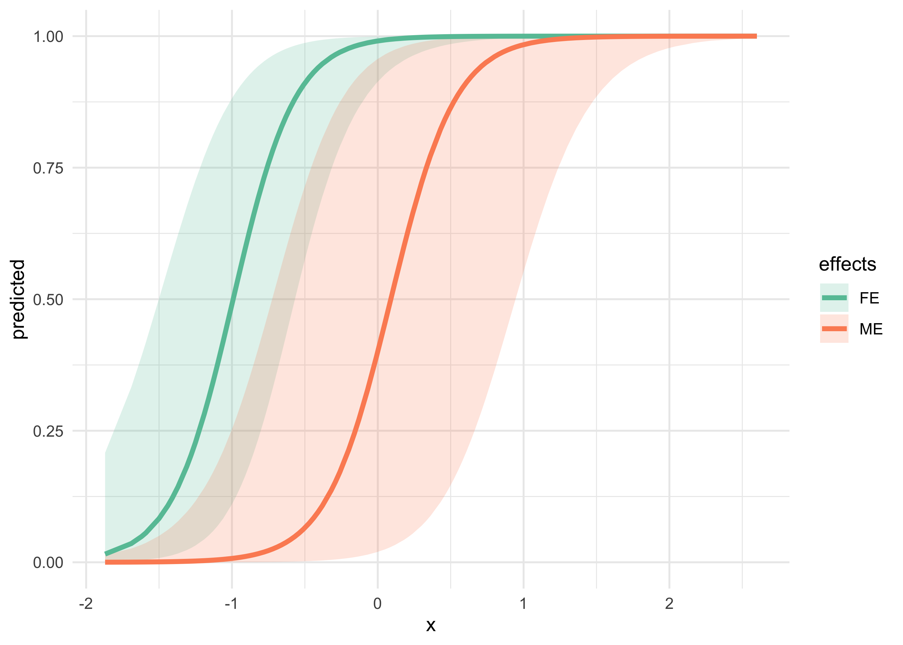<!-- -->

    d <- penguins %>%
        select(sex, species, island, bill_length_mm:body_mass_g) %>%
        mutate(sex = factor(sex),
               species = factor(species),
               island = factor(island),
               bill_length_mm = scale_nums(bill_length_mm),
               bill_depth_mm = scale_nums(bill_depth_mm),
               flipper_length_mm = scale_nums(flipper_length_mm))

    bm_model1 <- glm(
        body_mass_g ~ 1 + sex + species + bill_length_mm + bill_depth_mm + flipper_length_mm,
        data = d,
        family = gaussian(link = "identity")
    )

    bm_model2 <- glm(
        body_mass_g ~ 1 + sex * species + bill_length_mm + bill_depth_mm + flipper_length_mm,
        data = d,
        family = gaussian(link = "identity")
    )

    bm_model3 <- glm(
        body_mass_g ~ 1 + (sex + bill_length_mm + bill_depth_mm + flipper_length_mm) * species,
        data = d,
        family = gaussian(link = "identity")
    )

    bm_model4 <- glm(
        body_mass_g ~ 1 + (bill_length_mm + bill_depth_mm + flipper_length_mm) * (sex + species),
        data = d,
        family = gaussian(link = "identity")
    )

    summary(bm_model1)

    #> 
    #> Call:
    #> glm(formula = body_mass_g ~ 1 + sex + species + bill_length_mm + 
    #>     bill_depth_mm + flipper_length_mm, family = gaussian(link = "identity"), 
    #>     data = d)
    #> 
    #> Deviance Residuals: 
    #>     Min       1Q   Median       3Q      Max  
    #> -779.65  -173.18    -9.05   186.61   914.11  
    #> 
    #> Coefficients:
    #>                   Estimate Std. Error t value Pr(>|t|)    
    #> (Intercept)        3699.12      66.84  55.340  < 2e-16 ***
    #> sexmale             389.89      47.85   8.148 7.97e-15 ***
    #> speciesChinstrap   -251.48      81.08  -3.102 0.002093 ** 
    #> speciesGentoo      1014.63     129.56   7.831 6.85e-14 ***
    #> bill_length_mm       99.55      38.86   2.562 0.010864 *  
    #> bill_depth_mm       132.37      38.88   3.405 0.000745 ***
    #> flipper_length_mm   223.55      40.78   5.482 8.44e-08 ***
    #> ---
    #> Signif. codes:  0 '***' 0.001 '**' 0.01 '*' 0.05 '.' 0.1 ' ' 1
    #> 
    #> (Dispersion parameter for gaussian family taken to be 82563.33)
    #> 
    #>     Null deviance: 215259666  on 332  degrees of freedom
    #> Residual deviance:  26915647  on 326  degrees of freedom
    #> AIC: 4723.9
    #> 
    #> Number of Fisher Scoring iterations: 2

    p1 <- ggpredict(bm_model1, c("sex", "species")) %>%
        plot() +
        ggtitle("Fixed Effects model")
    p2 <- ggpredict(bm_model2, c("sex", "species")) %>%
        plot() +
        ggtitle("Fixed Effects model\nwith interaction")
    (p1 | p2 | guide_area()) +
        plot_layout(widths = c(5, 5, 1), guides = "collect")

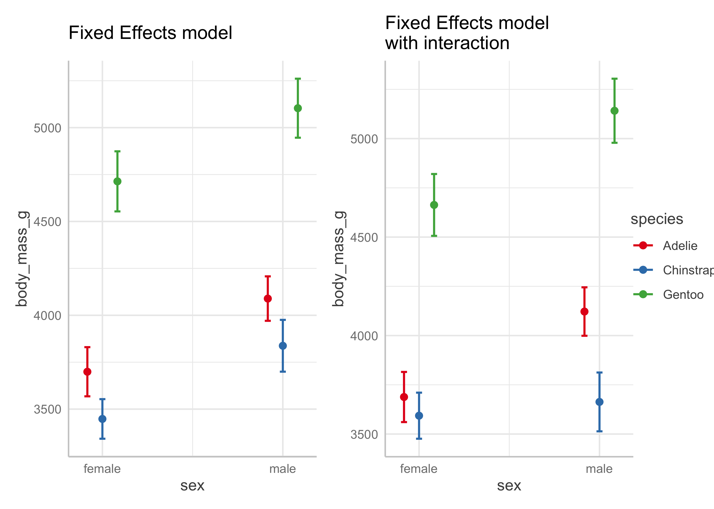<!-- -->

    ggpredict(bm_model3, c("bill_length_mm", "sex", "species")) %>%
        plot()

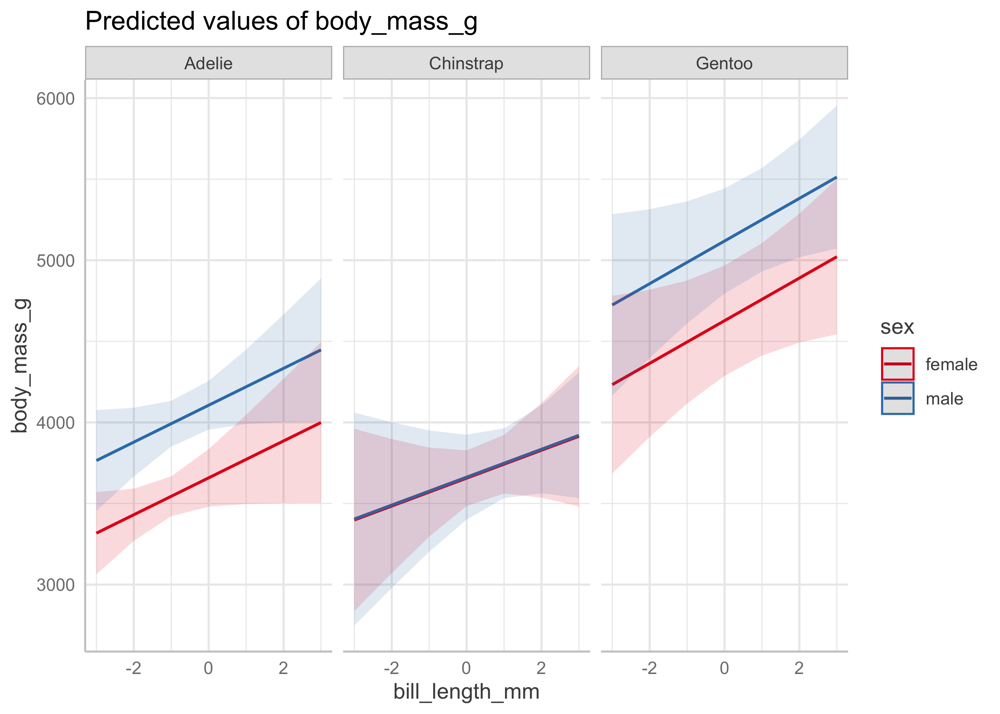<!-- -->

    ggpredict(bm_model4, c("bill_length_mm", "sex", "species")) %>%
        plot()

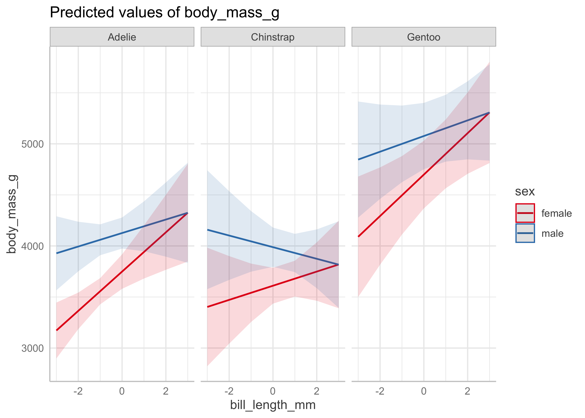<!-- -->

    bm_model4_stan <-  stan_glm(
        body_mass_g ~ 1 + (bill_length_mm + bill_depth_mm + flipper_length_mm) * (sex + species),
        data = d,
        family = gaussian(link = "identity")
    )

    #> 
    #> SAMPLING FOR MODEL 'continuous' NOW (CHAIN 1).
    #> Chain 1: 
    #> Chain 1: Gradient evaluation took 0.000133 seconds
    #> Chain 1: 1000 transitions using 10 leapfrog steps per transition would take 1.33 seconds.
    #> Chain 1: Adjust your expectations accordingly!
    #> Chain 1: 
    #> Chain 1: 
    #> Chain 1: Iteration:    1 / 2000 [  0%]  (Warmup)
    #> Chain 1: Iteration:  200 / 2000 [ 10%]  (Warmup)
    #> Chain 1: Iteration:  400 / 2000 [ 20%]  (Warmup)
    #> Chain 1: Iteration:  600 / 2000 [ 30%]  (Warmup)
    #> Chain 1: Iteration:  800 / 2000 [ 40%]  (Warmup)
    #> Chain 1: Iteration: 1000 / 2000 [ 50%]  (Warmup)
    #> Chain 1: Iteration: 1001 / 2000 [ 50%]  (Sampling)
    #> Chain 1: Iteration: 1200 / 2000 [ 60%]  (Sampling)
    #> Chain 1: Iteration: 1400 / 2000 [ 70%]  (Sampling)
    #> Chain 1: Iteration: 1600 / 2000 [ 80%]  (Sampling)
    #> Chain 1: Iteration: 1800 / 2000 [ 90%]  (Sampling)
    #> Chain 1: Iteration: 2000 / 2000 [100%]  (Sampling)
    #> Chain 1: 
    #> Chain 1:  Elapsed Time: 0.824894 seconds (Warm-up)
    #> Chain 1:                0.55287 seconds (Sampling)
    #> Chain 1:                1.37776 seconds (Total)
    #> Chain 1: 
    #> 
    #> SAMPLING FOR MODEL 'continuous' NOW (CHAIN 2).
    #> Chain 2: 
    #> Chain 2: Gradient evaluation took 2.2e-05 seconds
    #> Chain 2: 1000 transitions using 10 leapfrog steps per transition would take 0.22 seconds.
    #> Chain 2: Adjust your expectations accordingly!
    #> Chain 2: 
    #> Chain 2: 
    #> Chain 2: Iteration:    1 / 2000 [  0%]  (Warmup)
    #> Chain 2: Iteration:  200 / 2000 [ 10%]  (Warmup)
    #> Chain 2: Iteration:  400 / 2000 [ 20%]  (Warmup)
    #> Chain 2: Iteration:  600 / 2000 [ 30%]  (Warmup)
    #> Chain 2: Iteration:  800 / 2000 [ 40%]  (Warmup)
    #> Chain 2: Iteration: 1000 / 2000 [ 50%]  (Warmup)
    #> Chain 2: Iteration: 1001 / 2000 [ 50%]  (Sampling)
    #> Chain 2: Iteration: 1200 / 2000 [ 60%]  (Sampling)
    #> Chain 2: Iteration: 1400 / 2000 [ 70%]  (Sampling)
    #> Chain 2: Iteration: 1600 / 2000 [ 80%]  (Sampling)
    #> Chain 2: Iteration: 1800 / 2000 [ 90%]  (Sampling)
    #> Chain 2: Iteration: 2000 / 2000 [100%]  (Sampling)
    #> Chain 2: 
    #> Chain 2:  Elapsed Time: 0.660485 seconds (Warm-up)
    #> Chain 2:                0.543589 seconds (Sampling)
    #> Chain 2:                1.20407 seconds (Total)
    #> Chain 2: 
    #> 
    #> SAMPLING FOR MODEL 'continuous' NOW (CHAIN 3).
    #> Chain 3: 
    #> Chain 3: Gradient evaluation took 7.9e-05 seconds
    #> Chain 3: 1000 transitions using 10 leapfrog steps per transition would take 0.79 seconds.
    #> Chain 3: Adjust your expectations accordingly!
    #> Chain 3: 
    #> Chain 3: 
    #> Chain 3: Iteration:    1 / 2000 [  0%]  (Warmup)
    #> Chain 3: Iteration:  200 / 2000 [ 10%]  (Warmup)
    #> Chain 3: Iteration:  400 / 2000 [ 20%]  (Warmup)
    #> Chain 3: Iteration:  600 / 2000 [ 30%]  (Warmup)
    #> Chain 3: Iteration:  800 / 2000 [ 40%]  (Warmup)
    #> Chain 3: Iteration: 1000 / 2000 [ 50%]  (Warmup)
    #> Chain 3: Iteration: 1001 / 2000 [ 50%]  (Sampling)
    #> Chain 3: Iteration: 1200 / 2000 [ 60%]  (Sampling)
    #> Chain 3: Iteration: 1400 / 2000 [ 70%]  (Sampling)
    #> Chain 3: Iteration: 1600 / 2000 [ 80%]  (Sampling)
    #> Chain 3: Iteration: 1800 / 2000 [ 90%]  (Sampling)
    #> Chain 3: Iteration: 2000 / 2000 [100%]  (Sampling)
    #> Chain 3: 
    #> Chain 3:  Elapsed Time: 0.665846 seconds (Warm-up)
    #> Chain 3:                0.538566 seconds (Sampling)
    #> Chain 3:                1.20441 seconds (Total)
    #> Chain 3: 
    #> 
    #> SAMPLING FOR MODEL 'continuous' NOW (CHAIN 4).
    #> Chain 4: 
    #> Chain 4: Gradient evaluation took 6.7e-05 seconds
    #> Chain 4: 1000 transitions using 10 leapfrog steps per transition would take 0.67 seconds.
    #> Chain 4: Adjust your expectations accordingly!
    #> Chain 4: 
    #> Chain 4: 
    #> Chain 4: Iteration:    1 / 2000 [  0%]  (Warmup)
    #> Chain 4: Iteration:  200 / 2000 [ 10%]  (Warmup)
    #> Chain 4: Iteration:  400 / 2000 [ 20%]  (Warmup)
    #> Chain 4: Iteration:  600 / 2000 [ 30%]  (Warmup)
    #> Chain 4: Iteration:  800 / 2000 [ 40%]  (Warmup)
    #> Chain 4: Iteration: 1000 / 2000 [ 50%]  (Warmup)
    #> Chain 4: Iteration: 1001 / 2000 [ 50%]  (Sampling)
    #> Chain 4: Iteration: 1200 / 2000 [ 60%]  (Sampling)
    #> Chain 4: Iteration: 1400 / 2000 [ 70%]  (Sampling)
    #> Chain 4: Iteration: 1600 / 2000 [ 80%]  (Sampling)
    #> Chain 4: Iteration: 1800 / 2000 [ 90%]  (Sampling)
    #> Chain 4: Iteration: 2000 / 2000 [100%]  (Sampling)
    #> Chain 4: 
    #> Chain 4:  Elapsed Time: 0.798395 seconds (Warm-up)
    #> Chain 4:                0.476995 seconds (Sampling)
    #> Chain 4:                1.27539 seconds (Total)
    #> Chain 4:

    plot(bm_model4_stan)

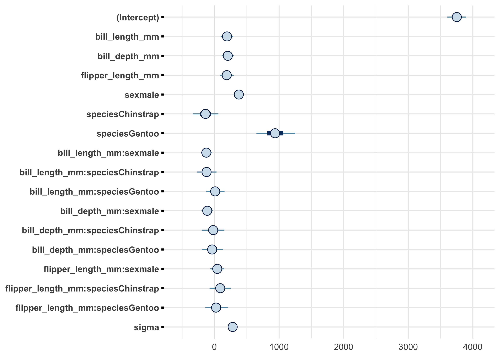<!-- -->

    plot(bayestestR::hdi(bm_model4_stan, ci = c(0.5, 0.75, 0.89, 0.95)))

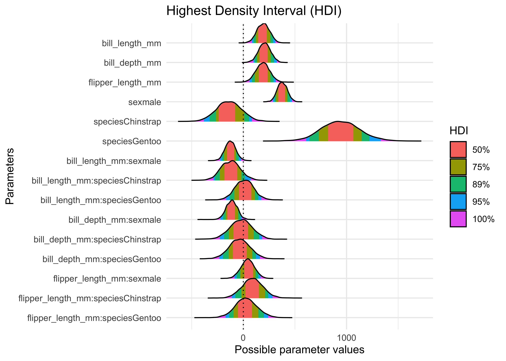<!-- -->

    p1 <- ggpredict(bm_model4, c("bill_length_mm [all]", "sex", "species")) %>%
        plot() +
        ggtitle("Frequentist")
    p2 <- ggpredict(bm_model4_stan, c("bill_length_mm [all]", "sex", "species")) %>%
        plot() +
        ggtitle("Bayesian")

    (p1 | p2 | guide_area()) +
        plot_layout(widths = c(5, 5, 1), guides = "collect")

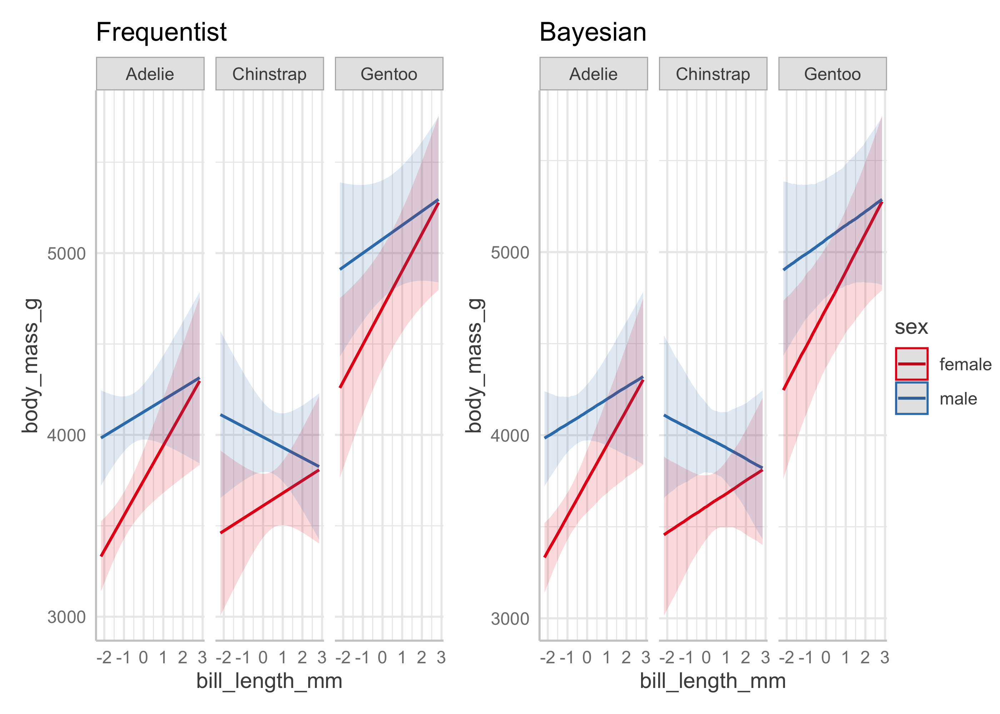<!-- -->

    ggpredict_plot_factory <- function(m, x_axis, x_axis_title, include_y_axis = TRUE) {
        ggpredict(m, c(x_axis, "sex", "species")) %>%
        plot() +
        theme(
            legend.title = element_blank(),
            legend.position = "right",
            plot.title = element_blank(),
            plot.subtitle = element_blank()
        ) +
        labs(x = x_axis_title,
             y = ifelse(include_y_axis, "predicted body mass (g)", ""))
    }

    p1 <- ggpredict_plot_factory(bm_model4_stan, "bill_length_mm [all]", "bill length (scaled)", include_y_axis = FALSE)
    p2 <- ggpredict_plot_factory(bm_model4_stan, "bill_depth_mm [all]", "bill depth (scaled)")
    p3 <- ggpredict_plot_factory(bm_model4_stan, "flipper_length_mm [all]", "flipper length (scaled)", include_y_axis = FALSE)

    ((p1 / p2 / p3) | guide_area()) +
        plot_layout(widths = c(5, 1), guides = "collect") +
        plot_annotation(title = "Predicted effect of body measurements on the body mass of penguins",
                        subtitle = "Including interaction terms for sex and species of penguin")

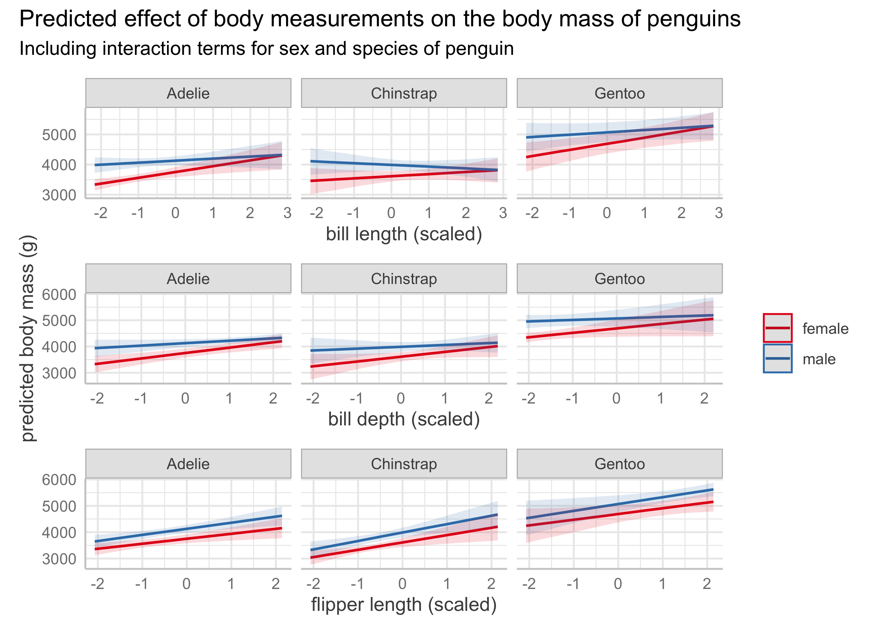<!-- -->

    ggsave(file.path("2020-07-28_palmer-penguins_files", 
                     "bodymass_by_measurements.png"), 
           width = 6, height = 10)
