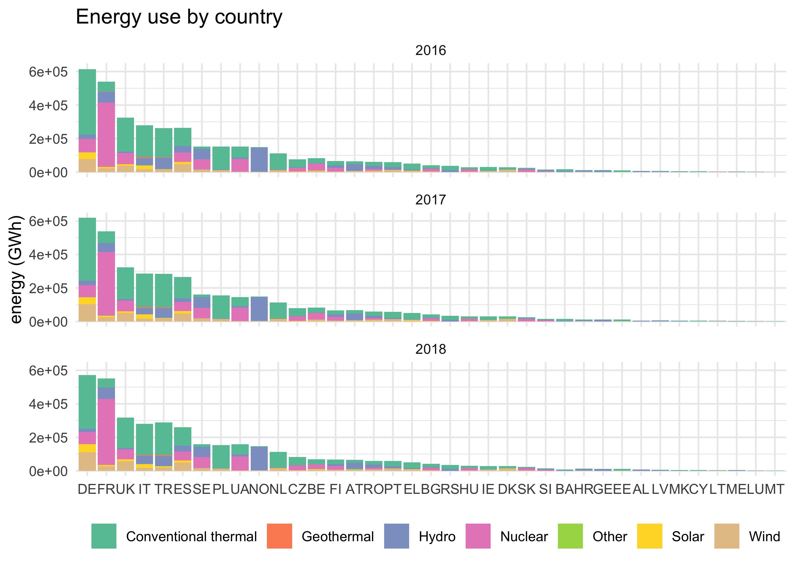
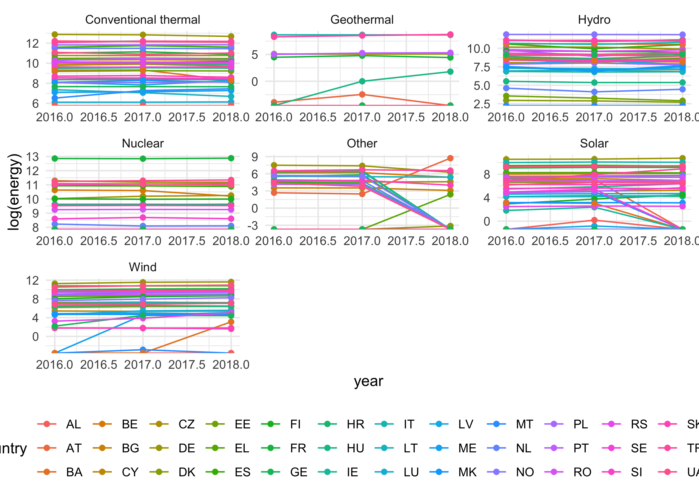
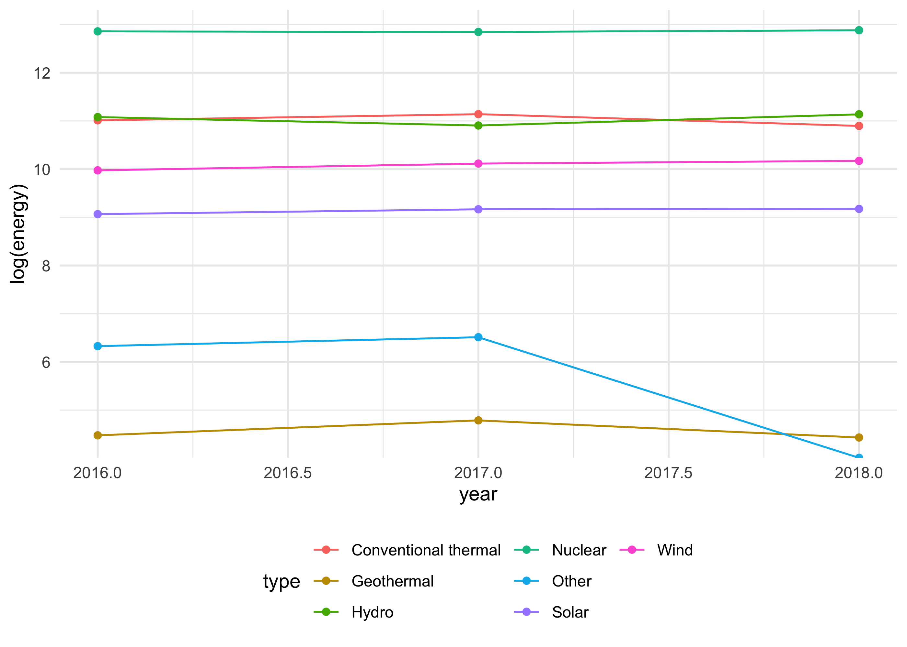
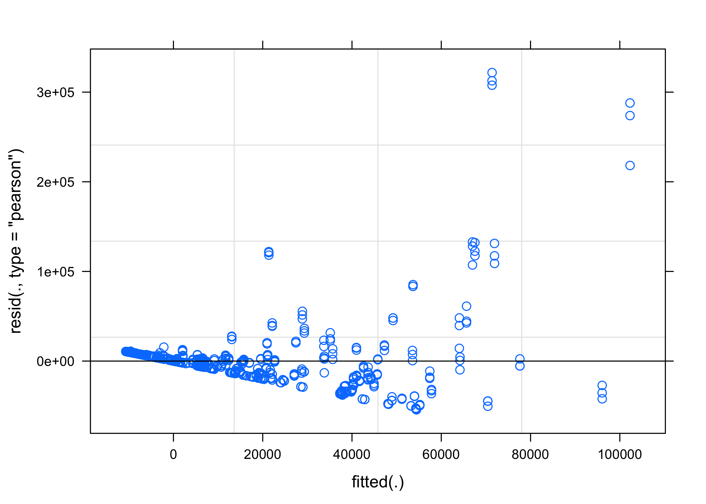
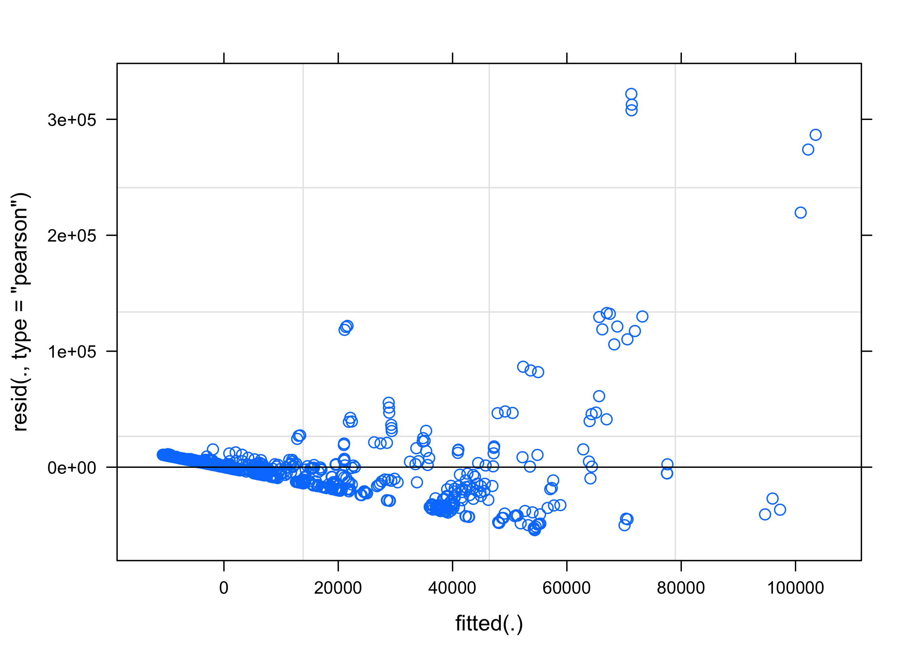
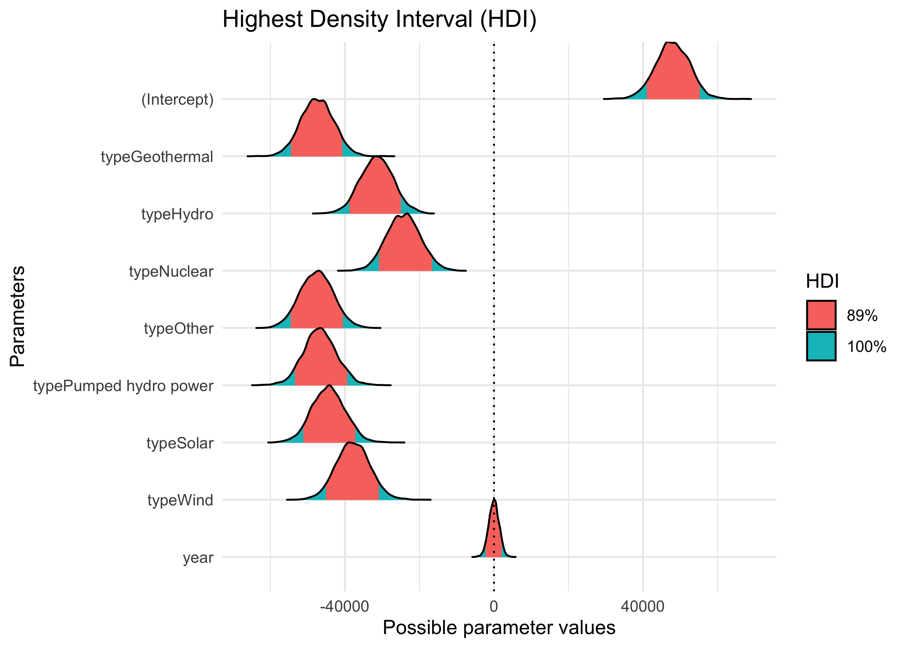
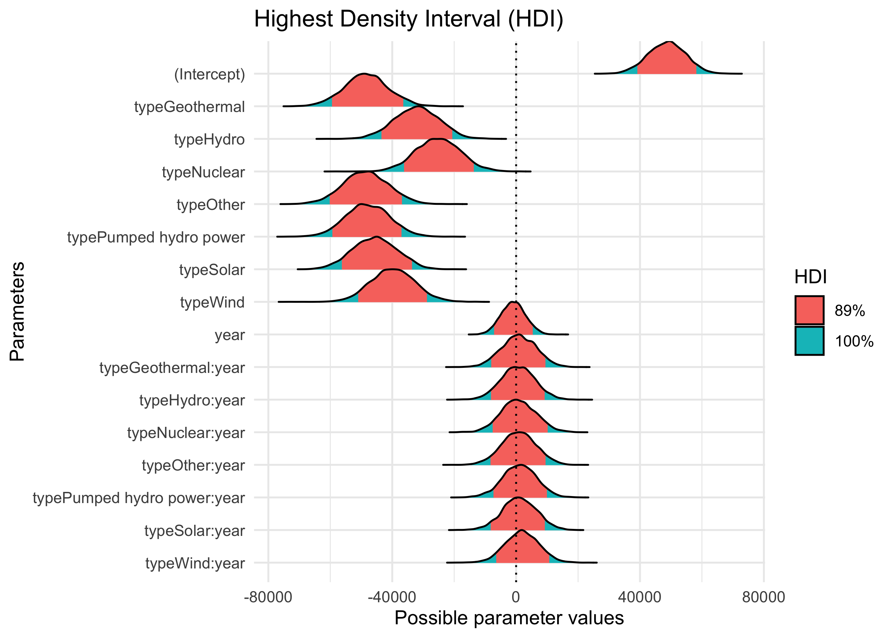
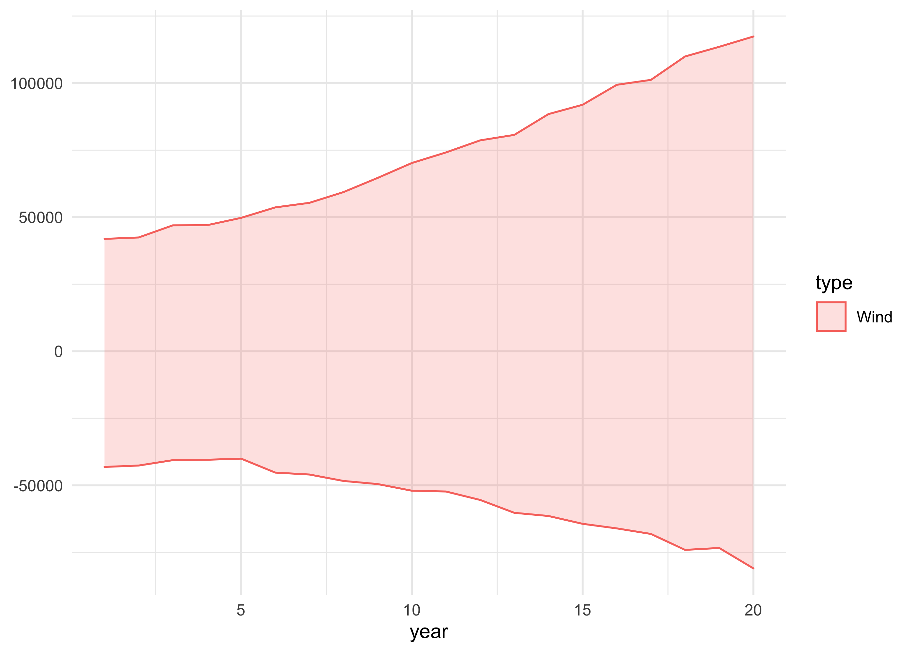
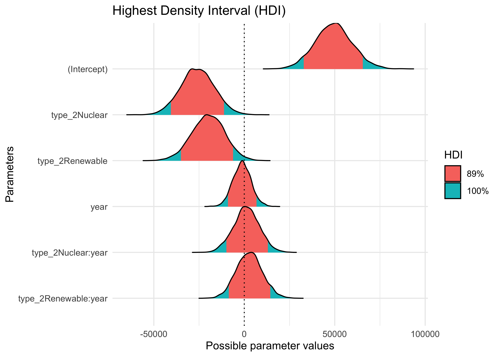
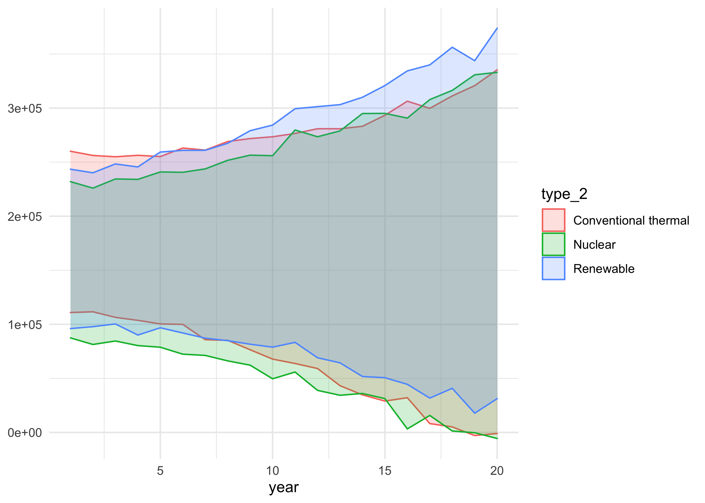

European energy
================
Joshua Cook
August 4, 2020

Setup
-----

TidyTuesday link:
[2020/2020-08-04/readme.md](https://github.com/rfordatascience/tidytuesday/blob/master/data/2020/2020-08-04/readme.md)

    knitr::opts_chunk$set(echo = TRUE, comment = "#>", dpi = 400)

    library(mustashe)
    library(glue)
    library(magrittr)
    library(patchwork)
    library(tidyverse)
    library(conflicted)

    conflict_prefer("filter", "dplyr")
    conflict_prefer("select", "dplyr")
    conflict_prefer("setdiff", "dplyr")

    blue <- "#5eafe6"
    dark_blue <- "#408ec2"
    red <- "#eb5e60"
    light_grey <- "grey80"
    grey <- "grey50"
    dark_grey <- "grey25"

    theme_set(theme_minimal())

    # To shut-up `summarise()`.
    options(dplyr.summarise.inform = FALSE)

    set.seed(0)

Data
----

    prep_data <- function(df) {
        df %>%
            janitor::clean_names() %>%
            pivot_longer(x2016:x2018, names_to = "year", values_to = "energy") %>%
            mutate(year = str_remove(year, "^x"),
                   year = as.numeric(year))
    }

    energy_types <- read_csv("https://raw.githubusercontent.com/rfordatascience/tidytuesday/master/data/2020/2020-08-04/energy_types.csv") %>%
        prep_data()

    #> Parsed with column specification:
    #> cols(
    #>   country = col_character(),
    #>   country_name = col_character(),
    #>   type = col_character(),
    #>   level = col_character(),
    #>   `2016` = col_double(),
    #>   `2017` = col_double(),
    #>   `2018` = col_double()
    #> )

    country_totals <- read_csv("https://raw.githubusercontent.com/rfordatascience/tidytuesday/master/data/2020/2020-08-04/country_totals.csv") %>%
        prep_data()

    #> Parsed with column specification:
    #> cols(
    #>   country = col_character(),
    #>   country_name = col_character(),
    #>   type = col_character(),
    #>   level = col_character(),
    #>   `2016` = col_double(),
    #>   `2017` = col_double(),
    #>   `2018` = col_double()
    #> )

EDA
---

    energy_types %>%
        filter(level == "Level 1") %>%
        mutate(country = fct_reorder(country, -energy, .fun = sum)) %>%
        ggplot(aes(country, energy)) +
        facet_wrap(~ year, ncol = 1) +
        geom_col(aes(fill = type)) +
        scale_fill_brewer(palette = "Set2", guide = guide_legend(nrow = 1)) +
        theme(
            legend.position = "bottom",
            legend.title = element_blank(),
            axis.title.x = element_blank()
        ) +
        labs(y = "energy (GWh)",
             title = "Energy use by country")

<!-- -->

    energy_types %>%
        filter(level == "Level 1") %>%
        ggplot(aes(x = year, y = log(energy))) +
        facet_wrap(~ type, scales = "free", ncol = 3) +
        geom_line(aes(color = country, group = paste0(country, "_", type))) +
        geom_point(aes(color = country)) +
        scale_color_discrete(guide = guide_legend(nrow = 3)) +
        theme(
            legend.position = "bottom"
        )

<!-- -->

    energy_types %>%
        filter(country %in% c("FR")) %>%
        filter(level == "Level 1") %>%
        ggplot(aes(x = year, y = log(energy))) +
        geom_line(aes(color = type, group = paste0(country, "_", type))) +
        geom_point(aes(color = type)) +
        scale_color_discrete(guide = guide_legend(nrow = 3)) +
        theme(
            legend.position = "bottom"
        )

<!-- -->

Model
-----

    library(lme4)

    #> Loading required package: Matrix

    #> 
    #> Attaching package: 'Matrix'

    #> The following objects are masked from 'package:tidyr':
    #> 
    #>     expand, pack, unpack

    d <- energy_types %>%
        mutate(year = year - min(year))

    m1 <- lmer(energy ~ type + year + (1|country), data = d)
    m2 <- lmer(energy ~ type * year + (1|country), data = d)
    summary(m1)

    #> Linear mixed model fit by REML ['lmerMod']
    #> Formula: energy ~ type + year + (1 | country)
    #>    Data: d
    #> 
    #> REML criterion at convergence: 20932.1
    #> 
    #> Scaled residuals: 
    #>     Min      1Q  Median      3Q     Max 
    #> -1.6148 -0.3846  0.0192  0.2182  9.5708 
    #> 
    #> Random effects:
    #>  Groups   Name        Variance  Std.Dev.
    #>  country  (Intercept) 2.836e+08 16841   
    #>  Residual             1.130e+09 33620   
    #> Number of obs: 888, groups:  country, 37
    #> 
    #> Fixed effects:
    #>                          Estimate Std. Error t value
    #> (Intercept)             48143.703   4444.927  10.831
    #> typeGeothermal         -47842.737   4512.844 -10.601
    #> typeHydro              -31866.282   4512.844  -7.061
    #> typeNuclear            -24671.696   4512.844  -5.467
    #> typeOther              -47975.519   4512.844 -10.631
    #> typePumped hydro power -47100.698   4512.844 -10.437
    #> typeSolar              -44863.397   4512.844  -9.941
    #> typeWind               -38239.261   4512.844  -8.473
    #> year                        6.418   1381.771   0.005
    #> 
    #> Correlation of Fixed Effects:
    #>             (Intr) typGth typHyd typNcl typOth typPhp typSlr typWnd
    #> typeGethrml -0.508                                                 
    #> typeHydro   -0.508  0.500                                          
    #> typeNuclear -0.508  0.500  0.500                                   
    #> typeOther   -0.508  0.500  0.500  0.500                            
    #> typPmpdhydp -0.508  0.500  0.500  0.500  0.500                     
    #> typeSolar   -0.508  0.500  0.500  0.500  0.500  0.500              
    #> typeWind    -0.508  0.500  0.500  0.500  0.500  0.500  0.500       
    #> year        -0.311  0.000  0.000  0.000  0.000  0.000  0.000  0.000

    summary(m2)

    #> Linear mixed model fit by REML ['lmerMod']
    #> Formula: energy ~ type * year + (1 | country)
    #>    Data: d
    #> 
    #> REML criterion at convergence: 20801.2
    #> 
    #> Scaled residuals: 
    #>     Min      1Q  Median      3Q     Max 
    #> -1.6067 -0.3828  0.0152  0.2165  9.5355 
    #> 
    #> Random effects:
    #>  Groups   Name        Variance  Std.Dev.
    #>  country  (Intercept) 2.832e+08 16829   
    #>  Residual             1.139e+09 33756   
    #> Number of obs: 888, groups:  country, 37
    #> 
    #> Fixed effects:
    #>                             Estimate Std. Error t value
    #> (Intercept)                    49461       5772   8.569
    #> typeGeothermal                -49183       7164  -6.865
    #> typeHydro                     -32917       7164  -4.595
    #> typeNuclear                   -25939       7164  -3.621
    #> typeOther                     -49318       7164  -6.884
    #> typePumped hydro power        -48645       7164  -6.790
    #> typeSolar                     -46432       7164  -6.481
    #> typeWind                      -40666       7164  -5.676
    #> year                           -1311       3924  -0.334
    #> typeGeothermal:year             1340       5550   0.242
    #> typeHydro:year                  1051       5550   0.189
    #> typeNuclear:year                1268       5550   0.228
    #> typeOther:year                  1343       5550   0.242
    #> typePumped hydro power:year     1544       5550   0.278
    #> typeSolar:year                  1568       5550   0.283
    #> typeWind:year                   2426       5550   0.437

    #> 
    #> Correlation matrix not shown by default, as p = 16 > 12.
    #> Use print(x, correlation=TRUE)  or
    #>     vcov(x)        if you need it

    plot(m1)

<!-- -->

    plot(m2)

<!-- -->

    AIC(m1, m2)

    #>    df      AIC
    #> m1 11 20954.13
    #> m2 18 20837.16

    library(see)
    library(bayestestR)
    library(tidybayes)
    library(rstanarm)

    #> Loading required package: Rcpp

    #> rstanarm (Version 2.19.3, packaged: 2020-02-11 05:16:41 UTC)

    #> - Do not expect the default priors to remain the same in future rstanarm versions.

    #> Thus, R scripts should specify priors explicitly, even if they are just the defaults.

    #> - For execution on a local, multicore CPU with excess RAM we recommend calling

    #> options(mc.cores = parallel::detectCores())

    #> - bayesplot theme set to bayesplot::theme_default()

    #>    * Does _not_ affect other ggplot2 plots

    #>    * See ?bayesplot_theme_set for details on theme setting

    stash("m1_stan", depends_on = "d", {
        m1_stan <- stan_lmer(energy ~ type + year + (1|country), data = d)
    })

    #> Loading stashed object.

    plot(bayestestR::hdi(m1_stan), show_intercept = TRUE)

<!-- -->

    summary(m2)

    #> Linear mixed model fit by REML ['lmerMod']
    #> Formula: energy ~ type * year + (1 | country)
    #>    Data: d
    #> 
    #> REML criterion at convergence: 20801.2
    #> 
    #> Scaled residuals: 
    #>     Min      1Q  Median      3Q     Max 
    #> -1.6067 -0.3828  0.0152  0.2165  9.5355 
    #> 
    #> Random effects:
    #>  Groups   Name        Variance  Std.Dev.
    #>  country  (Intercept) 2.832e+08 16829   
    #>  Residual             1.139e+09 33756   
    #> Number of obs: 888, groups:  country, 37
    #> 
    #> Fixed effects:
    #>                             Estimate Std. Error t value
    #> (Intercept)                    49461       5772   8.569
    #> typeGeothermal                -49183       7164  -6.865
    #> typeHydro                     -32917       7164  -4.595
    #> typeNuclear                   -25939       7164  -3.621
    #> typeOther                     -49318       7164  -6.884
    #> typePumped hydro power        -48645       7164  -6.790
    #> typeSolar                     -46432       7164  -6.481
    #> typeWind                      -40666       7164  -5.676
    #> year                           -1311       3924  -0.334
    #> typeGeothermal:year             1340       5550   0.242
    #> typeHydro:year                  1051       5550   0.189
    #> typeNuclear:year                1268       5550   0.228
    #> typeOther:year                  1343       5550   0.242
    #> typePumped hydro power:year     1544       5550   0.278
    #> typeSolar:year                  1568       5550   0.283
    #> typeWind:year                   2426       5550   0.437

    #> 
    #> Correlation matrix not shown by default, as p = 16 > 12.
    #> Use print(x, correlation=TRUE)  or
    #>     vcov(x)        if you need it

    stash("m2_stan", depends_on = "d", {
        m2_stan <- stan_lmer(energy ~ type * year + (1|country), data = d)
    })

    #> Loading stashed object.

    plot(bayestestR::hdi(m2_stan), show_intercept = TRUE)

<!-- -->

    years <- 1:20
    pred_d <- d %>%
        distinct(country, type) %>%
        mutate(year = list(years)) %>%
        unnest(year)

    pred_d %>%
        filter(country == "ME" & type == "Wind") %>%
        add_predicted_draws(m2_stan) %>%
        group_by(year, type, country) %>%
        summarise(top_89 = quantile(.prediction, 0.89),
                  bottom_89 = quantile(.prediction, 0.11)) %>%
        ggplot(aes(x = year)) +
        geom_ribbon(aes(ymin = bottom_89, ymax = top_89, fill = type, color = type),
                    alpha = 0.2)

<!-- -->

    d2 <- d %>%
        mutate(
            type_2 = case_when(
                type == "Nuclear" ~ "Nuclear",
                type == "Conventional thermal" ~ "Conventional thermal",
                TRUE ~ "Renewable"
            )
        ) %>% 
        group_by(country, year, type_2) %>%
        summarise(energy = sum(energy)) %>%
        group_by(country, year) %>%
        mutate(energy_pct = energy / sum(energy)) %>%
        ungroup()

    stash("m3_stan", depends_on = "d2", {
        m3_stan <- stan_lmer(energy ~ type_2 * year + (1|country), data = d2)
    })

    #> Loading stashed object.

    plot(bayestestR::hdi(m3_stan), show_intercept = TRUE)

<!-- -->

    years <- 1:20
    pred_d2 <- d2 %>%
        distinct(country, type_2) %>%
        mutate(year = list(years)) %>%
        unnest(year)

    pred_d2 %>%
        filter(country == "FR") %>%
        add_predicted_draws(m3_stan) %>%
        median_hdi(.width = 0.89) %>%
        ggplot(aes(x = year)) +
        geom_ribbon(aes(ymin = .lower, ymax = .upper, fill = type_2, color = type_2),
                    alpha = 0.2)

<!-- -->
