Avatar: The Last Airbender
================
Joshua Cook
August 11, 2020

Setup
-----

TidyTuesday link:
[2020/2020-08-11/readme.md](https://github.com/rfordatascience/tidytuesday/blob/master/data/2020/2020-08-11/readme.md)

    knitr::opts_chunk$set(echo = TRUE, comment = "#>", dpi = 400)

    library(mustashe)
    library(jhcutils)
    library(glue)
    library(magrittr)
    library(patchwork)
    library(ggridges)
    library(tidyverse)
    library(conflicted)

    conflict_prefer("filter", "dplyr")
    conflict_prefer("select", "dplyr")
    conflict_prefer("setdiff", "dplyr")

    blue <- "#5eafe6"
    dark_blue <- "#408ec2"
    red <- "#eb5e60"
    light_grey <- "grey80"
    grey <- "grey50"
    dark_grey <- "grey25"

    theme_set(theme_minimal())

    # To shut-up `summarise()`.
    options(dplyr.summarise.inform = FALSE)

    set.seed(0)

Data
----

    avatar <- read_csv("https://raw.githubusercontent.com/rfordatascience/tidytuesday/master/data/2020/2020-08-11/avatar.csv") %>%
        janitor::clean_names()

    #> Parsed with column specification:
    #> cols(
    #>   id = col_double(),
    #>   book = col_character(),
    #>   book_num = col_double(),
    #>   chapter = col_character(),
    #>   chapter_num = col_double(),
    #>   character = col_character(),
    #>   full_text = col_character(),
    #>   character_words = col_character(),
    #>   writer = col_character(),
    #>   director = col_character(),
    #>   imdb_rating = col_double()
    #> )

EDA
---

    avatar %>%
        distinct(book_num, chapter_num, imdb_rating) %>%
        mutate(i = row_number()) %>%
        ggplot(aes(i, imdb_rating, color = factor(book_num))) +
        geom_line(alpha = 0.5) +
        geom_point() +
        geom_smooth(method = "lm", formula = "y ~ x", alpha = 0.2) +
        labs(x = "episode number",
             y = "IMDB rating",
             color = "book",
             title = "Ratings per episode")

    #> Warning: Removed 1 rows containing non-finite values (stat_smooth).

    #> Warning: Removed 1 row(s) containing missing values (geom_path).

    #> Warning: Removed 1 rows containing missing values (geom_point).

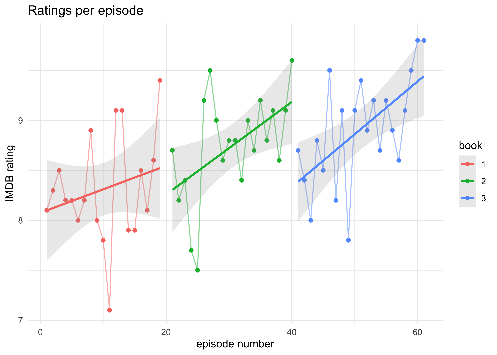<!-- -->

    character_episode_line_counts <- avatar %>%
        mutate(book = fct_inorder(book)) %>%
        count(book, chapter_num, character) %>%
        group_by(character) %>%
        filter(sum(n) > 200) %>%
        ungroup() %>%
        filter(character != "Scene Description") %>%
        mutate(character = fct_reorder(character, -n, .fun = sum))

    character_episode_line_counts %>%
        ggplot(aes(x = chapter_num, y = n, color = character)) +
        facet_grid(character ~ book) +
        geom_line(alpha = 0.3) +
        geom_point()

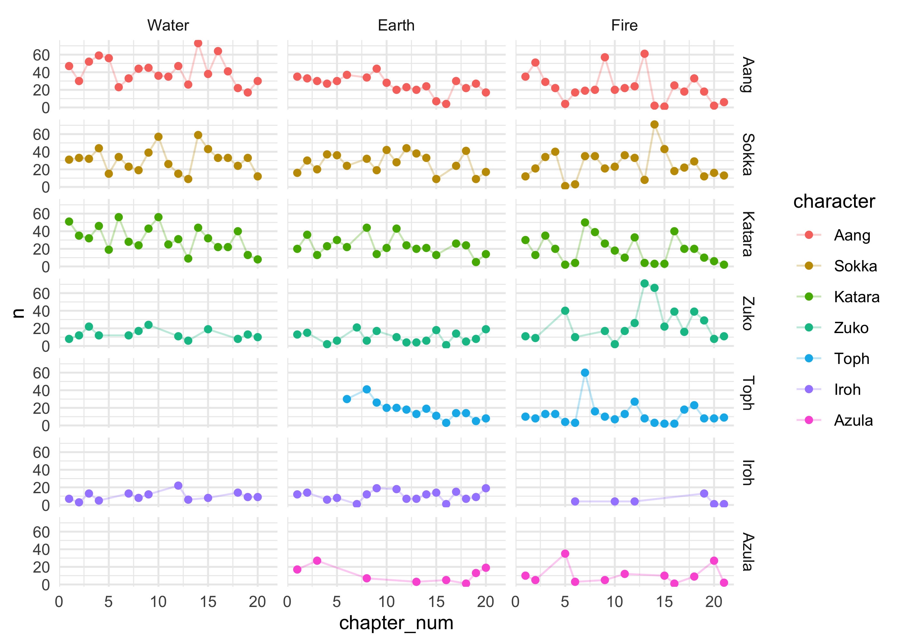<!-- -->

    top_characters <- unique(character_episode_line_counts$character)

    avatar %>%
        filter(character %in% as.character(top_characters)) %>%
        mutate(character = factor(character, levels = levels(top_characters)),
               book = fct_inorder(book)) %>%
        filter(!is.na(character_words)) %>%
        mutate(num_words = map_int(character_words, ~ length(unlist(str_split(.x, " "))))) %>%
        group_by(book, chapter_num, character) %>%
        summarise(word_count = sum(num_words)) %>%
        ggplot(aes(x = chapter_num, y = word_count)) +
        facet_wrap(~ book, nrow = 1, scales = "free_x") +
        geom_line(aes(color = character), alpha = 0.4, size = 1) +
        geom_point(aes(color = character))

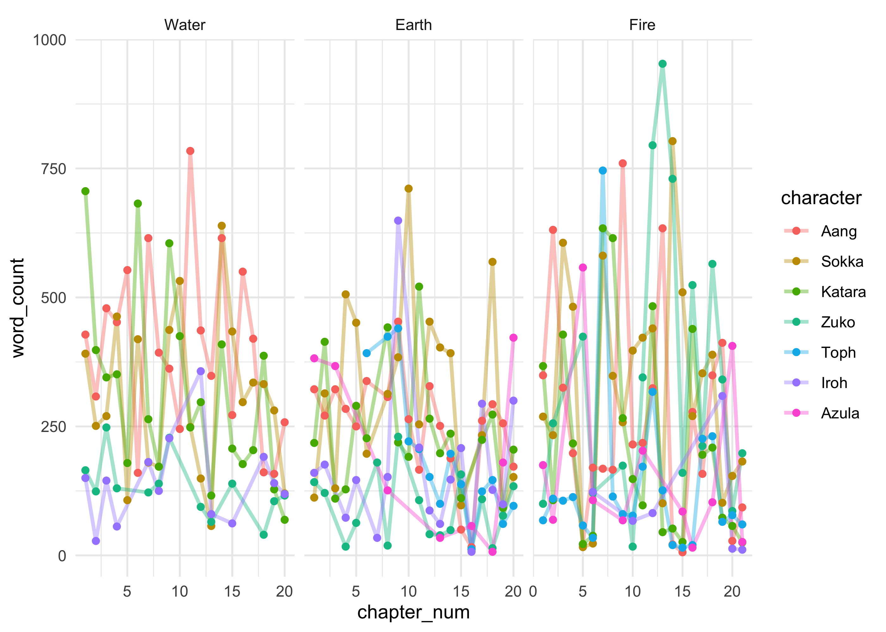<!-- -->

Modeling
--------

    library(easystats)

    #> # Attaching packages
    #> ✔ insight     0.9.0.1   ✔ bayestestR  0.7.2  
    #> ✔ performance 0.4.8     ✔ parameters  0.8.2  
    #> ✔ see         0.5.2     ✔ effectsize  0.3.2  
    #> ✔ correlation 0.3.0     ✔ modelbased  0.2.0  
    #> ✔ report      0.1.0     
    #> Warnings or errors in CRAN checks for package(s) 'parameters'.

    library(tidybayes)
    library(bayesplot)

    #> This is bayesplot version 1.7.2

    #> - Online documentation and vignettes at mc-stan.org/bayesplot

    #> - bayesplot theme set to bayesplot::theme_default()

    #>    * Does _not_ affect other ggplot2 plots

    #>    * See ?bayesplot_theme_set for details on theme setting

    library(rstanarm)

    #> Loading required package: Rcpp

    #> rstanarm (Version 2.19.3, packaged: 2020-02-11 05:16:41 UTC)

    #> - Do not expect the default priors to remain the same in future rstanarm versions.

    #> Thus, R scripts should specify priors explicitly, even if they are just the defaults.

    #> - For execution on a local, multicore CPU with excess RAM we recommend calling

    #> options(mc.cores = parallel::detectCores())

    #> - bayesplot theme set to bayesplot::theme_default()

    #>    * Does _not_ affect other ggplot2 plots

    #>    * See ?bayesplot_theme_set for details on theme setting

    episode_number <- avatar %>%
        distinct(book_num, chapter_num) %>%
        arrange(book_num, chapter_num) %>%
        mutate(episode_num = row_number())

    avatar_word_counts <- avatar %>%
        filter(!is.na(imdb_rating)) %>%
        filter(character %in% levels(top_characters)) %>%
        filter(!is.na(character_words)) %>%
        left_join(episode_number, by = c("book_num", "chapter_num")) %>%
        mutate(word_count = map_dbl(character_words, ~ length(unlist(str_split(.x, " "))))) %>%
        group_by(imdb_rating, book, book_num, chapter, chapter_num, episode_num, character) %>%
        summarise(total_wc = sum(word_count)) %>%
        ungroup() %>%
        mutate(log_wc = log(total_wc))

    d <- avatar_word_counts %>%
        pivot_wider(c(imdb_rating, book, book_num, chapter, chapter_num, episode_num, character),
                    names_from = character, values_from = log_wc) %>%
        arrange(episode_num)
    d[is.na(d)] <- 0

    avatar_word_counts %>%
        ggplot(aes(x = log_wc, y = imdb_rating)) +
        geom_point(aes(color = character)) +
        geom_smooth(aes(color = character), method = "lm", formula = "y ~ x", alpha = 0.15)

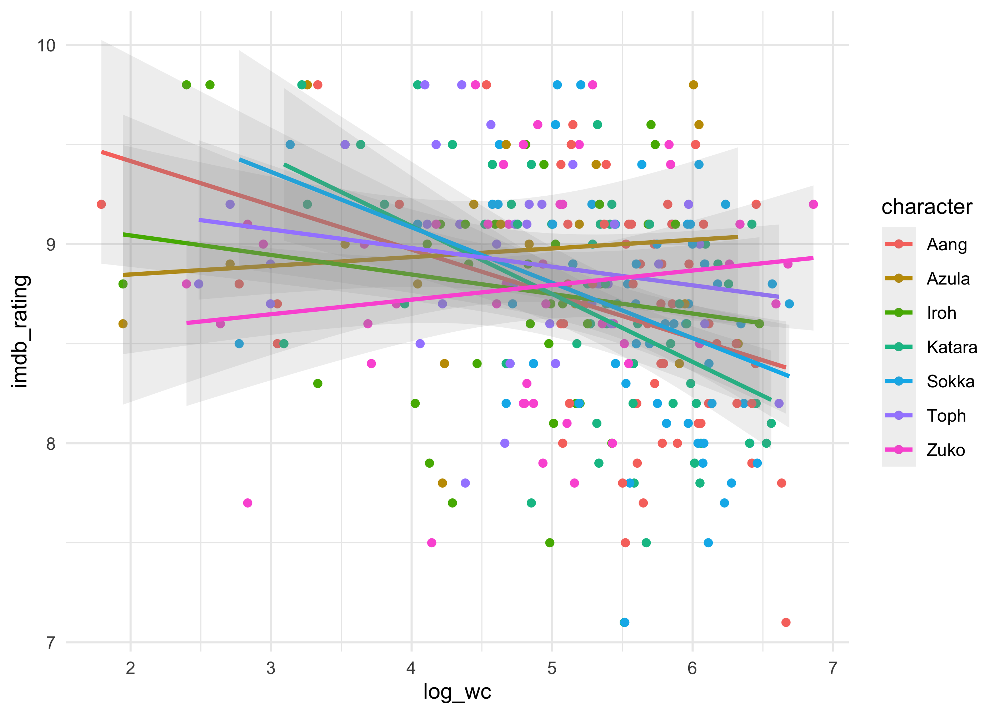<!-- -->

    avatar_word_counts %>%
        ggplot(aes(x = episode_num, y = log_wc)) +
        geom_point(aes(color = character, size = imdb_rating, shape = book), 
                   alpha = 0.6) +
        scale_size_continuous(range = c(1, 4))

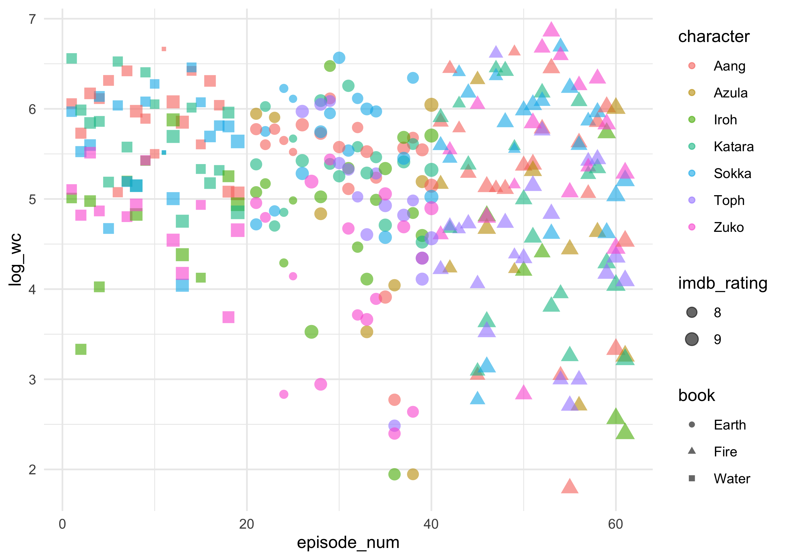<!-- -->

### Model 1

    m1_priors <- stan_glm(
        imdb_rating ~ 1 + episode_num,
        data = d,
        family = gaussian(link = "identity"),
        prior = normal(location = 0.01, scale = 1),
        prior_intercept = normal(location = 8, scale = 2.5),
        prior_aux = cauchy(),
        prior_PD = TRUE,
        refresh = 0,
        cores = 1
    )

    plot(m1_priors)

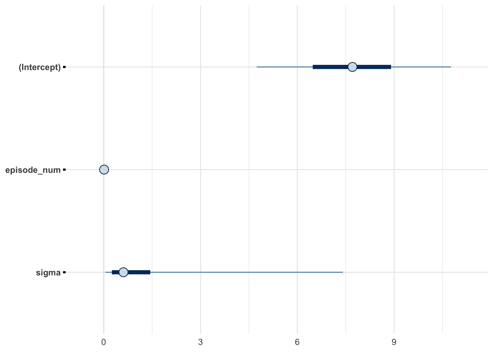<!-- -->

    plot(bayestestR::hdi(m1_priors, ci = c(0.5, 0.75, 0.89, 0.95)))

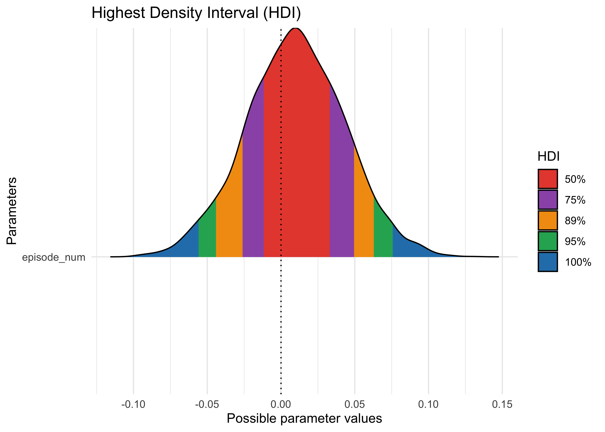<!-- -->

    d %>%
        distinct(episode_num) %>%
        add_predicted_draws(m1_priors) %>%
        ggplot(aes(x = episode_num, y = .prediction)) +
        stat_lineribbon() +
        scale_fill_brewer(palette = "Greys")

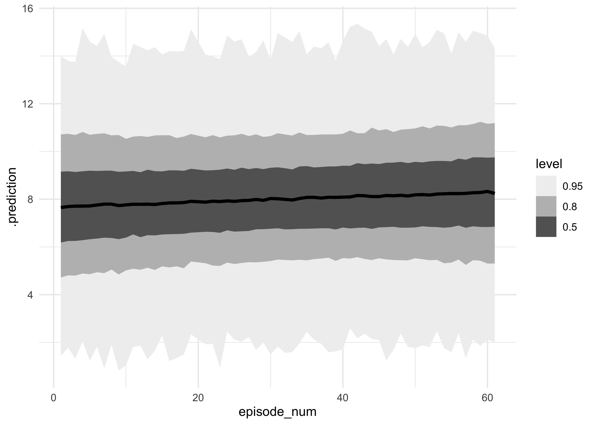<!-- -->

    m1_fit <- stan_glm(
        imdb_rating ~ 1 + episode_num,
        data = d,
        family = gaussian(link = "identity"),
        prior = normal(location = 0.01, scale = 1),
        prior_intercept = normal(location = 8, scale = 2.5),
        prior_aux = cauchy(),
        refresh = 0,
        cores = 1
    )

    plot(m1_fit)

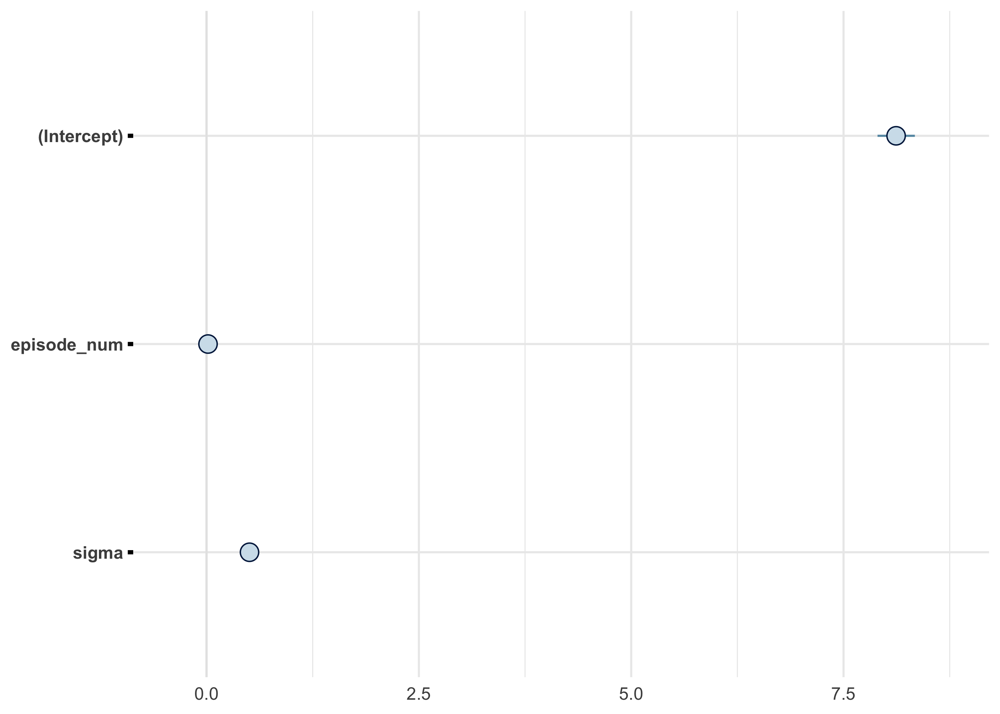<!-- -->

    plot(bayestestR::hdi(m1_fit, ci = c(0.5, 0.75, 0.89, 0.95)))

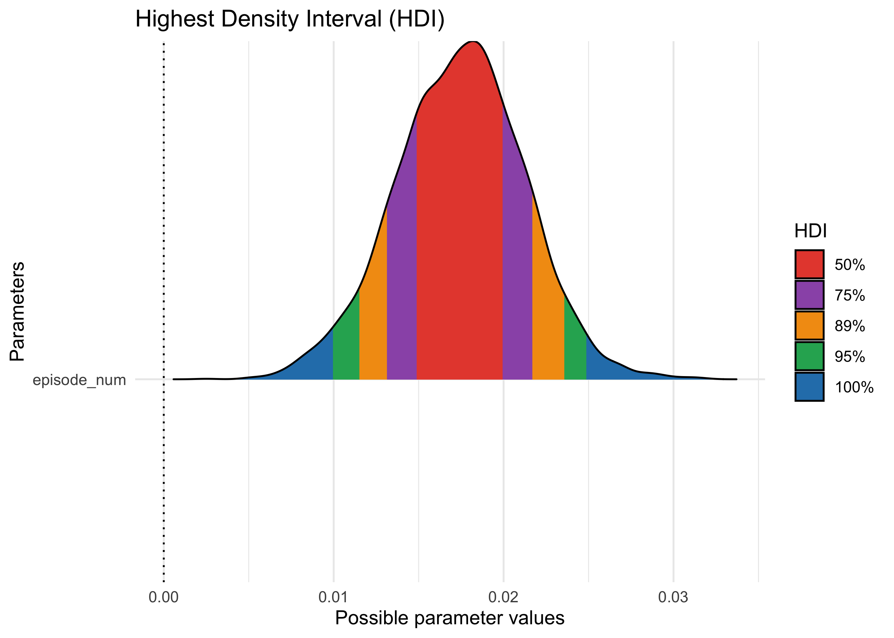<!-- -->

    describe_posterior(m1_fit)

    #> # Description of Posterior Distributions
    #> 
    #> Parameter   | Median |         89% CI | pd |        89% ROPE | % in ROPE |  Rhat |      ESS
    #> -------------------------------------------------------------------------------------------
    #> (Intercept) |  8.119 | [7.911, 8.337] |  1 | [-0.059, 0.059] |         0 | 0.999 | 3792.392
    #> episode_num |  0.018 | [0.012, 0.024] |  1 | [-0.059, 0.059] |       100 | 0.999 | 3885.133

    d %>%
        distinct(episode_num) %>%
        add_predicted_draws(m1_fit) %>%
        ggplot(aes(x = episode_num, y = .prediction)) +
        stat_lineribbon() +
        scale_fill_brewer(palette = "Greys")

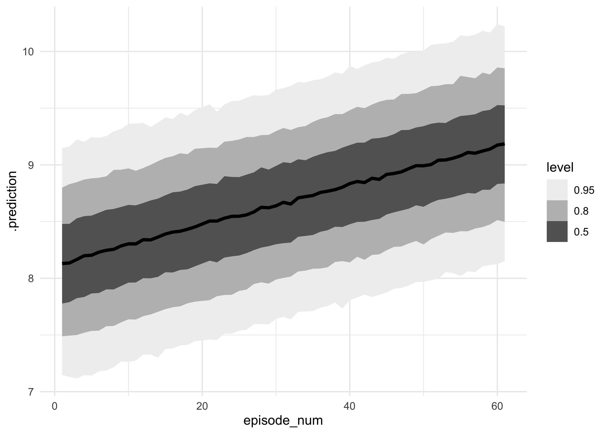<!-- -->

### Model 2

    m2_priors <- stan_glm(
        imdb_rating ~ 1 + Aang + Katara + Sokka + Iroh + Zuko + Azula + Toph,
        data = d,
        prior = normal(location = -0.1, scale = 1),
        prior_intercept = normal(location = 8, scale = 2),
        prior_aux = cauchy(location = 0, scale = 1),
        prior_PD = TRUE,
        refresh = 0,
        cores = 1
    )

    plot(m2_priors)

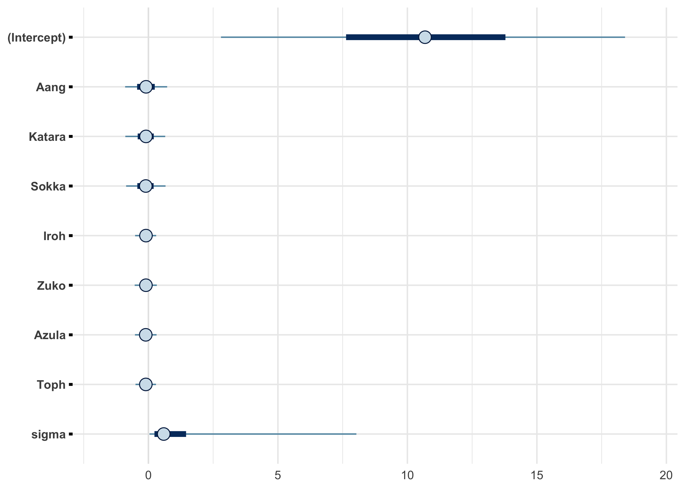<!-- -->

    d %>%
        modelr::data_grid(Aang = modelr::seq_range(Aang, n = 100),
                          Katara = mean(Katara, n = 10),
                          Sokka = mean(Sokka, n = 10),
                          Iroh = mean(Iroh, n = 10),
                          Zuko = mean(Zuko, n = 10),
                          Azula = mean(Azula, n = 10),
                          Toph = mean(Toph, n = 10)) %>%
        add_predicted_draws(m2_priors) %>%
        ggplot(aes(x = Aang, y = .prediction)) +
        stat_lineribbon() +
        scale_fill_brewer(palette = "Greys")

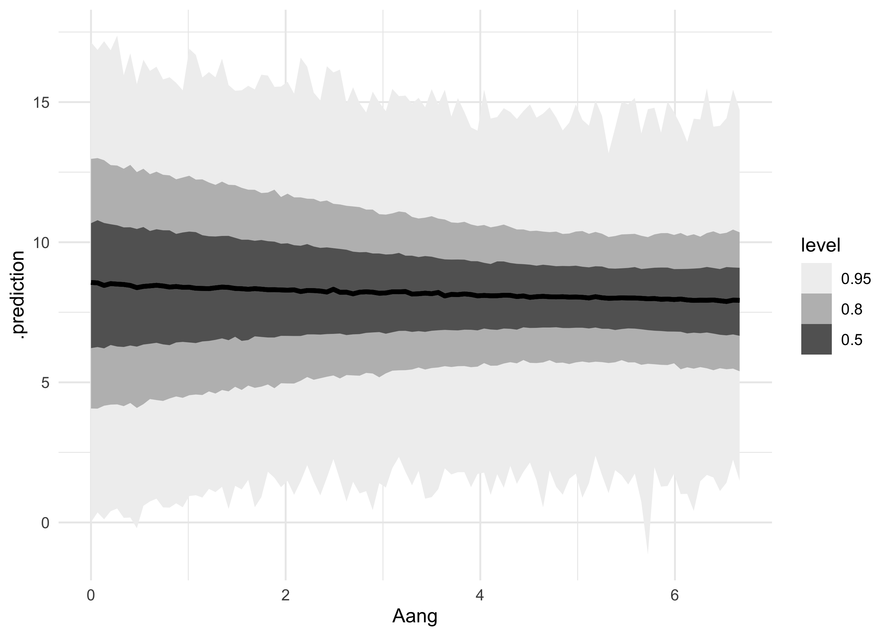<!-- -->

### Model 3

    m3_priors <- stan_glmer(
        imdb_rating ~ 1 + (1 + Aang + Katara + Sokka + Iroh + Zuko + Azula + Toph | book),
        data = d,
        family = gaussian(link = "identity"),
        prior = normal(location = 0, scale = 0.05),
        prior_intercept = normal(location = 8, scale = 1),
        prior_aux = cauchy(),
        prior_covariance = decov(),
        prior_PD = TRUE,
        cores = 1,
        refresh = 0
    )

    plot_intercepts <- function(m) {
        m %>%
            spread_draws(`(Intercept)`, b[g,t]) %>%
            filter(g == "(Intercept)") %>%
            mutate(book = str_remove(t, "book:")) %>%
            ggplot(aes(x = `(Intercept)` + b)) +
            geom_density_ridges(aes(y = book, color = book, fill = book), 
                                          alpha = 0.15, size = 1) +
            scale_color_brewer(palette = "Set2") +
            scale_fill_brewer(palette = "Set2") +
            scale_x_continuous(limits = c(4, 12), expand = c(0, 0)) +
            theme(legend.position = "none") +
            labs(x = "value",
                 y = "varying intercept")
    }

    plot_intercepts(m3_priors) +
        ggtitle("Prior")

    #> Picking joint bandwidth of 0.133

    #> Warning: Removed 754 rows containing non-finite values (stat_density_ridges).

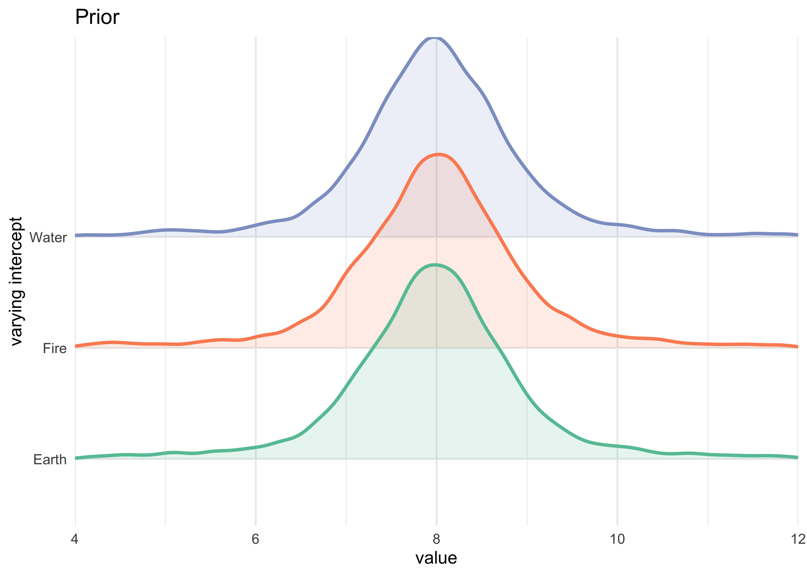<!-- -->

    plot_varying_slopes <- function(m) {
        m %>%
            spread_draws(`(Intercept)`, b[g,t]) %>%
            mutate(book = str_remove(t, "book:")) %>%
            filter(g != "(Intercept)") %>%
            ggplot(aes(x = b)) +
            geom_density_ridges(aes(y = g, color = book, fill = book),
                                alpha = 0.15, size = 1) +
            scale_x_continuous(limits = c(-0.3, 0.3), expand = c(0, 0)) +
            scale_color_brewer(palette = "Set2") +
            scale_fill_brewer(palette = "Set2") +
            labs(x = "value",
                 y = NULL,
                 color = "book",
                 fill = "book")
    }

    plot_varying_slopes(m3_priors)

    #> Picking joint bandwidth of 0.0151

    #> Warning: Removed 33419 rows containing non-finite values (stat_density_ridges).

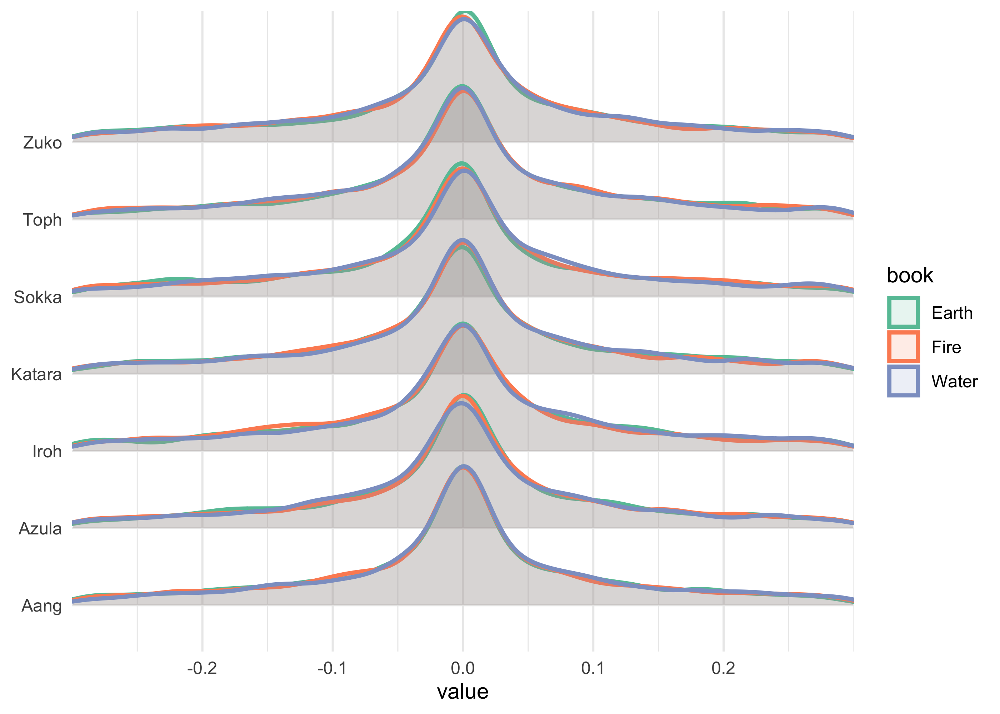<!-- -->

    stash("m3_fit", depends_on = "d", {
        m3_fit <- stan_glmer(
            imdb_rating ~ 1 + (1 + Aang + Katara + Sokka + Iroh + Zuko + Azula + Toph | book),
            data = d,
            family = gaussian(link = "identity"),
            prior = normal(location = -0.1, scale = 2),
            prior_intercept = normal(location = 8, scale = 1),
            prior_aux = cauchy(),
            prior_covariance = decov(),
            prior_PD = FALSE,
            adapt_delta = 0.999,
            cores = 1,
            refresh = 0
        )
    })

    #> Loading stashed object.

    plot_intercepts(m3_fit) +
        ggtitle("Posterior")

    #> Picking joint bandwidth of 0.0509

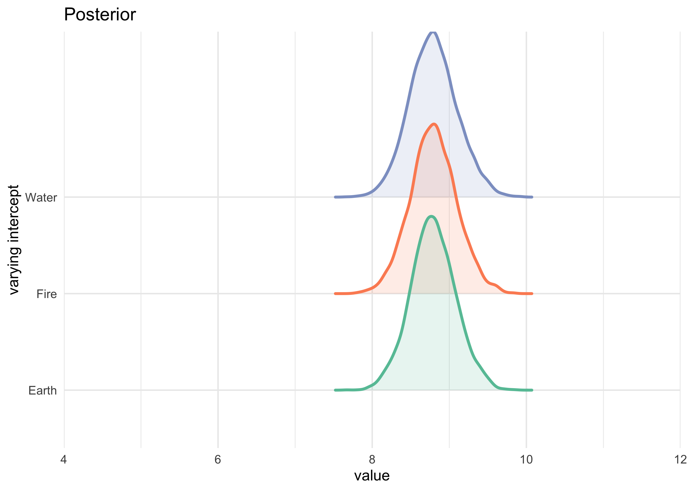<!-- -->

    plot_varying_slopes(m3_fit)

    #> Picking joint bandwidth of 0.00998

    #> Warning: Removed 309 rows containing non-finite values (stat_density_ridges).

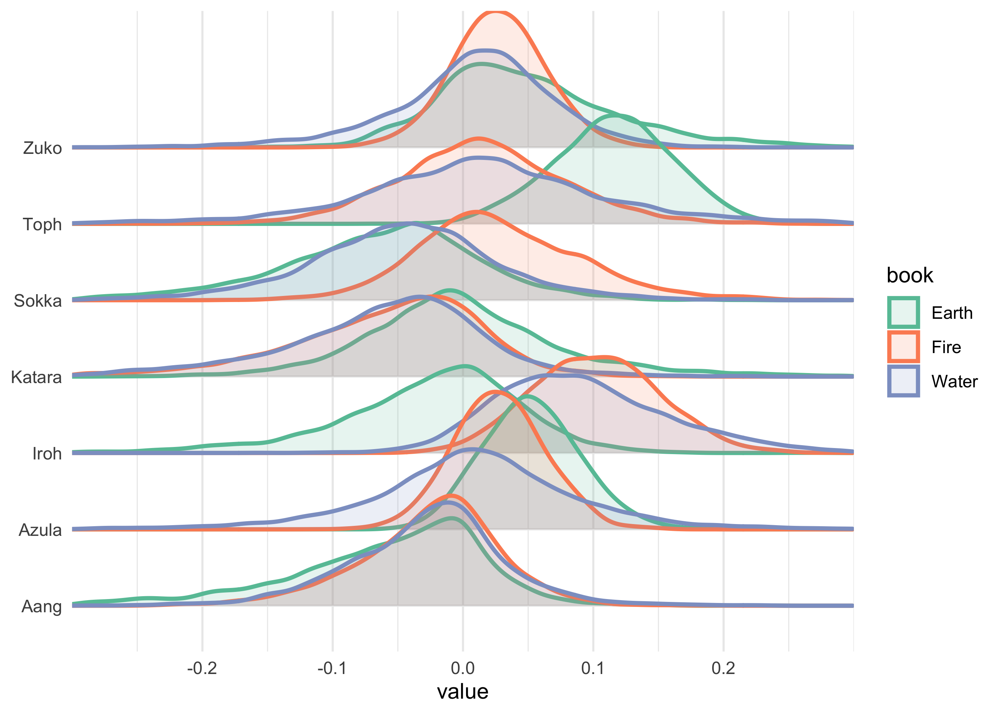<!-- -->

#### Comparing prior and posteriors

    prior_intercept_p <- plot_intercepts(m3_priors) +
        ggtitle("Prior")
    post_intercept_p <- plot_intercepts(m3_fit) +
        ggtitle("Posterior")

    prior_slopes_p <- plot_varying_slopes(m3_priors) 
    post_slopes_p <- plot_varying_slopes(m3_fit) 

    p <- (prior_intercept_p | prior_slopes_p) / (post_intercept_p | post_slopes_p) +
        plot_layout(widths = c(2, 3))
    ggsave(file.path("2020-08-11_avatar_files", "compare-priors-v-post.png"),
           plot = p,
           width = 10, height = 8, dpi = 400)

    #> Picking joint bandwidth of 0.133

    #> Warning: Removed 754 rows containing non-finite values (stat_density_ridges).

    #> Picking joint bandwidth of 0.0151

    #> Warning: Removed 33419 rows containing non-finite values (stat_density_ridges).

    #> Picking joint bandwidth of 0.0509

    #> Picking joint bandwidth of 0.00998

    #> Warning: Removed 309 rows containing non-finite values (stat_density_ridges).

    p

    #> Picking joint bandwidth of 0.133

    #> Warning: Removed 754 rows containing non-finite values (stat_density_ridges).

    #> Picking joint bandwidth of 0.0151

    #> Warning: Removed 33419 rows containing non-finite values (stat_density_ridges).

    #> Picking joint bandwidth of 0.0509
    #> Picking joint bandwidth of 0.00998

    #> Warning: Removed 309 rows containing non-finite values (stat_density_ridges).

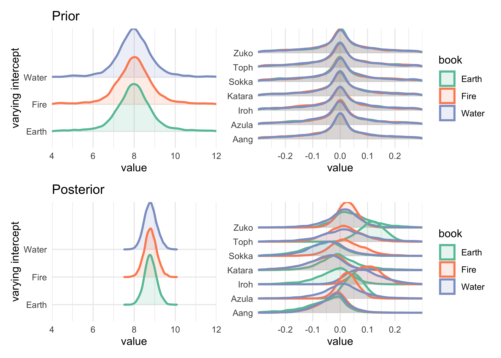<!-- -->
