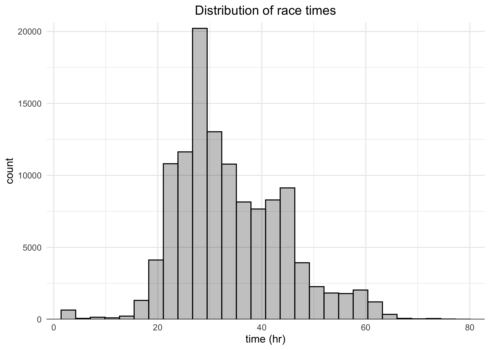
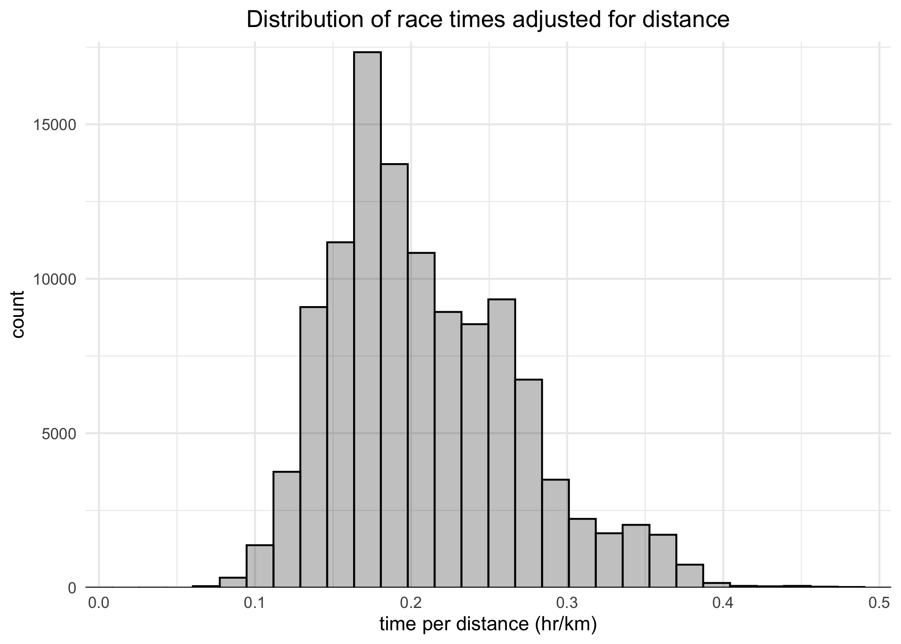
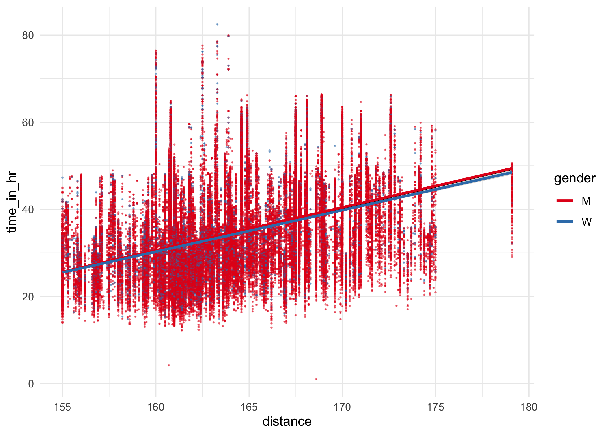
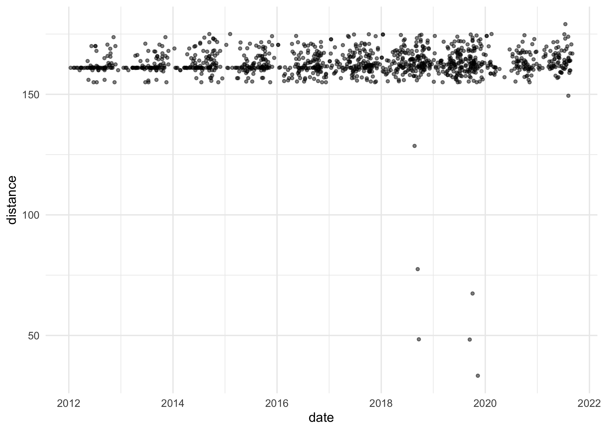
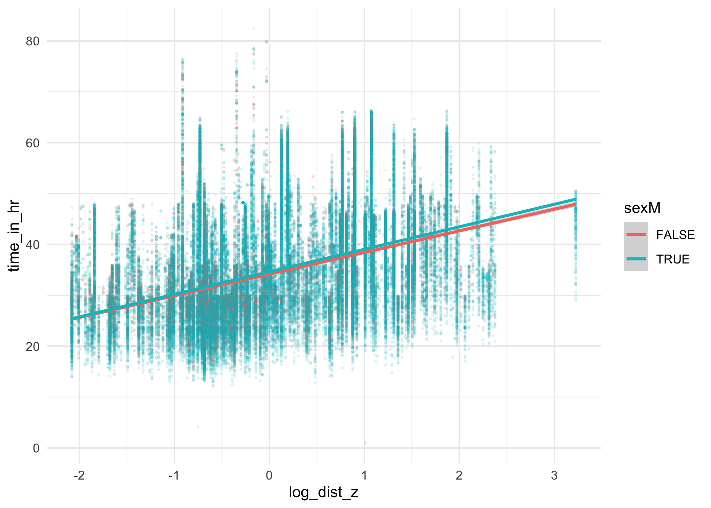
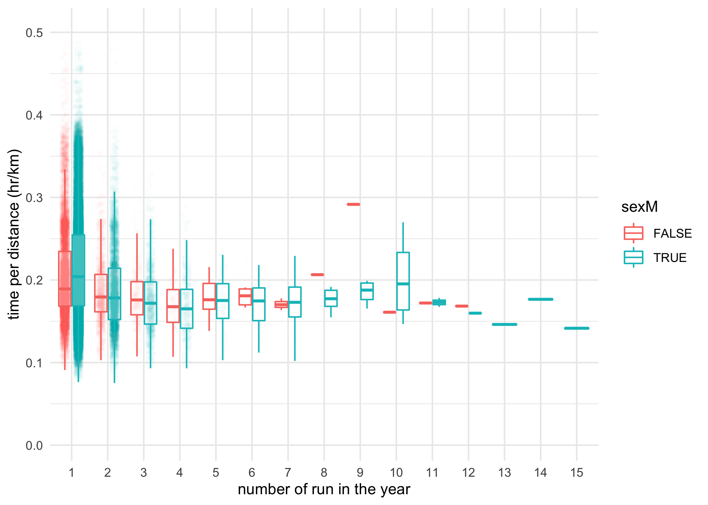

Ultra Trail Running
================
Joshua Cook
November 6, 2021

## Setup

TidyTuesday link:
[2021/2021-10-26/readme.md](https://github.com/rfordatascience/tidytuesday/blob/master/data/2021/2021-10-26/readme.md)

## Data

``` r
ultra_rankings <- readr::read_csv(
  "https://raw.githubusercontent.com/rfordatascience/tidytuesday/master/data/2021/2021-10-26/ultra_rankings.csv"
) %>%
  janitor::clean_names() %>%
  mutate(time_in_hr = time_in_seconds / 60 / 60)
```

    #> Rows: 137803 Columns: 8

    #> ── Column specification ────────────────────────────────────────────────────────
    #> Delimiter: ","
    #> chr (4): runner, time, gender, nationality
    #> dbl (4): race_year_id, rank, age, time_in_seconds

    #> 
    #> ℹ Use `spec()` to retrieve the full column specification for this data.
    #> ℹ Specify the column types or set `show_col_types = FALSE` to quiet this message.

``` r
race <- readr::read_csv(
  "https://raw.githubusercontent.com/rfordatascience/tidytuesday/master/data/2021/2021-10-26/race.csv"
) %>%
  janitor::clean_names() %>%
  mutate(
    participation = str_to_lower(participation),
    distance_m = distance * mile_per_km
  )
```

    #> Rows: 1207 Columns: 13

    #> ── Column specification ────────────────────────────────────────────────────────
    #> Delimiter: ","
    #> chr  (5): event, race, city, country, participation
    #> dbl  (6): race_year_id, distance, elevation_gain, elevation_loss, aid_statio...
    #> date (1): date
    #> time (1): start_time

    #> 
    #> ℹ Use `spec()` to retrieve the full column specification for this data.
    #> ℹ Specify the column types or set `show_col_types = FALSE` to quiet this message.

## EDA

``` r
head(ultra_rankings)
```

    #> # A tibble: 6 × 9
    #>   race_year_id  rank runner     time      age gender nationality time_in_seconds
    #>          <dbl> <dbl> <chr>      <chr>   <dbl> <chr>  <chr>                 <dbl>
    #> 1        68140     1 VERHEUL J… 26H 35…    30 M      GBR                   95725
    #> 2        68140     2 MOULDING … 27H 0M…    43 M      GBR                   97229
    #> 3        68140     3 RICHARDSO… 28H 49…    38 M      GBR                  103747
    #> 4        68140     4 DYSON Fio… 30H 53…    55 W      GBR                  111217
    #> 5        68140     5 FRONTERAS… 32H 46…    48 W      GBR                  117981
    #> 6        68140     6 THOMAS Le… 32H 46…    31 M      GBR                  118000
    #> # … with 1 more variable: time_in_hr <dbl>

``` r
glimpse(ultra_rankings)
```

    #> Rows: 137,803
    #> Columns: 9
    #> $ race_year_id    <dbl> 68140, 68140, 68140, 68140, 68140, 68140, 68140, 68140…
    #> $ rank            <dbl> 1, 2, 3, 4, 5, 6, 7, 8, 9, 10, 11, 12, 13, NA, NA, NA,…
    #> $ runner          <chr> "VERHEUL Jasper", "MOULDING JON", "RICHARDSON Phill", …
    #> $ time            <chr> "26H 35M 25S", "27H 0M 29S", "28H 49M 7S", "30H 53M 37…
    #> $ age             <dbl> 30, 43, 38, 55, 48, 31, 55, 40, 47, 29, 48, 47, 52, 49…
    #> $ gender          <chr> "M", "M", "M", "W", "W", "M", "W", "W", "M", "M", "M",…
    #> $ nationality     <chr> "GBR", "GBR", "GBR", "GBR", "GBR", "GBR", "GBR", "GBR"…
    #> $ time_in_seconds <dbl> 95725, 97229, 103747, 111217, 117981, 118000, 120601, …
    #> $ time_in_hr      <dbl> 26.59028, 27.00806, 28.81861, 30.89361, 32.77250, 32.7…

``` r
head(race)
```

    #> # A tibble: 6 × 14
    #>   race_year_id event   race   city   country date       start_time participation
    #>          <dbl> <chr>   <chr>  <chr>  <chr>   <date>     <time>     <chr>        
    #> 1        68140 Peak D… Mills… Castl… United… 2021-09-03 19:00      solo         
    #> 2        72496 UTMB®   UTMB®  Chamo… France  2021-08-27 17:00      solo         
    #> 3        69855 Grand … Ultra… viell… France  2021-08-20 05:00      solo         
    #> 4        67856 Persen… PERSE… Aseno… Bulgar… 2021-08-20 18:00      solo         
    #> 5        70469 Runfir… 100 M… uluki… Turkey  2021-08-20 18:00      solo         
    #> 6        66887 Swiss … 160KM  Münst… Switze… 2021-08-15 17:00      solo         
    #> # … with 6 more variables: distance <dbl>, elevation_gain <dbl>,
    #> #   elevation_loss <dbl>, aid_stations <dbl>, participants <dbl>,
    #> #   distance_m <dbl>

``` r
glimpse(race)
```

    #> Rows: 1,207
    #> Columns: 14
    #> $ race_year_id   <dbl> 68140, 72496, 69855, 67856, 70469, 66887, 67851, 68241,…
    #> $ event          <chr> "Peak District Ultras", "UTMB®", "Grand Raid des Pyréné…
    #> $ race           <chr> "Millstone 100", "UTMB®", "Ultra Tour 160", "PERSENK UL…
    #> $ city           <chr> "Castleton", "Chamonix", "vielle-Aure", "Asenovgrad", "…
    #> $ country        <chr> "United Kingdom", "France", "France", "Bulgaria", "Turk…
    #> $ date           <date> 2021-09-03, 2021-08-27, 2021-08-20, 2021-08-20, 2021-0…
    #> $ start_time     <time> 19:00:00, 17:00:00, 05:00:00, 18:00:00, 18:00:00, 17:0…
    #> $ participation  <chr> "solo", "solo", "solo", "solo", "solo", "solo", "solo",…
    #> $ distance       <dbl> 166.9, 170.7, 167.0, 164.0, 159.9, 159.9, 163.8, 163.9,…
    #> $ elevation_gain <dbl> 4520, 9930, 9980, 7490, 100, 9850, 5460, 4630, 6410, 31…
    #> $ elevation_loss <dbl> -4520, -9930, -9980, -7500, -100, -9850, -5460, -4660, …
    #> $ aid_stations   <dbl> 10, 11, 13, 13, 12, 15, 5, 8, 13, 23, 13, 5, 12, 15, 0,…
    #> $ participants   <dbl> 150, 2300, 600, 150, 0, 300, 0, 200, 120, 100, 300, 50,…
    #> $ distance_m     <dbl> 103.70685, 106.06806, 103.76899, 101.90488, 99.35725, 9…

``` r
ultra_rankings %>%
  filter(!is.na(time)) %>%
  ggplot(aes(x = time_in_hr)) +
  geom_histogram(bins = 30, color = "black", fill = "black", alpha = 0.25) +
  scale_x_continuous(expand = expansion(c(0, 0))) +
  scale_y_continuous(expand = expansion(c(0, 0.02))) +
  labs(x = "time (hr)", y = "count", title = "Distribution of race times")
```

<!-- -->

``` r
ultra_rankings %>%
  filter(!is.na(time)) %>%
  left_join(race %>% select(race_year_id, distance), by = "race_year_id") %>%
  filter(distance > 0.0) %>%
  filter(!is.na(distance)) %>%
  mutate(time_per_km = time_in_hr / distance) %>%
  ggplot(aes(x = time_per_km)) +
  geom_histogram(bins = 30, color = "black", fill = "black", alpha = 0.25) +
  scale_x_continuous(expand = expansion(c(0, 0))) +
  scale_y_continuous(expand = expansion(c(0, 0.02))) +
  labs(
    x = "time per distance (hr/km)",
    y = "count",
    title = "Distribution of race times adjusted for distance"
  )
```

<!-- -->

``` r
ultra_rankings %>%
  filter(!is.na(time)) %>%
  left_join(race %>% select(race_year_id, distance), by = "race_year_id") %>%
  filter(distance > 0.0) %>%
  filter(distance > 150) %>%
  filter(!is.na(gender)) %>%
  ggplot(aes(x = distance, y = time_in_hr)) +
  geom_point(aes(color = gender), alpha = 0.5, size = 0.2) +
  geom_smooth(formula = "y~x", method = "lm", color = "black") +
  geom_smooth(aes(color = gender), formula = "y~x", method = "lm") +
  scale_color_brewer(
    type = "qual",
    palette = "Set1",
    guide = guide_legend(
      override.aes = list(size = 1.2, alpha = 1.0, fill = "white")
    )
  )
```

<!-- -->

``` r
race %>%
  filter(distance > 0) %>%
  ggplot(aes(x = date, y = distance)) +
  geom_point(alpha = 0.5, size = 1)
```

<!-- -->

## Modeling

``` r
d <- ultra_rankings %>%
  filter(!is.na(time)) %>%
  filter(!is.na(gender)) %>%
  mutate(
    gender = str_to_lower(gender),
    sexM = (gender == "m")
  ) %>%
  left_join(
    race %>% select(race_year_id, distance, date), 
    by = "race_year_id"
  ) %>%
  filter(distance > 0) %>%
  filter(distance > 150) %>%
  mutate(
    log_dist = log(distance),
    log_dist_z = (log_dist - mean(log_dist)) / sd(log_dist),
    runner = str_to_lower(runner),
    runner = str_replace_all(runner, " ", "-"),
    year = lubridate::year(date)
  )
```

``` r
d %>%
  ggplot(aes(x = log_dist_z, y = time_in_hr)) +
  geom_point(aes(color = sexM), size = 0.4, alpha = 0.1) +
  geom_smooth(aes(color = sexM), formula = "y~x", method = "lm")
```

<!-- -->

``` r
length(unique(d$runner))
```

    #> [1] 61867

``` r
d %>%
  count(runner, name = "num_runs") %>%
  arrange(-num_runs) %>%
  head()
```

    #> # A tibble: 6 × 2
    #>   runner          num_runs
    #>   <chr>              <int>
    #> 1 smith-mike            50
    #> 2 donnelly-susan        42
    #> 3 fancett-kenneth       38
    #> 4 carter-williams       33
    #> 5 ettinghausen-ed       30
    #> 6 catmur-edward         29

``` r
pos <- position_jitterdodge(jitter.width = 0.2, jitter.height = 0, seed = 0)
d %>%
  mutate(time_per_dist = time_in_hr / distance) %>%
  arrange(runner, date) %>%
  group_by(runner, year) %>%
  mutate(number_run_in_year = row_number()) %>%
  ungroup() %>%
  ggplot(aes(x = factor(number_run_in_year), y = time_per_dist)) +
  geom_jitter(aes(color = sexM), size = 0.8, position = pos, alpha = 0.01) +
  geom_boxplot(
    aes(color = sexM), 
    outlier.shape = NA, 
    alpha = 0.25, 
    fill = "white"
  ) +
  labs(x = "number of run in the year", y = "time per distance (hr/km)")
```

<!-- -->

``` r
d %>%
  count(runner, sexM, name = "total_num_runs") %>%
  filter(total_num_runs > 2)
```

    #> # A tibble: 10,788 × 3
    #>    runner                    sexM  total_num_runs
    #>    <chr>                     <lgl>          <int>
    #>  1 ?al-saidi-saleh           TRUE               3
    #>  2 aaron-fredo               TRUE               3
    #>  3 aarons-jamie              FALSE              3
    #>  4 abadie-jean-philippe      TRUE               4
    #>  5 abarca-cedric             TRUE               3
    #>  6 abbott-jerry              TRUE               8
    #>  7 abbs-alan                 TRUE               4
    #>  8 abby-mckee                FALSE              5
    #>  9 abdallah-said-toihir      TRUE               5
    #> 10 abdul-rahim-khairul-anuar TRUE               4
    #> # … with 10,778 more rows
